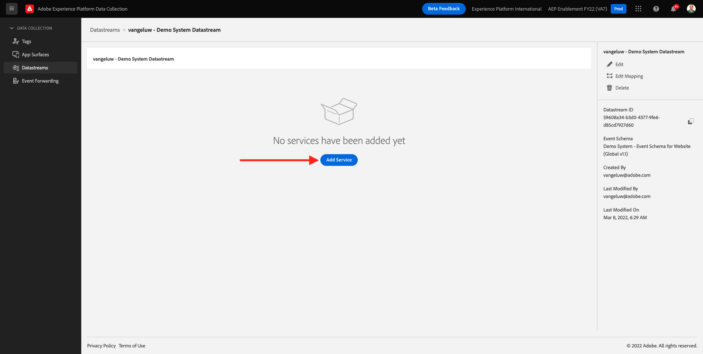
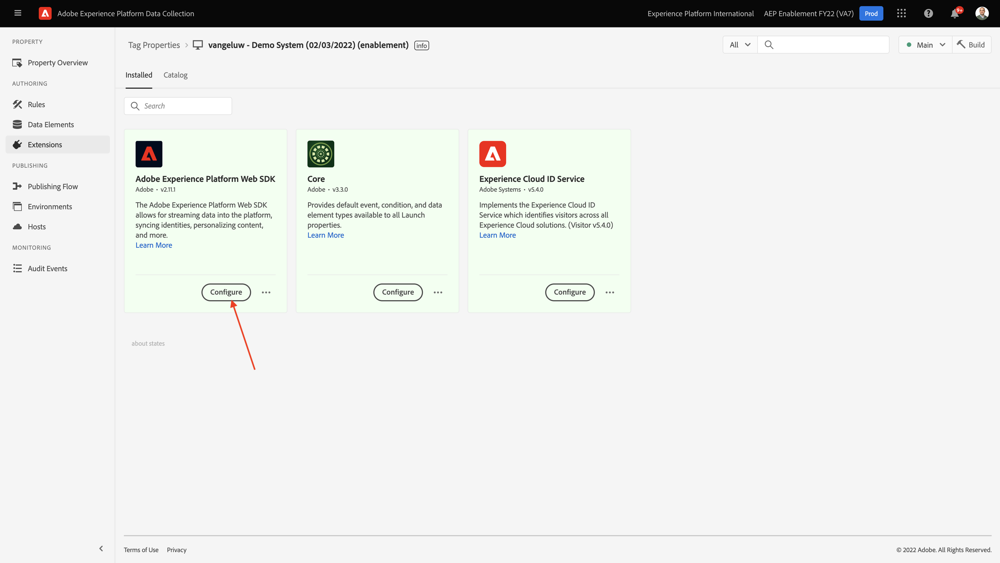

# 0.3 Maak uw gegevensstroom

Ga naar [https://experience.adobe.com/#/data-collection/](https://experience.adobe.com/#/data-collection/). Na de vorige oefening, hebt u nu twee eigenschappen van de Inzameling van Gegevens: één voor het web en één voor mobiel.

Deze eigenschappen zijn bijna klaar om te worden gebruikt, maar alvorens u gegevens kunt beginnen te verzamelen gebruikend deze eigenschappen moet u opstelling een gegevensstroom. U zult meer informatie over het concept krijgen wat een gegevensstroom is en wat het in Uitoefening 1.2 betekent.

Voer voorlopig deze stappen uit.

## 0.3.1 Maak uw DataStream voor het Web

Klikken **[!UICONTROL DataStreams]** of **[!UICONTROL Gegevensstromen (bèta)]**.

Selecteer in de rechterbovenhoek van het scherm de naam van de sandbox die u wilt instellen als `--aepSandboxId--`.

Klikken **[!UICONTROL Nieuwe DataStream]**.

Voor de **[!UICONTROL Vriendschappelijke naam]** en voor de facultatieve beschrijving `--demoProfileLdap-- - Demo System Datastream`. Selecteer bij Gebeurtenisschema de optie **Demosysteem - Gebeurtenisschema voor website (Global v1.1)**. Klikken **Opslaan**.

Dan zie je dit. Klikken **Service toevoegen**.

Selecteer de service **[!UICONTROL Adobe Experience Platform]**, die extra velden beschikbaar maakt. Dan zie je dit.

Selecteer bij Gebeurtenisgegevens de optie **Demosysteem - Dataset voor gebeurtenissen voor website (Global v1.1)** en voor Profielgegevensset selecteert u **Demosysteem - profielgegevensset voor website (Global v1.1)**. Klikken **Opslaan**.

Dit zie je nu.

Dat is het voor nu. In [Module 1](./../module1/data-ingestion-launch-web-sdk.md) u zult meer over Web SDK leren en hoe te om elk van zijn mogelijkheden te vormen.

Klik in het linkermenu op **[!UICONTROL Tags]**.

Filter de onderzoeksresultaten om uw twee eigenschappen van de Inzameling van Gegevens te zien. De eigenschap openen voor **Web** door erop te klikken.

Dan zie je dit. Klikken **Extensies**.

Klik in de extensie Adobe Experience Platform Web SDK op **Configureren**.

Dan zie je dit. Voor **DataStreams**, wordt er momenteel een dummywaarde van 1 weergegeven. U moet nu op de knop **Kiezen uit lijst** keuzerondje. Selecteer in de vervolgkeuzelijst de DataStream die u eerder hebt gemaakt.

Zorg ervoor dat u de optie **DataStream**. TIP: U kunt de resultaten in de vervolgkeuzelijst eenvoudig filteren door uw `--demoProfileLdap--`.

Omlaag schuiven totdat u ziet **Gegevensverzameling**. Controleer of het selectievakje voor **Klikgegevensverzameling inschakelen** is niet ingeschakeld. Klikken **Opslaan** om uw wijzigingen op te slaan.

Ga naar **Publishing Flow**.

Klik op de knop **...** for **Hoofd** en klik vervolgens op **Bewerken**.

Klikken **Alle gewijzigde bronnen toevoegen** en klik vervolgens op **Opslaan en bouwen voor ontwikkeling**.

Uw wijzigingen worden nu gepubliceerd en zijn over een paar minuten klaar.

## 0.3.2 Maak uw gegevensstroom voor mobiele apparaten

Ga naar [https://experience.adobe.com/#/data-collection/](https://experience.adobe.com/#/data-collection/).

Klikken **[!UICONTROL DataStreams]** of **[!UICONTROL Gegevensstromen (bèta)]**.

Selecteer in de rechterbovenhoek van het scherm de naam van de sandbox die u wilt instellen als `--aepSandboxId--`.

Klikken **[!UICONTROL Nieuwe DataStream]**.

Voor de **[!UICONTROL Vriendschappelijke naam]** en voor de facultatieve beschrijving `--demoProfileLdap-- - Demo System Datastream (Mobile)`. Selecteer bij Gebeurtenisschema de optie **Demosysteem - Gebeurtenisschema voor mobiele app (Global v1.1)**. Klikken **Opslaan**.

Klikken **[!UICONTROL Opslaan]**.

Dan zie je dit. Klikken **Service toevoegen**.

Selecteer de service **[!UICONTROL Adobe Experience Platform]**, die extra velden beschikbaar maakt. Dan zie je dit.

Selecteer bij Gebeurtenisgegevens de optie **Demosysteem - Dataset voor gebeurtenissen voor mobiele app (Global v1.1)** en voor Profielgegevensset selecteert u **Demosysteem - profielgegevensset voor mobiele app (Global v1.1)**. Klikken **Opslaan**.

Dan zie je dit.

Uw DataStream is nu klaar om in uw bezit van de Cliënt van de Inzameling van Gegevens van Adobe Experience Platform voor Mobiel te worden gebruikt.

Ga naar **Tags** en filtert de zoekresultaten om uw twee eigenschappen van de Gegevensverzameling te zien. De eigenschap openen voor **Mobiel** door erop te klikken.

Dan zie je dit. Klikken **Extensies**.

Op de **Adobe Experience Platform Edge Network** extensie, klikken **Configureren**.

Dan zie je dit. U moet nu de juiste sandbox en datastream selecteren die u net hebt geconfigureerd. De sandbox die moet worden gebruikt, is `--aepSandboxId--` en de gegevensstroom wordt aangeroepen `--demoProfileLdap-- - Demo System Datastream (Mobile)`.

Voor de **Edge Network-domein** gebruikt u het standaarddomein dat **edge.adobedc.net**.

Klikken **Opslaan** om uw wijzigingen op te slaan.

Ga naar **Publishing Flow**.

Klik op de knop **...** naast **Hoofd** en klik vervolgens op **Bewerken**.

Klikken **Alle gewijzigde bronnen toevoegen** en klik vervolgens op **Opslaan en bouwen voor ontwikkeling**.

Uw wijzigingen worden nu gepubliceerd en zijn over een paar minuten klaar.

Volgende stap: [0.4 De website gebruiken](./ex4.md)

[Ga terug naar module 0](./getting-started.md)

[Terug naar alle modules](./../../overview.md)