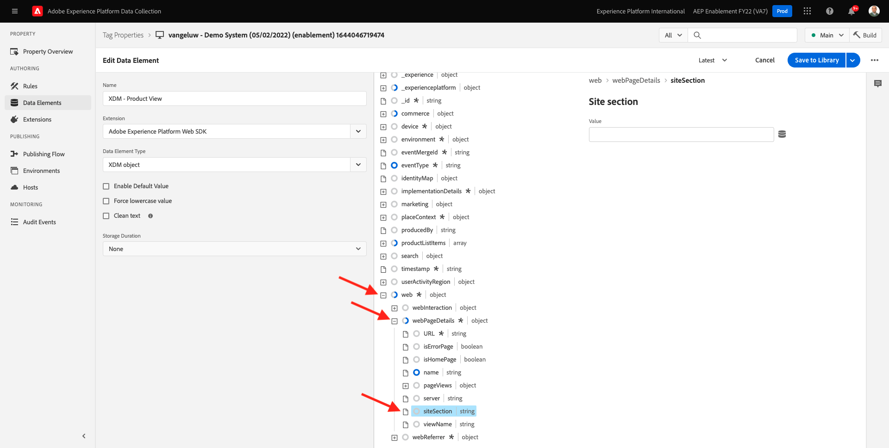
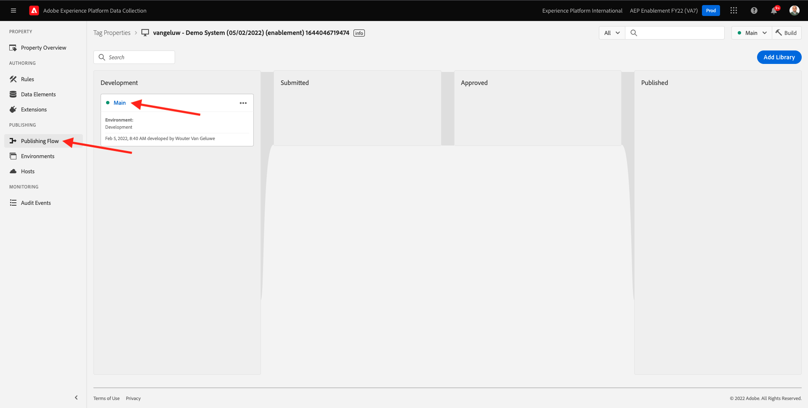
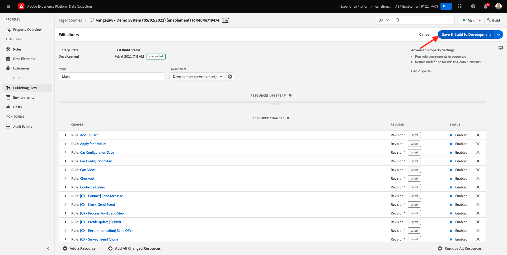

# 1.3 - Inleiding tot Adobe Experience Platform-gegevensverzameling

## Context

Laten we nu dieper kijken naar de bouwstenen van Adobe Experience Platform Data Collection, om te begrijpen wat er op uw demo-website is geïnstalleerd. U zult een dichtere blik bij de Uitbreiding van SDK van het Web van Adobe Experience Platform hebben, zult u een gegevenselement en een regel vormen en u zult leren hoe te om een bibliotheek te publiceren.

## 1.3.1 - Adobe Experience Platform Web SDK Extension

Een extensie is een set verpakte code waarmee de interface van Adobe Experience Platform Data Collection en de bibliotheekfunctionaliteit worden uitgebreid. Adobe Experience Platform Data Collection is het platform, en uitbreidingen zijn als apps die op het platform lopen. Alle extensies die in de zelfstudie worden gebruikt, worden gemaakt en beheerd door Adobe, maar derden kunnen hun eigen extensies maken om de hoeveelheid aangepaste code te beperken die Adobe Experience Platform-gebruikers moeten beheren.

Ga naar [Adobe Experience Platform-gegevensverzameling](https://experience.adobe.com/launch/) en selecteert u **Tags**.

Dit is de pagina Eigenschappen van Adobe Experience Platform-gegevensverzameling die u eerder hebt gezien.

In module 0, leidde het Systeem van de Demo tot twee eigenschappen van de Cliënt voor u: één voor de website en één voor de mobiele app. Zoeken naar `--demoProfileLdap--` in de **[!UICONTROL Zoeken]** doos.

Open de **Web** eigenschap.

U zult dan de pagina van het Overzicht van het Bezit zien. Klikken op **[!UICONTROL Extensies]** in het linkerspoor. Klik op de knop **[!UICONTROL Configureren]** onder de extensie Adobe Experience Platform Web SDK.

Welkom bij de Adobe Experience Platform Web SDK! Hier kunt u de extensie configureren met de DataStream die u hebt gemaakt [Oefening 0.2](./../module0/ex2.md) en een geavanceerdere configuratie. U gaat slechts twee montages voor deze oefening vormen.

Het standaardEdge-domein is altijd **edge.adobedc.net**. Als u een CNAME-configuratie in uw Adobe Experience Cloud- of Adobe Experience Platform-omgeving hebt geïmplementeerd, moet u de **[!UICONTROL Edge-domein]**. Uw Adobe Experience Platform-instantie gebruikt dit Edge-domein: `--webSdkEdgeDomain--`.

Als het Edge-domein van uw instantie afwijkt van het standaarddomein, moet u het Edge-domein bijwerken. Een Domein van de Rand maakt het mogelijk om een 1st partij het volgen server te vormen, die dan een configuratie CNAME in het achterste eind gebruikt om ervoor te zorgen dat het gegeven in Adobe wordt verzameld.

Zorg nu voor de **[!UICONTROL Kiezen uit lijst]** keuzerondje is geselecteerd onder de optie **[!UICONTROL DataStreams]** en selecteer de gegevensstroom met de naam: `--demoProfileLdap-- - Demo System Datastream`van de lijst in de **[!UICONTROL DataStream]** doos.

Klikken **[!UICONTROL Opslaan]** om terug te gaan naar de weergave Extensies.

## 1.3.2 Gegevenselementen

De elementen van gegevens zijn de bouwstenen voor uw gegevenswoordenboek (of gegevenskaart). Gebruik gegevenselementen om gegevens te verzamelen, te organiseren en te leveren over marketing- en advertentietechnologie.

Eén gegevenselement is een variabele waarvan de waarde kan worden toegewezen aan querytekenreeksen, URL&#39;s, cookie-waarden, JavaScript-variabelen enzovoort. U kunt naar deze waarde verwijzen met de variabelenaam in de hele Adobe Experience Platform-gegevensverzameling. Deze verzameling gegevenselementen wordt het woordenboek met gedefinieerde gegevens dat u kunt gebruiken om uw regels (gebeurtenissen, voorwaarden en handelingen) samen te stellen. Dit gegevenswoordenboek wordt door alle Adobe Experience Platform-gegevensverzameling gedeeld voor gebruik met extensies die u aan uw eigenschap hebt toegevoegd.

U gaat nu een reeds bestaand gegevenselement in een Friendly formaat van SDK van het Web uitgeven.

Klik op Data Elements in de linkertrack die naar de pagina Data Elements moet worden verplaatst.

>[!NOTE]
>
>U bewerkt alleen een gegevenselement in deze oefening, maar u kunt de **[!UICONTROL Gegevenselement toevoegen]** op deze pagina, die zou worden gebruikt om een nieuwe variabele aan het gegevenswoordenboek toe te voegen. Dit kan vervolgens worden gebruikt in de hele gegevensverzameling van Adobe Experience Platform. U kunt naar sommige andere reeds bestaande gegevenselementen kijken, meestal met lokale opslag als gegevensbron.

Typ in de zoekbalk **XDM - Productweergave** en klik op het gegevenselement dat wordt geretourneerd.

Dit scherm toont het XDM Voorwerp u zult uitgeven. Het model van de Gegevens van de Ervaring (XDM) is een concept dat veel verder door dit Technische Leerprogramma zal worden onderzocht, maar voor nu is het genoeg om het als formaat te begrijpen dat Adobe Experience Platform Web SDK vereist. U voegt wat meer informatie toe aan de gegevens die op artikelpagina&#39;s van de demo-website worden verzameld.

Klik op de knop met het plusteken naast **web** onder aan de boom.

Klik op de knop met het plusteken naast **webPageDetails**.

Klikken op **siteSection**. U ziet nu dat **siteSection** is nog niet gekoppeld aan een gegevenselement. Laten we dat veranderen.

Omhoog schuiven en de tekst invoeren `%Product Category%`. Klikken **[!UICONTROL Opslaan]**.

Op dit punt, is de Uitbreiding van SDK van het Web van Adobe Experience Platform geïnstalleerd en u hebt een gegevenselement bijgewerkt om gegevens tegen een structuur te verzamelen XDM. Daarna, controleren de regels die gegevens op de correcte tijd zullen verzenden.

## 1.3.3 Regels

De Inzameling van Gegevens van Adobe Experience Platform is een op regel-gebaseerd systeem. Er wordt gezocht naar gebruikersinteractie en bijbehorende gegevens. Wanneer aan de criteria die in uw regels worden geschetst wordt voldaan, teweegbrengt de regel de uitbreiding, het manuscript, of cliënt-zijcode in werking u identificeerde.

Bouw regels om de gegevens en de functionaliteit van marketing en advertentietechnologie te integreren die ongelijksoortige producten in één enkele oplossing verenigt.

Laten we de regel die gegevens verzendt op artikelpagina&#39;s opsplitsen.

Klikken op **[!UICONTROL Regels]** in het linkerspoor.

**[!UICONTROL Zoeken]** for `Product View`.

Klik op de regel die is teruggekeerd.

Laten we eens kijken naar de afzonderlijke elementen waaruit deze regel bestaat. Voor alle regels Als een opgegeven **[!UICONTROL Gebeurtenis]** doet zich voor, de **[!UICONTROL Voorwaarden]** worden geëvalueerd, dan worden gespecificeerd **[!UICONTROL Handelingen]** indien nodig.

Klik op de gebeurtenis **Aangepaste gebeurtenis - Productweergave**. Dit is de weergave die wordt geladen.

Klik op de knop **Type gebeurtenis** vervolgkeuzelijst.

Dit maakt een lijst van sommige standaardinteractie u kunt gebruiken om de Inzameling van Gegevens van Adobe Experience Platform te signaleren om de acties in werking te stellen, als de voorwaarden waar zijn.

Klikken **[!UICONTROL Annuleren]** om terug te gaan naar het Reglement.

Klik op de handeling **&quot;Product View&quot;-gebeurtenis naar AEP verzenden**.

Hier kunt u de gegevens zien die door de SDK van het Web van Adobe Experience Platform naar de Adobe Edge worden verzonden. Meer specifiek gebruikt dit de **legering** **[!UICONTROL Instance]** van de Web SDK. Een andere instelling instellen **[!UICONTROL Instance]** zou het onder andere mogelijk maken verschillende gegevensstromen te gebruiken. U hebt de gebeurtenis opgegeven **[!UICONTROL Type]** als **commerce.productViews** en de XDM Gegevens u verzendt is **XDM - Productweergave** data element u vroeger veranderde.

Nu u naar de Regel hebt gekeken, kunt u al uw veranderingen in de Inzameling van Gegevens van Adobe Experience Platform publiceren.

## 1.3.4 Publiceren in een bibliotheek

Tot slot om de regel en het gegevenselement te bevestigen u enkel hebt bijgewerkt, moet u een bibliotheek publiceren die de uitgegeven punten in ons bezit bevatten. Er zijn een paar snelle stappen die u in **[!UICONTROL Publiceren]** sectie van de Gegevensinzameling van Adobe Experience Platform.

Klikken **[!UICONTROL Publishing Flow]** in de linkernavigatie

Klik op de bestaande bibliotheek met de naam **Hoofd**.

Klik op de knop **Alle gewijzigde bronnen toevoegen** knop.

Omlaag schuiven om te zien dat de meeste bronnen ongewijzigd blijven **Revisie 1 (nieuwste)**, maar de twee die we hebben veranderd - **Gegevenselement: ruleArticlePages** en **Extensie: Adobe Experience Platform Web SDK** wordt gemarkeerd met net **Laatste**.

Klik op de knop **Opslaan en bouwen voor ontwikkeling** knop.

Het kan enkele minuten duren voordat de bibliotheek is gemaakt. Als de bibliotheek is voltooid, wordt links van de naam van de bibliotheek een groene stip weergegeven.

Zoals u op het het Publiceren scherm van de Stroom kunt zien, is er veel meer aan het het publiceren proces in de Inzameling van Gegevens van Adobe Experience Platform die buiten het werkingsgebied van dit leerprogramma is. We gaan gewoon één bibliotheek gebruiken in onze ontwikkelomgeving.

Volgende stap: [1.4 Clientside Web Data Collection](./ex4.md)

[Ga terug naar module 1](./data-ingestion-launch-web-sdk.md)

[Terug naar alle modules](./../../overview.md)
