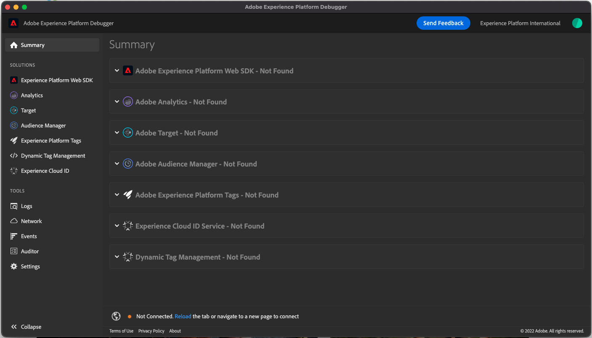
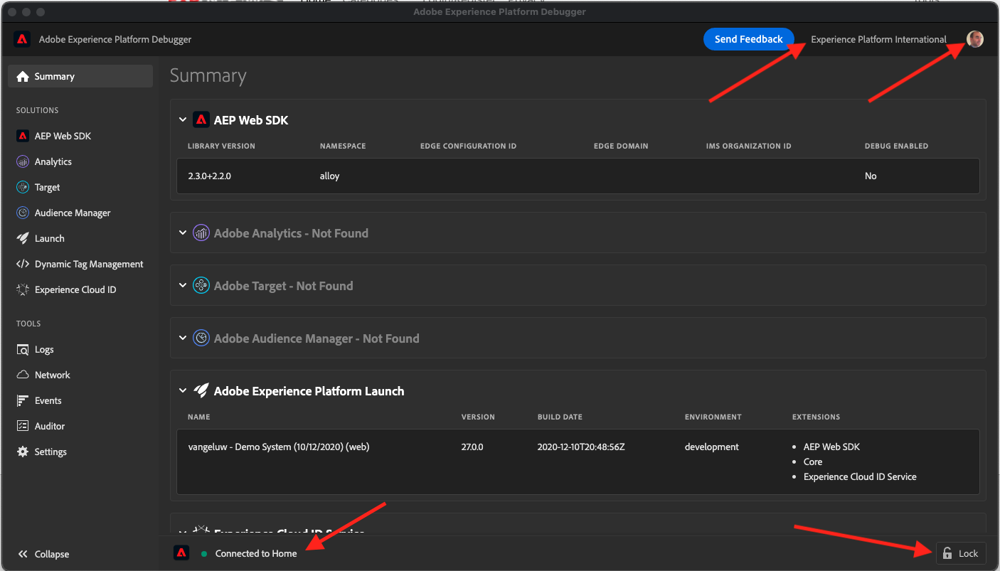

# 1.4 Clientside Web Data Collection

## 1.4.1 De gegevens in het verzoek valideren

### Foutopsporing voor Adobe Experience Platform installeren

Foutopsporing voor Experience Platforms is een extensie die beschikbaar is voor Chrome- en Firefox-browsers en waarmee u de Adobe-technologie kunt bekijken die in uw webpagina&#39;s is geïmplementeerd. Download de versie voor uw voorkeursbrowser:

- [Firefox-extensie](https://addons.mozilla.org/en-US/firefox/addon/adobe-experience-platform-dbg/)

- [Chrome-extensie](https://chrome.google.com/webstore/detail/adobe-experience-platform/bfnnokhpnncpkdmbokanobigaccjkpob)

Als u de foutopsporing nog nooit eerder hebt gebruikt - en deze is anders dan de vorige Adobe Experience Cloud Debugger - kunt u deze overzichtsvideo van vijf minuten bekijken:

>[!VIDEO](https://video.tv.adobe.com/v/32156?quality=12&learn=on)

Aangezien u de demo-website in de incognitomodus gaat laden, moet u ervoor zorgen dat Foutopsporing voor Experience Platform ook beschikbaar is in de incognitomodus. Ga hiertoe naar **chrome://extensions** in uw browser en open de extensie Foutopsporing Experience Platform.

Controleer of deze twee instellingen zijn ingeschakeld:

- Ontwerpmodus
- Toestaan in incognito

### De demo-website openen

Ga naar [https://builder.adobedemo.com/projects](https://builder.adobedemo.com/projects). Nadat je je hebt aangemeld bij je Adobe ID, kun je dit zien. Klik op uw websiteproject om het te openen.

Op de **Schermen** pagina, klikt u op **Uitvoeren**.

Vervolgens wordt uw demowebsite geopend. Selecteer de URL en kopieer deze naar het klembord.

Open een nieuw Incognito-browservenster.

Plak de URL van uw demowebsite, die u in de vorige stap hebt gekopieerd. Vervolgens wordt u gevraagd u aan te melden met uw Adobe ID.

Selecteer uw accounttype en voltooi het aanmeldingsproces.

Uw website wordt vervolgens geladen in een Incognito-browservenster. Voor elke demonstratie, zult u een vers, incognito browser venster moeten gebruiken om uw demowebsite URL te laden.

### Gebruik Debugger van het Experience Platform om de vraag te zien die naar de Rand gaat

Zorg ervoor dat de demo-website is geopend en klik op het extensiepictogram Foutopsporing Experience Platform.

Foutopsporing opent en toont de details van de implementatie die in uw bezit van de Inzameling van Gegevens van Adobe Experience Platform wordt gecreeerd. Herinner dat u de Uitbreiding en de regels zuivert die u enkel hebt uitgeeft.

Klik op de knop **[!UICONTROL Aanmelden]** boven aan rechts om te verifiëren. Als u al een browsertabblad hebt geopend met de interface van Adobe Experience Platform Data Collection, wordt de verificatiestap automatisch uitgevoerd en hoeft u uw gebruikersnaam en wachtwoord niet meer in te voeren.

Druk op de knop Opnieuw laden op uw demowebsite om de foutopsporing te verbinden met dat specifieke tabblad.

Foutopsporing bevestigen is **[!UICONTROL Verbonden met startpunt]** zoals hierboven afgebeeld en klik vervolgens op de knop **[!UICONTROL vergrendelen]** pictogram om Foutopsporing te vergrendelen op de demowebsite. Als u dit niet doet, zal Debugger blijven overschakelen om de implementatiedetails van om het even welk browser lusje in nadruk bloot te stellen, wat verwarrend kan zijn.

Ga vervolgens naar een willekeurige pagina op de demo-website, bijvoorbeeld de **Mannen** rubriekpagina.

Klik nu op **[!UICONTROL Experience Platform Web SDK]** in de linkernavigatie om de **[!UICONTROL Netwerkverzoeken]**.

Elke aanvraag bevat een **[!UICONTROL gebeurtenissen]** rij.

Klik om het dialoogvenster **[!UICONTROL gebeurtenissen]** rij. Let op hoe u de **web.webpagedetails.pageViews** en andere variabelen die zich aan de **Web SDK ExperienceEvent XDM** gebruiken.

Deze types van verzoekdetails zijn ook zichtbaar in het Netwerk tabel. Filter voor aanvragen met **interageren** om van de verzoeken de plaats te bepalen die door Web SDK worden verzonden. U kunt alle details van de XDM nuttige lading in de Kopballen van de Payload van het Verzoek vinden:

Volgende stap: [1.5 Adobe Analytics en Adobe Audience Manager implementeren](./ex5.md)

[Ga terug naar module 1](./data-ingestion-launch-web-sdk.md)

[Terug naar alle modules](./../../overview.md)
