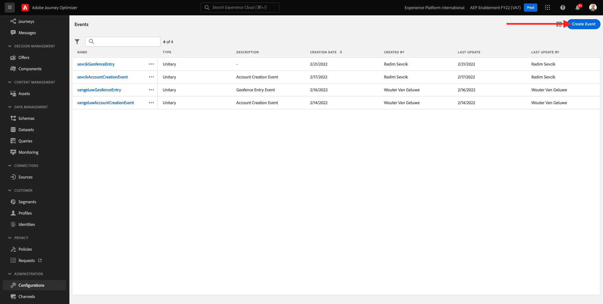
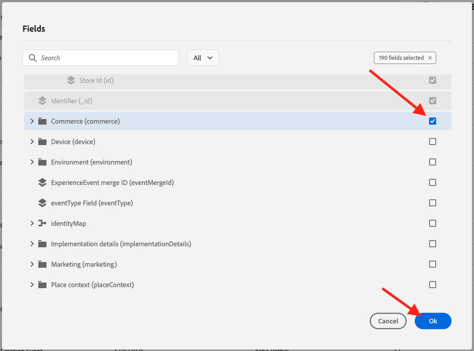
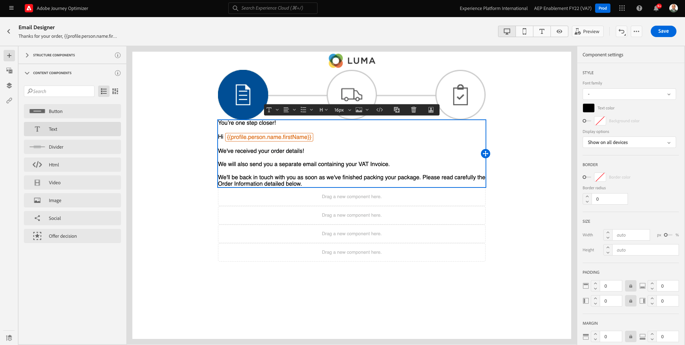
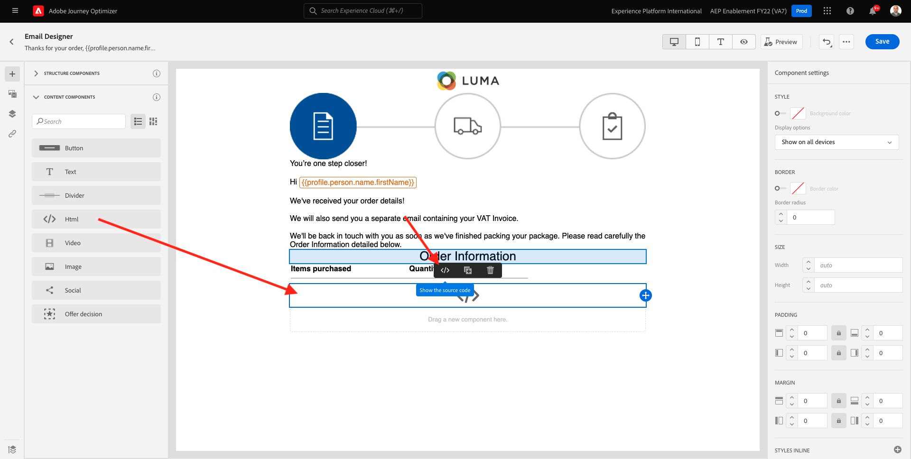
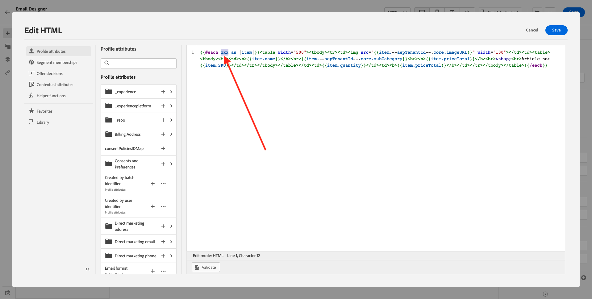
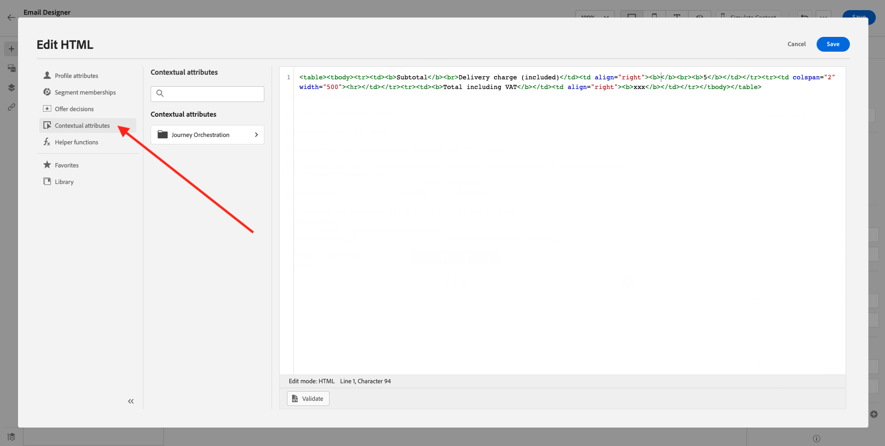
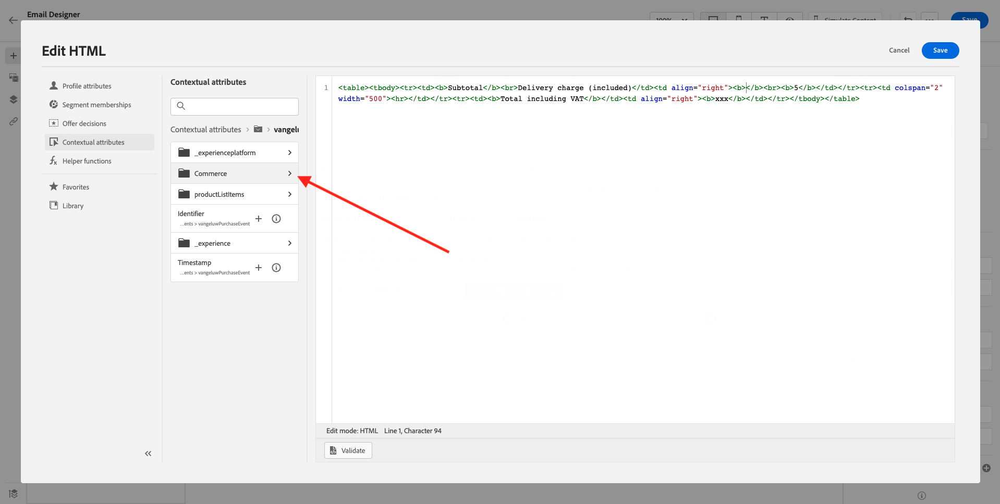

# 10.1 Een op trigger gebaseerde reis configureren - Bestelbevestiging

Aanmelden bij Adobe Journey Optimizer door naar [Adobe Experience Cloud](https://experience.adobe.com). Klikken **Journey Optimizer**.


U wordt omgeleid naar de **Home**  in Journey Optimizer. Eerst, zorg ervoor u de correcte zandbak gebruikt. De sandbox die moet worden gebruikt, wordt `--aepSandboxId--`. Als u van de ene naar de andere sandbox wilt gaan, klikt u op **PRODUCTIEVOORRAAD (VA7)** en selecteert u de sandbox in de lijst. In dit voorbeeld krijgt de sandbox een naam **AEP-activering FY22**. Dan ben je in de **Home** weergave van de sandbox `--aepSandboxId--`.


## 10.1.1 Uw gebeurtenis maken

Ga in het menu naar **Configuraties** en klik op **Beheren** krachtens **Gebeurtenissen**.


Op de **Gebeurtenissen** -scherm, ziet u een vergelijkbare weergave. Klikken **Gebeurtenis maken**.



U ziet dan een lege gebeurtenisconfiguratie.


Geef uw gebeurtenis als volgt een naam: `--demoProfileLdap--PurchaseEvent`en voeg een beschrijving als deze toe: `Purchase Event`.


Volgende is de **Type gebeurtenis** selectie. Selecteren **Unitair**.


Volgende is de **Type gebeurtenis-id** selectie. Selecteren **Door systeem gegenereerd**


Nu de selectie van het schema. Hiervoor is een schema opgesteld. Gebruik het schema `Demo System - Event Schema for Website (Global v1.1) v.1`.


Nadat u het schema hebt geselecteerd, ziet u een aantal velden die worden geselecteerd in het dialoogvenster **Payload** sectie. Klik op de knop **Bewerken/Potlood** pictogram om extra velden aan deze gebeurtenis toe te voegen.


Dan zie je deze popup. U moet nu extra selectievakjes inschakelen om toegang te krijgen tot aanvullende gegevens wanneer deze gebeurtenis wordt geactiveerd.


Schakel eerst het selectievakje op de regel in `--aepTenantId--`.


Blader vervolgens omlaag en schakel het selectievakje in op de regel `productListItems`.


Blader vervolgens omlaag en schakel het selectievakje in op de regel `commerce`.



Klik op Volgende **OK**.

Vervolgens ziet u dat er extra velden zijn toegevoegd aan de gebeurtenis. Klikken **Opslaan**.


Uw nieuwe gebeurtenis wordt dan gedeeld en u zult uw gebeurtenis in de lijst van beschikbare gebeurtenissen nu zien.

Klik nogmaals op de gebeurtenis om het dialoogvenster **Gebeurtenis bewerken** opnieuw.
Houd de aanwijzer boven de **Payload** nogmaals in om de 3 pictogrammen weer te zien. Klik op de knop **Payload weergeven** pictogram.


U zult nu een voorbeeld van de verwachte nuttige lading zien. Uw gebeurtenis heeft een unieke orchestration eventID, die u kunt vinden door neer in die lading te scrollen tot u ziet `_experience.campaign.orchestration.eventID`.


De gebeurtenis-id is wat naar Adobe Journey Optimizer moet worden verzonden om de reis te activeren die u in de volgende stap maakt. Schrijf deze eventID neer, aangezien u het in één van de volgende stappen zult nodig hebben.
`"eventID": "ef6dd943c94fe1b4763c098ccd1772344662f2a9f614513106cb5ada8be36857"`

Klikken **OK**, gevolgd door **Annuleren**.

Uw gebeurtenis is nu geconfigureerd en klaar om te worden gebruikt.

## 10.1.2 Maak uw reis

Ga in het menu naar **Reizen** en klik op **Reis maken**.


Dan zie je dit. Geef je reis een naam. Gebruik `--demoProfileLdap-- - Order Confirmation journey`. Klikken **OK**.


Eerst, moet u uw gebeurtenis toevoegen als uitgangspunt van uw reis. Zoeken naar uw gebeurtenis `--demoProfileLdap--PurchaseEvent` en sleep het naar het canvas. Klikken **OK**.


Volgende, onder **Handelingen**, zoekt u naar de **E-mail** en voegt u deze toe aan het canvas.


Stel de **Categorie** tot **Marketing** en selecteer een e-mailoppervlak waarmee u e-mail kunt verzenden. In dit geval is het te selecteren e-mailoppervlak **E-mail**. Zorg ervoor dat de selectievakjes **Klik op e-mail** en **e-mail wordt geopend** zijn beide ingeschakeld.


De volgende stap is uw bericht te creëren. Om dat te doen, klikt u op **Inhoud bewerken**.


U ziet dit nu. Klik op de knop **Onderwerpregel** tekstveld.


Begin met schrijven in het tekstgebied **Hartelijk dank voor uw bestelling,**


De onderwerpregel is nog niet gereed. Vervolgens moet u het personalisatietoken voor het veld introduceren **Voornaam** dat is opgeslagen onder `profile.person.name.firstName`. Blader in het linkermenu omlaag om de **Persoon** > **Volledige naam** >  **Voornaam** en klik op de knop **+** pictogram om het verpersoonlijkingstoken in de onderwerpregel toe te voegen. Klikken **Opslaan**.


Dan ben je hier weer. Klikken **E-mailontwerper** om de inhoud van de e-mail te maken.


Klik in het volgende scherm op **Ontwerpen vanaf nul**.


In het linkermenu vindt u de structuurcomponenten die u kunt gebruiken om de structuur van de e-mail (rijen en kolommen) te definiëren.

Slepen en 8 keer per keer neerzetten **1:1, kolom** op het canvas, dat u dit zou moeten geven:


Ga naar **Inhoudscomponenten**.


Sleep een **Afbeelding** op de eerste rij. Klikken **Bladeren**.


Ga naar de map **vermogensbestanddelen**, selecteert u het bestand **luma-logo.png** en klik op **Selecteren**.


Je bent nu weer hier. Klik op de afbeelding om deze te selecteren en gebruik vervolgens de **Grootte** om de afbeelding van het logo iets kleiner te maken.


Ga naar **Inhoudscomponenten** en sleep een **Afbeelding** op de tweede rij. Selecteer **Afbeeldingscomponent** maar klik niet op Bladeren.


Deze afbeeldings-URL in het veld plakken **Bron**: `https://parsefiles.back4app.com/hgJBdVOS2eff03JCn6qXXOxT5jJFzialLAHJixD9/29043bedcde632a9cbe8a02a164189c9_preparing.png`. Deze afbeelding wordt buiten Adobe gehost.


Wanneer u het bereik in een ander veld wijzigt, wordt de afbeelding gerenderd en ziet u het volgende:


Ga vervolgens naar **Inhoudscomponenten** en sleep een **Tekst** op de derde rij.


De standaardtekst in die component selecteren **Typ hier uw tekst.** en vervangen door de onderstaande tekst:

```javascript
You’re one step closer!

Hi 

We've received your order details!

We will also send you a separate email containing your VAT Invoice.

We'll be back in touch with you as soon as we've finished packing your package. Please read carefully the Order Information detailed below.
```


De cursor naast de tekst plaatsen **Hallo** en klik op **Persoonlijkheid toevoegen**.


Ga naar de **Persoon** > **Volledige naam** > **Voornaam** en klik op de knop **+** pictogram om het verpersoonlijkingstoken in de onderwerpregel toe te voegen. Klikken **Opslaan**.


U zult dan dit zien:



Ga vervolgens naar **Inhoudscomponenten** en sleep een **Tekst** op de vierde rij.


De standaardtekst in die component selecteren **Typ hier uw tekst.** en vervangen door de onderstaande tekst:

`Order Information`

De tekengrootte wijzigen in **26 px** en centreer de tekst in deze cel. Dan heb je het volgende:


Ga vervolgens naar **Inhoudscomponenten** en sleep een **HTML** op de vijfde rij. Klik op de component HTML en klik vervolgens op **De broncode weergeven**.


In de **HTML bewerken** popup, plak deze HTML:

```<table><tbody><tr><td><b>Items purchased</b></td><td></td><td><b>Quantity</b></td><td><b>Subtotal</b></td></tr><tr><td colspan="4" width="500"><hr></td></tr></tbody></table>```

Klikken **Opslaan**.


Dan heb je dit. Klikken **Opslaan** om de voortgang op te slaan.


Ga naar **Inhoudscomponenten** en sleep een **HTML** op de zesde rij. Klik op de component HTML en klik vervolgens op **De broncode weergeven**.



In de **HTML bewerken** popup, plak deze HTML:

```{{#each xxx as |item|}}<table width="500"><tbody><tr><td></td><td><table><tbody><tr><td><b>{{item.name}}</b><br>{{item.--aepTenantId--.core.subCategory}}<br><b>{{item.priceTotal}}</b><br>&nbsp;<br>Article no: {{item.SKU}}</td></tr></tbody></table></td><td>{{item.quantity}}</td><td><b>{{item.priceTotal}}</b></td></tr></tbody></table>{{/each}}```

Dan heb je het volgende:


U moet nu vervangen **xxx** door een verwijzing naar het productListItems-object dat deel uitmaakt van de gebeurtenis die de reis activeert.



Eerst verwijderen **xxx** in uw HTML code eerst.


Klik in het linkermenu op **Contextafhankelijke kenmerken**. Deze context wordt doorgegeven aan de boodschap van de reis.


Dan zie je dit. Klik op de pijl naast **Journey Orchestration** dieper boren.


Klik op de pijl naast **Gebeurtenissen** dieper boren.


Klik op de pijl naast `--demoProfileLdap--PurchaseEvent` dieper boren.


Klik op de pijl naast **productListItems** dieper boren.


Klik op de knop **+** pictogram naast **Naam** om het aan het canvas toe te voegen. Dan heb je dit. U moet nu  **.name** zoals aangegeven in de onderstaande schermafbeelding, en dan moet u **.name**.


Dan heb je dit. Klikken **Opslaan**.


U bent nu weer in de e-mailontwerper. Klikken **Opslaan** om de voortgang op te slaan.


Ga vervolgens naar **Inhoudscomponenten** en sleep een **HTML** op de zevende rij. Klik op de component HTML en klik vervolgens op **De broncode weergeven**.


In de **HTML bewerken** popup, plak deze HTML:

```<table><tbody><tr><td><b>Subtotal</b><br>Delivery charge (included)</td><td align="right"><b>xxx</b><br><b>5</b></td></tr><tr><td colspan="2" width="500"><hr></td></tr><tr><td><b>Total including VAT</b></td><td align="right"><b>xxx</b></td></tr></tbody></table>```

Er zijn twee verwijzingen naar **xxx** in deze HTML-code. U moet nu elke **xxx** door een verwijzing naar het productListItems-object dat deel uitmaakt van de gebeurtenis die de reis activeert.


Eerst verwijdert u de eerste **xxx** in uw HTML-code.


Klik in het linkermenu op **Contextafhankelijke kenmerken**.



Klik op de pijl naast **Journey Orchestration** dieper boren.


Klik op de pijl naast **Gebeurtenissen** dieper boren.


Klik op de pijl naast `--demoProfileLdap--PurchaseEvent` dieper boren.


Klik op de pijl naast **Handel** dieper boren.



Klik op de pijl naast **Volgorde** dieper boren.


Klik op de knop **+** pictogram naast **Prijs totaal** om dat aan het canvas toe te voegen.


Dan heb je dit. Verwijder nu de tweede **xxx** in uw HTML-code.


Klik op de knop **+** pictogram naast **Prijs totaal** nogmaals om dat aan het canvas toe te voegen.


U kunt ook het veld toevoegen **Valuta** van binnen **Volgorde** -object op het canvas plaatsen, zoals u hier kunt zien.
Als u klaar bent, klikt u op **Opslaan** om uw wijzigingen op te slaan.


U bent dan weer in de e-mailontwerper. Klikken **Opslaan** opnieuw.


Ga terug naar het berichtdashboard door op het **pijl** naast de tekst van de onderwerpregel in de linkerbovenhoek.


Klik op de pijl in de linkerbovenhoek om terug te gaan naar uw reis.


Klikken **OK** om uw e-mailactie te sluiten.


Klikken **Publiceren** om uw reis te publiceren.


Klikken **Publiceren** opnieuw.


Uw reis is nu gepubliceerd.


## 10.1.5 Werk uw Adobe Experience Platform Data Collection Client-eigenschap bij

Ga naar [Adobe Experience Platform-gegevensverzameling](https://experience.adobe.com/launch/) en selecteert u **Tags**.

Dit is de pagina Eigenschappen van Adobe Experience Platform-gegevensverzameling die u eerder hebt gezien.


In module 0, leidde het Systeem van de Demo tot twee eigenschappen van de Cliënt voor u: één voor de website en één voor de mobiele app. Zoeken naar `--demoProfileLdap--` in de **[!UICONTROL Zoeken]** doos. Klik om het dialoogvenster **Web** eigenschap.


Ga naar **Gegevenselementen**. Het gegevenselement zoeken en openen **XDM - Aankoop**.


Dan zie je dit. Naar het veld navigeren **_experience.campagne.orchestration.eventID** en vul hier uw eventID in. De eventID die u hier moet invullen, is de eventID die u hebt gemaakt als onderdeel van oefening 10.1.2. Klikken **Opslaan** of **Opslaan in bibliotheek**.


Sla uw wijzigingen op in de eigenschap Client en publiceer uw wijzigingen door uw ontwikkelingsbibliotheek bij te werken.


Uw wijzigingen worden nu geïmplementeerd en kunnen worden getest.

## 10.1.6 Test het bevestigingsbericht voor uw bestelling via de demo-website

Laten we de bijgewerkte reis testen door een product te kopen op de demo-website.

Ga naar [https://builder.adobedemo.com/projects](https://builder.adobedemo.com/projects). Nadat je je hebt aangemeld bij je Adobe ID, kun je dit zien. Klik op uw websiteproject om het te openen.


Op de **Schermen** pagina, klikt u op **Uitvoeren**.


Vervolgens wordt uw demowebsite geopend. Selecteer de URL en kopieer deze naar het klembord.


Open een nieuw Incognito-browservenster.


Plak de URL van uw demowebsite, die u in de vorige stap hebt gekopieerd. Vervolgens wordt u gevraagd u aan te melden met uw Adobe ID.


Selecteer uw accounttype en voltooi het aanmeldingsproces.


Uw website wordt vervolgens geladen in een Incognito-browservenster. Voor elke demonstratie, zult u een vers, incognito browser venster moeten gebruiken om uw demowebsite URL te laden.


Klik op het Adobe-logopictogram in de linkerbovenhoek van het scherm om de Profile Viewer te openen.


Bekijk het deelvenster Profielviewer en het realtime klantprofiel met de **Experience Cloud-id** als primaire identificator voor deze momenteel onbekende klant.


Ga naar de pagina Registreren/Aanmelden. Klikken **EEN ACCOUNT MAKEN**.


Vul uw gegevens in en klik op **Registreren** waarna u naar de vorige pagina wordt omgeleid.


Voeg om het even welk product aan uw kar toe en ga naar **Kar** pagina. Klikken **Doorgaan naar afhandeling**.


Controleer vervolgens de velden op de uitcheckpagina en klik op **Afhandeling**.


U ontvangt dan binnen enkele seconden een bevestigingsbericht voor uw bestelling.


U hebt deze oefening voltooid.

Volgende stap: [10.2 Vorm een op partij-gebaseerde nieuwsbrief reis](./ex2.md)

[Ga terug naar module 10](./journeyoptimizer.md)

[Terug naar alle modules](../../overview.md)
