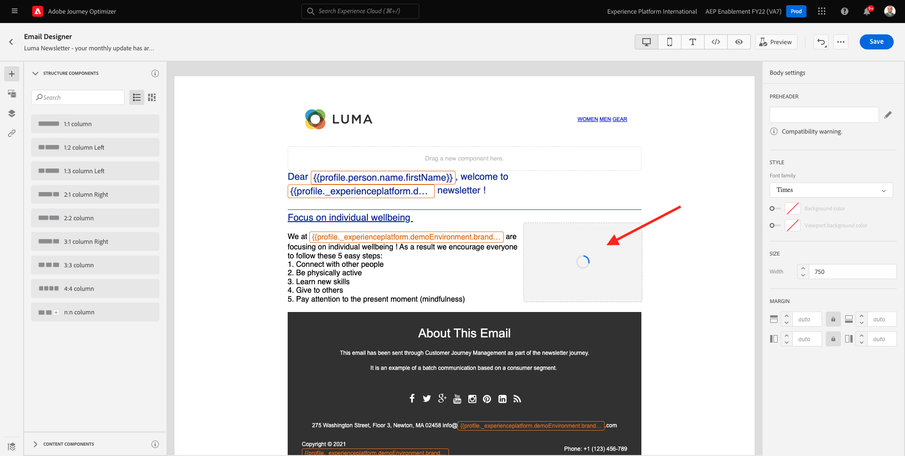
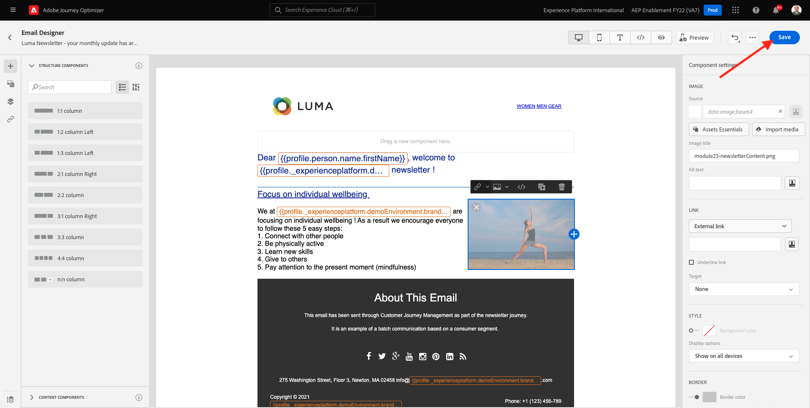

# 10.2 Vorm een op partij-gebaseerde nieuwsbrief reis

Aanmelden bij Adobe Journey Optimizer door naar [Adobe Experience Cloud](https://experience.adobe.com). Klikken **Journey Optimizer**.

U wordt omgeleid naar de **Home**  in Journey Optimizer. Eerst, zorg ervoor u de correcte zandbak gebruikt. De sandbox die moet worden gebruikt, wordt `--aepSandboxId--`. Als u van de ene naar de andere sandbox wilt gaan, klikt u op **PRODUCTIEVOORRAAD (VA7)** en selecteert u de sandbox in de lijst. In dit voorbeeld krijgt de sandbox een naam **AEP-activering FY22**. Dan ben je in de **Home** weergave van de sandbox `--aepSandboxId--`.

## 10.2.1 Een nieuwsbrief maken

U zult nu een op partij-gebaseerde reis creëren. In tegenstelling tot de op gebeurtenis-gebaseerde reis van de vorige oefening die op inkomende ervaringsgebeurtenissen of segmentingangen of uitgang steunt om een reis voor één specifieke klant teweeg te brengen, richten de op partij-gebaseerde reizen één keer een heel segment met unieke inhoud zoals nieuwsbrieven, eenmalige bevorderingen, of generische informatie of periodiek met gelijkaardige inhoud die op regelmatige basis wordt verzonden zoals bijvoorbeeld verjaardagscampagnes en herinneringen.

Ga in het menu naar **Reizen** en klik op **Reis maken**.

Rechts ziet u een formulier waarin u de naam en de beschrijving van het transport moet vermelden. Voer de volgende waarden in:

- **Naam**: `--demoProfileLdap-- - Newsletter Journey`. Bijvoorbeeld: **vangeluw - Newsletter Journey**.
- **Beschrijving**: Maandelijkse nieuwsbrief

Klikken **OK**.

Onder **Orchestratie**, slepen en neerzetten **Segment lezen** op het canvas. Dit betekent dat, zodra de reis wordt gepubliceerd, het hele segmentpubliek zal terugwinnen, dat dan het doelpubliek van de reis en de boodschap wordt. Klikken **Een segment selecteren**.

In de **Een segment kiezen** popup, onderzoek naar uw ldap en selecteer het segment u binnen creeerde [Module 6 - Echte tijd CDP - Bouw een segment en neem actie](../module6/real-time-cdp-build-a-segment-take-action.md) benoemd `--demoProfileLdap-- - Interest in PROTEUS FITNESS JACKSHIRT`. bijvoorbeeld: vangeluw - interesse in PROTEUS FITNESS JACKSHIRT. Klikken **Opslaan**.

Klikken **OK**.

Zoek in het linkermenu de **Handelingen** en sleep een **E-mail** op het canvas.

Stel de **Categorie** tot **Marketing** en selecteer een e-mailoppervlak waarmee u e-mail kunt verzenden. In dit geval is het te selecteren e-mailoppervlak **E-mail**. Zorg ervoor dat de selectievakjes **Klik op e-mail** en **e-mail wordt geopend** zijn beide ingeschakeld.

De volgende stap is uw bericht te creëren. Om dat te doen, klikt u op **Inhoud bewerken**.

U ziet dit nu. Klik op de knop **Onderwerpregel** tekstveld.

Voer deze tekst in voor de onderwerpregel: `Luma Newsletter - your monthly update has arrived.`. Klikken **Opslaan**.

Dan ben je hier weer. Klikken **E-mailontwerper** om de e-mailinhoud te maken.

Dan zie je dit. Klikken **HTML importeren**.

In het pop-upscherm moet u het HTML-bestand van de e-mail slepen en neerzetten. U kunt de sjabloon HTML vinden [hier](../../assets/html/ajo-newsletter.html.zip). Download het ZIP-bestand met de HTML-sjabloon naar uw lokale computer en pak het uit op uw bureaublad.

Het bestand slepen en neerzetten **ajo-nieuwsbrief.html** om te uploaden naar Journey Optimizer. Klikken **Importeren**.

Deze e-mailinhoud is klaar voor gebruik omdat deze alle verwachte personalisatie, afbeeldingen en tekst bevat. Alleen de tijdelijke aanduiding voor het voorstel blijft leeg.

Er kan een foutbericht verschijnen: **Fout tijdens het ophalen van elementen**. Dit is gekoppeld aan de afbeelding in de e-mail.

Als deze fout optreedt, selecteert u de afbeelding en klikt u op de knop **Afbeelding bewerken** knop.

Klikken **Assets Essentials** om terug te gaan naar uw AEM Assets Essentials-bibliotheek.

Dan zie je deze popup. Ga naar de map **vermogensbestanddelen** en selecteert u de afbeelding **luma-newsletterContent.png**. Klikken **Selecteren**.

Je standaardnieuwsbrief is nu klaar. Klikken **Opslaan**.

Ga terug naar het berichtdashboard door op het **pijl** naast de tekst van de onderwerpregel in de linkerbovenhoek.

Klik op de pijl in de linkerbovenhoek om terug te gaan naar uw reis.

Klikken **OK** om uw e-mailactie te sluiten.

Uw nieuwsbrief kan nu worden gepubliceerd. Voordat u dit doet, moet u de **Schema** waar u deze reis van een eenmalig naar een terugkerende campagne kunt schakelen. Klik op de knop **Schema** knop.

Dan zie je dit. Selecteren **Eenmaal**.

Selecteer een datum en tijd binnen het volgende uur zodat u uw reis kunt testen. Klikken **OK**.

>[!NOTE]
>
>De verzenddatum en -tijd van het bericht moeten binnen een uur liggen.

Klikken **Publiceren**.

Klikken **Publiceren** opnieuw.

Uw standaardnieuwsbrief is nu gepubliceerd. Uw e-mailbericht voor nieuwsbrieven wordt verzonden zoals u het in uw planning hebt gedefinieerd. Uw reis wordt beëindigd zodra het laatste e-mailbericht is verzonden.

U hebt deze oefening voltooid.

Volgende stap: [10.3 Een personalisatie toepassen in een e-mailbericht](./ex3.md)

[Ga terug naar module 10](./journeyoptimizer.md)

[Terug naar alle modules](../../overview.md)
