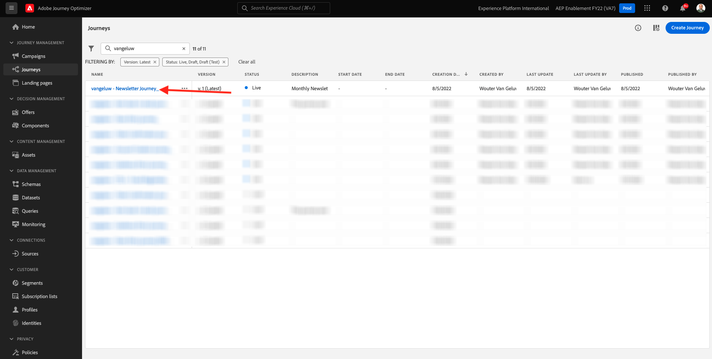
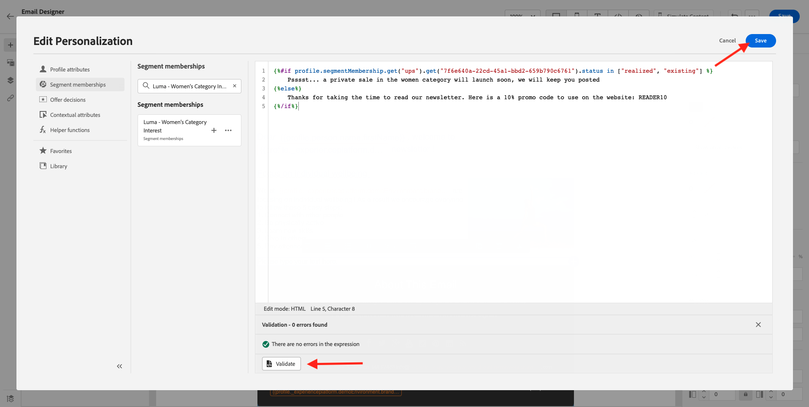
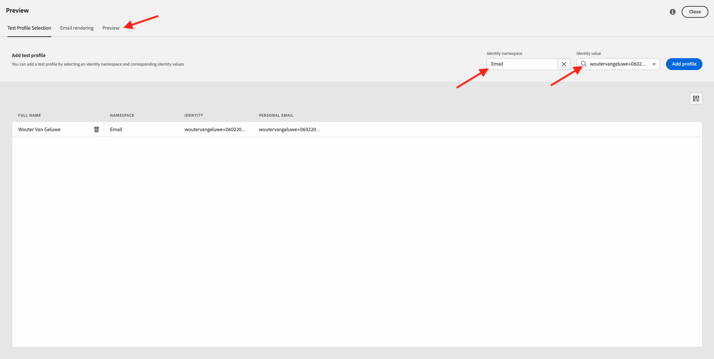
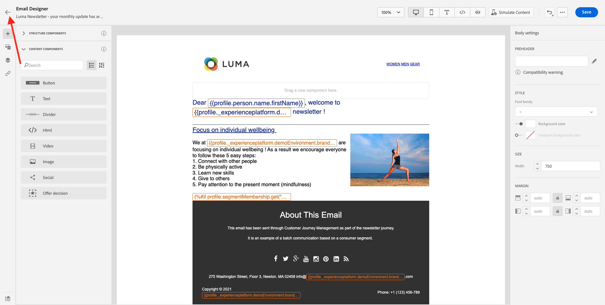

# 10.3 Een personalisatie toepassen in een e-mailbericht

Aanmelden bij Adobe Experience Cloud door naar [Adobe Experience Cloud](https://experience.adobe.com). Klikken **Adobe Journey Optimizer**.

U wordt omgeleid naar de **Home** in Journey Optimizer. Voordat u verdergaat, moet u een **sandbox**. De sandbox die moet worden geselecteerd, krijgt een naam ``--aepTenantId--``. U kunt dit doen door op de tekst te klikken **[!UICONTROL Productieproduct]** in de blauwe lijn boven op het scherm.

## 10.3.1 personalisatie op basis van segmenten

In deze oefening zult u uw nieuwsbrief e-mailbericht met een gepersonaliseerde tekst verbeteren die op segmentlidmaatschap wordt gebaseerd.

Ga naar **Reizen**. Vind de nieuwsbrief die u in de vorige oefening hebt gecreeerd. Zoeken naar `--demoProfileLdap-- - Newsletter`. Klik op uw reis om deze te openen.

Dan zie je dit. Klikken **Dupliceren**.

Klik op ** Dupliceren**.

Selecteer uw **E-mail** handeling en klik op **Inhoud bewerken**.

Klikken **E-mailontwerper**.

Dan zie je dit.

Openen **Inhoudscomponenten** en sleep een **Tekst** onder de huidige inhoud van de nieuwsbrief.

Selecteer de hele standaardtekst en verwijder deze. Klik vervolgens op de knop **Aanpassing toevoegen** in de werkbalk.

U zult dan dit zien:

Klik in het linkermenu op **Segmentlidmaatschap**.

>[!NOTE]
>
>Als u uw segment niet in deze lijst kunt vinden, scrol neer een beetje om instructies op te zoeken hoe te om segmentidentiteitskaart manueel terug te winnen.

Selecteer het segment `Luma - Women's Category Interest` en klik op de knop **+** pictogram, dat er als volgt uitziet:

Vervolgens laat u de eerste regel ongewijzigd en vervangt u regel 2 en 3 door de volgende code:

``
Psssst... a private sale in the women category will launch soon, we will keep you posted

Thanks for taking the time to read our newsletter. Here is a 10% promo code to use on the website: READER10

``

Dan heb je het volgende:

Klikken **Valideren** om te controleren of de code correct is. Klikken **Opslaan**.

U kunt dit bericht nu opslaan door op de knop **Opslaan** in de rechterbovenhoek. Klik vervolgens op **Inhoud simuleren**.

Selecteer een van de profielen die u als onderdeel van deze zelfstudie hebt gemaakt en klik op **Voorvertoning**. U zult dan het resultaat van uw configuratie zien.

Dan zie je dit. Klik vervolgens op **Sluiten**.

Ga terug naar het berichtdashboard door op het **pijl** naast de tekst van de onderwerpregel in de linkerbovenhoek.

Klik op de pijl in de linkerbovenhoek om terug te gaan naar uw reis.

Klikken **OK** om uw e-mailactie te sluiten.

Wijzig uw **Schema** tot **Eenmaal** en een **Datum/tijd**. Klikken **OK**.

>[!NOTE]
>
>De verzenddatum en -tijd van het bericht moeten binnen een uur liggen.

Klik op de knop **Publiceren** op de reis.

Klik in het pop-upvenster op **Publiceren** opnieuw.

Uw standaardnieuwsbrief is nu gepubliceerd. Uw e-mailbericht voor nieuwsbrieven wordt op basis van uw planning verzonden en uw reis wordt beëindigd zodra het laatste e-mailbericht is verzonden.

U hebt deze oefening voltooid.

Volgende stap: [10.4 Pushmeldingen instellen en gebruiken voor iOS](./ex4.md)

[Ga terug naar module 10](./journeyoptimizer.md)

[Terug naar alle modules](../../overview.md)
