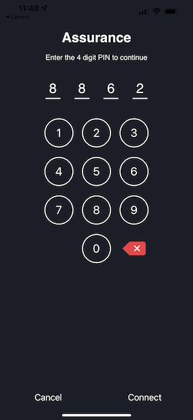
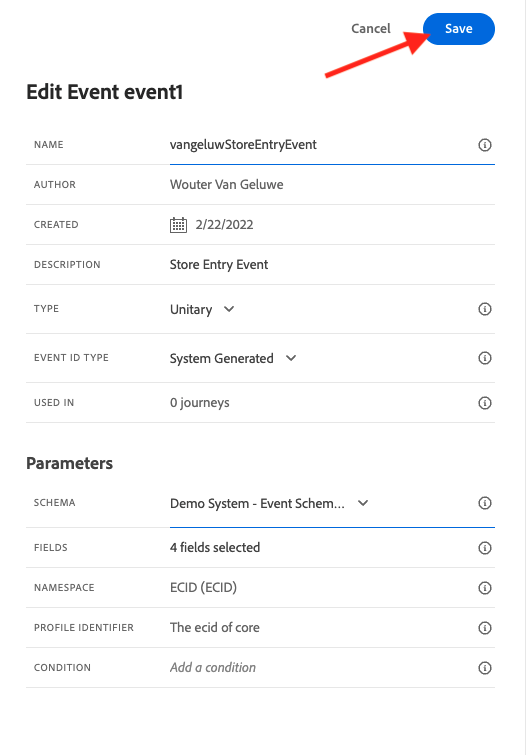
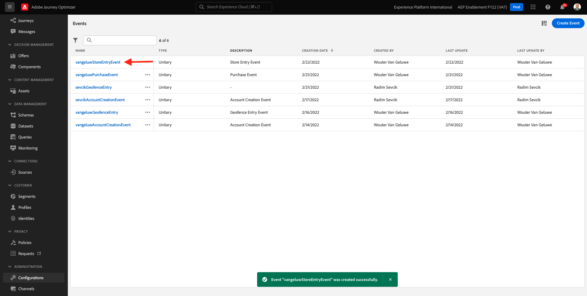
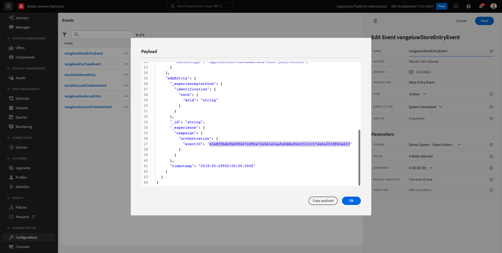
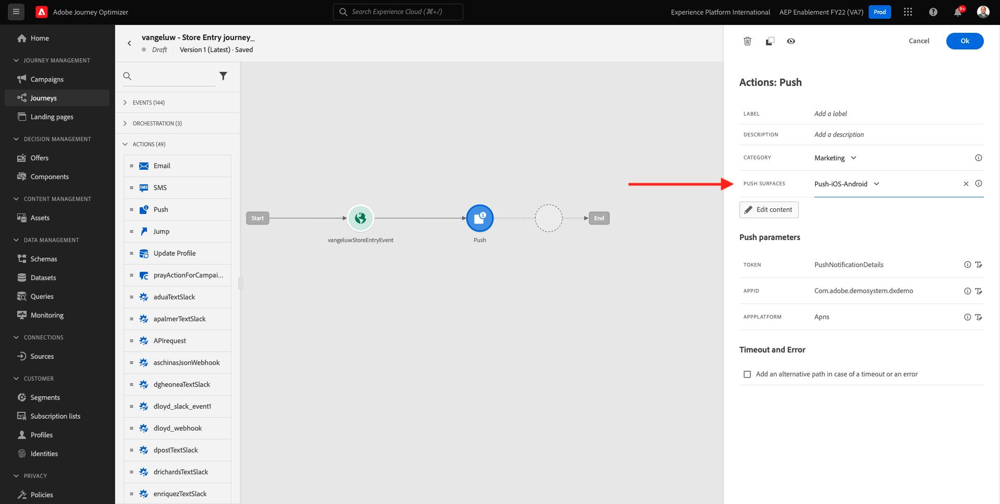
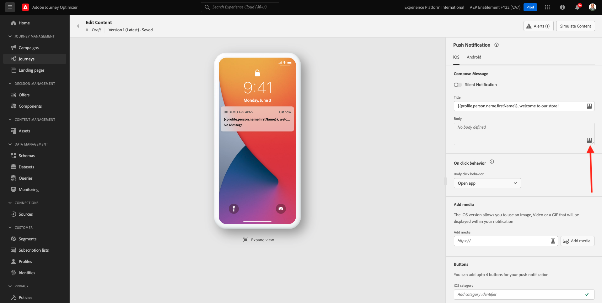
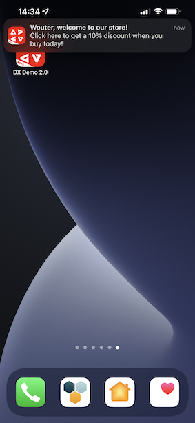

# 10.4 Pushmeldingen instellen en gebruiken voor iOS

Als u pushmeldingen wilt gebruiken met Adobe Journey Optimizer, moet u een aantal instellingen controleren en weten wat deze zijn.

Hier zijn alle instellingen die moeten worden gecontroleerd:

- Datasets en schema&#39;s in Adobe Experience Platform
- DataStream voor mobiele apparaten
- Eigenschappen voor gegevensverzameling voor mobiele apparaten
- App-oppervlak voor push-certificaten
- Test uw pushinstellingen met AEP Assurance

Laten we deze een voor een herzien.

Aanmelden bij Adobe Journey Optimizer door naar [Adobe Experience Cloud](https://experience.adobe.com). Klikken **Journey Optimizer**.

U wordt omgeleid naar de **Home**  in Journey Optimizer. Eerst, zorg ervoor u de correcte zandbak gebruikt. De sandbox die moet worden gebruikt, wordt `--aepSandboxId--`. Als u van de ene naar de andere sandbox wilt gaan, klikt u op **PRODUCTIEVOORRAAD (VA7)** en selecteert u de sandbox in de lijst. In dit voorbeeld krijgt de sandbox een naam **AEP-activering FY22**. Dan ben je in de **Home** weergave van de sandbox `--aepSandboxId--`.

## 10.4.1 Pushgegevenssets

Adobe Journey Optimizer gebruikt datasets om dingen zoals de pushtokens van mobiele apparaten op te slaan of interactie met pushberichten (zoals: bericht verzonden, bericht geopend, enz.) in een dataset in Adobe Journey Optimizer.

U kunt deze datasets vinden door te gaan **[!UICONTROL Gegevenssets]** in het menu aan de linkerkant van het scherm. Om systeemdatasets te tonen, klik het filterpictogram.

De optie inschakelen **Systeemgegevenssets tonen** en zoek naar **AJO**. U zult dan de datasets zien die voor dupberichten worden gebruikt.

## 10.4.2 Gegevensstroom voor mobiele apparaten

Ga naar [https://experience.adobe.com/#/data-collection/](https://experience.adobe.com/#/data-collection/).

Ga in het linkermenu naar **[!UICONTROL DataStream]** en zoek naar de gegevensstroom die u hebt gemaakt in [Oefening 0.2](./../module0/ex2.md), die `--demoProfileLdap-- - Demo System Datastream (Mobile)`. Klik om het te openen.

Klikken **Bewerken** op de **Adobe Experience Platform** service.

U zult dan de gegevensstroommontages zien die werden bepaald, en waarin datasets gebeurtenissen en profielattributen zullen worden opgeslagen.

Er zijn geen wijzigingen nodig. Uw gegevensstroom is nu klaar om te worden gebruikt in uw Client-eigenschap voor gegevensverzameling voor Mobile.

## 10.4.3 Herzie uw bezit van de Inzameling van Gegevens voor Mobiel

Ga naar [https://experience.adobe.com/#/data-collection/](https://experience.adobe.com/#/data-collection/). Als onderdeel van [Oefening 0.1](./../module0/ex1.md), 2 eigenschappen voor gegevensverzameling zijn gemaakt.
U hebt deze eigenschappen van de Cliënt van de Inzameling van Gegevens reeds als deel van vorige modules gebruikt.

Klik om de eigenschap Gegevensverzameling voor mobiel te openen.

Ga in uw bezit van de Inzameling van Gegevens, naar **Extensies**. Vervolgens ziet u de verschillende extensies die nodig zijn voor de mobiele app. Klik om de extensie te openen **Adobe Experience Platform Edge Network**.

U zult dan zien dat uw gegevensstroom voor mobiel hier verbonden is. Klik op Volgende **Annuleren** om terug te gaan naar het overzicht van extensies.

Dan ben je weer terug hier. U ziet de extensie voor **AEP-betrouwbaarheid**. Met AEP Assurance kunt u controleren, testen, simuleren en valideren hoe u gegevens verzamelt of ervaringen opdoet in uw mobiele app. U kunt hier meer lezen over AEP Assurance en Project Griffon [https://aep-sdks.gitbook.io/docs/beta/project-griffon](https://aep-sdks.gitbook.io/docs/beta/project-griffon).

Klik op Volgende **Configureren** om de extensie te openen **Adobe Journey Optimizer**.

U zult dan zien dat dit is waar de dataset voor het volgen van dupgebeurtenissen verbonden is.

Er is geen behoefte om het even welke veranderingen in uw bezit van de Inzameling van Gegevens aan te brengen.

## 10.4.4 Controleer de installatie van uw toepassingsoppervlak

Ga naar [https://experience.adobe.com/#/data-collection/](https://experience.adobe.com/#/data-collection/). Ga in het linkermenu naar **Toepassingsoppervlakken** en open, de App Surface voor **DX Demo App APNS**.

Vervolgens ziet u de geconfigureerde App Surface voor iOS en Android.

## 10.4.5 Test push notification setup using AEP Assurance.

Nadat de app is geïnstalleerd, vindt u deze op het beginscherm van uw apparaat. Klik op het pictogram om de app te openen.

Wanneer u de app de eerste keer gebruikt, wordt u gevraagd u aan te melden met uw Adobe ID. Voltooi het aanmeldingsproces.

Nadat u zich hebt aangemeld, wordt er een melding weergegeven waarin u wordt gevraagd om toestemming voor het verzenden van meldingen. We sturen meldingen als onderdeel van de zelfstudie, dus klik op **Toestaan**.

Vervolgens ziet u de startpagina van de app. Ga naar **Instellingen**.

In montages, zult u zien dat momenteel **Openbaar project** wordt geladen in de app. Klikken **Aangepast project**.

U kunt nu een aangepast project laden. Klik de code QR om uw project gemakkelijk te laden.

Na oefening 0.1, had u dit resultaat. Klik om het dialoogvenster **Mobiele detailhandel** dat voor u is gemaakt.

Als u per ongeluk uw browservenster hebt gesloten, of voor toekomstige demo- of inschrijvingssessies, kunt u ook naar uw websiteproject gaan [https://builder.adobedemo.com/projects](https://builder.adobedemo.com/projects). Nadat je je hebt aangemeld bij je Adobe ID, kun je dit zien. Klik op uw mobiele-toepassingsproject om het te openen.

Dan zie je dit. Klikken **Integraties**.

U moet het bezit van de Inzameling van Gegevens voor mobiel selecteren dat in oefening 0.1 werd gecreeerd. Klik op Volgende **Uitvoeren**.

U zult dan deze popup zien, die een QR code bevat. Scan deze QR-code vanuit de mobiele app.

Vervolgens wordt uw project-id weergegeven in de app, waarna u kunt klikken **Opslaan**.

Ga nu terug naar **Home** in de app. Uw app is nu klaar om te worden gebruikt.

U moet nu een QR-code scannen om uw mobiele apparaat aan te sluiten op uw AEP-betrouwbaarheidssessie.

Ga naar [https://experience.adobe.com/#/@experienceplatform/griffon](https://experience.adobe.com/#/@experienceplatform/griffon). Klikken **Sessie maken**.

Klikken **Start**.

Vul de waarden in:

- Naam sessie: gebruiken `--demoProfileLdap-- - push debugging` en vervang ldap door uw ldap
- Basis-URL: gebruiken **dxdemo://default**

Klik op **Next**.

Vervolgens ziet u een QR-code op uw scherm, die u moet scannen met uw iOS-apparaat.

Open de camera-app op uw mobiele apparaat en scan de QR-code die wordt weergegeven door AEP Assurance.

U zult dan een popup scherm zien, vragend u om de SPELD-code in te gaan. Kopieer de pincode van uw AEP Assurance-scherm en klik op **Verbinden**.

Dan zie je dit.

In AEP Assurance ziet u nu dat een apparaat naar de AEP Assurance-sessie gaat.

Ga naar **Push Debug**. Je ziet iets dergelijks.

Enkele uitleg:

- De eerste kolom, **Client**, geeft de beschikbare id&#39;s op uw iOS-apparaat weer. Je ziet een ECID en een Push Token.
- De tweede kolom toont **Profiel** informatie, met extra informatie over welk platform de Push Token in (APNS of APNSSandbox) woont. Als u op de knop **Inspect-profiel** , wordt u doorgestuurd naar Adobe Experience Platform en ziet u het volledige Real-Time Klantprofiel.
- De derde kolom toont de **Toepassingsconfiguratie**, die in het kader van de uitoefening van **10.5.4 Toepassingsconfiguratie maken in starten**

Als u de instellingen voor de pushconfiguratie wilt testen, klikt u op de knop **Pushmelding verzenden** knop.

U moet ervoor zorgen dat de **DX-demo** is niet geopend op het moment dat u op het tabblad **Pushmelding verzenden** knop. Als de app geopend is, wordt het pushbericht mogelijk op de achtergrond ontvangen en is het niet zichtbaar.

Vervolgens verschijnt er een pushmelding zoals deze op uw mobiele apparaat.

Als u het pushbericht hebt ontvangen, betekent dit dat uw instelling juist is en prima werkt.

## 10.4.6 Een nieuwe gebeurtenis maken

Ga in het menu naar **Reisadministratie** en klik op **Beheren** krachtens **Gebeurtenissen**.

Op de **Gebeurtenissen** -scherm, ziet u een vergelijkbare weergave. Klikken **Gebeurtenis maken**.

U ziet dan een lege gebeurtenisconfiguratie.

Geef uw gebeurtenis als volgt een naam: `--demoProfileLdap--StoreEntryEvent` en stel beschrijving in op `Store Entry Event`.

Volgende is de **Type gebeurtenis** selectie. Selecteren **Unitair**.

Volgende is de **Type gebeurtenis-id** selectie. Selecteren **Door systeem gegenereerd**

Nu de selectie van het schema. Hiervoor is een schema opgesteld. Gebruik het schema `Demo System - Event Schema for Mobile App (Global v1.1) v.1`.

Nadat u het schema hebt geselecteerd, ziet u een aantal velden die worden geselecteerd in het dialoogvenster **Payload** sectie. Uw gebeurtenis is nu volledig geconfigureerd.

Dan moet je dit zien. Klikken **Opslaan**.

Uw gebeurtenis is nu geconfigureerd en opgeslagen. Klik nogmaals op de gebeurtenis om het dialoogvenster **Gebeurtenis bewerken** opnieuw.

Houd de aanwijzer boven de **Payload** en klik op de knop **Payload weergeven** pictogram.

U zult nu een voorbeeld van de verwachte nuttige lading zien.

Uw gebeurtenis heeft een unieke orchestration eventID, die u kunt vinden door neer in die lading te scrollen tot u ziet `_experience.campaign.orchestration.eventID`.

De gebeurtenis-id is wat naar Adobe Experience Platform moet worden verzonden om de Reis te activeren die u in de volgende stap maakt. Schrijf deze eventID neer, aangezien u het in de volgende stap zult nodig hebben.
`"eventID": "e3a8f0bdc0b609667cd96a72a6b1e5aafa0ddaf6ccf121c574e6a2030860a633"`

Klikken **OK**, gevolgd door **Annuleren**.

## 10.4.7 Een reis maken

Ga in het menu naar **Reizen** en klik op **Reis maken**.

Dan zie je dit. Geef je reis een naam. Gebruik `--demoProfileLdap-- - Store Entry journey`. Klikken **OK**.

Eerst, moet u uw gebeurtenis toevoegen als uitgangspunt van uw reis. Zoeken naar uw gebeurtenis `--demoProfileLdap--StoreEntryEvent` en sleep het naar het canvas. Klikken **OK**.

Volgende, onder **Handelingen**, zoekt u naar de **Push** handeling.
Sleep de **Push** op het canvas.

Stel de **Categorie** tot **Marketing** en selecteer een drukknop waarmee u pushmeldingen kunt verzenden. In dit geval is het te selecteren e-mailoppervlak **Push-iOS-Android**.

De volgende stap is uw bericht te creëren. Om dat te doen, klikt u op **Inhoud bewerken**.

Dan zie je dit. Klik op de knop **personalisatie** pictogram voor de **Titel** veld.

Dan zie je dit. U kunt nu elk profiel rechtstreeks selecteren in het realtime profiel van de klant.

Zoeken naar het veld **Voornaam** klikt u op de knop **+** pictogram naast het veld **Voornaam**. U zult dan het verpersoonlijkingstoken voor Voornaam zien die wordt toegevoegd: **{{profile.person.name.firstName}}**.

Voeg vervolgens de tekst toe **, welkom in onze winkel!** achter **{{profile.person.name.firstName}}**.

Klikken **Opslaan**.

U hebt dit nu. Klik op de knop **personalisatie** pictogram voor de **Lichaam** veld.

Deze tekst invoeren **Klik hier om een korting van 10% te krijgen wanneer je vandaag koopt!** en klik op **Opslaan**.

Dan heb je dit. Klik op de pijl in de linkerbovenhoek om terug te gaan naar uw reis.

Klikken **OK** om de drukknop te sluiten.

Klikken **Publiceren**.

Klikken **Publiceren** opnieuw.

Uw reis is nu gepubliceerd.

## 10.4.8 Test uw reis en duwbericht

Ga in uw DX Demo 2.0 mobiele toepassing naar de **Instellingen** scherm. Klik op de knop **Winkelvermelding** knop.

>[!NOTE]
>
>De **Winkelvermelding** wordt momenteel geïmplementeerd. U vindt deze nog niet in de app.

Sluit de app onmiddellijk nadat u op de knop **Winkelvermelding** anders wordt het pushbericht niet weergegeven.

Na een paar seconden, zult u het bericht zien verschijnen.

U hebt deze oefening voltooid.

Volgende stap: [10.5 Een zakenreis maken](./ex5.md)

[Ga terug naar module 10](./journeyoptimizer.md)

[Terug naar alle modules](../../overview.md)
