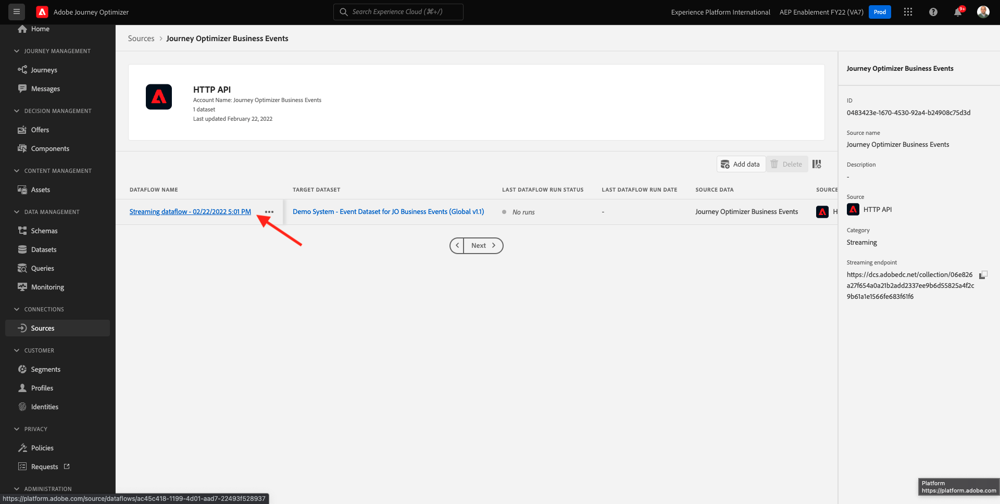

# 10.5 Een zakenreis maken

Aanmelden bij Adobe Journey Optimizer door naar [Adobe Experience Cloud](https://experience.adobe.com). Klikken **Journey Optimizer**.


U wordt omgeleid naar de **Home**  in Journey Optimizer. Eerst, zorg ervoor u de correcte zandbak gebruikt. De sandbox die moet worden gebruikt, wordt `--aepSandboxId--`. Als u van de ene naar de andere sandbox wilt gaan, klikt u op **PRODUCTIEVOORRAAD (VA7)** en selecteert u de sandbox in de lijst. In dit voorbeeld krijgt de sandbox een naam **AEP-activering FY22**. Dan ben je in de **Home** weergave van de sandbox `--aepSandboxId--`.


## 10.5.1 Een zakelijke gebeurtenis maken

Klik in het linkermenu op **Configuraties**. Klik op de knop **Beheren** in de **Gebeurtenissen** kaart.


Zakelijke gebeurtenissen zijn een nieuw type gebeurtenis dat u kunt maken in Journey Optimizer. In tegenstelling tot **Unitair** gebeurtenissen die u in vorige modules hebt gecreeerd, worden de bedrijfsgebeurtenissen niet teweeggebracht door de klant maar door de organisatie. U gaat nu uw bedrijfsgebeurtenis maken.

Klikken **Gebeurtenis maken**.


Voer de volgende waarden in het formulier voor het maken van gebeurtenissen in:

- **Naam**: `--demoProfileLdap--ItemBackInStock`. Bijvoorbeeld: **vangeluwItemBackInStock**
- **Beschrijving**: Deze gebeurtenis wordt geactiveerd wanneer een product weer in voorraad is
- **Type**: selecteren **Zakelijk** in de vervolgkeuzelijst


Selecteer voor het schema de optie **Demosysteem - Gebeurtenisschema voor JO Business Events (Global v1.1) v.1**. U moet nu de gebieden in het schema selecteren die u voor ons gebruiksgeval vereist.


Voer de volgende stappen uit:

Klik op de knop **potlood** pictogram op het veld waar het wordt weergegeven **1 veld geselecteerd**.


Selecteer alle beschikbare velden in het schema en klik op **OK**.


Voor de voorwaarde: u moet specificeren welke verslagen in dit schema de bedrijfsgebeurtenis zullen teweegbrengen.

Voer de volgende stappen uit:

Klik op de knop **potlood** pictogram op het veld waar het wordt weergegeven **Een voorwaarde toevoegen**.


Breid aan de linkerkant de `--aepTenantId--` object, het object uitvouwen **joBusinessEvents** en sleep het veld **eventName** op het canvas.


Voor het veld **eventName** Voer de volgende waarde in: `--demoProfileLdap--ItemBackInStock`. Bijvoorbeeld: vangeluwItemBackInStock.
Klikken **OK**.


Klikken **OK**.


Tot slot zou uw vorm van de gebeurtenisverwezenlijking als dit moeten kijken. Klikken **Opslaan** om uw bedrijfsgebeurtenis op te slaan.


## 10.5.2 Een zakenreis maken

U kunt deze zakelijke gebeurtenis en het bericht nu gebruiken voor een reis. Ga naar **Reizen**. Klikken **Reis maken**.


Rechts ziet u een formulier waarin u de naam en de beschrijving van het transport moet vermelden. Voer de volgende waarden in:

- **Naam**: `--demoProfileLdap-- - Item back in stock journey`. Bijvoorbeeld: vangeluw - Reizen van artikelen
- **Beschrijving**: Deze reis verzendt een SMS wanneer een voorwerp aan bezoeker terug in voorraad is die een interesse heeft getoond.

Klikken **OK**.


In het linkermenu, onder **Gebeurtenissen**, zoek naar uw LDAP. U zult de eerder gecreëerde bedrijfsgebeurtenis vinden `--demoProfileLdap--ItemBackInStock`. Sleep en zet deze gebeurtenis neer op het canvas, aangezien dit het uitgangspunt van de reis zal zijn.


Zoals u kunt zien, een **Segment lezen** activiteit is automatisch toegevoegd aan het canvas. Dit is omdat de bedrijfsgebeurtenissen slechts een trekker voor de reis verzenden om een specifiek segment te lezen, dat dan de lijst van profielen voor die reis zal terugwinnen.

Klik op de knop **Segment lezen** activiteit.
De **Segment lezen** de configuratie verwacht u om het segment te selecteren dat u van de bedrijfsgebeurtenis op de hoogte wilt brengen die enkel gebeurde. Klik op de knop **Een segment selecteren** veld.


In de **Een segment kiezen** popup, onderzoek naar uw ldap en selecteer het segment u binnen creeerde [Module 6 - Echte tijd CDP - Bouw een segment en neem actie](../module6/real-time-cdp-build-a-segment-take-action.md) benoemd `--demoProfileLdap-- - Interest in PROTEUS FITNESS JACKSHIRT`. bijvoorbeeld: vangeluw - interesse in PROTEUS FITNESS JACKSHIRT. Klikken **Opslaan**.


Klik op Volgende **OK**.


De volgende stap is het slepen en neerzetten van de actie die we op deze reis willen uitvoeren. Selecteer de handeling **SMS** en sleep deze vervolgens naar de voorwaarde die u zojuist hebt toegevoegd.


Stel de **Categorie** tot **Marketing** en selecteer een sms-oppervlak waarmee u sms kunt verzenden. In dit geval is het te selecteren e-mailoppervlak **SMS**.


De volgende stap is uw bericht te creëren. Om dat te doen, klikt u op **Inhoud bewerken**.


U zult nu het berichtdashboard zien, waar u de tekst van uw SMS kunt vormen. Klik op de knop **Bericht samenstellen** gebied voor het maken van uw bericht.


Voer de volgende tekst in: `Hi {{profile.person.name.firstName}}, the Proteus Fitness Jackshirt is back in stock at Luma.`. Klikken **Opslaan**.


Ga terug naar het berichtdashboard door op het **pijl** naast de tekst van de onderwerpregel in de linkerbovenhoek.


Je ziet nu de voltooide SMS-actie. Klikken **OK**.


Uw reis is nu klaar om te worden gepubliceerd. Klikken **Publiceren**.


Klikken **Publiceren** opnieuw.


Uw reis wordt nu gepubliceerd, u kunt het nu testen!


## 10.5.3 Test uw zakenreis

U gaat nu de hervoorraad van een product simuleren door een nieuwe gebeurtenis in te voeren tegen de **Demosysteem - Gebeurtenisschema voor JO Business Events (Global v1.1) v.1** Postman gebruiken.

Klik in het linkermenu op **Bronnen** en klik vervolgens op de knop **Accounts** tab.


Op de **Accounts** tab, vindt u de account genaamd **Journey Optimizer Business Events**. Klik erop om het te openen.


Deze account heeft slechts één gegevensstroom. Klik op de naam van de gegevensstroom om deze te selecteren.



Klikken **Schema-lading kopiëren** in het rechtermenu. Met deze optie wordt het gehele **krullen** gebruiken om een record in te voegen tegen de **Demosysteem - Gebeurtenisschema voor JO Business Events (Global v1.1) v.1** naar uw klembord.


Plak de opdracht Curl in een teksteditor


Laten we dit verzoek nader bekijken.

- Het verzoek van de POST wordt verzonden naar DCS Inlet ID
- Het verzoek verwijst naar het schema, de dataset en identiteitskaart van de Organisatie.
- Tot slot bevat het de knoop xdmEntiteit die de gegevens vertegenwoordigt die wij binnen de dataset willen tot stand brengen.

U moet nu het volgende vervangen `xdmEntity` regel...

```json
"xdmEntity": {
  "_experienceplatform": {
    "joBusinessEvents": {
      "eventDescription": "string",
      "eventName": "string",
      "stockEventId": "string"
    }
  },
  "_id": "/uri-reference",
  "eventType": "advertising.completes",
  "timestamp": "2018-11-12T20:20:39+00:00"
}
```

...door deze lijn, zorg ervoor de gebied eventName zoals het zou moeten zeggen verifieert `--demoProfileLdap--ItemBackInStock`, die de voorwaarde vertegenwoordigt u in uw bedrijfsgebeurtenis hebt gespecificeerd om uw reis teweeg te brengen.

```json
"xdmEntity": {
  "_experienceplatform": {
    "joBusinessEvents": {
      "eventDescription": "Product Proteus Fitness Jackshirt is back in stock",
      "eventName": "--demoProfileLdap--ItemBackInStock",
      "stockEventId": "1"
    }
  },
  "_id": "/uri-reference",
  "eventType": "productBackInStock",
  "timestamp": "2021-04-19T15:25:39+00:00"
}
```

De bijgewerkte **krullen** de opdracht moet er als volgt uitzien:


Selecteer alles en kopieer het naar uw klembord.

Open Postman. Klik links in Postman op **Importeren**.


Selecteer **Onbewerkte tekst** en plak de eerder hier gekopieerde opdracht. Klikken **Doorgaan**.


Klikken **Importeren**.


Postman heeft de **krullen** bevel in een REST bevel klaar om te worden teweeggebracht, druk eenvoudig **Verzenden** knoop om het creëren van dat verslag binnen de dataset te verzoeken.


Controleer of uw aanvraag is ontvangen. Zoeken naar een **200 OK** status in postbode.


Het SMS kan een paar minuten duren om op je mobiele telefoon aan te komen. Als dat niet het geval is, **Belang van het Proteus Fitness-jasje** segment mag geen profiel met een correcte mobiele telefoon bevatten. Als dat het geval is, ga dan naar de Luma-website **Proteus Fitness Jackshirt** product en registreer u terwijl u ervoor zorgt dat u het juiste mobiele telefoonnummer opgeeft.


U hebt deze oefening nu afgerond.

Volgende stap: [Samenvatting en voordelen](./summary.md)

[Ga terug naar module 10](./journeyoptimizer.md)

[Terug naar alle modules](../../overview.md)
