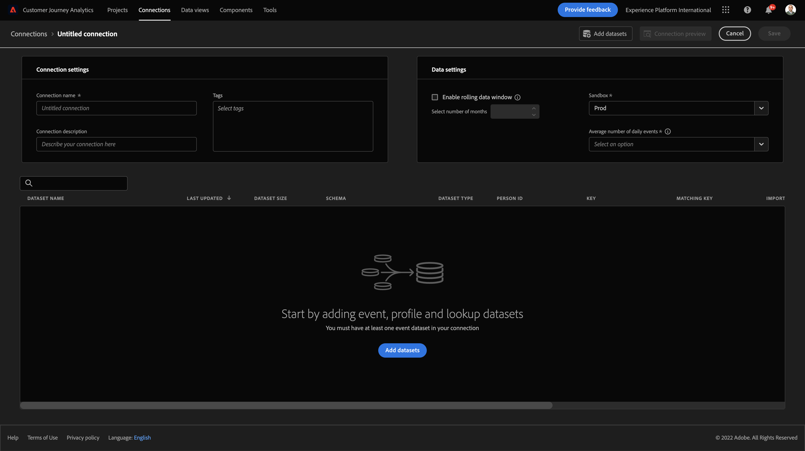
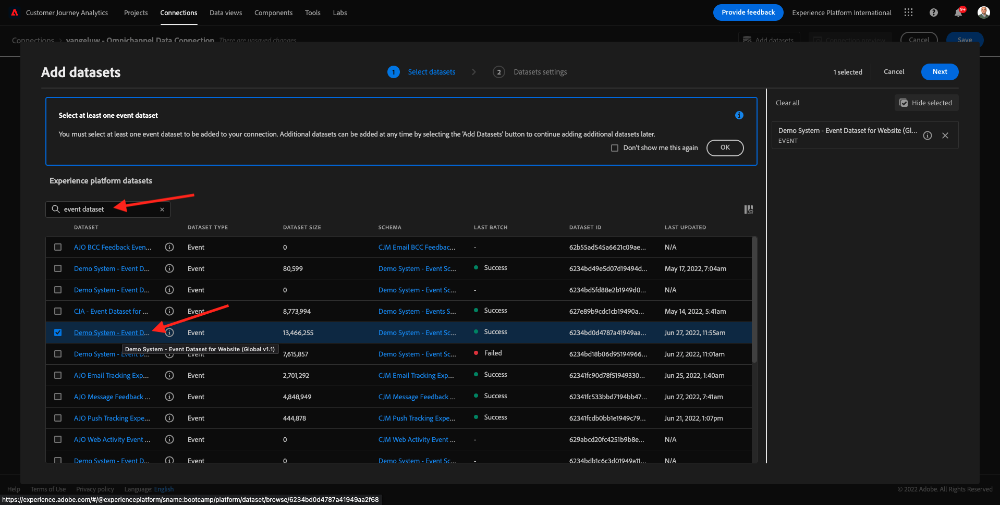
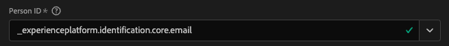
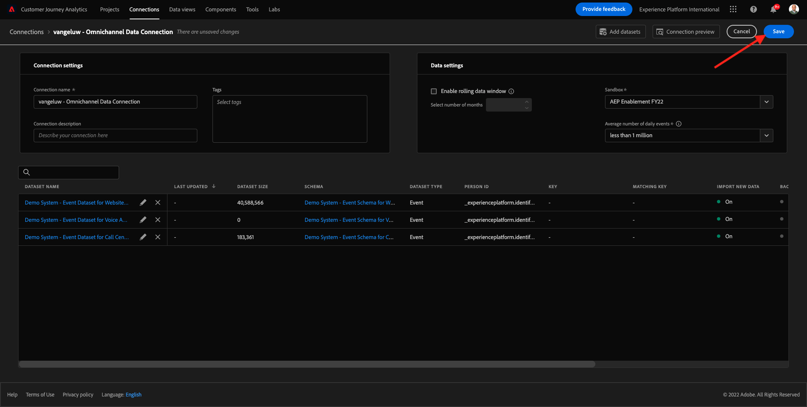

# 11.2 Connect Adobe Experience Platform-gegevenssets in Customer Journey Analytics

## Doelstellingen

- De interface voor gegevensverbinding begrijpen
- Adobe Experience Platform-gegevens in CJA plaatsen
- Persoon-id en gegevensstitching begrijpen
- Leer het concept gegevensstreaming in Customer Journey Analytics

## 11.2.1 Verbinding

Ga naar [analytics.adobe.com](https://analytics.adobe.com) om toegang te krijgen tot Customer Journey Analytics.

Ga op de Customer Journey Analytics-homepage naar **Verbindingen**.

Hier kunt u alle verschillende verbindingen zien die tussen CJA en Platform worden gemaakt. Deze verbindingen hebben hetzelfde doel als rapportsuites in Adobe Analytics. De gegevensverzameling is echter totaal anders. Alle gegevens komen uit de datasets van Adobe Experience Platform.

Laten we uw eerste verbinding maken. Klikken **Nieuwe verbinding maken**.

Dan zie je de **Verbinding maken** UI.

U kunt nu een naam aan uw verbinding geven.

Gebruik deze naamgevingsconventie: `--demoProfileLdap-- – Omnichannel Data Connection`.

Voorbeeld: `vangeluw - Omnichannel Data Connection`

U moet ook de juiste sandbox selecteren om te gebruiken. Selecteer in het menu van de sandbox de sandbox die u wilt gebruiken `Bootcamp`. In dit voorbeeld moet de sandbox **Bootkamp**. En u moet ook de **Gemiddeld aantal dagelijkse gebeurtenissen** tot **minder dan 1 miljoen**.

Nadat u de sandbox hebt geselecteerd, worden de beschikbare gegevenssets bijgewerkt.

## 11.2.2 Adobe Experience Platform-gegevenssets selecteren

Zoeken naar de gegevensset `Demo System - Event Dataset for Website (Global v1.1)`. Klikken **+** om de dataset aan deze verbinding toe te voegen.

Zoek nu de selectievakjes voor `Demo System - Event Dataset for Voice Assistants (Global v1.1)` en `Demo System - Event Dataset for Call Center (Global v1.1)`.

Dan heb je dit. Klik op **Next**.

## 11.2.3 Persoon-id en gegevensplaatsing

### Persoon-id

### Persoon-id

Het doel is nu om zich bij deze datasets aan te sluiten. Voor elke gegevensset die u hebt geselecteerd, wordt een veld weergegeven met de naam **Persoon-id**. Elke dataset heeft zijn eigen gebied van identiteitskaart van de Persoon.

Zoals u kunt zien, hebben de meeste van hen automatisch geselecteerde identiteitskaart van de Persoon. Dit komt omdat in elk schema in Adobe Experience Platform een primaire id is geselecteerd. Als voorbeeld, hier is het schema voor `Demo System - Event Schema for Call Center (Global v1.1)`, waar u kunt zien dat de primaire id is ingesteld op `phoneNumber`.

Nochtans, kunt u nog beïnvloeden welk herkenningsteken zal worden gebruikt om datasets voor uw verbinding samen te binden. U kunt om het even welke herkenningsteken gebruiken die in het schema verbonden aan uw dataset wordt gevormd. Klik op dropdown om IDs te onderzoeken beschikbaar op elke dataset.

Zoals vermeld, kunt u verschillende Persoon IDs voor elke dataset plaatsen. Dit staat u toe om verschillende datasets van veelvoudige oorsprong in CJA samen te brengen. Stel je voor dat we NPS-gegevens of enquêtegegevens invoeren die erg interessant en nuttig zouden zijn om de context te begrijpen en waarom er iets is gebeurd.

De naam van het veld Person-id is niet belangrijk, zolang de waarde in de velden Person-id overeenkomt. Laten we zeggen: `email` in één gegevensset en `emailAddress` in een andere gegevensset die is gedefinieerd als Person ID. Indien `delaigle@adobe.com` is de zelfde waarde voor de persoon ID-gebied op beide datasets, CJA zal de gegevens kunnen verbinden.

Op dit moment zijn er nog enkele andere beperkingen, zoals het aanstichten van het anonieme gedrag aan gekend. Lees hier de veelgestelde vragen: [Veelgestelde vragen](https://experienceleague.adobe.com/docs/analytics-platform/using/cja-overview/cja-faq.html).

### De gegevens tikken met de persoon-id

Nu u het concept van het stitching datasets gebruikend identiteitskaart van de Persoon begrijpt, kiezen `email` als uw Persoon-id voor elke dataset.

Ga naar elke dataset om identiteitskaart van de Persoon bij te werken.

Vul nu het veld Persoon-id waarin u de optie `email` in de vervolgkeuzelijst.

Zodra u de drie datasets hebt vastgezet, zijn wij bereid om verder te gaan.

| gegevensset | Persoon-id |
| ----------------- |-------------| 
| Demosysteem - Dataset voor gebeurtenissen voor website (Global v1.1) | email |
| Demosysteem - Dataset van de Gebeurtenis voor de Medewerkers van de Stem (Globale v1.1) | email |
| Het Systeem van de manifestatie - de Dataset van de Gebeurtenis voor het Centrum van de Vraag (Globale v1.1) | email |

U moet ook ervoor zorgen dat voor elke dataset, deze opties worden toegelaten:

- Alle nieuwe gegevens importeren
- Back-up maken van alle bestaande gegevens

Klikken **Gegevenssets toevoegen**.

Klikken **Opslaan** en ga naar de volgende oefening.
Nadat u uw **Verbinding** het kan een paar uur duren voordat uw gegevens beschikbaar zijn in CJA.

Volgende stap: [11.3 Een gegevensweergave maken](./ex3.md)

[Ga terug naar module 11](./customer-journey-analytics-build-a-dashboard.md)

[Terug naar alle modules](./../../overview.md)
