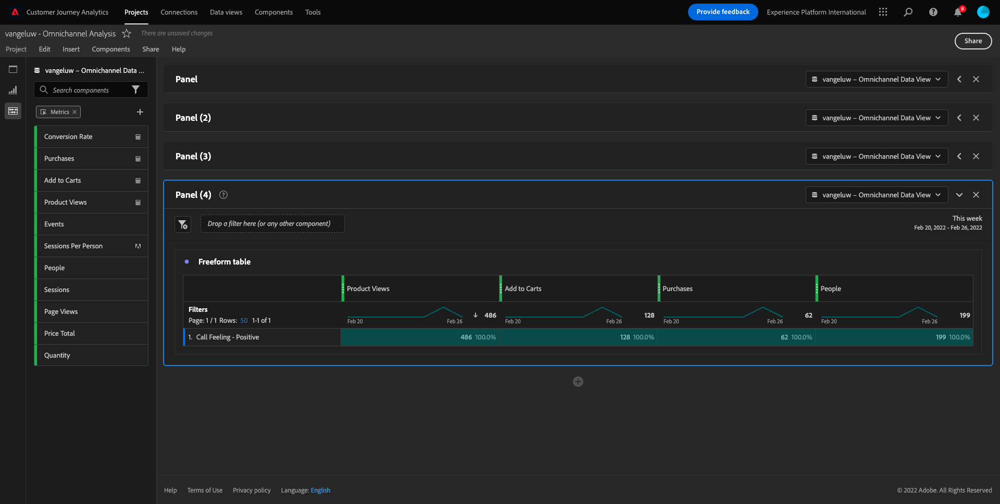

# 11.5 Visualisatie met Customer Journey Analytics

## Doelstellingen

- Analysis Workspace-gebruikersinterface begrijpen
- Leer een functie die Analysis Workspace zo verschillend maakt.
- Leer hoe u in CJA analyseert met Analysis Workspace

## Context

In deze oefeningen zult u Analysis Workspace binnen CJA gebruiken om productmeningen, producttrechters, kurn etc. te analyseren.

Wij zullen enkele vragen behandelen die in Module 7 - de Dienst van de Vraag worden gedaan zodat kunt u zien hoe gemakkelijk is om de zelfde vragen en meer in werking te stellen maar zonder SQL te gebruiken en slechts op de belemmering en dalingsfilosofie van Analysis Workspace te vertrouwen.

Laten we het project gebruiken waarin u hebt gemaakt [11.4 Gegevensvoorbereiding in Analysis Workspace](./ex4.md), dus ga naar [https://analytics.adobe.com](https://analytics.adobe.com).

Uw project openen `--demoProfileLdap-- - Omnichannel Analysis`.

Met uw geopend project en de Mening van Gegevens `--demoProfileLdap-- - Omnichannel Analysis` geselecteerd, bent u klaar om uw eerste visualisaties te bouwen.

## Hoeveel productweergaven hebben we dagelijks

Allereerst moeten we de juiste data selecteren om de gegevens te analyseren. Ga naar de kalenderdropdown op de rechterkant van het canvas. Klik erop en selecteer het toepasselijke datumbereik.

In het linkerzijmenu (componentengebied), vind Berekende Metrisch **Productweergaven**. Selecteer het en sleep het en laat vallen binnen het canvas, op het hoogste recht binnen de vrije vormlijst.

De dimensie automatisch instellen **Dag** wordt toegevoegd om uw eerste tabel te maken. Nu kunt u zien hoe uw vraag direct wordt beantwoord.

Klik vervolgens met de rechtermuisknop op het metrische overzicht.

Klikken op **Visualiseren** en selecteer vervolgens **Lijn** als visualisatie.

Uw producten worden overdag weergegeven.

U kunt het tijdsbereik veranderen in dag door op **Instellingen** binnen de visualisatie.

Klik op de stip naast **Lijn** tot **De gegevensbron beheren**.

Klik op Volgende **Selectie vergrendelen** en selecteert u **Geselecteerde items** om deze visualisatie te vergrendelen zodat altijd een tijdlijn van productweergaven wordt weergegeven.

## Vijf meest bekeken producten

Wat zijn de vijf belangrijkste producten die worden weergegeven?

Vergeet niet om het project nu en dan op te slaan.

| OS | Korte snede |
| ----------------- |-------------| 
| Windows | Control + S |
| Mac | Command + S |

Laten we de beste 5 bekeken producten vinden. In het linkerzijmenu, vind **Productnaam** - Dimension.

Nu slepen en neerzetten **Productnaam** ter vervanging van de **Dag** dimensie:

Dit zal het resultaat zijn

Probeer vervolgens een van de producten te splitsen op merknaam. Zoeken naar **brandName** en sleep het onder de eerste productnaam.

Daarna, doe een verdeling gebruikend de Agent van de Gebruiker. Zoeken naar **Gebruikersagent** en sleep het onder de merknaam.

U zult dan dit zien:

Tot slot kunt u meer visualisaties toevoegen. Aan de linkerkant, onder visualisatie, zoek naar `Donut`. Neem `Donut`, slepen en neerzetten op het canvas onder de **Lijn** visualisatie.

Selecteer vervolgens in de tabel de eerste 5 **Gebruikersagent**  rijen uit de ineenstorting die we onder **Google Pixel XL 32 GB zwarte smartphone** > **Citi Signal**. Houd tijdens het selecteren van de drie rijen de knop **CTRL** (in Windows) of de knop **Opdracht** (op Mac).

Het donutdiagram is gewijzigd:

U kunt zelfs het ontwerp aanpassen om leesbaarder te zijn, door zowel **Lijn** de **Donut** een beetje kleiner uitlijnen zodat ze naast elkaar kunnen passen:

Klik op de stip naast **Donut** tot **De gegevensbron beheren**.
Klik op Volgende **Selectie vergrendelen** om deze visualisatie te vergrendelen zodat altijd een tijdlijn van productweergaven wordt weergegeven.

Meer informatie over visualisaties met Analysis Workspace vindt u hier:

- [https://experienceleague.adobe.com/docs/analytics/analyze/analysis-workspace/visualizations/freeform-analysis-visualizations.html](https://experienceleague.adobe.com/docs/analytics/analyze/analysis-workspace/visualizations/freeform-analysis-visualizations.html)
- [https://experienceleague.adobe.com/docs/analytics/analyze/analysis-workspace/visualizations/t-sync-visualization.html](https://experienceleague.adobe.com/docs/analytics/analyze/analysis-workspace/visualizations/t-sync-visualization.html)

## Trechter met productinteracties, van weergave tot aankoop

Er zijn veel manieren om deze kwestie op te lossen. Één van hen moet het Type van Interactie van het Product gebruiken en het op een vrije vormlijst gebruiken. Een andere manier is om een **Vallout Visualisatie**. Laten we de laatste gebruiken die we tegelijkertijd willen visualiseren en analyseren.

Sluit het huidige deelvenster door hier te klikken:

Voeg nu een nieuw leeg deelvenster toe door op **+ Leeg deelvenster toevoegen**.

Klik op visualisatie **Fallout**.

Selecteer hetzelfde datumbereik als in de vorige exercitie.

Dan zie je dit.

Dimensie zoeken **Type gebeurtenis** onder de onderdelen aan de linkerkant:

Klik op de pijl om de dimensie te openen:

Alle beschikbare gebeurtenistypen worden weergegeven.

Item selecteren **commerce.productViews** en sleep het naar de **Aanraakpunt toevoegen** veld binnen **Vallout Visualisatie**.

Doe hetzelfde met **commerce.productListAdds** en **commerce.purchase** en zet ze neer op **Aanraakpunt toevoegen** veld binnen **Vallout Visualisatie**. Uw visualisatie ziet er nu als volgt uit:

Je kunt hier veel doen. Enkele voorbeelden: vergelijk in tijd, vergelijk elke stap door apparaat of vergelijk door loyaliteit. Nochtans, als wij interessante dingen willen analyseren zoals waarom klanten niet kopen na het toevoegen van een punt aan hun kar, kunnen wij het beste hulpmiddel in CJA gebruiken: klik met de rechtermuisknop.

Klik met de rechtermuisknop op het aanraakpunt **commerce.productListAdds**. Klik vervolgens op **Brainstormfallout bij dit aanraakpunt**.

Er wordt een nieuwe vrije-vormtabel gemaakt om te analyseren wat de mensen deden als ze niets hadden aangeschaft.

Wijzig de **Type gebeurtenis** door **Paginanaam** in de nieuwe vrije-formuliertabel om te zien welke pagina&#39;s ze gaan in plaats van de pagina Aankoopbevestiging.

## Wat doen de mensen op de plaats alvorens de Cancel pagina van de Dienst te bereiken?

Nogmaals, er zijn vele manieren om deze analyse uit te voeren. Laten we de flowanalyse gebruiken om het detectieonderdeel te starten.

Sluit het huidige deelvenster door hier te klikken:

Voeg nu een nieuw leeg deelvenster toe door op **+ Leeg deelvenster toevoegen**.

Klik op visualisatie **Stroom**.

U zult dan dit zien:

Selecteer hetzelfde datumbereik als in de vorige exercitie.

Dimensie zoeken **Paginanaam** onder de onderdelen aan de linkerkant:

Klik op de pijl om de dimensie te openen:

Alle pagina&#39;s worden weergegeven. De paginanaam zoeken: **Service annuleren**.
Slepen en neerzetten **Service annuleren** In de Visualisatie van de Stroom op het middengebied:

U zult dan dit zien:

Laten we nu analyseren of klanten die de **Service annuleren** de pagina op de website noemde ook het callcenter en wat het resultaat was.

Ga onder de afmetingen terug en zoek **Type oproepinteractie**.
Slepen en neerzetten **Type oproepinteractie** ter vervanging van de eerste interactie aan de rechterkant in het dialoogvenster **Stroomvisualisatie**.

U ziet nu het steunkaartje van de klanten die het callcenter na het bezoeken van het **Service annuleren** pagina.

Zoek vervolgens onder de afmetingen naar **Aanroepfunctie**.  Sleep het object om de eerste interactie aan de rechterkant binnen het deelvenster te vervangen **Stroomvisualisatie**.

U zult dan dit zien:

Zoals u kunt zien, hebben wij een omnichannel analyse in werking gesteld gebruikend de Visualisatie van de Stroom. Daardoor hebben we ontdekt dat sommige klanten die van plan waren hun service te annuleren, een positief gevoel hadden nadat ze het callcenter hadden gebeld. Hebben we misschien hun gedachten veranderd met een promotie?

## Hoe presteert de klanten met een Positief contact Callcenter tegen belangrijkste KPIs?

Laten we eerst de gegevens segmenteren om alleen gebruikers te krijgen met **positief** oproepen. In CJA, worden de Segmenten genoemd Filters. Ga naar filters binnen het componentgebied (aan de linkerkant) en klik **+**.

Geef binnen de filterconstructor een naam op voor het filter

| Naam | Beschrijving |
| ----------------- |-------------| 
| Bellen - Positief | Bellen - Positief |

Onder de componenten (binnen de Bouwer van de Filter), vind **Aanroepfunctie** en sleep het in de Definitie van de Bouwer van de Filter.

Nu selecteren **positief** als waarde voor het filter.

Het bereik wijzigen **Persoon** niveau.

Als u wilt voltooien, klikt u gewoon op **Opslaan**.

Dan ben je hier weer. Sluit het vorige deelvenster als dat nog niet is gedaan.

Voeg nu een nieuw leeg deelvenster toe door op **+ Leeg deelvenster toevoegen**.

Selecteer hetzelfde datumbereik als in de vorige exercitie.

Klikken op **Vrije-vormentabel**.

Sleep nu het filter dat u zojuist hebt gemaakt.

Tijd voor het toevoegen van cijfers. Beginnen met **Productweergaven**. Sleep en zet het neer in de vrije-vormlijst. U kunt ook de opdracht **Gebeurtenissen** metrisch.

Doe hetzelfde met **Mensen**,  **Toevoegen aan winkelwagentje** en **Aankopen**. Je komt dan met zo&#39;n tafel.

Dankzij de eerste stroomanalyse kwam er een nieuwe vraag op. Dus besloten we deze tabel te maken en een aantal KPI&#39;s te controleren op een segment om die vraag te beantwoorden. Zoals u kunt zien, is tijd aan inzicht veel sneller dan het gebruiken van SQL of het gebruiken van andere oplossingen van BI.

## Customer Journey Analytics- en Analysis Workspace-rechthoek

Zoals u in dit laboratorium hebt geleerd, hecht Analysis Workspace gegevens van alle kanalen samen om de volledige klantenreis te analyseren. Vergeet ook niet dat u gegevens naar dezelfde werkruimte kunt brengen die niet aan de reis is gekoppeld.
Het kan echt nuttig zijn om losgekoppelde gegevens in uw analyse te brengen om context aan de reis te geven. Voorbeelden zijn onder andere NPS-gegevens, enquêtes, Facebook Ads-gebeurtenissen of offline-interacties (niet geïdentificeerd).

Volgende stap: [Samenvatting en voordelen](./summary.md)

[Ga terug naar module 11](./customer-journey-analytics-build-a-dashboard.md)

[Terug naar alle modules](./../../overview.md)
