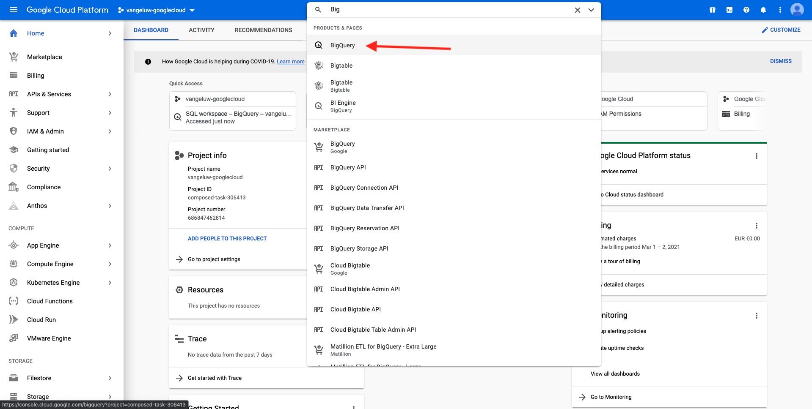

# 12.1 Een Google Cloud Platform-account maken

## Doelstellingen

- Google Cloud Platform-account maken
- Bekend worden met Google Cloud Platform Console
- Uw BigQuery-project maken en voorbereiden

## 12.1.1 Waarom maakt u verbinding met Google BigQuery met Adobe Experience Platform om Google Analytics-gegevens op te halen

Google Cloud Platform (GCP) is een pakket openbare cloudcomputingdiensten die door Google worden aangeboden. Het Google Cloud-Platform bevat een reeks gehoste services voor het ontwikkelen van computers, opslagsystemen en toepassingen die op Google-hardware worden uitgevoerd.

BigQuery is een van deze services en wordt altijd opgenomen in Google Analytics 360. Google Analytics-gegevens worden vaak gesampled wanneer we gegevens er direct vanaf proberen te krijgen (bijvoorbeeld API). Daarom bevat Google BigQuery om niet-gesamplede gegevens te verkrijgen, zodat merken geavanceerde analyses kunnen uitvoeren met SQL en kunnen profiteren van de kracht van GCP.

De gegevens van Google Analytics worden geladen dagelijks in BigQuery gebruikend een batch-mechanisme. Daarom heeft het geen zin om deze integratie van GCP/BigQuery te gebruiken voor realtime personalisatie en activeringsgebruiksgevallen.

Als een merk gebruiksgevallen voor realtime personalisatie wil aanbieden op basis van Google Analytics-gegevens, kan het die gegevens verzamelen op de website met Google Tag Manager en deze vervolgens in real-time naar Adobe Experience Platform streamen.

De GCP/BigQuery Source Connector moet worden gebruikt voor...

- Volg al klantengedrag op de website en laad die gegevens in Adobe Experience Platform voor analyse, gegevenswetenschap en verpersoonlijking gebruiksgevallen die geen activering in real time vereisen.
- historische gegevens van de Google Analytics in Adobe Experience Platform laden, ook voor gebruik door de wetenschap van analyses en gegevens

## 12.1.2 Je Google-account maken

Voor een Google Cloud Platform-account hebt u een Google-account nodig.

## 12.1.3 Uw Google Cloud Platform-account activeren

Nu u een Google-account hebt, kunt u een Google Cloud Platform-omgeving maken. Ga om dat te doen naar [https://console.cloud.google.com/](https://console.cloud.google.com/).

Accepteer de Algemene voorwaarden op de volgende pagina.

Klik op Volgende **Een project selecteren**.

Klikken op **NIEUW PROJECT**.

Geef uw project een naam volgens deze naamgevingsconventie:

| Conventie | Voorbeeld |
| ----------------- |-------------| 
| `--demoProfileLdap---googlecloud` | delaigle-googlecloud |

Klikken **Maken**.

Wacht tot het bericht in de rechterbovenhoek van het scherm u vertelt dat het maken is voltooid. Klik vervolgens op **Project weergeven**.

Ga vervolgens naar de zoekbalk boven op het scherm en typ **BigQuery**. Selecteer het eerste resultaat.

U wordt vervolgens omgeleid naar de BigQuery Console en er wordt een pop-upbericht weergegeven.

**Klik op Gereed**.

Het doel van deze module is om gegevens van Google Analytics in Adobe Experience Platform te krijgen. Om dat te doen, hebben we dummygegevens nodig in een dataset van Google Analytics om mee te beginnen.

Klikken op **Gegevens toevoegen** in het linkermenu, gevolgd door **Openbare gegevenssets verkennen**.

U ziet dan dit venster:

Voer de zoekterm in **Voorbeeld van Google Analytics** in de zoekbalk en selecteert u het eerste resultaat.

U zult het volgende scherm met een beschrijving van de dataset zien. Klikken op **DATASET WEERGEVEN**.

U wordt vervolgens omgeleid naar BigQuery waar u dit ziet **bigquery-public-data** gegevensset onder **Verkenner**.

In **Verkenner** Er moet nu een aantal tabellen worden weergegeven. Voel je vrij om ze te verkennen. Ga naar `google_analytics_sample`.

Klik om de tabel te openen `ga_sessions`.

Voordat u verdergaat met de volgende oefening, noteer gelieve de volgende dingen in een afzonderlijk tekstdossier op uw computer:

| Credentials | Naamgeving | Voorbeeld |
| ----------------- |-------------| -------------|
| Projectnaam | `--demoProfileLdap---googlecloud` | vangeluw-googlecloud |
| Project-id | random | composiet-task-306413 |

U kunt uw Projectnaam en identiteitskaart van het Project vinden door op uw te klikken **Projectnaam** in de bovenste menubalk:

U ziet dan uw project-id aan de rechterkant:

U kunt nu naar oefening 12.2 gaan waar u uw handen vuil maakt door de gegevens van Google Analytics te vragen.

Volgende stap: [12.2 Maak uw eerste query in BigQuery](./ex2.md)

[Ga terug naar module 12](./customer-journey-analytics-bigquery-gcp.md)

[Terug naar alle modules](./../../overview.md)
