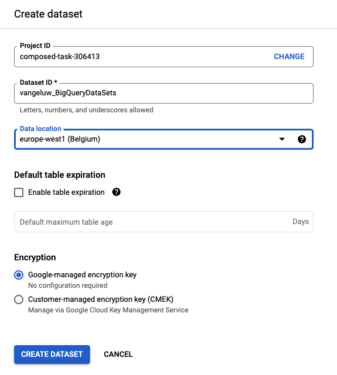

# 12.2 Maak uw eerste query in BigQuery

## Doelstellingen

- De gebruikersinterface van BigQuery verkennen
- Een SQL-query maken in BigQuery
- Sparen de resultaten van uw SQL vraag in een dataset binnen BigQuery

## Context

Wanneer de gegevens van Google Analytics in BigQuery zijn, zijn de dimensies, metriek en andere variabelen allen genest. Bovendien worden de Google Analytics-gegevens dagelijks in verschillende tabellen geladen. Dit betekent dat het rechtstreeks proberen om Google Analytics lijsten binnen BigQuery aan Adobe Experience Platform te verbinden zeer moeilijk en geen goed idee is.

De oplossing voor dit probleem is het omzetten van gegevens van Google Analytics in een leesbaar formaat om de opname in Adobe Experience Platform gemakkelijker te maken.

## 12.2.1 creeer een dataset om nieuwe Lijsten te bewaren BigQuery

Ga naar de [BigQuery-console](https://console.cloud.google.com/bigquery).


In **Verkenner**, je ziet je project-id. Klik op uw project-id (klik niet op de knop **bigquery-public-data** dataset).


Je kunt zien dat er nog geen dataset is, dus laten we er nu een maken.
Klikken **DATASET MAKEN**.


Aan de rechterkant van het scherm ziet u de **Gegevensset maken** -menu.


Voor de **Dataset-id** en gebruikt u de onderstaande naamgevingsconventie. Voor de andere velden laat u de standaardinstellingen ongewijzigd.

| Naamgeving | Voorbeeld |
| ----------------- | ------------- | 
| `--demoProfileLdap--_BigQueryDataSets` | vangeluw_BigQueryDataSets |



Klik op Volgende **Gegevensset maken**.


U zult dan terug in de Console BigQuery met uw gemaakte dataset zijn.


## 12.2.2 Maak uw eerste SQL BigQuery

Daarna, zult u uw eerste vraag in BigQuery creëren. Het doel van deze vraag is de Google Analytics steekproefgegevens te nemen en het om te zetten zodat het in Adobe Experience Platform kan worden opgenomen. Ga naar de **EDITOR** tab.


Kopieer de volgende SQL-query en plak deze in die Query Editor. Voel vrij om de vraag te lezen en de syntaxis te begrijpen van Google Analytics BigQuery.


```sql
SELECT
  CONCAT(fullVisitorId, CAST(hitTime AS String), '-', hitNumber) AS _id,
  TIMESTAMP(DATETIME(Year_Current, Month_Current, Day_Current, Hour, Minutes, Seconds)) AS timeStamp,
  fullVisitorId as GA_ID,
  -- Fake CUSTOMER ID
  CONCAT('3E-D4-',fullVisitorId, '-1W-93F' ) as customerID,
  Page,
  Landing_Page,
  Exit_Page,
  Device,
  Browser,
  MarketingChannel,
  TrafficSource,
  TrafficMedium,
  -- Enhanced Ecommerce
  TransactionID,
  CASE
      WHEN EcommerceActionType = '2' THEN 'Product_Detail_Views'
      WHEN EcommerceActionType = '3' THEN 'Adds_To_Cart'
      WHEN EcommerceActionType = '4' THEN 'Product_Removes_From_Cart'
      WHEN EcommerceActionType = '5' THEN 'Product_Checkouts'
      WHEN EcommerceActionType = '6' THEN 'Product_Refunds'
    ELSE
    NULL
  END
     AS Ecommerce_Action_Type,
  -- Entrances (metric)
  SUM(CASE
      WHEN isEntrance = TRUE THEN 1
    ELSE
    0
  END
    ) AS Entries,
    
--Pageviews (metric)
    COUNT(*) AS Pageviews,
    
 -- Exits 
    SUM(
    IF
      (isExit IS NOT NULL,
        1,
        0)) AS Exits,
        
 --Bounces
   SUM(CASE
      WHEN isExit = TRUE AND isEntrance = TRUE THEN 1
    ELSE
    0
  END
    ) AS Bounces,
        
  -- Unique Purchases (metric)
  COUNT(DISTINCT TransactionID) AS Unique_Purchases,
  -- Product Detail Views (metric)
  COUNT(CASE
      WHEN EcommerceActionType = '2' THEN fullVisitorId
    ELSE
    NULL
  END
    ) AS Product_Detail_Views,
  -- Product Adds To Cart (metric)
  COUNT(CASE
      WHEN EcommerceActionType = '3' THEN fullVisitorId
    ELSE
    NULL
  END
    ) AS Adds_To_Cart,
  -- Product Removes From Cart (metric)
  COUNT(CASE
      WHEN EcommerceActionType = '4' THEN fullVisitorId
    ELSE
    NULL
  END
    ) AS Product_Removes_From_Cart,
  -- Product Checkouts (metric)
  COUNT(CASE
      WHEN EcommerceActionType = '5' THEN fullVisitorId
    ELSE
    NULL
  END
    ) AS Product_Checkouts,
  -- Product Refunds (metric)
  COUNT(CASE
      WHEN EcommerceActionType = '7' THEN fullVisitorId
    ELSE
    NULL
  END
    ) AS Product_Refunds
  FROM (
  SELECT
    -- Landing Page (dimension)
    CASE
      WHEN hits.isEntrance = TRUE THEN hits.page.pageTitle
    ELSE NULL
  END
    AS Landing_page,
    
        -- Exit Page (dimension)
    CASE
      WHEN hits.isExit = TRUE THEN hits.page.pageTitle
    ELSE
    NULL
  END
    AS Exit_page,
    
    hits.page.pageTitle AS Page,
    hits.isEntrance,
    hits.isExit,
    hits.hitNumber as hitNumber,
    hits.time as hitTime,
    date as Fecha,
    fullVisitorId,
    visitStartTime,
    device.deviceCategory AS Device,
    device.browser AS Browser,
    channelGrouping AS MarketingChannel,
    trafficSource.source AS TrafficSource,
    trafficSource.medium AS TrafficMedium,
    hits.transaction.transactionId AS TransactionID,
    CAST(EXTRACT(YEAR FROM CURRENT_DATE()) AS INT64) AS Year_Current,
    CAST(EXTRACT(MONTH FROM CURRENT_DATE()) AS INT64) AS Month_Current,
     CAST(EXTRACT(DAY FROM CURRENT_DATE()) AS INT64) AS Day_Current,
    CAST(EXTRACT(DAY FROM DATE_SUB(CURRENT_DATE(),INTERVAL 1 DAY)) AS INT64) AS Day_Current_Before,
    CAST(FORMAT_DATE('%Y', PARSE_DATE("%Y%m%d", date)) AS INT64) AS Year,
  CAST(FORMAT_DATE('%m', PARSE_DATE("%Y%m%d",date)) AS INT64) AS Month,
  CAST(FORMAT_DATE('%d', PARSE_DATE("%Y%m%d",date)) AS INT64) AS Day,
    CAST(EXTRACT (hour FROM TIMESTAMP_SECONDS(hits.time)) AS INT64) AS Hour,
  CAST(EXTRACT (minute FROM TIMESTAMP_SECONDS(hits.time)) AS INT64) AS Minutes,
  CAST(EXTRACT (second FROM TIMESTAMP_SECONDS(hits.time)) AS INT64) AS SecondS,
    hits.eCommerceAction.action_type AS EcommerceActionType
  
  FROM
    `bigquery-public-data.google_analytics_sample.ga_sessions_*`,
     UNNEST(hits) AS hits
  WHERE
    _table_suffix BETWEEN '20170101'
    AND '20170331'
    AND totals.visits = 1
    AND hits.type = 'PAGE'
    )
    
GROUP BY
  1,
  2,
  3,
  4,
  5,
  6,
  7,
  8,
  9,
  10,
  11,
  12,
  13,
  14
    
  ORDER BY 2 DESC
```

Wanneer u klaar bent, klikt u op **Uitvoeren** om de query uit te voeren:


Het uitvoeren van de query kan een paar minuten duren.

Zodra de vraag het lopen heeft gebeëindigd, zult u de hieronder output in zien **Zoekresultaten**.


## 12.2.3 Sla de resultaten van uw BigQuery SQL-query op

De volgende stap is de output van uw vraag te bewaren door te klikken **RESULTATEN OPSLAAN** knop.


Als de locatie voor de uitvoer selecteert u **BigQuery-tabel**.


Dan zie je een nieuwe popup, waar je **Projectnaam** en **Naam gegevensset** vooraf ingevuld. De naam van de dataset zou de dataset moeten zijn die u in het begin van deze oefening, met deze noemende overeenkomst creeerde:

| Naamgeving | Voorbeeld |
| ----------------- | ------------- | 
| `--demoProfileLdap--_BigQueryDataSets` | `vangeluw_BigQueryDataSets` |

U moet nu een tabelnaam invoeren. Gebruik deze naamgevingsconventie:

| Naamgeving | Voorbeeld |
| ----------------- |------------- | 
| `--demoProfileLdap--_GAdataTableBigQuery` | `vangeluw_GAdataTableBigQuery` |


Klikken **OPSLAAN**.

Het kan enige tijd duren tot de gegevens klaar zijn in de tabel die u hebt gemaakt. Vernieuw na een paar minuten de browser. U zou dan binnen uw dataset moeten zien `--demoProfileLdap--_GAdataTableBigquery` tabel onder **Verkenner** in uw BigQuery-project.


U gaat nu verder met de volgende oefening, waar u deze lijst aan Adobe Experience Platform zult verbinden.

Volgende stap: [12.3 GCP en BigQuery aansluiten op Adobe Experience Platform](./ex3.md)

[Ga terug naar module 12](./customer-journey-analytics-bigquery-gcp.md)

[Terug naar alle modules](./../../overview.md)
