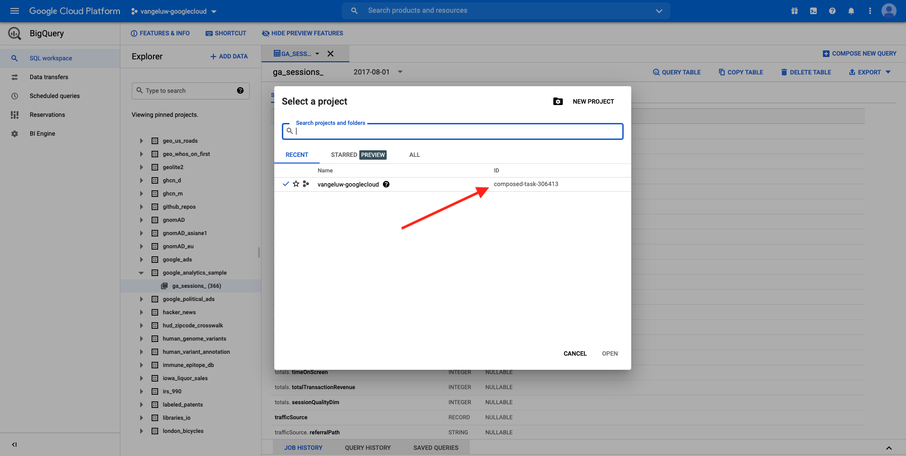
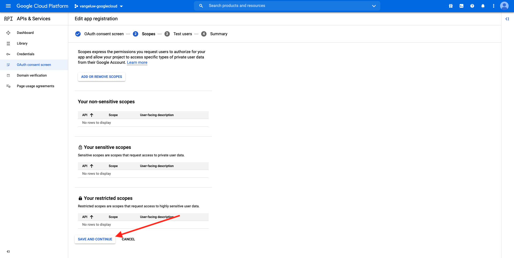

# 12.3 GCP en BigQuery aansluiten op Adobe Experience Platform

## Doelstellingen

- De API&#39;s en services verkennen in het Google Cloud-Platform
- Ben vertrouwd met OAuth Playground voor het testen van Google APIs
- Uw eerste BigQuery-verbinding maken in Adobe Experience Platform

## Context

Adobe Experience Platform biedt een aansluiting binnen **Bronnen** dat u zal helpen datasets BigQuery in Adobe Experience Platform brengen. Deze gegevensconnector is gebaseerd op de Google BigQuery API. Daarom is het belangrijk om uw Google Cloud-Platform en uw BigQuery-omgeving goed voor te bereiden voor het ontvangen van API-aanroepen van Adobe Experience Platform.

Voor het configureren van de BigQuery Source Connector in Adobe Experience Platform hebt u de volgende vier waarden nodig:

- project
- clientId
- clientSecret
- refreshToken

Tot nu toe heb je alleen de eerste, de eerste **Project-id**. Dit **Project-id** De waarde is een willekeurige identiteitskaart die door Google werd geproduceerd toen u uw project BigQuery tijdens oefening 12.1 creeerde.

Kopieer de project-id in een gescheiden tekstbestand.

| Credentials | Naamgeving | Voorbeeld |
| ----------------- |-------------| -------------|
| Project-id | random | composiet-task-306413 |

U kunt uw project-id op elk gewenst moment controleren door op uw **Projectnaam** in de bovenste menubalk:

U ziet uw project-id aan de rechterkant:

In deze oefening zult u leren hoe te om de andere 3 vereiste gebieden te krijgen:

- clientId
- clientSecret
- refreshToken

## 12.3.1 Google Cloud API &amp; Services

Ga terug naar de homepage van Google Cloud Platform om te beginnen. Klik hiertoe in de linkerbovenhoek van het scherm op het logo.

Wanneer u op de homepage bent, ga naar het linkermenu en klik **API&#39;s en services** en klik vervolgens op **Dashboard**.

U ziet nu de **API&#39;s en services** homepage.

Op deze pagina kunt u het gebruik van uw verschillende Google API-verbindingen zien. Als u een API-verbinding wilt instellen zodat Adobe Experience Platform gegevens kan lezen van BigQuery, moet u de volgende stappen uitvoeren:

- Eerst, moet u een OAuth toestemmingsscherm tot stand brengen om toekomstige authentificatie toe te laten. De veiligheidsredenen van Google vereisen ook een mens om de eerste authentificatie te maken, alvorens een programmatic toegang wordt toegestaan.
- Ten tweede hebt u API Credentials (clientId en clientSecret) nodig die worden gebruikt voor API-verificatie en toegang tot uw BigQuery-connector.

## 12.3.2 Scherm met OAuth-instemming

Laten we beginnen met het maken van het scherm OAuth-instemming. In het linkermenu op het tabblad **API&#39;s en services** homepage, klik **Scherm voor OAuth-toestemming**.

U zult dan dit zien:

Selecteer het gebruikerstype: **Extern**. Klik op Volgende **MAKEN**.

Dan ben je op de **Constante schermconfiguratie** venster.

Het enige wat u hier kunt doen, is de naam van het toestemmingsscherm invoeren in het **Toepassingsnaam** en selecteer de **E-mail met gebruikersondersteuning**. Gebruik voor de toepassingsnaam de volgende naamgevingsconventie:

| Naamgeving | Voorbeeld |
| ----------------- |-------------| 
| `--demoProfileLdap-- - AEP BigQuery Connector` | vangeluw - AEP BigQuery Connector |

Blader vervolgens omlaag totdat u het ziet **Contactgegevens ontwikkelaar** en vul een e-mailadres in.

Klikken **OPSLAAN EN DOORGAAN**.

Dan zie je dit. Klikken **OPSLAAN EN DOORGAAN**.

Dan zie je dit. Klikken **OPSLAAN EN DOORGAAN**.

Dan zie je dit. Klikken **TERUG NAAR DASHBOARD**.

Dan zie je dit. Klikken **APP PUBLICEREN**.

Klikken **BEVESTIGEN**.

Dan zie je dit.

In de volgende stap gaat u de API-instelling voltooien en uw API-referenties ophalen.

## 12.3.3 Google API-referenties: Clientgeheim en client-id

Klik in het linkermenu op **Credentials**. U zult dan dit zien:

Klik op de knop **+ CREDENTIALS MAKEN** knop.

U ziet drie opties. Klik op de knop **OAuth-client-id**:

Selecteer in het volgende scherm de optie **Webtoepassing**.

Er verschijnen meerdere nieuwe velden. U moet nu de **Naam** van de OAuth Client ID en voer ook de **Toegestane omleiding van URI&#39;s**.

Volg deze naamgevingsconventie:

| Veld | Waarde | Voorbeeld |
| ----------------- |-------------| -------------| 
| Naam | ldap - AEP BigQuery Connector | vangeluw - Platform BigQuery Connector |
| Toegestane omleiding van URI&#39;s | https://developers.google.com/oauthplayground | https://developers.google.com/oauthplayground |

De **Toegestane omleiding van URI&#39;s** het gebied is een zeer belangrijk gebied omdat u het later zult nodig hebben om RefreshToken te krijgen u de opstelling van de Bron van BigQuery Schakelaar in Adobe Experience Platform moet beëindigen.

Voordat u verdergaat, moet u fysiek op de knop **Enter** na het invoeren van de URL om de waarde op te slaan in het dialoogvenster **Toegestane omleiding van URI&#39;s** veld. Als u niet op de knop **Enter** in een later stadium, in het dialoogvenster **OAuth 2.0 Playground**.

Klik op Volgende **Maken**:

U zult nu uw identiteitskaart van de Cliënt en uw Geheim van de Cliënt zien.

Kopieer deze twee velden en plak ze in een tekstbestand op uw bureaublad. U kunt deze geloofsbrieven altijd tot een later stadium toegang hebben, maar het is gemakkelijker als u hen in een tekstdossier naast uw identiteitskaart van het Project BigQuery opslaat.

Als recap voor de configuratie van de BigQuery Source Connector in Adobe Experience Platform hebt u nu al de volgende waarden beschikbaar:

| Credentials voor BigQuery Connector | Waarde |
| ----------------- |-------------| 
| Project-id | uw eigen project-id (bijv.: composiet-task-306413) |
| clientid | uzelf |
| kindergeheim | uw clientgeheim |

U mist nog steeds de **refreshToken**. refreshToken is een vereiste wegens veiligheidsredenen. In de wereld van APIs, verlopen de tekenen typisch om de 24 uur. Dus **refreshToken** is nodig om het beveiligingstoken elke 24 uur te vernieuwen, zodat uw Source Connector-instelling verbinding kan blijven maken met het Google Cloud-Platform en BigQuery.

## 12.3.4 BigQuery API en refreshToken

Er zijn verschillende manieren om een refreshToken te verkrijgen voor toegang tot API&#39;s voor Google Cloud-Platforms. Een van deze opties is bijvoorbeeld het gebruik van Postman.
Google heeft echter iets eenvoudiger gemaakt om te testen en af te spelen met de API&#39;s, een hulpprogramma dat **OAuth 2.0 Playground**.

Toegang tot **OAuth 2.0 Playground**, ga naar [https://developers.google.com/oauthplayground](https://developers.google.com/oauthplayground).

Dan zie je de **OAuth 2.0 Playground** homepage.

Klik op de knop **tandwiel** pictogram in de rechterbovenhoek van het scherm:

Zorg ervoor dat de instellingen overeenkomen met de instellingen in de bovenstaande afbeelding.

Controleer de instellingen om 100% zeker te zijn.

Als u klaar bent, schakelt u het selectievakje **Gebruik uw eigen OAuth-referenties**

Er moeten twee velden worden weergegeven, waarvoor u de waarde hebt.

Vul de velden volgende op deze tabel in:

| Instellingen voor afspeelAPI | Uw Google API-gebruikersgegevens |
| ----------------- |-------------| 
| OAuth Client ID | uw eigen client-id (in het tekstbestand op uw bureaublad) |
| OAuth Client Secret | uw eigen clientgeheim (in het tekstbestand op uw bureaublad) |

Kopieer de **Client-id** en **Clientgeheim** uit het tekstbestand dat u op uw bureaublad hebt gemaakt.

Klik op **Sluiten**

In het linkermenu ziet u alle beschikbare Google API&#39;s. Zoeken naar **BigQuery API v2**.

Selecteer vervolgens het bereik dat wordt aangegeven in de onderstaande afbeelding:

Als u deze eenmaal hebt geselecteerd, ziet u een blauwe knop met de volgende tekst: **API&#39;s autoriseren**. Klik erop.

Selecteer de Google-account die u hebt gebruikt voor het instellen van GCP en BigQuery.

U ziet misschien een grote waarschuwing: **Deze app is niet geverifieerd**. Dit gebeurt omdat uw Platform BigQuery Connector nog niet formeel is gecontroleerd, zodat Google niet weet of het een authentieke app is of niet. U moet deze melding negeren.

Klikken **Geavanceerd**.

Klik op Volgende **Ga naar LDAP - AEP BigQuery Connector (onveilig)**.

U wordt omgeleid naar het scherm voor onvoorwaardelijke toestemming dat u hebt gemaakt.

Als u 2-Factor Authentificatie (2FA) gebruikt, ga de verificatiecode in die naar u wordt verzonden.

Google toont je nu acht verschillende **Machtiging** vragen. Klikken **Toestaan** voor alle acht toestemmings-verzoeken. (Dit is een procedure die één keer moet worden gevolgd en bevestigd door een echt menselijk wezen, voordat de API programmatische verzoeken toestaat)

Opnieuw, **acht verschillende pop-upvensters** wordt niet weergegeven, u moet klikken **Toestaan** voor hen allemaal.

Na de acht machtigingsaanvragen ziet u dit overzicht. Klikken **Toestaan** om het proces te voltooien.

Na de laatste **Toestaan**-click, zult u naar OAuth 2.0 Playground worden teruggestuurd en u zult dit zien:

Klikken **Exchange-autorisatiecode voor tokens**.

Na een paar seconden **Stap 2 - de vergunningscode van de Uitwisseling voor tokens** de weergave wordt automatisch gesloten en u ziet **Stap 3 - Verzoek voor API configureren**.

Je moet teruggaan naar **Stap 2 de vergunningscode van de Uitwisseling voor tokens**, dus klik op **Stap 2 de vergunningscode van de Uitwisseling voor tokens** opnieuw om de **Token vernieuwen**.

U ziet nu de **Token vernieuwen**.

Kopieer de **Token vernieuwen** en plak het in het tekstbestand op uw bureaublad samen met de andere BigQuery Source Connector Credentials:

| Credentials van BigQuery Source Connector | Waarde |
| ----------------- |-------------| 
| Project-id | uw eigen willekeurige project-id (bijv.: apt-zomer (273608) |
| clientid | uzelf |
| kindergeheim | uw clientgeheim |
| vernieuwingstoken | ureftoken |

Stel vervolgens uw Source Connector in Adobe Experience Platform in.

## Oefening 12.3.5 - Verbind Platform met uw eigen lijst BigQuery

Meld u aan bij Adobe Experience Platform door naar deze URL te gaan: [https://experience.adobe.com/platform](https://experience.adobe.com/platform).

Na het aanmelden landt je op de homepage van Adobe Experience Platform.

Voordat u verdergaat, moet u een **sandbox**. De sandbox die moet worden geselecteerd, krijgt een naam ``--aepSandboxId--``. U kunt dit doen door op de tekst te klikken **[!UICONTROL Productieproduct]** in de blauwe lijn boven op het scherm. Na het selecteren van de aangewezen zandbak, zult u de het schermverandering zien en nu bent u in uw specifieke zandbak.

Ga in het linkermenu naar Bronnen. Dan zie je de **Bronnen** homepage. In de **Bronnen** menu, klik op **Databases**. Klik op de knop **Google BigQuery** kaart. Klik op Volgende **Instellen** of **+ Configureren**.

Maak nu een nieuwe verbinding.

Klikken op **Nieuwe account**. U moet nu alle hieronder gebieden invullen, die op de opstelling worden gebaseerd u in GCP en BigQuery deed.

Laten we beginnen met de naam van de verbinding:

Gebruik deze naamgevingsconventie:

| Credentials voor BigQuery Connector | Waarde | Voorbeeld |
| ----------------- |-------------| -------------| 
| Accountnaam | `--demoProfileLdap-- - BigQuery Connection` | vangeluw - BigQuery Connection |
| Beschrijving | `--demoProfileLdap-- - BigQuery Connection` | vangeluw - BigQuery Connection |

Dat zou je iets als dit moeten geven:

Vul vervolgens de GCP- en BigQuery-API in **Accountverificatie**-details die u hebt opgeslagen in een tekstbestand op uw bureaublad:

| Credentials voor BigQuery Connector | Waarde |
| ----------------- |-------------| 
| Project-id | uw eigen willekeurige project-id (bijv.: apt-zomer (273608) |
| clientId | ... |
| clientSecret | ... |
| refreshToken | ... |

Uw **Accountverificatie** De details moeten er nu als volgt uitzien:

Nadat u al deze velden hebt ingevuld, klikt u op **Verbinden met bron**.

Als uw **Accountverificatie** de gegevens correct zijn ingevuld, ziet u nu een visuele bevestiging dat de verbinding goed werkt, door de **Verbonden** bevestiging.

Klik op **Volgende**:

U zult nu de dataset zien BigQuery u tijdens oefening 12.2 creeerde.

Goed gedaan! In de volgende oefening, zult u gegevens van die lijst laden en het tegen een schema en dataset in Adobe Experience Platform in kaart brengen.

Volgende stap: [12.4 Gegevens laden van BigQuery naar Adobe Experience Platform](./ex4.md)

[Ga terug naar module 12](./customer-journey-analytics-bigquery-gcp.md)

[Terug naar alle modules](./../../overview.md)
