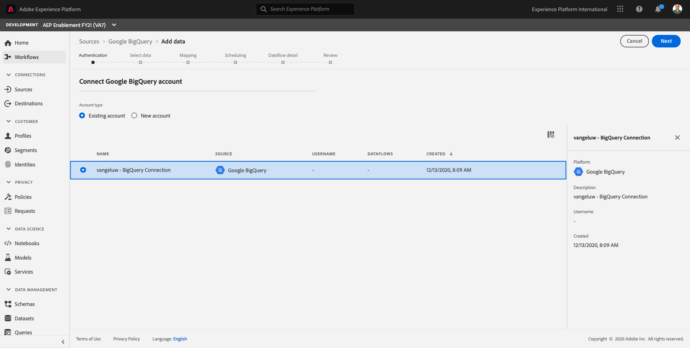
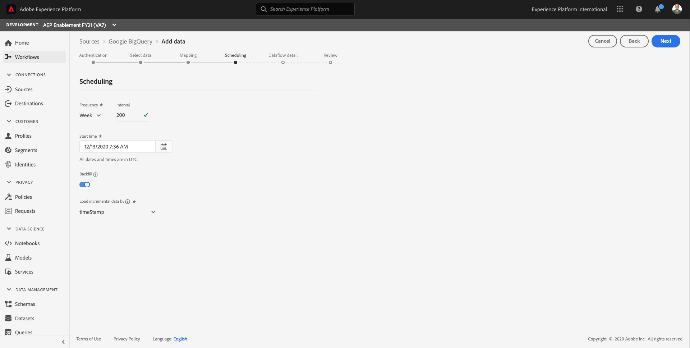

# 12.4 Gegevens laden van BigQuery naar Adobe Experience Platform

## Doelstellingen

- BigQuery-gegevens toewijzen aan een XDM-schema
- BigQuery-gegevens in Adobe Experience Platform laden
- Word vertrouwd met de UI van de Bron BigQuery Connector

## Voordat u begint

Na oefening 12.3, zou u deze pagina in Adobe Experience Platform moeten openen:

**Als u het open hebt, ga dan verder met oefening 12.4.1.**

**Als je het niet open hebt, ga dan naar [Adobe Experience Platform](https://experience.adobe.com/platform/home).**

Ga in het linkermenu naar Bronnen. Dan zie je de **Bronnen** homepage. In de **Bronnen** menu, klik op **Databases**.

Selecteer **Google BigQuery** Bronaansluiting en klik op **+ Configureren**.

U ziet dan het selectiescherm voor Google BigQuery-accounts.

Selecteer uw account en klik op **Volgende**.

Dan zie je de **Gegevens toevoegen** weergeven.

## 12.4.1 Selectie van BigQuery-tabel

In de **Gegevens toevoegen** bekijken, selecteer uw dataset BigQuery.

U kunt nu een voorbeeld van voorbeeldgegevens van de Google Analytics-gegevens bekijken in BigQuery.

Klik op **Next**.

## 12.4.2 XDM-toewijzing

U ziet nu het volgende:

U moet nu of een nieuwe dataset creëren of een bestaande dataset selecteren om de gegevens van Google Analytics in te laden. Voor deze oefening, zijn een dataset en een schema reeds gecreeerd. U te hoeven niet om een nieuw schema of dataset tot stand te brengen.

Selecteren **Bestaande gegevensset**. Open het vervolgkeuzemenu om een dataset te selecteren. Zoeken naar de benoemde gegevensset `Demo System - Event Dataset for BigQuery (Global v1.1)` en selecteert u deze. Klik op **Next**.

Omlaag schuiven. U moet nu elke **Bronveld** van Google Analytics/BigQuery naar een XDM **Doelveld**, veld voor veld.

Gebruik de onderstaande toewijzingstabel voor deze oefening.

| Bronveld | Doelveld |
| ----------------- |-------------| 
| **_id** | _id |
| **_id** | channel._id |
| timeStamp | tijdstempel |
| GA_ID | ``--aepTenantId--``.identification.core.gaid |
| customerID | ``--aepTenantId--``.identification.core.loyaltyId |
| Pagina | web.webPageDetails.name |
| Apparaat | device.type |
| Browser | environment.browserDetails.vendor |
| MarketingChannel | marketing.trackingCode |
| TrafficSource | channel.typeAtSource |
| TrafficMedium | channel.mediaType |
| TransactionID | commerce.order.payments.transactionID |
| Ecommerce_Action_Type | eventType |
| Pageviews | web.webPageDetails.pageViews.value |
| Unique_Purchases | commerce.purchases.value |
| Product_Details_Weergaven | commerce.productViews.value |
| Adds_To_Cart | commerce.productListAdds.value |
| Product_Verwijderen_Uit_winkelwagentje | commerce.productListRemovals.value |
| Product_kassa&#39;s | commerce.checkouts.value |

Nadat u de bovenstaande toewijzing naar de gebruikersinterface van Adobe Experience Platform hebt gekopieerd en geplakt, controleert u of er geen fouten optreden die te wijten zijn aan typos of leading/trailing spaties.

U hebt nu een **Toewijzing** zoals deze:

De bronvelden **GA_ID** en **customerID** worden toegewezen aan een id in dit XDM-schema. Op deze manier kunt u Google Analytics-gegevens (web/app-gedragsgegevens) verrijken met andere gegevenssets, zoals Loyalty of Call Center-data.

Klik op **Next**.

## 12.4.3 Verbinding en de planning van de gegevensinvoer

U ziet nu de **Planning** tab:

In de **Planning** tab, kunt u een frequentie voor het proces van gegevensinvoer voor dit bepalen **Toewijzing** en gegevens.

Aangezien u demo gegevens in Google BigQuery gebruikt die niet zullen worden verfrist, is er geen echte behoefte om een programma in deze oefening te plaatsen. U moet wel iets selecteren en om te veel nutteloze processen voor het opnemen van gegevens te voorkomen, moet u de frequentie als volgt instellen:

- Frequentie: **Week**
- Interval: **200**

**Belangrijk**: zorg ervoor dat u de **Achtergrond** switch.

Last but not least moet u een **delta** veld.

De **delta** wordt gebruikt om de verbinding te plannen en slechts nieuwe rijen te uploaden die in uw dataset BigQuery komen. Een deltaveld is doorgaans altijd een tijdstempelkolom. Voor toekomstige geplande gegevensinvoer worden dus alleen de rijen met een nieuwe, recentere tijdstempel opgenomen.

Selecteren **timeStamp** als het deltaveld.

U hebt dit nu.

Klik op **Next**.

## 12.4.4 Verbinding controleren en starten

In de **Gegevens over gegevensstroom** weergeven. U moet uw verbinding noemen, die u zal helpen om het later te vinden.

Gebruik deze naamgevingsconventie:

| Veld | Naamgeving | Voorbeeld |
| ----------------- |-------------| -------------|
| Naam gegevensstroom | DataFlow - LDAP - BigQuery Website Interaction | DataFlow - vangeluw - BigQuery Website Interaction |
| Beschrijving | DataFlow - LDAP - BigQuery Website Interaction | DataFlow - vangeluw - BigQuery Website Interaction |

Klik op **Next**.

U ziet nu een gedetailleerd overzicht van uw verbinding. Zorg ervoor dat alles juist is voordat u verdergaat, aangezien sommige instellingen achteraf niet meer kunnen worden gewijzigd, zoals bijvoorbeeld de XDM-toewijzing.

Klikken **Voltooien**.

Het instellen van de verbinding kan enige tijd in beslag nemen, dus maak u geen zorgen als u dit ziet:

Zodra de verbinding is gecreeerd, zult u dit zien:

U bent nu klaar om met de volgende oefening verder te gaan, waarin u Customer Journey Analytics zult gebruiken om krachtige visualisaties bovenop de gegevens van Google Analytics te bouwen.

Volgende stap: [12.5 Gegevens van Google Analytics analyseren met behulp van Customer Journey Analytics](./ex5.md)

[Ga terug naar module 12](./customer-journey-analytics-bigquery-gcp.md)

[Terug naar alle modules](./../../overview.md)
