# 12.5 Gegevens van Google Analytics analyseren met behulp van Customer Journey Analytics

## Doelstellingen

- Verbind onze gegevensreeks BigQuery met Customer Journey Analytics (CJA)
- Verbind en sluit zich aan bij Google Analytics met Loyalty Gegevens.
- Bekend worden met de gebruikersinterface van CJA

## 12.5.1 Verbinding maken

Ga naar [analytics.adobe.com](https://analytics.adobe.com) om toegang te krijgen tot Customer Journey Analytics.

Ga op de Customer Journey Analytics-startpagina naar **Verbindingen**.

Hier kunt u alle verschillende verbindingen zien die tussen CJA en Platform worden gemaakt. Deze verbindingen hebben hetzelfde doel als rapportsuites in Adobe Analytics. De gegevensverzameling is echter totaal anders. Alle gegevens komen uit de datasets van Adobe Experience Platform.

Klikken **Nieuwe verbinding maken**.

Dan zie je de **Verbinding maken** UI.

Ten eerste moet u de juiste sandbox selecteren om te gebruiken. Selecteer in het menu van de sandbox de sandbox die u wilt gebruiken `--aepSandboxId--`. In dit voorbeeld moet de sandbox **AEP-activering FY21**.

Nadat u de sandbox hebt geselecteerd, worden de beschikbare gegevenssets bijgewerkt.

In het linkermenu, kunt u alle beschikbare datasets van Adobe Experience Platform zien. Zoeken naar de gegevensset `Demo System - Event Dataset for BigQuery (Global v1.1)`. Klikken **+** om de dataset aan deze verbinding toe te voegen.

Na het toevoegen van het, zult u de dataset binnen de verbinding zien.

U moet nu de **Persoon-id**. Zorg ervoor dat **loyaltyId** is geselecteerd als persoon-id.

U zult nu de gegevens van de Interactie van de Website van Google Analytics met een andere dataset van Adobe Experience Platform verrijken.

Zoeken naar de gegevensset `Demo System - Profile Dataset for Loyalty (Global v1.1)` gegevensset en voeg deze toe aan deze verbinding.

U zult dan dit zien:

Om beide datasets samen te voegen, moet u selecteren **Persoon-id** die hetzelfde type id&#39;s bevat. De dataset `Demo System - Profile Dataset for Loyalty (Global v1.1)` gebruikt de **loyaltyId** als Persoon-id, die hetzelfde type id&#39;s bevat als de id `Demo System - Event Dataset for BigQuery (Global v1.1)`, die ook de **loyaltyId** als een persoon-id.

Klik op **Next**.

U zult dan dit zien:

Hier moet u een naam aan uw verbinding geven.

Gebruik deze naamgevingsconventie: `ldap - GA + Loyalty Data Connection`.

Voorbeeld: `vangeluw - GA + Loyalty Data Connection`

Activeer voordat u klaar bent **Importeer automatisch alle nieuwe gegevens voor alle datasets in deze verbinding, vanaf vandaag.** zoals in de onderstaande afbeelding.

Hierdoor wordt om de 60 minuten een gegevensstroom van Adobe Experience Platform naar CJA gestart, maar met grote hoeveelheden gegevens kan dit tot 24 uur duren.

U moet ook een back-up maken van historische gegevens. Schakel het selectievakje in voor **Alle bestaande gegevens importeren** en selecteert u **minder dan 1 miljoen** krachtens **Gemiddeld aantal dagelijkse gebeurtenissen**.

Nadat u uw **Verbinding** het kan een paar uur duren voordat uw gegevens beschikbaar zijn in CJA.

Klikken **Opslaan** en ga naar de volgende oefening.

U zult dan uw verbinding in de lijst van beschikbare verbindingen zien.

## 12.5.2 Een gegevensweergave maken

Als de verbinding tot stand is gebracht, kunt u nu de visualisatie beïnvloeden. Een verschil tussen Adobe Analytics en CJA is dat CJA een gegevensweergave nodig heeft om de gegevens vóór visualisatie te kunnen opschonen en voorbereiden.

Een gegevensmening is gelijkaardig aan het concept virtuele rapportsuites in Adobe Analytics, waar u context-bewuste bezoekdefinities bepaalt, filtrerend en ook, hoe de componenten worden geroepen.

U hebt minimaal één gegevensweergave per verbinding nodig. Nochtans, voor sommige gebruik-gevallen, is het groot om veelvoudige gegevensmeningen voor de zelfde verbinding te hebben, met het doel om verschillende inzichten aan verschillende teams te geven.

Als u uw bedrijf gegevensgedreven wilt worden, zou u moeten aanpassen hoe de gegevens in elk team worden bekeken. Enkele voorbeelden:

- UX-meetgegevens alleen voor het UX-ontwerpteam
- Gebruik dezelfde namen voor KPI&#39;s en Metriek voor Google Analytics als voor Customer Journey Analytics, zodat het digitale analyseteam slechts één taal kan spreken.
- gegevensweergave gefilterd om bijvoorbeeld gegevens weer te geven voor 1 markt, of 1 merk, of alleen voor mobiele apparaten.

Op de **Verbindingen** , schakelt u het selectievakje in vóór de verbinding die u net hebt gemaakt.

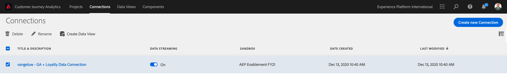

Klik nu op **Gegevensweergave maken**.

U wordt omgeleid naar de **Gegevensweergave maken** workflow.

U kunt de basisdefinities voor uw gegevensmening nu vormen. Dingen zoals Tijdzone, Sessietime-out of het filteren van de gegevensweergave (het segmenteringsonderdeel dat lijkt op Virtuele rapportsets in Adobe Analytics).

De **Verbinding** die u in de vorige oefening hebt gemaakt, is al geselecteerd. De naam van uw verbinding is `ldap - GA + Loyalty Data Connection`.

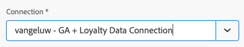

Geef de gegevensweergave vervolgens een naam volgens deze naamgevingsconventie: `ldap - GA + Loyalty Data View`.

Voer dezelfde waarde in voor de beschrijving: `ldap - GA + Loyalty Data View`.

Voordat we een analyse of visualisatie kunnen uitvoeren, moeten we een gegevensweergave maken met alle velden, afmetingen en metriek en hun attributie-instellingen.

| Veld | Naamgevingsconventie | Voorbeeld |
| ----------------- |-------------|-------------|  
| Naam van verbinding | LDAP - GA + Loyalty Data View | vangeluw - GA + Loyalty Data View |
| Beschrijving | LDAP - GA + Loyalty Data View | vangeluw - GA + Loyalty Data View |

Klikken **Opslaan en doorgaan**.

U kunt nu componenten toevoegen aan uw gegevensweergave. Zoals u kunt zien, worden sommige metriek en afmetingen automatisch toegevoegd.

Voeg de volgende componenten aan de gegevensmening toe:

| Componentnaam | Componenttype | Componentpad |
| -----------------|-----------------|-----------------|
| niveau | Dimension | _experiencePlatform.loyaltyDetails.level |
| punten | Metrisch | _experiencePlatform.loyaltyDetails.points |
| commerce.checkouts.value | Metrisch | commerce.checkouts.value |
| commerce.productListRemovals.value | Metrisch | commerce.productListRemovals.value |
| commerce.productListAdds | Metrisch | commerce.productListAdds |
| commerce.productViews.value | Metrisch | commerce.productViews.value |
| commerce.purchases.value | Metrisch | commerce.purchases.value |
| web.webPageDetails.pageViews | Metrisch | web.webPageDetails.pageViews |
| Transactie-id | Dimension | commerce.order.payments.transactionID |
| channel.mediaType | Dimension | channel.mediaType |
| channel.typeAtSource | Dimension | channel.typeAtSource |
| Code bijhouden | Dimension | marketing.trackingCode |
| onbeschaamd | Dimension | _ExperiencePlatform.identification.core.gaid |
| web.webPageDetails.name | Dimension | web.webPageDetails.name |
| Type gebeurtenis | Dimension | eventType |
| Leverancier | Dimension | environment.browserDetails.vendor |
| Id | Dimension | _id |
| Tijdstempel | Dimension | tijdstempel |
| Type | Dimension | device.type |
| loyaltyId | Dimension | _ExperiencePlatform.identification.core.loyaltyId |

Dan heb je het volgende:

Vervolgens moet u de vriendelijke naam wijzigen van enkele van de bovenstaande metriek en dimensies, zodat u deze eenvoudig kunt gebruiken wanneer u de analyse maakt. Om dat te doen, selecteer metrisch of afmeting en werk bij **Naam** in het onderstaande veld.

| Oorspronkelijke naam component | Weergavenaam |
| -----------------|-----------------|
| niveau | Loyaliteitsniveau |
| punten | Loyalty-punten |
| commerce.checkouts.value | Betalingen |
| commerce.productListRemovals.value | Verwijderingen uit winkelwagen |
| commerce.productListAdds | Extra winkelwagentjes |
| commerce.productViews.value | Productweergaven |
| commerce.purchases.value | Aankopen |
| web.webPageDetails.pageViews | Paginaweergaven |
| channel.mediaType | Verkeersmedium |
| channel.typeAtSource | Verkeersbron |
| Code bijhouden | Marketingkanaal |
| onbeschaamd | Google Analytics-id |
| Naam | Paginatitel |
| Leverancier | Browser |
| Type | Apparaattype |
| loyaltyId | Loyalty-id |

Dan heb je iets als dit:

Vervolgens moet u enkele wijzigingen aanbrengen in de context Person en Sessie voor sommige van deze componenten door de instelling **Attributie-instellingen**.

Wijzig de **Attributie-instellingen** voor de volgende onderdelen:

| Component |
| -----------------|
| Verkeersbron |
| Marketingkanaal |
| Browser |
| Verkeersmedium |
| Apparaattype |
| Google Analytics-id |
| Loyalty-id |
| Loyaliteitsniveau |
| Loyalty-punten |

Selecteer hiertoe de component en klik op **Aangepast toewijzingsmodel gebruiken** en stelt de **Model** tot **Laatste aanraking** en de **Verlopen** tot **Persoon (rapportagevenster)**. Herhaal dit voor alle bovengenoemde componenten.

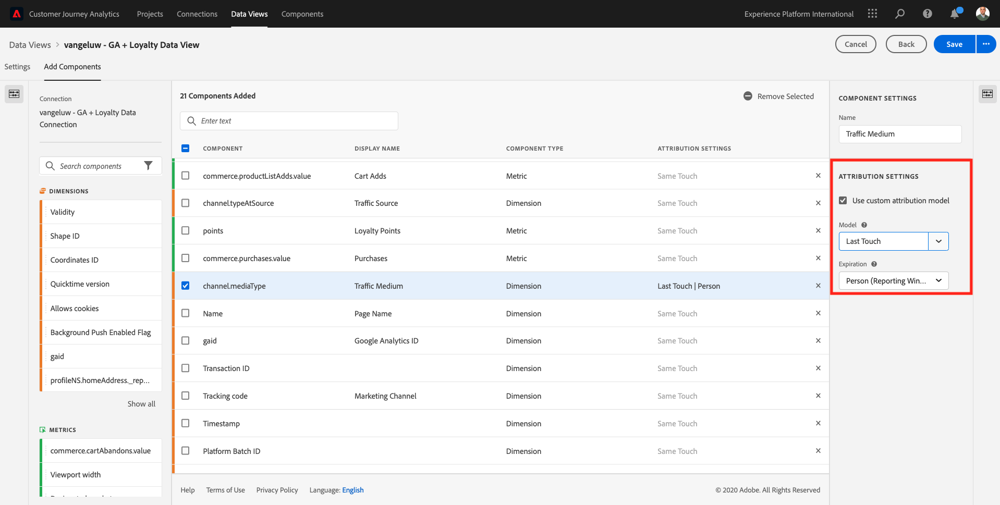

Na het aanbrengen van de veranderingen in attributie montages voor alle bovengenoemde componenten, zou u deze mening dan moeten hebben:

Uw gegevensweergave is nu geconfigureerd. Klikken **Opslaan**.

U kunt nu de gegevens van Google Analytics analyseren in Adobe Analytics Analysis Workspace. Laten we naar de volgende oefening gaan.

## 12.5.3 Uw project maken

Ga in Customer Journey Analytics naar **Projecten**.

U zult dan dit zien:

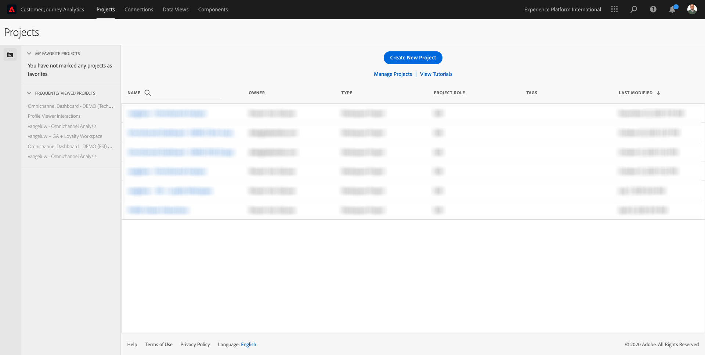

Een project maken door op **Nieuw project maken**.

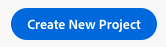

U hebt nu een leeg project:

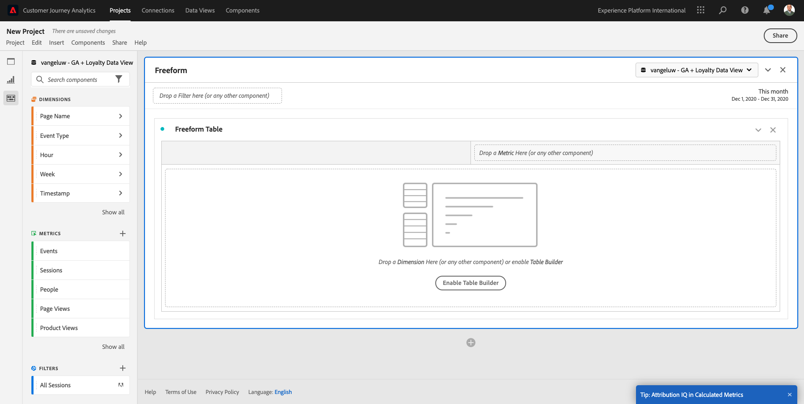

Sla eerst het project op en geef het een naam. U kunt de volgende opdracht gebruiken om op te slaan:

| OS | Korte snede |
| ----------------- |-------------| 
| Windows | Control + S |
| Mac | Command + S |

U ziet deze pop-up:

Gebruik deze naamgevingsconventie:

| Naam | Beschrijving |
| ----------------- |-------------| 
| LDAP - GA + Loyalty-werkruimte | LDAP - GA + Loyalty-werkruimte |

Klik op Volgende **Project opslaan**.

Selecteer vervolgens de juiste gegevensweergave in de rechterbovenhoek van het scherm. Dit is de gegevensweergave die u in de vorige oefening hebt gemaakt, met de naamgevingsconventie `ldap - GA + Loyalty Data View`. In dit voorbeeld moet de gegevensweergave worden geselecteerd: `ldap - GA + Loyalty Data View`.

### 12.5.3.1 Vrije-vormtabellen

Vrije-vormtabellen werken min of meer als draaitabellen in Excel. U kiest iets van de linkerbar en u sleept en laat vallen het in de Vrije vorm en u zult een lijstrapport krijgen.

Vrije-vormtabellen zijn bijna oneindig. U kunt (bijna) om het even wat doen en dit brengt zo veel waarde in vergelijking met Google Analytics (aangezien dit hulpmiddel sommige analysebeperkingen heeft). Dit is een van de redenen om Google Analytics gegevens in een ander analysehulpmiddel te laden.

Laat twee voorbeelden zien waar u SQL, BigQuery en wat tijd moet gebruiken om eenvoudige vragen te beantwoorden die niet mogelijk zijn om binnen Google Analytics UI of de Studio van Gegevens van Google te doen:

- Hoeveel mensen komen aan de controle van Safari Browser die door marketing kanaal wordt verdeeld? Gelieve te zien dat metrische checkout door Browser Safari wordt gefiltreerd. We hebben net de variabele Browser = Safari gesleept en neergezet boven op de uitcheckkolom.

- Als analist kan ik zien dat het Social Marketing Channel lage omzettingen heeft. Ik gebruik de kenmerk Last Touch standaard, maar hoe zit het met First Touch? De metrische instellingen worden weergegeven wanneer u de muis boven metrische instellingen houdt. Daar kan ik het gewenste attributiemodel selecteren. U kunt Attribution in GA (niet in gegevensstudio) als standalone activiteit doen, maar u kunt geen andere metriek of dimensies hebben die niet aan attributieanalyse binnen de zelfde lijst verwant zijn.

Laten we deze vragen en nog wat meer beantwoorden met Analysis Workspace in CJA.

Selecteer eerst het juiste datumbereik (**Afgelopen 53 volledige weken**) aan de rechterkant van het paneel.

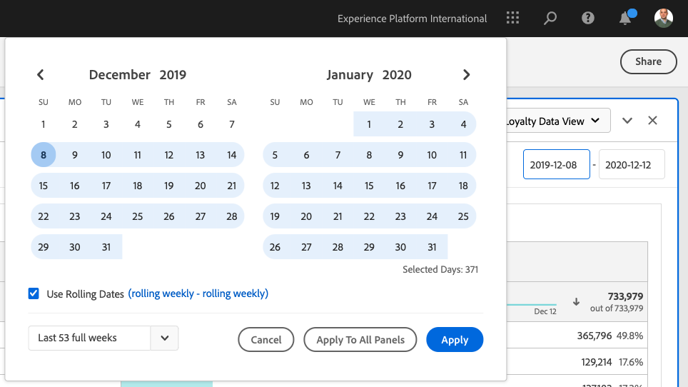

Klik vervolgens op **Toepassen** om het datumbereik toe te passen. Onthoud deze stap voor volgende oefeningen.

>[!NOTE]
>
>Als u net **Gegevensverbinding** en **Gegevens, weergave** misschien moet u een paar uur wachten. CJA heeft enige tijd nodig om historische gegevens terug te vullen wanneer er een enorme hoeveelheid gegevensverslagen is.

Laten wij wat dimensies en metriek slepen en laten vallen om de kanalen van de Marketing te analyseren. Gebruik eerst de dimensie **Marketingkanaal** en sleep het naar het canvas van **Vrije-vormentabel**. (Klik op **Alles tonen** voor het geval u metrisch niet onmiddellijk in het menu van Metriek ziet)

U zult dan dit zien:

Vervolgens moet u de metriek toevoegen aan de tabel Vrije vorm. Voeg de volgende metriek toe: **Mensen**, **Sessies**, **Productweergaven**, **Afbeeldingen**, **Aankopen**, **Omzetsnelheid** (Berekend metrisch).

Voordat u dat kunt doen, moet u eerst de parameter Berekend metrisch maken **Omzetsnelheid**. Om dat te doen, klik **+** pictogram naast Metriek:

Als naam voor Berekende metrisch, gebruik **Omzetsnelheid**. Sleep vervolgens de metriek **aankoop** en **Sessies** op het canvas. Set **Indeling** tot **Percentage** en **Decimalen** tot **2**. Tot slot klikt u op **Opslaan**.

Als u vervolgens al deze statistieken wilt gebruiken in het dialoogvenster **Vrije-vormentabel**, sleep ze een voor een naar de **Vrije-vormentabel**. Zie het onderstaande voorbeeld.

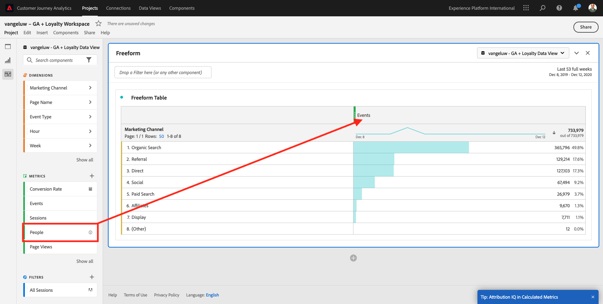

U zult eindigen met een tabel als deze:

Zoals hierboven vermeld, **Vrije-vormtabellen** geef je de vrijheid om diepgaande duiken te analyseren. U kunt bijvoorbeeld een andere Dimension kiezen om een bepaalde metrische waarde in de tabel op te splitsen.

Als voorbeeld, ga naar dimensies en onderzoek en selecteer **Browser** variabele.

Vervolgens ziet u een overzicht van de beschikbare waarden voor deze Dimension.

De Dimension kiezen **Safari** en sleep deze naar de bovenkant van een metrisch object, bijvoorbeeld **Afbeeldingen**. U zult dan dit zien:

U hebt zojuist een mogelijke vraag beantwoord: Hoeveel mensen komen aan de checkout pagina gebruikend Safari, verdeeld door het Kanaal van de Marketing?

Laten we nu de Attribution-vraag beantwoorden.

Zoek de **Aanschaffen** in de tabel.

Houd de muisaanwijzer boven de metrieke en **Instellingen** wordt weergegeven. Klik erop.

Er wordt een contextueel menu weergegeven. Schakel het selectievakje in voor **niet-standaard toewijzingsmodel**.

In popup zult u zien, kunt u de attributiemodellen en het raadplegingsvenster gemakkelijk veranderen (dat vrij complex is om met SQL te bereiken).

Selecteren **Eerste aanraking** als uw attributiemodel.

Kies **Persoon** voor het venster Opzoeken.

Klik nu op **Toepassen**.

U kunt nu zien dat het attributiemodel voor die bepaalde metrische waarde nu First Touch is.

U kunt net zo veel uitsplitsen als u wilt, zonder beperkingen van typen variabelen, segmenten, dimensies of datumbereiken.

Nog iets bijzonders is de mogelijkheid om zich bij elke dataset van Adobe Experience Platform aan te sluiten om de digitale gedragsgegevens van Google Analytics te verrijken. Bijvoorbeeld, off-line, vraag centrum, loyaliteit of de gegevens van CRM.

Om die functionaliteit te tonen, vormen wij uw eerste uitsplitsing die off-line gegevens met online gegevens combineert. De dimensie kiezen **Loyaliteitsniveau** en sleep het naar een willekeurige locatie **Marketingkanaal**, bijvoorbeeld **Organic Search**:

Laten we vervolgens analyseren welke **Apparaattype** wordt gebruikt door klanten die naar de site zijn gekomen met **Organic Search** met een **Loyaliteitsniveau** dat **Brons**. Neem de Dimension **Apparaattype** en sleep het naar **Brons**. U zult dan dit zien:

Je ziet dat voor je eerste uitsplitsing Loyalty Level wordt gebruikt. Deze afmeting komt uit een verschillende dataset en verschillend schema dan die u voor de schakelaar BigQuery gebruikte. De persoon-id **loyaltyID** (Demosysteem - Gebeurtenisschema voor BigQuery (Global v1.1)) en **loyaltyID** (Demosysteem - Profielschema voor Loyalty (Global v1.1)) komt met elkaar overeen. Daarom kunt u Experience Events uit Google Analytics combineren met Profile Data uit het Loyalty-schema.

We kunnen de rijen blijven splitsen met segmenten of specifieke datumbereiken (misschien om bepaalde tv-campagnes te weerspiegelen) om vragen te stellen aan Customer Journey Analytics en de antwoorden onderweg te krijgen.

Het bereiken van het zelfde eindresultaat met SQL en dan een derdevisualisatiehulpmiddel is vrij een uitdaging. Vooral als je vragen stelt en probeert de antwoorden direct te krijgen. Customer Journey Analytics heeft deze uitdaging niet en staat de Analysten van Gegevens toe om de gegevens flexibel en in real time te vragen.

## 12.5.3.2 Trechter- of valkenanalyse

De trechters zijn een groot mechanisme om de belangrijkste stappen in een klantenreis te begrijpen. Deze stappen kunnen ook afkomstig zijn van offline interacties (bijvoorbeeld vanuit het callcenter) en vervolgens kunt u ze combineren met digitale aanraakpunten in dezelfde trechter.

Customer Journey Analytics laat je toe dat te doen en nog veel meer. Als u Module 13 herinnert, wij waar het mogelijk is om met de rechtermuisknop aan te klikken en dingen te doen zoals:

- Analyseren waar de gebruikers naar toe gaan na een uitvalstap
- Een segment maken van een willekeurig punt in de trechter
- Zie Trend in om het even welk stadium in een Grafiek van de Lijn visualisatie

Laten we nog een ding zien dat je kunt doen: Hoe is mijn Reisbaan van de Klant deze maand tegenover de vorige maand? Hoe zit het met mobiel versus desktop?

Onder u zult twee panelen creëren:

- Kanaalanalyse (januari)
- Kanaalanalyse (februari)

U zult zien dat wij een trechter over verschillende tijdsperiodes (Januari en Februari) vergelijken die door het Type van Apparaat worden verdeeld.

Dit soort analyse is niet mogelijk binnen de gebruikersinterface van de Google Analytics of is zeer beperkt. Dus CJA voegt weer veel waarde toe aan de gegevens die door Google Analytics worden vastgelegd.

Om uw eerste fallout visualisatie tot stand te brengen. Sluit het huidige deelvenster om te beginnen met een nieuw deelvenster.

Kijk naar de rechterkant van het deelvenster en klik op de pijl om het te sluiten.

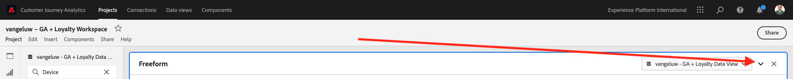

Klik op Volgende **+** om een nieuw deelvenster te maken.

Selecteer nu de optie **Fallout** Visualisatie.

Als analist stel je voor dat je wilt begrijpen wat er gebeurt met je belangrijkste e-commerce trechter: Home > Intern zoeken > Productgegevens > Afhandeling > Aanschaffen.

Laten we beginnen met het toevoegen van nieuwe stappen aan de trechter. Om dat te doen, open **Paginanaam** dimensie.

Vervolgens ziet u alle beschikbare pagina&#39;s die zijn bezocht.

Slepen en neerzetten **Home** tot de eerste stap.

Als tweede stap gebruikt u de opdracht **Zoekresultaten opslaan**

Nu moet u wat e-commerce acties toevoegen. Zoek in de Dimension naar de Dimension **Type gebeurtenis** dimensie. Klik om de dimensie te openen.

Selecteren **Product_Details_Weergaven** en sleep deze naar de volgende stap.

Selecteren **Product_kassa&#39;s** en sleep deze naar de volgende stap.

Pas de grootte van uw uitvalvisualisatie aan.

Uw uitvalvisualisatie is nu gereed.

Om de inzichten te beginnen analyseren en te documenteren, is het altijd een goed idee om **Tekst** visualisatie. Als u een **Tekst** visualisatie, klik op de **Grafiek** in het linkermenu om alle beschikbare visualisaties weer te geven. Sleep vervolgens de **Tekst** visualisatie op het canvas. Wijzig het formaat en verplaats het zodat het lijkt op de afbeelding onder.

En opnieuw, resize het om het dashboard te passen:

Bij valutamatievisualisaties zijn ook uitsplitsingen mogelijk. Gebruik de **Apparaattype** door deze te openen en enkele waarden één voor één naar de visualisatie te slepen:

U krijgt dan een geavanceerdere visualisatie:

Customer Journey Analytics laat je toe dat te doen en nog veel meer. Door met de rechtermuisknop ergens in de fallout te klikken, kunt u...

- Analyseren waar de gebruikers van een reservestap gaan
- Een segment maken van een willekeurig punt in de trechter
- Teken om het even welke stap in een Lijnvisualisatie
- Vergelijk een trechter visueel met verschillende tijdsperiodes.

Als voorbeeld, doe een met de rechtermuisknop aan klik in om het even welke stap van de reserve om sommige van deze analyseopties te zien.

## 12.5.3.3 Stroomanalyse en visualisatie

Als u geavanceerde stroomanalyse wilt doen gebruikend Google Analytics, moet u SQL gebruiken om de gegevens te halen en dan een derdeoplossing voor het visualisatiedeel te gebruiken. Customer Journey Analytics zal daarbij helpen.

In deze stap, zult u een stroomanalyse vormen om deze vraag te beantwoorden: Wat zijn de belangrijkste bijdragende kanalen vóór een specifieke het landen pagina.  Als analist kunt u met twee slepen en neerzetten en met één muisklik de richting van de landingspagina van de gebruiker vaststellen met de twee laatste aanrakingen van de marketingkanalen.

Andere vragen die Customer Journey Analytics u kan helpen beantwoorden:

- Wat is de belangrijkste combinatie kanalen vóór een specifieke het Bestaan Pagina?
- Wat veroorzaakt een gebruiker om de zitting weg te gaan wanneer hij/zij aan Product_Checkout aankomt? Waar de vorige stappen?

Laten we opnieuw met een leeg deelvenster beginnen om deze vragen te beantwoorden. Sluit het huidige deelvenster en klik op **+**.

Selecteer nu de optie **Stroom** visualisatie.

Stel nu een Meerwegs Analyse van de Stroom van het Kanaal van de Marketing. Sleep de **Marketingkanaal** dimensie op de **Invoer Dimension** gebied.

U kunt nu de eerste toegangspaden zien:

Klik op het eerste pad om er omlaag over te boren.

U kunt nu het volgende pad zien (Marketingkanaal).

Laten we een derde boor-down doen. Klik op de eerste optie in het nieuwe pad. **Verwijzing**.

Nu moet je de visualisatie als volgt zien:

Laten we dingen compliceren. Stel dat u wilt analyseren wat de landingspagina was na twee marketingpaden? Hiervoor kunt u een secundaire dimensie gebruiken om het laatste pad te wijzigen. Zoek de **Paginanaam** afmeting en sleep en zet het als volgt neer:

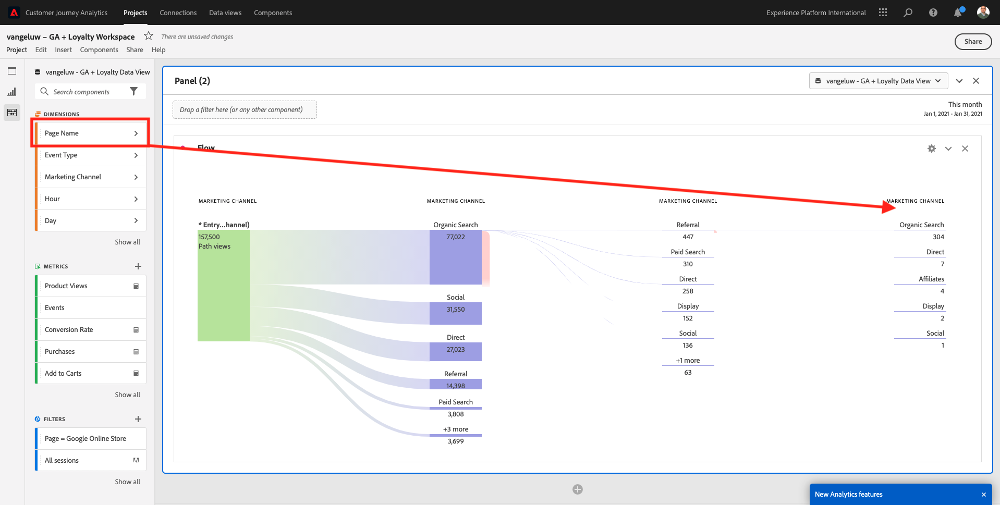

U ziet nu het volgende:

Laten we nog een flowanalyse uitvoeren. Deze keer zult u analyseren wat na een specifiek uitgangspunt gebeurde. Andere analytische oplossingen vereisen het gebruik van SQL/ETL en opnieuw, een derdevisualisatiehulpmiddel om het zelfde ding te bereiken.

Nieuwe **Stroomvisualisatie** in het deelvenster.

Dan heb je het volgende:

De Dimension zoeken **Type gebeurtenis** en sleep het naar de **Afmeting afsluiten** gebied.

Nu kunt u zien welke **Type gebeurtenis**-paths reden klanten aan de uitgang.

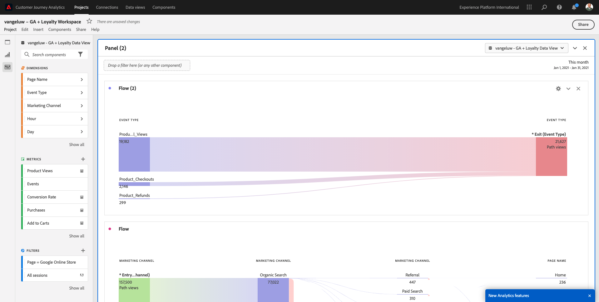

Laten we onderzoeken wat er is gebeurd voordat de kassa-actie is afgesloten. Klik op de knop **Product_kassa&#39;s** pad:

Er wordt een nieuw actiepad weergegeven met gegevens die niet begrijpelijk zijn.

Laten we verder analyseren! De Dimension doorzoeken **Paginanaam** en sleep het naar het nieuwe gegenereerde pad.

U hebt nu een geavanceerde flowanalyse uitgevoerd in minuten. U kunt op de verschillende paden klikken om te zien hoe ze een verbinding tot stand brengen vanaf het einde tot aan de vorige stappen.

U beschikt nu over een krachtige kit om trechters te analyseren en wegen van klantengedrag over digitaal maar ook, off-line aanraakpunten te verkennen.

Vergeet niet uw wijzigingen op te slaan!

## 12.5.4 Het project delen

>[!IMPORTANT]
>
>De onderstaande inhoud is bedoeld als FYI - U doet dit **NOT** moet uw project met iedereen delen.

FYI - U kunt dit project met collega&#39;s delen om samen te werken of bedrijfsvragen samen te analyseren.

Volgende stap: [Samenvatting en voordelen](./summary.md)

[Ga terug naar module 12](./customer-journey-analytics-bigquery-gcp.md)

[Terug naar alle modules](./../../overview.md)
