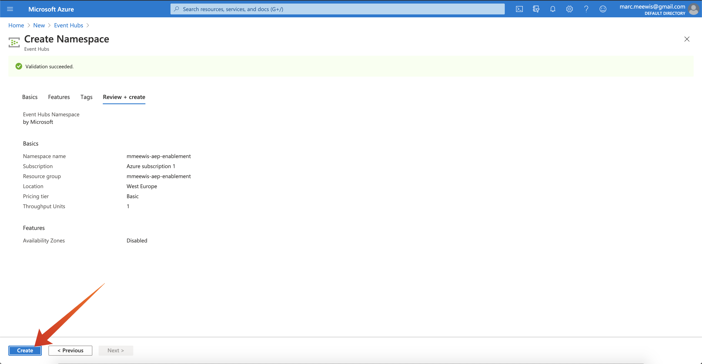
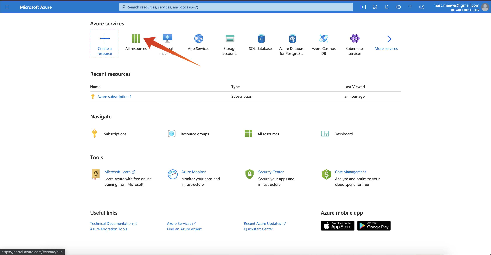
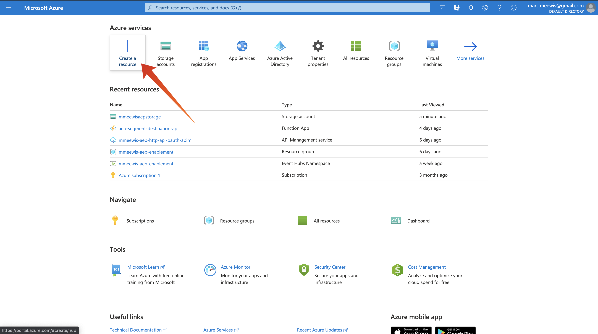

# 13.1 Configureer uw Microsoft Azure EventHub-omgeving

Azure Event Hubs is een hoogst scalable publish-subscribe dienst die miljoenen gebeurtenissen per seconde kan opnemen en hen in veelvoudige toepassingen stroomt. Zo kunt u de enorme hoeveelheden gegevens verwerken en analyseren die door de aangesloten apparaten en toepassingen worden geproduceerd.

## 13.1.1 Wat is Azure Event Hubs?

Azure Event Hubs is een groot platform voor gegevensstreaming en service voor het opnemen van gebeurtenissen. Het kan miljoenen gebeurtenissen per seconde ontvangen en verwerken. Gegevens die naar een gebeurtenishub worden verzonden, kunnen worden getransformeerd en opgeslagen met behulp van een realtime analyseprovider of batchadapters.

Gebeurtenishubs vertegenwoordigen de **voorkant** voor een gebeurtenispijpleiding, vaak genoemd een gebeurtenis ingestor in oplossingsarchitectuur. Een gebeurtenislistener is een component of service die zich tussen gebeurtenisuitgevers (zoals Adobe Experience Platform RTCDP) en gebeurtenisgebruikers bevindt om de productie van een gebeurtenisstream los te koppelen van het gebruik van die gebeurtenissen. De Hubs van de gebeurtenis verstrekt een verenigd stromend platform met tijdretentiebuffer, ontkoppelt gebeurtenisproducenten van gebeurtenisconsumenten.

## 13.1.2 Een naamruimte Gebeurtenishubs maken

Ga naar [https://portal.azure.com/#home](https://portal.azure.com/#home) en selecteert u **Een bron maken**.

In het middelscherm, ga binnen **Gebeurtenis** in de zoekbalk en selecteer **Gebeurtenishubs** uit het vervolgkeuzemenu:

Klikken **Maken**:

Als dit de eerste keer is dat u een middel in Azure creeert, zult u een nieuw moeten creëren **Brongroep**. Als u al een middelgroep hebt kunt u het selecteren (of nieuwe creëren).

Selecteren **Nieuw maken**, geef uw groep een naam `--demoProfileLdap---aep-enablement`.

Voltooi de test van de velden zoals aangegeven:

- Namespace: Definieer de naamruimte, deze moet uniek zijn en gebruik het volgende patroon `--demoProfileLdap---aep-enablement`
- Locatie: **West-Europa** verwijst naar het Azure datacenter in Amsterdam
- Prijsniveau: **Basis**
- Doorvoereenheden: **1**

Klikken **Revisie + maken**.

Klikken **Maken**.

De plaatsing van uw middelgroep kan 1-2 minuten vergen, wanneer succesvol u het volgende scherm zult zien:

## 13.1.3 Opstelling uw Hub van de Gebeurtenis in Azure

Ga naar [https://portal.azure.com/#home](https://portal.azure.com/#home) en selecteert u **Alle bronnen**.

Selecteer in de lijst met bronnen de optie `--demoProfileLdap---aep-enablement` naamruimte:

In `--demoProfileLdap---aep-enablement` detailscherm selecteren **Gebeurtenishubs**:

Klikken **+ Gebeurtenissenhub**.

Gebruiken `--demoProfileLdap---aep-enablement-event-hub` als de naam en klik op **Maken**.

Klikken **Gebeurtenishubs** in de naamruimte van de gebeurtenishub. U moet nu uw **Gebeurtenishub** vermeld. Als dat het geval is, kunt u overgaan op de volgende oefening.

## 13.1.4 Stel uw Azure Storage Account in

Om uw functie van de Hub van de Gebeurtenis van de Azure in recentere oefeningen te zuiveren, zult u een Azure Rekening van de Opslag als deel van uw het projectopstelling van de Code van Visual Studio moeten verstrekken. U gaat nu die Azure Storage Account maken.

Ga naar [https://portal.azure.com/#home](https://portal.azure.com/#home) en selecteert u **Een bron maken**.

Enter **opslag** in de zoekopdracht en selecteer **Opslagaccount** in de lijst.

Selecteer **Maken**.

Geef uw **Brongroep** (gemaakt aan het begin van deze oefening), gebruik `--demoProfileLdap--aepstorage` als uw naam voor de opslagaccount en selecteer **Lokaal redundante opslag (LRS)** en klik vervolgens op **Revisie + maken**.

Klikken **Maken**.

Het maken van uw opslagaccount duurt een paar seconden:

Als u klaar bent, wordt het scherm weergegeven **Ga naar bron** knop.

Klikken **Microsoft Azure**.

Uw opslagaccount is nu zichtbaar onder **Recente bronnen**.

Volgende stap: [13.2 Configureer uw Azure Event Hub Destination in Adobe Experience Platform](./ex2.md)

[Ga terug naar module 13](./segment-activation-microsoft-azure-eventhub.md)

[Terug naar alle modules](./../../overview.md)
