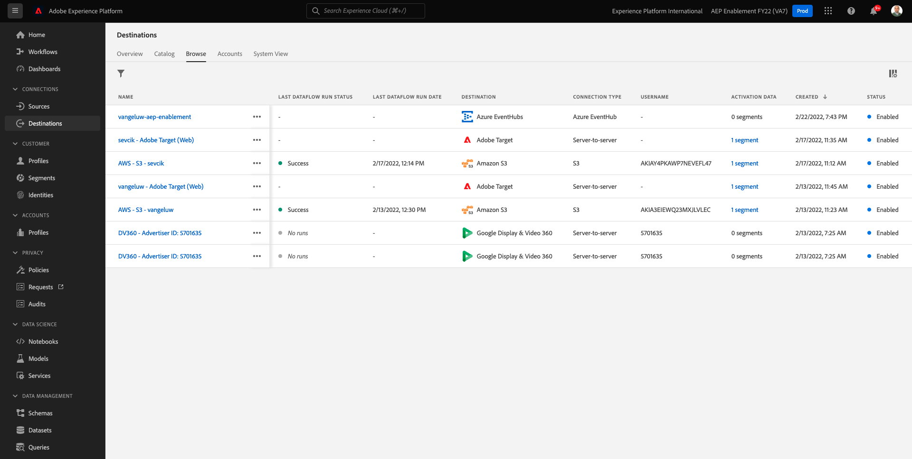

# 13.2 Configureer uw Azure Event Hub Destination in Adobe Experience Platform

## 13.2.1 Vereiste parameters van Azure Connection identificeren

Om een bestemming van de Hub van de Gebeurtenis in Adobe Experience Platform te bepalen hebt u uw nodig:

- Naamruimte van gebeurtenishubs
- Gebeurtenishub
- Azure SAS Key Name
- Azure SAS Key

De Hub van de gebeurtenis en EventHub namespace zijn bepaald in de vorige oefening: [Oefening 1 - Setup Event Hub in Azure](./ex1.md)

### Naamruimte van gebeurtenishubs

Als u de bovenstaande informatie in Azure Portal wilt opzoeken, navigeert u naar [https://portal.azure.com/#home](https://portal.azure.com/#home). Zorg ervoor dat u het correcte Azure-account gebruikt.

Selecteren **Alle bronnen** in Azure Portal:

### Gebeurtenishub

Zoeken naar een resource met een brontype **Naamruimte van gebeurtenishubs** Als u de naamgevingsconventies die in de vorige oefening zijn gebruikt, hebt u Namespace van gebeurtenishubs gevolgd `--demoProfileLdap---aep-enablement`. Neem er nota van, u zult het in de volgende oefening nodig hebben.

Klik op de naam van de naamruimte Gebeurtenishubs om de details op te halen:

Selecteren **Gebeurtenishubs** om een lijst van Gebeurtenishubs te krijgen die in uw Namespace van de Hubs van de Gebeurtenis wordt bepaald, als u de noemende overeenkomsten volgde die in de vorige oefening worden gebruikt zult u een genoemde Hub van de Gebeurtenis vinden `--demoProfileLdap---aep-enablement-event-hub`. Neem er nota van, u zult het in de volgende oefening nodig hebben.

### SAS-sleutelnaam

Selecteren **Beleid voor gedeelde toegang** voor uw **Naamruimte van gebeurtenishubs**

U zult een lijst van Gedeeld toegangsbeleid zien. De SAS-sleutel die we zoeken is **RootManageSharedAccessKey**. Dit is de SAS Key-naam. Schrijf het op.

### SAS-sleutelwaarde

Klik op de knop **RootManageSharedAccessKey** om de SAS-sleutelwaarde te krijgen. Druk op **Kopiëren naar klembord** pictogram om het **Primaire sleutel**:

### Overzicht van doelwaarden

Op dit punt zou u alle waarden moeten geïdentificeerd hebben nodig om de Azure bestemming van de Hub van de Gebeurtenis in Adobe Experience Platform in real time CDP te bepalen.

| Naam doelkenmerk | Waarde doelkenmerk | Voorbeeldwaarde |
|---|---|---|
| sasKeyName | SAS-sleutelnaam | RootManageSharedAccessKey |
| sasKey | SAS-sleutelwaarde | srREx9ShJG1Rv7f/... |
| namespace | Naamruimte van gebeurtenishubs | `--demoProfileLdap---aep-enablement` |
| eventHubName | Gebeurtenishub | `--demoProfileLdap---aep-enablement-event-hub` |

## 13.2.2 Azure Event Hub Destination in Adobe Experience Platform maken

Meld u aan bij Adobe Experience Platform door naar deze URL te gaan: [https://experience.adobe.com/platform](https://experience.adobe.com/platform).

Na het aanmelden landt je op de homepage van Adobe Experience Platform.

Voordat u verdergaat, moet u een **sandbox**. De sandbox die moet worden geselecteerd, krijgt een naam ``--aepSandboxId--``. U kunt dit doen door op de tekst te klikken **[!UICONTROL Productieproduct]** in de blauwe lijn boven op het scherm. Na het selecteren van de aangewezen zandbak, zult u de het schermverandering zien en nu bent u in uw specifieke zandbak.

Ga naar **Doelen** en ga vervolgens naar **Catalogus**.

Selecteren **Cloud Storage** en ga naar **Azure Event Hubs** en klik op **Instellen** of **Configureren**:

Vul de bestemmingswaarden in die u in de vorige oefening hebt verzameld. Klik op Volgende **Verbinden met doel**.

Als uw gegevens juist waren, wordt een bevestiging weergegeven: **Verbonden**.

U moet nu de naam en beschrijving in de notatie invoeren `--demoProfileLdap---aep-enablement`. Voer de **eventHubName** (zie vorige oefening, kijkt het als volgt: `--demoProfileLdap---aep-enablement-event-hub`) en klik op **Volgende**.

Klikken **Opslaan en afsluiten**.

Je bestemming is nu gemaakt en beschikbaar in Adobe Experience Platform.

Volgende stap: [13.3 Een segment maken](./ex3.md)

[Ga terug naar module 13](./segment-activation-microsoft-azure-eventhub.md)

[Terug naar alle modules](./../../overview.md)
