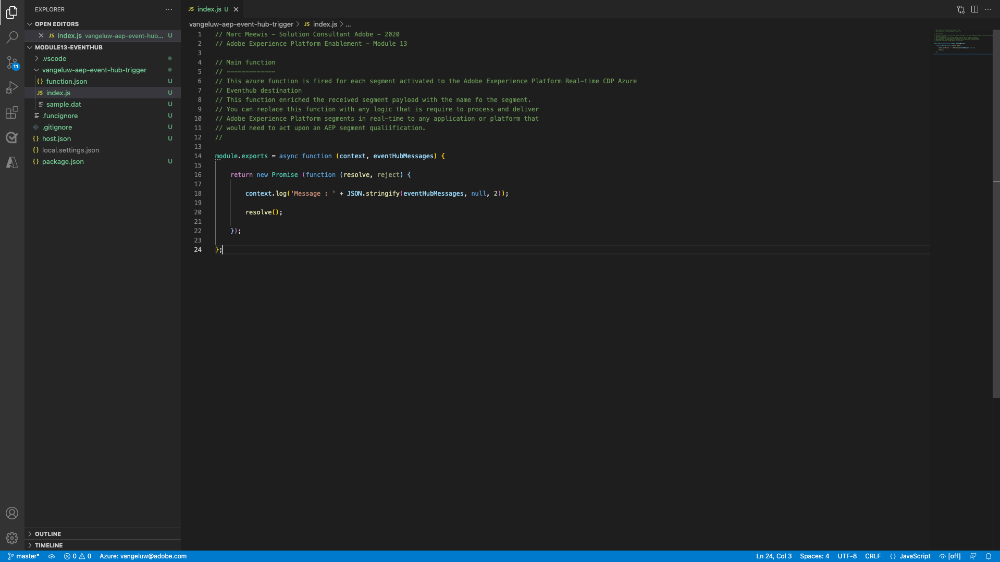
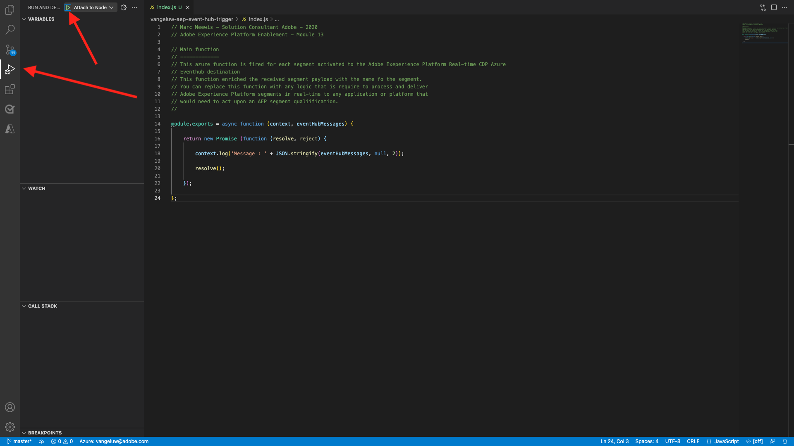

# 13.5 Uw Microsoft Azure-project maken

## 13.5.1 Het worden vertrouwd met de functies van de Hub van de Gebeurtenis van de Azure

Met Azure Functions kunt u kleine stukjes code uitvoeren (ook wel **functies**) zonder zich zorgen te maken over de toepassingsinfrastructuur. Met Azure-functies biedt de cloudinfrastructuur alle up-to-date servers die u nodig hebt om uw toepassing op schaal te houden.

Een functie is **geactiveerd** door een specifiek type gebeurtenis. De gesteunde trekkers omvatten het antwoorden aan veranderingen in gegevens, die aan berichten (bijvoorbeeld de Hubs van de Gebeurtenis) antwoorden, die op een programma, of als resultaat van een HTTP- verzoek lopen.

Azure Functions is een serverloze compute service waarmee u gebeurtenisgestuurde code kunt uitvoeren zonder dat u expliciet infrastructuur hoeft aan te bieden of te beheren.

Azure Event Hubs integreert met Azure Functions voor een serverloze architectuur.

## 13.5.2 Open Visual Studio Code en Logon aan Azure

De Code van Visual Studio maakt het gemakkelijk aan...

- Azure-functies definiëren en binden aan Event Hubs
- lokaal testen
- implementeren in Azure
- externe logboekfunctie uitvoeren

### Visual Studio-code openen

Om de Code van Visual Studio te openen ga binnen **visueel** in de zoekopdracht van uw besturingssysteem (Spotlight-zoekopdracht op OSX, Zoeken op de taakbalk van Windows). Als u het niet vindt, moet u de stappen herhalen die in [Oefening 0 - Voorwaarden](./ex0.md).


### Aanmelden bij Azure

Wanneer u zich aanmeldt bij uw Azure-account die u hebt gebruikt om u aan te melden [Oefening 0 - Voorwaarden](./ex0.md), zal de Code van Visual Studio u alle middelen van de Hub van de Gebeurtenis vinden en binden.

Klik op de knop **Azure** pictogram in de Code van Visual Studio. Als u die optie niet hebt, kan er iets misgegaan zijn met de installatie van de vereiste extensies.

Volgende selectie **Aanmelden bij Azure**:


U wordt omgeleid naar uw browser om u aan te melden. Vergeet niet de Azure-account te selecteren die u hebt gebruikt om u te registreren.


Wanneer u het volgende scherm in uw browser ziet, wordt u het programma geopend met Visual Code Studio:


Terugkeer aan Visual Code Studio (u zult de naam van uw Azure abonnement zien, bijvoorbeeld **Azure-abonnement 1**):


## 13.5.3 Een Azure-project maken

Wanneer u de muis boven **Azure-abonnement 1** verschijnt boven de sectie, selecteert u **Nieuw project maken...**:


Selecteer een lokale map naar keuze om het project op te slaan en klik op **Selecteren**:


U gaat nu de wizard Project maken in. Selecteren **Javascript** als taal voor uw project:


Selecteren **Azure Event Hub trigger** als eerste functiesjabloon van uw project:


Voer een naam in voor uw functie en gebruik de volgende notatie `--demoProfileLdap---aep-event-hub-trigger` en druk op Enter:


Selecteren **Nieuwe lokale app-instelling maken**:


Selecteer een naamruimte van een gebeurtenishub. U moet de gebeurtenishub zien waarin u hebt gedefinieerd **Oefening 2**. In dit voorbeeld is de naamruimte van de gebeurtenishub **vangeluw-aep-enablement**:


Selecteer uw Hub van de Gebeurtenis, zou u de Hub van de Gebeurtenis moeten zien die u binnen bepaalde **Oefening 2**. In mijn geval is dat **vangeluw-aep-enablement-event-hub**:


Selecteren **RootManageSharedAccessKey** als uw beleid van de Hub van de Gebeurtenis:


Enter-teken voor gebruik **$Standaard**:


Selecteren **Toevoegen aan werkruimte** over het openen van uw project:


Nadat u project hebt gemaakt, klikt u op **index.js** om het bestand in de editor te openen:


De nuttige lading die door Adobe Experience Platform naar uw Hub van de Gebeurtenis wordt verzonden zal segment id&#39;s omvatten:

```json
[{
"segmentMembership": {
"ups": {
"ca114007-4122-4ef6-a730-4d98e56dce45": {
"lastQualificationTime": "2020-08-31T10:59:43Z",
"status": "realized"
},
"be2df7e3-a6e3-4eb4-ab12-943a4be90837": {
"lastQualificationTime": "2020-08-31T10:59:56Z",
"status": "realized"
},
"39f0feef-a8f2-48c6-8ebe-3293bc49aaef": {
"lastQualificationTime": "2020-08-31T10:59:56Z",
"status": "realized"
}
}
},
"identityMap": {
"ecid": [{
"id": "08130494355355215032117568021714632048"
}]
}
}]
```

Vervang de code in index.js van uw Code van Visual Studio met de hieronder code. Deze code zal worden uitgevoerd telkens als CDP in real time segmentkwalificaties naar uw bestemming van de Hub van de Gebeurtenis verzendt. In ons voorbeeld gaat de code alleen over het weergeven en verbeteren van de ontvangen lading. Maar je kunt je elke functie voorstellen om segmentkwalificaties in real-time te verwerken.

```javascript
// Marc Meewis - Solution Consultant Adobe - 2020
// Adobe Experience Platform Enablement - Module 13

// Main function
// -------------
// This azure function is fired for each segment activated to the Adobe Exeperience Platform Real-time CDP Azure 
// Eventhub destination
// This function enriched the received segment payload with the name fo the segment. 
// You can replace this function with any logic that is require to process and deliver
// Adobe Experience Platform segments in real-time to any application or platform that 
// would need to act upon an AEP segment qualiification.
// 

module.exports = async function (context, eventHubMessages) {

    return new Promise (function (resolve, reject) {

        context.log('Message : ' + JSON.stringify(eventHubMessages, null, 2));

        resolve();

    });    

};
```

Het resultaat moet er als volgt uitzien:



## 13.5.4 Run Azure Project

Nu is het tijd om uw project uit te voeren. In dit stadium zullen wij niet het project aan Azure opstellen. Wij zullen het plaatselijk in zuivert wijze in werking stellen. Selecteer het pictogram Uitvoeren en klik op de groene pijl.



De eerste keer dat u uw project uitvoert in de foutopsporingsmodus, moet u een Azure-opslagaccount koppelen, klikt u op **Opslagaccount selecteren**.


Selecteer in de lijst met opslagaccounts de account die u hebt gemaakt als onderdeel van [13.1.4 Stel uw Azure Storage Account in](./ex1.md). De naam van uw opslagaccount is `--demoProfileLdap--aepstorage`, bijvoorbeeld: **mmewisaepstorage**.


Uw project is nu in gebruik en maakt een lijst van voor gebeurtenissen in de Hub van de Gebeurtenis. In de volgende oefening zult u gedrag op de website van de demo van de Luma aantonen die u voor die segmenten zal kwalificeren. Dientengevolge zult u een lading van de segmentkwalificatie in de terminal van uw de trekkerfunctie van de Hub van de Gebeurtenis ontvangen:


## 13.5.5 Stop Azure Project

Om uw project tegen te houden, selecteer **Terminal** tab, klik in het eindvenster en druk op **CMD-C** op OSX of **CTRL-C** in Windows:


Volgende stap: [13.6 End-to-end scenario](./ex6.md)

[Ga terug naar module 13](./segment-activation-microsoft-azure-eventhub.md)

[Terug naar alle modules](./../../overview.md)
