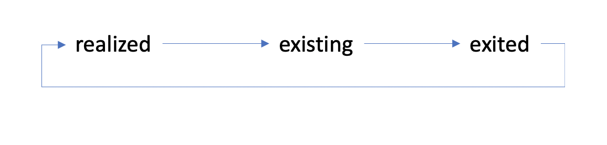

# 13.6 End-to-end scenario

## 13.6.1 Start Azure Event Hub trigger

Om de nuttige lading te tonen die door Adobe Experience Platform in real time CDP naar onze Azure Hub van de Gebeurtenis op segmentkwalificatie wordt verzonden, moeten wij onze eenvoudige Azure de trekkerfunctie van de Hub van de Gebeurtenis beginnen. Deze functie zal eenvoudig &quot;stortplaats&quot;de nuttige lading aan de console in de Code van Visual Studio. Maar denk eraan dat deze functie op elke manier kan worden uitgebreid om met allerlei omgevingen te communiceren met behulp van specifieke API&#39;s en protocollen.

### De Code van Visual Studio van de lancering en beginproject

Zorg ervoor dat uw geopend en lopend project van de Code van Visual Studio hebt

Om uw functie van Azure in de Code van Visual Studio te beginnen/te stoppen/opnieuw te beginnen, verwijs naar de volgende oefeningen:

- [Oefening 13.5.4 - Start Azure Project](./ex5.md)
- [Oefening 13.5.5 - Stop Azure Project](./ex5.md)

Uw Code van Visual Studio **Terminal** Ik zou iets gelijkaardigs willen noemen:

```code
[2022-02-23T05:03:41.429Z] Worker process started and initialized.
[2022-02-23T05:03:41.484Z] Debugger attached.
[2022-02-23T05:03:46.401Z] Host lock lease acquired by instance ID '000000000000000000000000D90C881B'.
```


## 13.6.2 Uw Luma-website laden

Ga naar [https://builder.adobedemo.com/projects](https://builder.adobedemo.com/projects). Nadat je je hebt aangemeld bij je Adobe ID, kun je dit zien. Klik op uw websiteproject om het te openen.


U kunt nu de onderstaande workflow volgen om toegang te krijgen tot de website. Klikken **Integraties**.


Op de **Integraties** pagina, moet u het bezit van de Inzameling van Gegevens selecteren dat in oefening 0.1 werd gecreeerd.


Vervolgens wordt uw demowebsite geopend. Selecteer de URL en kopieer deze naar het klembord.


Open een nieuw Incognito-browservenster.


Plak de URL van uw demowebsite, die u in de vorige stap hebt gekopieerd. Vervolgens wordt u gevraagd u aan te melden met uw Adobe ID.


Selecteer uw accounttype en voltooi het aanmeldingsproces.


Uw website wordt vervolgens geladen in een Incognito-browservenster. Voor elke demonstratie, zult u een vers, incognito browser venster moeten gebruiken om uw demowebsite URL te laden.


## 13.6.3 Geschikt voor uw interesse in het segment Apparatuur

Ga naar de **Apparatuur** pagina één keer, en **niet opnieuw laden of vernieuwen**. Deze actie komt in aanmerking voor uw `--demoProfileLdap-- - Interest in Equipment` segment.


Open het deelvenster Profielviewer om dit te verifiëren. U moet nu lid zijn van de `--demoProfileLdap-- - Interest in Equipment`. Als uw segmentlidmaatschappen nog niet zijn bijgewerkt in het deelvenster Profielviewer, klikt u op de knop Opnieuw laden.


De schakelaar terug naar de Code van Visual Studio en kijkt uw **TERMINAL** zou u een lijst van segmenten voor uw specifiek moeten zien **ECID**. Deze activeringslading wordt geleverd aan uw gebeurtenishub zodra u voor `--demoProfileLdap-- - Interest in Equipment` segment.

Wanneer u een dichtere blik bij de segmentlading neemt, kunt u zien dat `--demoProfileLdap-- - Interest in Equipment` bevindt zich in status **gereed**.

Een segmentstatus van **gereed** betekent dat ons profiel net het segment is ingegaan. Terwijl de **bestaand** status betekent dat ons profiel zich in het segment blijft bevinden.


## 13.6.4 Bezoek de pagina Apparatuur voor een tweede keer

Doe hard verfrissen van **Apparatuur** pagina.


Nu, schakelaar terug naar de Code van Visual Studio en verifieer uw **TERMINAL** tab. U zult zien dat wij uw segment nog hebben, maar nu in status **bestaand** dat betekent dat ons profiel zich in het segment blijft bevinden .


## 13.6.5 Bezoek de pagina Sport voor de derde keer

Als u de **Sport** pagina voor de derde keer, zal geen activering plaatsvinden, omdat er geen staatsverandering van een segmentstandpunt is.

De activaties van het segment komen slechts voor wanneer de status van het segment verandert:



Volgende stap: [Samenvatting en voordelen](./summary.md)

[Ga terug naar module 13](./segment-activation-microsoft-azure-eventhub.md)

[Terug naar alle modules](./../../overview.md)
