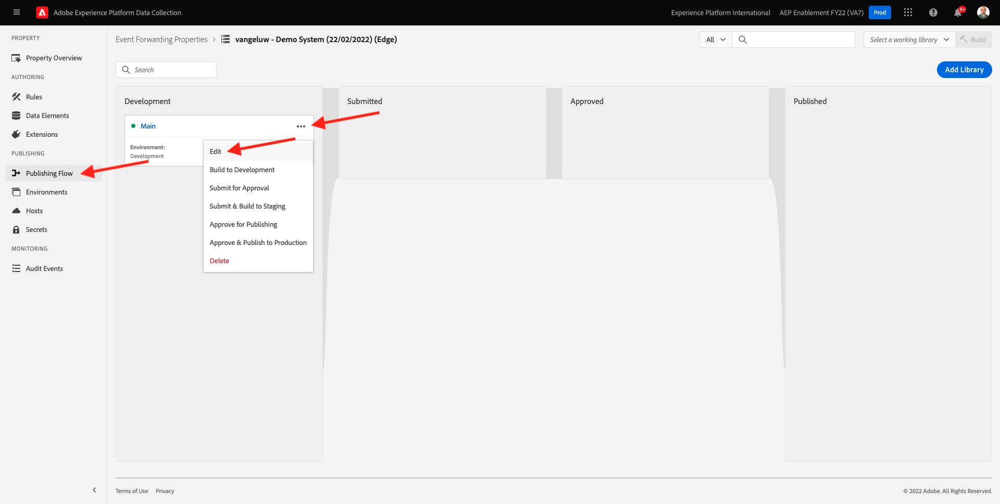
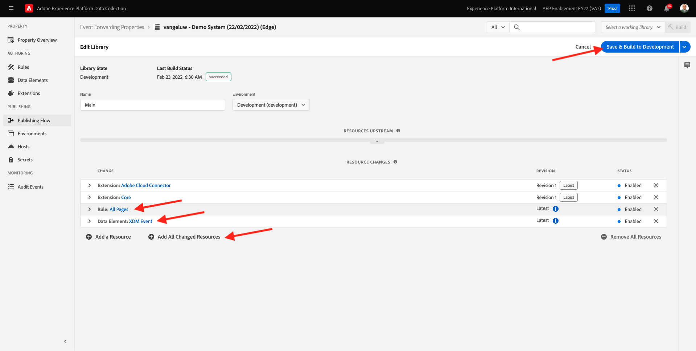

# 14.3 Een aangepaste webhaak maken en configureren

## 14.3.1 Een aangepaste webhaak maken

Ga naar [https://webhook.site/](https://webhook.site/). Je ziet iets als dit:

U ziet uw unieke URL, die er als volgt uitziet: `https://webhook.site/585126a1-41fc-4721-864b-d4aa8c268a1d`.

Deze website heeft deze webhaak nu voor u gemaakt en u kunt deze webhaak configureren in uw **[!DNL Event Forwarding property]** om het testen van het door:sturen van gebeurtenissen te beginnen.

## 14.3.2 Werk uw eigenschap Event Forwarding bij: Een gegevenselement maken

Ga naar [https://experience.adobe.com/#/data-collection/](https://experience.adobe.com/#/data-collection/) en ga naar **Gebeurtenis doorsturen**. Zoek in de eigenschap Event Forwarding en klik erop om deze te openen.

Ga in het linkermenu naar **Gegevenselementen**. Klikken **Nieuw gegevenselement maken**.

U zult dan een nieuw gegevenselement zien om te vormen.

Maak de volgende selectie:

- Als de **Naam**, enter **XDM-gebeurtenis**.
- Als de **Extensie**, selecteert u **Kern**.
- Als de **Type gegevenselement**, selecteert u **Pad**.
- Als de **Pad**, enter **arc.event.xdm**. Door dit pad in te voeren, filtert u de **XDM** van de payload van de gebeurtenis die door de website of mobiele app naar de Adobe Edge wordt verzonden.

Nu heb je dit. Klikken **Opslaan**.

>[!NOTE]
>
>In het bovenstaande pad wordt verwezen naar **boog**. **boog** staat voor Adobe Resource Context en **boog** staat altijd voor het hoogste beschikbare voorwerp dat in de context van de Zijde van de Server beschikbaar is. Verrijkingen en transformaties kunnen aan die **boog** object met Adobe Experience Platform Data Collection Server-functies.
>
>In het bovenstaande pad wordt verwezen naar **event**. **event** staat voor een unieke gebeurtenis en Adobe Experience Platform Data Collection Server zal altijd elke gebeurtenis afzonderlijk evalueren. Soms ziet u een verwijzing naar **gebeurtenissen** in de nuttige lading die door de Kant van SDK van het Web wordt verzonden, maar in de Server van de Inzameling van Gegevens van Adobe Experience Platform, wordt elke gebeurtenis individueel geëvalueerd.

## 14.3.3 Werk de Adobe Experience Platform Data Collection Server-eigenschap bij: Een regel maken

Ga in het linkermenu naar **Regels**. Klikken **Nieuwe regel maken**.

U zult dan een nieuwe regel zien om te vormen. Voer de **Naam**: **Alle pagina&#39;s**. Voor deze oefening, zult u geen voorwaarde moeten vormen. In plaats daarvan stelt u een handeling in. Klik op de knop **+ Toevoegen** knop onder **Handelingen**.

Dan zie je dit. Maak de volgende selectie:

- Selecteer **Extensie**: **Adobe Cloud Connector**.
- Selecteer **Type handeling**: **Ophaalvraag maken**.

Dat zou u moeten geven **Naam**: **Adobe Cloud Connector - Fetch-gesprek maken**. U zou nu dit moeten zien:

Configureer daarna het volgende:

- Wijzig de aanvraagmethode van GET in **POST**
- Voer de URL in van de aangepaste webhaak die u in een van de vorige stappen van het dialoogvenster hebt gemaakt [https://webhook.site/](https://webhook.site/) website, die er als volgt uitziet: `https://webhook.site/585126a1-41fc-4721-864b-d4aa8c268a1d`

Dat zou u nu moeten doen. Ga vervolgens naar **Lichaam**.

Dan zie je dit. Klik op het pictogram voor het gegevenselement zoals hieronder aangegeven.

Selecteer in het pop-upmenu het gegevenselement **XDM-gebeurtenis** die u in de vorige stap hebt gemaakt. Klikken **Selecteren**.

Dan zie je dit. Klikken **Wijzigingen behouden**.

Dan zie je dit. Klikken **Opslaan**.

U hebt nu uw eerste regel in een Gebeurtenis gevormd die bezit door:sturen. Ga naar **Publishing Flow** om uw wijzigingen te publiceren.
De ontwikkelingsbibliotheek openen **Hoofd** door te klikken **Bewerken** zoals aangegeven.

Klik op de knop **Alle gewijzigde bronnen toevoegen** de knoop, waarna zult u uw Regel en Element van Gegevens in deze bibliotheek zien. Klik op Volgende **Opslaan en bouwen voor ontwikkeling**. Uw wijzigingen worden nu geïmplementeerd.

Na een paar minuten zult u zien dat de implementatie klaar is en klaar om te worden getest.

## 14.3.4 Test uw configuratie

Ga naar [https://builder.adobedemo.com/projects](https://builder.adobedemo.com/projects). Nadat je je hebt aangemeld bij je Adobe ID, kun je dit zien. Klik op uw websiteproject om het te openen.

U kunt nu de onderstaande workflow volgen om toegang te krijgen tot de website. Klikken **Integraties**.

Op de **Integraties** pagina, moet u het bezit van de Inzameling van Gegevens selecteren dat in oefening 0.1 werd gecreeerd.

Vervolgens wordt uw demowebsite geopend. Selecteer de URL en kopieer deze naar het klembord.

Open een nieuw Incognito-browservenster.

Plak de URL van uw demowebsite, die u in de vorige stap hebt gekopieerd. Vervolgens wordt u gevraagd u aan te melden met uw Adobe ID.

Selecteer uw accounttype en voltooi het aanmeldingsproces.

Uw website wordt vervolgens geladen in een Incognito-browservenster. Voor elke demonstratie, zult u een vers, incognito browser venster moeten gebruiken om uw demowebsite URL te laden.

Wanneer u uw browser de Mening van de Ontwikkelaar opent, kunt u de verzoeken van het Netwerk zoals hieronder vermeld inspecteren. Wanneer u het filter gebruikt **interageren**, zult u de netwerkverzoeken zien die door de Cliënt van de Inzameling van Gegevens van Adobe Experience Platform naar Adobe Edge worden verzonden.

Als u de onbewerkte lading selecteert, ga naar [https://jsonformatter.org/json-pretty-print](https://jsonformatter.org/json-pretty-print) en plak de lading. Klikken **Mooi maken**. Dan zie je de JSON-lading, de **gebeurtenissen** en **xdm** object. In een van de vorige stappen, toen u het Gegevenselement bepaalde, gebruikte u de verwijzing **arc.event.xdm**, waardoor u de **xdm** object van deze lading.

Ga van weergave naar website [https://webhook.site/](https://webhook.site/) die u in een van de vorige stappen hebt gebruikt. U zou nu een mening gelijkend op dit moeten hebben, met netwerkverzoeken die in het linkermenu worden getoond. Je ziet de **xdm** lading die uit het netwerkverzoek was dat hierboven werd getoond.

Blader een beetje omlaag in de lading om de paginanaam te vinden, die in dit geval is **vangeluw-OCUC** (dit is de projectnaam van uw demo-website).

Als u nu door de website navigeert, zult u extra netwerkverzoeken zien die op deze douanewebsite in real time beschikbaar worden.

U hebt nu de Server Door:sturen van de nuttige ladingen van SDK/XDM van het Web aan een externe douanetoewijzing gevormd. In de volgende oefeningen, zult u een gelijkaardige benadering vormen, en u zult die zelfde gegevens naar de milieu&#39;s van Google en van AWS verzenden.

Volgende stap: [14.4 Een Google Cloud-functie maken en configureren](./ex4.md)

[Ga terug naar module 14](./aep-data-collection-ssf.md)

[Terug naar alle modules](./../../overview.md)
