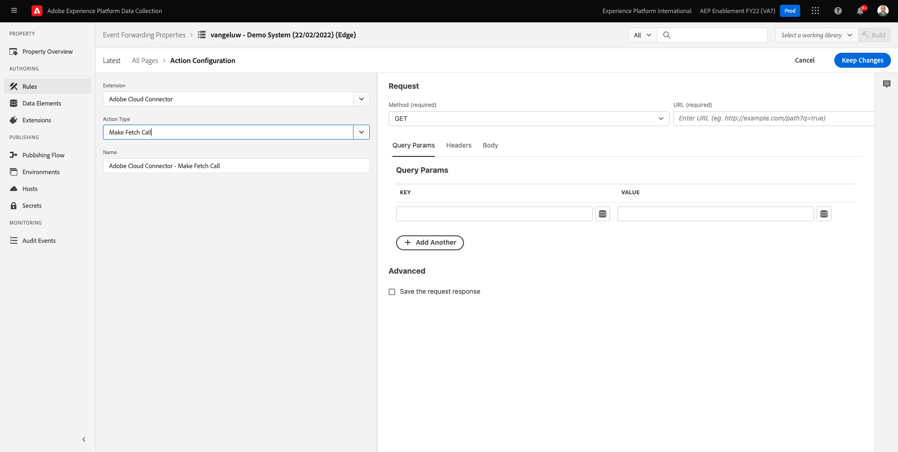
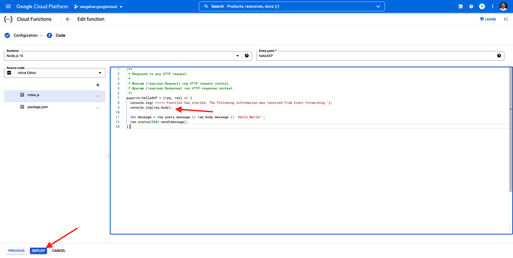

# 14.4 Een Google Cloud-functie maken en configureren

## 14.4.1 Een Google Cloud-functie maken

Ga naar [https://console.cloud.google.com/](https://console.cloud.google.com/). Ga naar **Cloud-functies**.


Dan zie je dit. Klikken **FUNCTIE MAKEN**.


Dan zie je dit.


Kies de volgende opties:

- **Functienaam**: `--demoProfileLdap---event-forwarding`
- **Regio**: elk gebied selecteren
- **Type trigger**: selecteren **HTTP**
- **Verificatie**: selecteren **Niet-geverifieerde aanroepen toestaan**

Dat zou u nu moeten doen. Klikken **OPSLAAN**.


Klikken **VOLGENDE**.


U zult dan dit zien:


Kies de volgende opties:

- **Runtime**: selecteren **Node.js 16** (of recenter)
- **Invoerpunt**: enter **helloAEP**

Klikken **API INSCHAKELEN** om **Cloud Build-API**. Dan zie je een nieuw venster. Klik in dat nieuwe venster op **INSCHAKELEN** opnieuw.


Dan zie je dit. Klikken **Inschakelen**.


Eenmaal **Cloud Build-API** is ingeschakeld, wordt dit weergegeven.


Ga terug naar uw **Cloud**.
Controleer of u in de Inline-editor voor cloudfuncties de volgende code hebt:

```javascript
/**
 * Responds to any HTTP request.
 *
 * @param {!express:Request} req HTTP request context.
 * @param {!express:Response} res HTTP response context.
 */
exports.helloAEP = (req, res) => {
  let message = req.query.message || req.body.message || 'Hello World!';
  res.status(200).send(message);
};
```

Klik op Volgende **IMPLEMENTEREN**.


Dan zie je dit. Uw cloudfunctie wordt nu gemaakt. Dit kan een paar minuten duren.


Als uw functie eenmaal is gemaakt en uitgevoerd, ziet u dit. Klik op de naam van uw functie om deze te openen.


Dan zie je dit. Ga naar **TRIGGER**. Dan zie je de **Trigger-URL** dat is wat u zult gebruiken om het eindpunt in de Zijde van de Server van de Lancering te bepalen.


Kopieer de Trigger-URL, die er als volgt uitziet: **https://europe-west1-dazzling-pillar-273812.cloudfunctions.net/vangeluw-event-forwarding**.

In de volgende stappen configureert u Adobe Experience Platform Data Collection Server om specifieke informatie te streamen over **Paginaweergaven** naar uw Google Cloud Function. In plaats van alleen maar de volledige nuttige lading ongewijzigd door:sturen, zult u slechts dingen zoals verzenden **ECID**, **tijdstempel** en **Paginanaam** naar uw Google Cloud Function.

Hier is een voorbeeld van een lading die u zult moeten ontleden om de bovengenoemde variabelen uit te filteren:

```json
{
  "events": [
    {
      "xdm": {
        "eventType": "web.webpagedetails.pageViews",
        "web": {
          "webPageDetails": {
            "URL": "https://builder.adobedemo.com/run/vangeluw-OCUC",
            "name": "vangeluw-OCUC",
            "viewName": "vangeluw-OCUC",
            "pageViews": {
              "value": 1
            }
          },
          "webReferrer": {
            "URL": "https://builder.adobedemo.com/run/vangeluw-OCUC/equipment"
          }
        },
        "device": {
          "screenHeight": 1080,
          "screenWidth": 1920,
          "screenOrientation": "landscape"
        },
        "environment": {
          "type": "browser",
          "browserDetails": {
            "viewportWidth": 1920,
            "viewportHeight": 451
          }
        },
        "placeContext": {
          "localTime": "2022-02-23T06:51:07.140+01:00",
          "localTimezoneOffset": -60
        },
        "timestamp": "2022-02-23T05:51:07.140Z",
        "implementationDetails": {
          "name": "https://ns.adobe.com/experience/alloy/reactor",
          "version": "2.8.0+2.9.0",
          "environment": "browser"
        },
        "_experienceplatform": {
          "identification": {
            "core": {
              "ecid": "08346969856929444850590365495949561249"
            }
          },
          "demoEnvironment": {
            "brandName": "vangeluw-OCUC"
          },
          "interactionDetails": {
            "core": {
              "channel": "web"
            }
          }
        }
      },
      "query": {
        "personalization": {
          "schemas": [
            "https://ns.adobe.com/personalization/html-content-item",
            "https://ns.adobe.com/personalization/json-content-item",
            "https://ns.adobe.com/personalization/redirect-item",
            "https://ns.adobe.com/personalization/dom-action"
          ],
          "decisionScopes": [
            "eyJ4ZG06YWN0aXZpdHlJZCI6Inhjb3JlOm9mZmVyLWFjdGl2aXR5OjE0YzA1MjM4MmUxYjY1MDUiLCJ4ZG06cGxhY2VtZW50SWQiOiJ4Y29yZTpvZmZlci1wbGFjZW1lbnQ6MTRiZjA5ZGM0MTkwZWJiYSJ9",
            "__view__"
          ]
        }
      }
    }
  ],
  "query": {
    "identity": {
      "fetch": [
        "ECID"
      ]
    }
  },
  "meta": {
    "state": {
      "domain": "adobedemo.com",
      "cookiesEnabled": true,
      "entries": [
        {
          "key": "kndctr_907075E95BF479EC0A495C73_AdobeOrg_identity",
          "value": "CiYwODM0Njk2OTg1NjkyOTQ0NDg1MDU5MDM2NTQ5NTk0OTU2MTI0OVIPCPn66KfyLxgBKgRJUkwx8AH5-uin8i8="
        },
        {
          "key": "kndctr_907075E95BF479EC0A495C73_AdobeOrg_consent_check",
          "value": "1"
        },
        {
          "key": "kndctr_907075E95BF479EC0A495C73_AdobeOrg_consent",
          "value": "general=in"
        }
      ]
    }
  }
}
```

Dit zijn de gebieden die de informatie bevatten die moet worden ontleed:

- ECID: **events.xdm._ExperiencePlatform.identification.core.ecid**
- tijdstempel: **tijdstempel**
- Paginanaam: **events.xdm.web.webPageDetails.name**

Laten we nu naar de Adobe Experience Platform Data Collection Server gaan om de gegevenselementen te configureren om dat mogelijk te maken.

## 14.4.2 Werk uw eigenschap Event Forwarding bij: Gegevenselementen

Ga naar [https://experience.adobe.com/#/data-collection/](https://experience.adobe.com/#/data-collection/) en ga naar **Gebeurtenis doorsturen**. Zoek in de eigenschap Event Forwarding en klik erop om deze te openen.


Ga in het linkermenu naar **Gegevenselementen**. Klikken **Gegevenselement toevoegen**.


U zult dan een nieuw gegevenselement zien om te vormen.


Maak de volgende selectie:

- Als de **Naam**, enter **customerECID**.
- Als de **Extensie**, selecteert u **Kern**.
- Als de **Type gegevenselement**, selecteert u **Pad**.
- Als de **Pad**, enter `arc.event.xdm.--aepTenantId--.identification.core.ecid`. Door dit pad in te voeren, filtert u het veld uit **ecid** van de payload van de gebeurtenis die door de website of mobiele app naar de Adobe Edge wordt verzonden.

>[!NOTE]
>
>In de bovenstaande en de onderpaden wordt verwezen naar: **boog**. **boog** staat voor Adobe Resource Context en **boog** staat altijd voor het hoogste beschikbare voorwerp dat in de context van de Zijde van de Server beschikbaar is. Verrijkingen en transformaties kunnen aan die **boog** object met Adobe Experience Platform Data Collection Server-functies.
>
>In de bovenstaande en de onderpaden wordt verwezen naar: **event**. **event** staat voor een unieke gebeurtenis en Adobe Experience Platform Data Collection Server zal altijd elke gebeurtenis afzonderlijk evalueren. Soms ziet u een verwijzing naar **gebeurtenissen** in de nuttige lading die door de Kant van SDK van het Web wordt verzonden, maar in de Server van de Inzameling van Gegevens van Adobe Experience Platform, wordt elke gebeurtenis individueel geëvalueerd.

Nu heb je dit. Klikken **Opslaan**.


Klikken **Gegevenselement toevoegen**.


U zult dan een nieuw gegevenselement zien om te vormen.


Maak de volgende selectie:

- Als de **Naam**, enter **eventTimestamp**.
- Als de **Extensie**, selecteert u **Kern**.
- Als de **Type gegevenselement**, selecteert u **Pad**.
- Als de **Pad**, enter **arc.event.xdm.timestamp**. Door dit pad in te voeren, filtert u het veld uit **tijdstempel** van de payload van de gebeurtenis die door de website of mobiele app naar de Adobe Edge wordt verzonden.

Nu heb je dit. Klikken **Opslaan**.


Klikken **Gegevenselement toevoegen**.


U zult dan een nieuw gegevenselement zien om te vormen.


Maak de volgende selectie:

- Als de **Naam**, enter **pageName**.
- Als de **Extensie**, selecteert u **Kern**.
- Als de **Type gegevenselement**, selecteert u **Pad**.
- Als de **Pad**, enter **arc.event.xdm.web.webPageDetails.name**. Door dit pad in te voeren, filtert u het veld uit **name** van de payload van de gebeurtenis die door de website of mobiele app naar de Adobe Edge wordt verzonden.

Nu heb je dit. Klikken **Opslaan**.


U hebt nu de volgende gegevenselementen gemaakt:


## 14.4.3 Werk uw eigenschap Event Forwarding bij: Een regel bijwerken

Ga in het linkermenu naar **Regels**. In de vorige oefening, creeerde u de regel **Alle pagina&#39;s**. Klik op die regel om deze te openen.


Dan ga je dit doen. Klik op de knop **+** pictogram onder **Handelingen** om een nieuwe handeling toe te voegen.


Dan zie je dit.


Maak de volgende selectie:

- Selecteer **Extensie**: **Adobe Cloud Connector**.
- Selecteer **Type handeling**: **Ophaalvraag maken**.

Dat zou u moeten geven **Naam**: **Adobe Cloud Connector - Fetch-gesprek maken**. U zou nu dit moeten zien:



Configureer daarna het volgende:

- Wijzig het aanvraagprotocol van GET in **POST**
- Voer de URL in van de Google Cloud Function die u in een van de vorige stappen hebt gemaakt en die er als volgt uitziet: **https://europe-west1-dazzling-pillar-273812.cloudfunctions.net/vangeluw-event-forwarding**

Dat zou u nu moeten doen. Ga vervolgens naar **Lichaam**.


Dan zie je dit. Klik op het keuzerondje voor **JSON**.


Configureer de **Lichaam** als volgt:

| SLEUTEL | WAARDE |
|--- |--- |
| customerECID | {{customerECID}} |
| pageName | {{pageName}} |
| eventTimestamp | {{eventTimestamp}} |

Dan zie je dit. Klikken **Wijzigingen behouden**.


Dan zie je dit. Klikken **Opslaan**.


U hebt nu uw bestaande regel in een bezit van de Server van de Inzameling van Gegevens van Adobe Experience Platform bijgewerkt. Ga naar **Publishing Flow** om uw wijzigingen te publiceren. De ontwikkelingsbibliotheek openen **Hoofd** door te klikken **Bewerken** zoals aangegeven.


Klik op de knop **Alle gewijzigde bronnen toevoegen** de knoop, waarna zult u uw Regel en Element van Gegevens in deze bibliotheek zien. Klik op Volgende **Opslaan en bouwen voor ontwikkeling**. Uw wijzigingen worden nu geïmplementeerd.


Na een paar minuten zult u zien dat de implementatie klaar is en klaar om te worden getest.


## 14.3.4 Test uw configuratie

Ga naar [https://builder.adobedemo.com/projects](https://builder.adobedemo.com/projects). Nadat je je hebt aangemeld bij je Adobe ID, kun je dit zien. Klik op uw websiteproject om het te openen.


U kunt nu de onderstaande workflow volgen om toegang te krijgen tot de website. Klikken **Integraties**.


Op de **Integraties** pagina, moet u het bezit van de Inzameling van Gegevens selecteren dat in oefening 0.1 werd gecreeerd.


Vervolgens wordt uw demowebsite geopend. Selecteer de URL en kopieer deze naar het klembord.


Open een nieuw Incognito-browservenster.


Plak de URL van uw demowebsite, die u in de vorige stap hebt gekopieerd. Vervolgens wordt u gevraagd u aan te melden met uw Adobe ID.


Selecteer uw accounttype en voltooi het aanmeldingsproces.


Uw website wordt vervolgens geladen in een Incognito-browservenster. Voor elke demonstratie, zult u een vers, incognito browser venster moeten gebruiken om uw demowebsite URL te laden.


Wanneer u uw browser de Mening van de Ontwikkelaar opent, kunt u de verzoeken van het Netwerk zoals hieronder vermeld inspecteren. Wanneer u het filter gebruikt **interageren**, zult u de netwerkverzoeken zien die door de Cliënt van de Inzameling van Gegevens van Adobe Experience Platform naar Adobe Edge worden verzonden.


Ga naar Google Cloud Function en ga naar **LOGS**. U zou nu een mening gelijkend op dit moeten hebben, met een aantal logboekingangen die worden getoond. Elke keer dat je ziet **Functie-uitvoering gestart**, betekent dit dat binnenkomend verkeer is ontvangen in uw Google Cloud Function.


Werk uw functie een beetje bij om met de inkomende gegevens te werken, en toon de informatie die van de Server van de Inzameling van Gegevens van Adobe Experience Platform werd ontvangen. Ga naar **BRON** en klik op **BEWERKEN**.


Klik in het volgende scherm op **VOLGENDE**.


Werk de code als volgt bij:

```javascript
/**
 * Responds to any HTTP request.
 *
 * @param {!express:Request} req HTTP request context.
 * @param {!express:Response} res HTTP response context.
 */
exports.helloAEP = (req, res) => {
  console.log('>>>>> Function has started. The following information was received from Event Forwarding:');
  console.log(req.body);

  let message = req.query.message || req.body.message || 'Hello World!';
  res.status(200).send(message);
};
```

Dan heb je dit. Klikken **IMPLEMENTEREN**.



Na een paar minuten wordt uw functie opnieuw geïmplementeerd. Klik op de naam van de functie om deze te openen.


Navigeer op uw demo-website naar een product, bijvoorbeeld **DEIRDRE RELAXED-FIT CAPRI**.


Ga naar Google Cloud Function en ga naar **LOGS**. U zou nu een mening gelijkend op dit moeten hebben, met een aantal logboekingangen die worden getoond.

Voor elke paginaweergave op uw demo-website wordt nu een nieuw logbericht weergegeven in de logboeken van de functie Google Cloud, waarin de ontvangen informatie wordt weergegeven.


U hebt nu met succes gegevens verzonden die door de Inzameling van Gegevens van Adobe Experience Platform, in real time, aan een eindpunt van de Functie van de Wolk van Google werden verzameld. Vanaf dat punt kunnen die gegevens worden gebruikt door elke toepassing van het Google Cloud-Platform, zoals BigQuery voor opslag en rapportage, of voor de Gebruiksscenario&#39;s van Machine Learning.

Volgende stap: [14.5 Toekomstige ontwikkelingen in het ecosysteem van AWS](./ex5.md)

[Ga terug naar module 14](./aep-data-collection-ssf.md)

[Terug naar alle modules](./../../overview.md)
