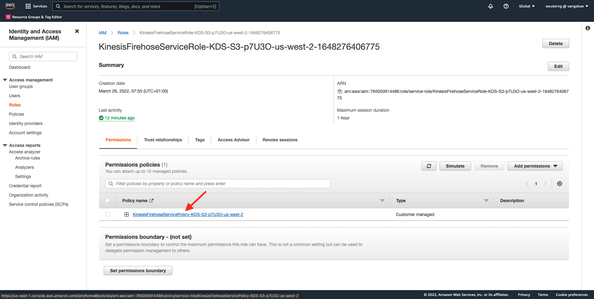
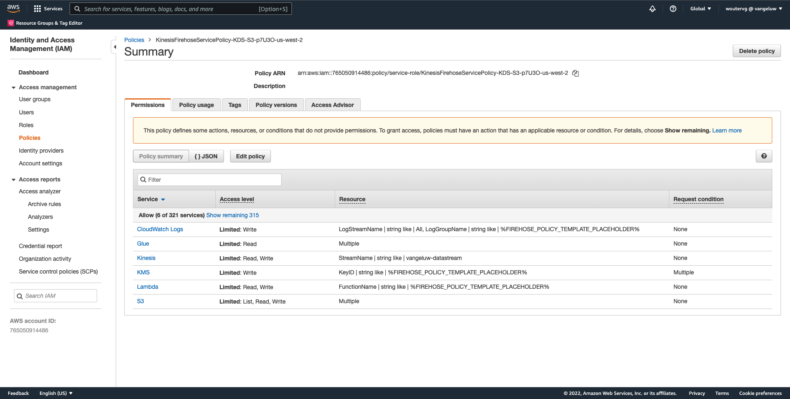
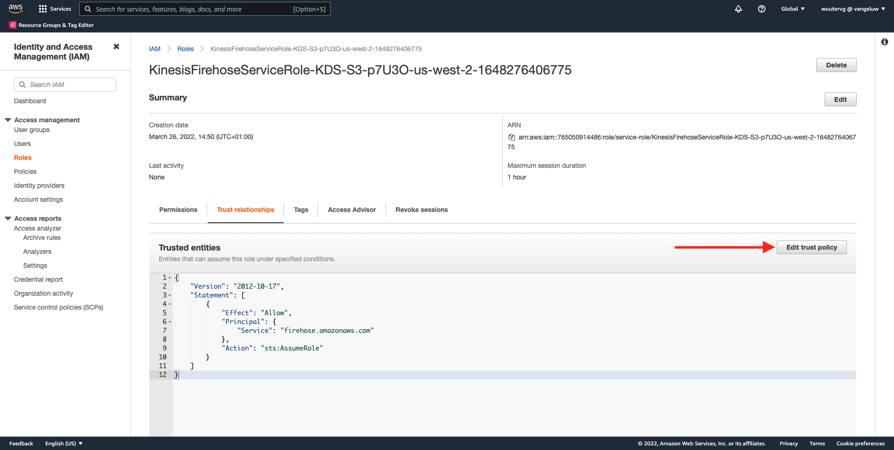
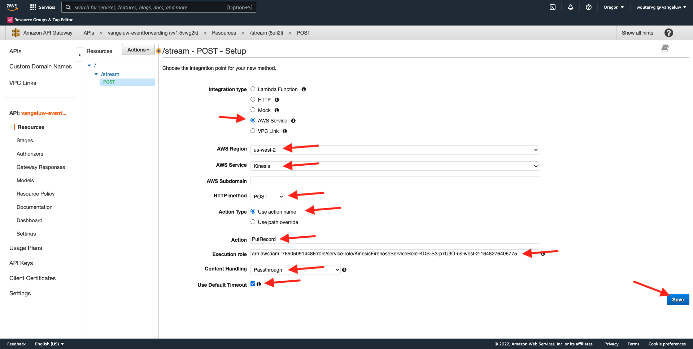
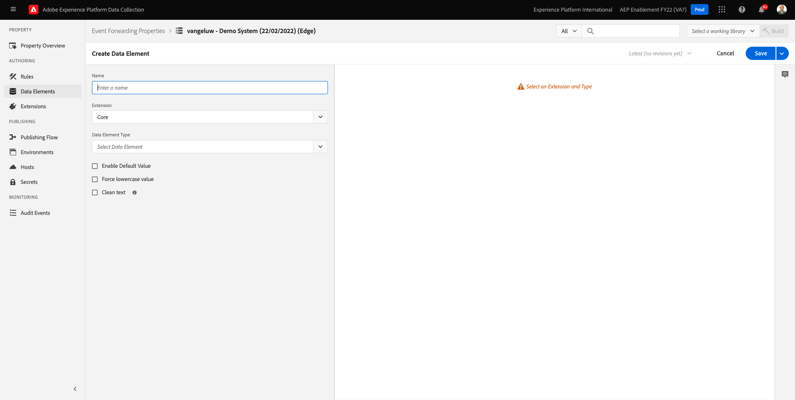
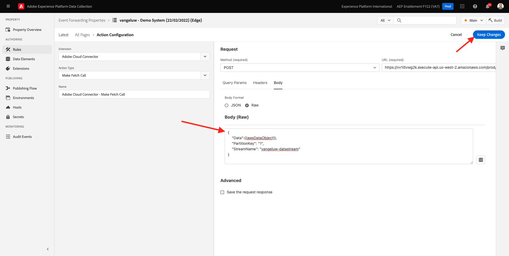

# 14.5 Toekomstige ontwikkelingen in het ecosysteem van AWS

>[!IMPORTANT]
>
>De afronding van deze exercitie is optioneel en er zijn kosten verbonden aan het gebruik van AWS Kinesis. Hoewel AWS een gratis tier-account biedt waarmee u veel services zonder kosten kunt testen en configureren, maakt AWS Kinesis geen deel uit van die gratis tier-account. Om deze exercitie uit te voeren en te testen, zullen er kosten verbonden zijn aan het gebruik van AWS Kinesis.

## Goed te weten

Adobe Experience Platform ondersteunt verschillende Amazon-services als bestemming.
Kinesis en S3 zijn beide [profielen voor exportdoelen](https://experienceleague.adobe.com/docs/experience-platform/destinations/destination-types.html?lang=en) en kan worden gebruikt als onderdeel van Adobe Experience Platform Real-Time CDP.
U kunt hoogwaardige segmentgebeurtenissen en de bijbehorende profielkenmerken eenvoudig in uw eigen systemen invoeren.

In deze notitie leert u hoe u uw eigen Amazon Kinesis-stream instelt om gebeurtenisgegevens te streamen die van het Adobe Experience Platform Edge-ecosysteem naar een locatie voor cloudopslag, zoals Amazon S3, komen. Dit is handig voor het geval u ervaringsgebeurtenissen wilt verzamelen van web- en mobiele eigenschappen en deze in uw database wilt plaatsen voor analyse en operationele rapportage. Datalakes nemen over het algemeen gegevens op een partijwijze met grote dagelijkse dossierinvoer op, zij stellen openbaar http eindpunt niet bloot dat samen met gebeurtenis kon worden gebruikt door:sturen.

Als u de bovenstaande gebruiksgevallen ondersteunt, moeten gestreamde gegevens worden gebufferd of in een wachtrij worden geplaatst voordat ze naar een bestand worden geschreven. Er moet op worden gelet dat het bestand niet wordt geopend voor schrijftoegang in meerdere processen. Het delegeren van deze taak aan toegewijde systemen is ideaal om mooi te schalen en tegelijk een hoog niveau van dienstverlening te garanderen, daar komt Kinesis bij.

Amazon Kinesis Data Streams richt zich op het opnemen en opslaan van gegevensstromen. Kinesis Data Firehose richt zich op het leveren van gegevensstromen om doelen te selecteren, zoals S3 emmers.

Als onderdeel van deze oefening zult u...

- Een basisconfiguratie van een Kinesis-gegevensstroom uitvoeren
- Een leveringsstream van Fireworks maken en S3-emmertje gebruiken als doel
- Amazon API-gateway configureren als een rest-API-eindpunt om uw gebeurtenisgegevens te ontvangen
- Raw-gebeurtenisgegevens doorsturen van Adobe Edge naar uw Kinesis-stroom

## 14.5.1 Uw AWS S3-emmertje configureren

Ga naar [https://console.aws.amazon.com](https://console.aws.amazon.com) en meld u aan met de Amazon-account die u eerder hebt gemaakt.


Nadat u zich hebt aangemeld, wordt u omgeleid naar de **AWS Management Console**.


In de **Services zoeken** menu, zoeken naar **s3**. Klik op het eerste zoekresultaat: **S3 - Schaalbare opslag in de cloud**.


Dan zie je de **Amazon S3** homepage. Klikken **Emmertje maken**.


In de **Emmertje maken** scherm, moet u twee dingen vormen:

- Naam: de naam gebruiken `eventforwarding---demoProfileLdap--`. In deze oefening is de naam van de emmertje bijvoorbeeld **aepmodulertcdpvangeluw**
- Regio: de regio gebruiken **EU (Frankfurt)**


Laat alle andere standaardinstellingen ongewijzigd. Omlaag schuiven en klikken **Emmertje maken**.


Vervolgens ziet u dat uw emmer is gemaakt en wordt deze omgeleid naar de startpagina van Amazon S3.


## 14.5.2 Uw AWS Kinesis-gegevensstroom configureren

In de **Services zoeken** menu, zoeken naar **kinesis**. Klik op het eerste zoekresultaat: **Kinesis - Werken met realtime streaminggegevens**.


Selecteren **Kinesis-gegevensstromen**. Klikken **Gegevensstroom maken**.


Voor de **Naam gegevensstroom**, gebruik `--demoProfileLdap---datastream`.


U hoeft de andere instellingen niet te wijzigen. Omlaag schuiven en klikken **Gegevensstroom maken**.


Dan zie je dit. Zodra uw gegevensstroom met succes wordt gecreeerd, kunt u zich aan de volgende oefening bewegen.


## 14.5.3 Configureer uw AWS Firehose Delivery Stream

In de **Services zoeken** menu, zoeken naar **kinesis**. Klikken **Kinesis Data Firehose**.


Klikken **Leveringsstroom maken**.


Voor **Bron**, selecteert u **Amazon Kinesis-gegevensstromen**. Voor **Doel**, selecteert u **Amazon S3**. Klikken **Bladeren** om uw gegevensstroom te selecteren.


Selecteer de gegevensstroom. Klikken **Kies**.


Dan zie je dit. Onthoud de **Naam leveringsstroom** zoals u het later nodig zult hebben.


Omlaag schuiven totdat u ziet **Doelinstellingen**. Klikken **Bladeren** om uw S3 emmertje te selecteren.


Selecteer uw S3 emmertje en klik **Kies**.


Dan zie je zoiets. Werk de volgende instellingen bij:

- Dynamische partitionering: instellen op **Ingeschakeld**
- Decoratie van meerdere records: instellen op **Uitgeschakeld**
- Nieuw regelscheidingsteken: instellen op **Ingeschakeld**
- Inline parseren voor JSON: instellen op **Ingeschakeld**


Schuif een beetje omlaag, dan ziet u dit. Werk de volgende instellingen bij:

- Dynamische partitioneringssleutels
   - Sleutelnaam: **dynamicPartitioningKey**
   - JQ-expressie: **.dynamicPartitioningKey**
- S3-emmervoorvoegsel: Voeg de volgende code toe:

```bash
!{partitionKeyFromQuery:dynamicPartitioningKey}/!{timestamp:yyyy}/!{timestamp:MM}/!{timestamp:dd}/!{timestamp:HH}/}
```

- Uitvoervoorvoegsel S3-emmerfout: instellen op **fout**


Tot slot scrol neer een beetje meer en klik **Leveringsstroom maken**


Na een paar minuten wordt uw leveringsstroom niet gemaakt en **Actief**.


## 14.5.4 Uw AWS IAM-rol configureren

In de **Services zoeken** menu, zoeken naar **iam**. Klikken **API-gateway**.


Klikken **Rollen**.


Zoeken naar uw **KinesisFirehose** rol. Klik erop om het te openen.


Klik op de naam van het machtigingenbeleid om dit te openen.



Klik in het nieuwe scherm dat wordt geopend op **Beleid bewerken**.


Onder **Kinesis** - **Handelingen** ervoor te zorgen dat de **Schrijven** machtigingen voor **PutRecord** is ingeschakeld. Klikken **Revisiebeleid**.


Klikken **Wijzigingen opslaan**.


Dan ben je hier weer. Klikken **Rollen**.



Zoeken naar uw **KinesisFirehose** rol. Klik erop om het te openen.


Ga naar **Relaties vertrouwen** en klik op **Vertrouwensbeleid bewerken**.



Overschrijf het huidige vertrouwensbeleid door deze code te plakken ter vervanging van de bestaande code:

```json
{
	"Version": "2012-10-17",
	"Statement": [
		{
			"Effect": "Allow",
			"Principal": {
				"Service": [
                    "firehose.amazonaws.com",
                    "kinesis.amazonaws.com",
                    "apigateway.amazonaws.com"
                ]
			},
			"Action": "sts:AssumeRole"
		}
	]
}
```

Klikken **Beleid bijwerken**


Dan zie je dit. U moet de **ARN** voor deze rol in de volgende stap.


## 14.5.5 Configureer uw AWS API Gateway

Amazon API Gateway is een AWS-service voor het maken, publiceren, onderhouden, controleren en beveiligen van REST-, HTTP- en WebSocket-API&#39;s op elke schaal. API-ontwikkelaars kunnen API&#39;s maken die toegang krijgen tot AWS of andere webservices en tot gegevens die zijn opgeslagen in de AWS Cloud.

De Kinesis-gegevensstroom wordt nu via een HTTPS-eindpunt beschikbaar gemaakt voor gebruik op internet. Dit kan vervolgens rechtstreeks worden gebruikt door Adobe-services, zoals Gebeurtenis doorsturen.

In de **Services zoeken** menu, zoeken naar **api-gateway**. Klikken **API-gateway**.


Dan zie je zoiets. Klikken **API maken**.


Klikken **Opbouwen** op de **REST API** kaart.


Dan zie je dit. Vul de instellingen als volgt in:

- Kies het protocol: selecteren **REST**
- Nieuwe API maken: selecteren **Nieuwe API**
- Instellingen:
   - API-naam: gebruiken `--demoProfileLdap---eventforwarding`
   - Type eindpunt: selecteren **Regionaal**

Klikken **API maken**.


Dan zie je dit. Klikken **Handelingen** en klik vervolgens op **Resource maken**.


Dan zie je dit. Set **Bronnaam** tot **stream**. Klikken **Resource maken**.


Dan zie je dit. Klikken **Handelingen** en klik vervolgens op **Methode maken**.


Selecteer in het vervolgkeuzemenu de optie **POST** en klik op de knop **v** knop.


Dan zie je dit. Vul de instellingen als volgt in:

- Type integratie: **AWS Service**
- AWS-regio: Selecteer in dit geval het gebied dat wordt gebruikt door uw Kinesis-gegevensstroom: **us-west-2**
- AWS-service: selecteren **Kinesis**
- AWS-subdomein: leeg laten
- HTTP-methode: selecteren **POST**
- Type handeling: selecteren **Handelingsnaam gebruiken**
- Handeling: enter **PutRecord**
- Uitvoerrol: plakken **ARN** van de uitvoeringsrol die wordt gebruikt door uw Kinesis Data Firehose, zoals u in de vorige oefening hebt geleerd
- Inhoud verwerken: selecteren **Passthrough**
- Standaardtime-out gebruiken: selectievakje inschakelen

Klikken **Opslaan**.



Dan zie je dit. Klikken **Integratieverzoek**.


Klikken **HTTP-headers**.


Een beetje omlaag schuiven en klikken **Koptekst toevoegen**.


Set **Naam** tot **Inhoudstype**, set **Toegewezen uit** tot `'application/x-amz-json-1.1'`. Klik op de knop **v** om uw wijzigingen op te slaan.


Dan zie je dit. Voor **Doorhaling aanvragen**, selecteert u **Als er geen sjablonen zijn gedefinieerd (aanbevolen)**. Klik op Volgende **Toewijzingssjabloon toevoegen**.


Onder **Inhoudstype**, enter **application/json**. Klik op de knop **v** om uw wijzigingen op te slaan.


Schuif omlaag om een venster van de coderedacteur te vinden. Plak de onderstaande code in:

```json
{
  "StreamName": "$input.path('StreamName')",
  "Data": "$util.base64Encode($input.json('$.Data'))",
  "PartitionKey": "$input.path('$.PartitionKey')"
}
```

Klikken **Opslaan**.


Blader vervolgens omhoog en klik op **&lt;- Methode uitvoeren** om terug te gaan.


Klikken **TEST**.


Omlaag schuiven en deze code onder plakken **Verzoek**. Klikken **Testen**.

```json
{
  "Data": {
    "message": "Hello World",
    "dynamicPartitioningKey": "v2"
  },
  "PartitionKey": "1",
  "StreamName": "--demoProfileLdap---datastream"
}
```


Dan zie je een vergelijkbaar resultaat:


Dan zie je dit. Klikken **Handelingen** en klik vervolgens op **API implementeren**.


Voor **Implementatiefase**, selecteert u **Nieuw werkgebied**. Als **Werkgebiednaam**, enter **prod**. Klikken **Implementeren**.


Dan zie je dit. Klikken **Wijzigingen opslaan**. FYI: de URL in de afbeelding is de URL waarnaar gegevens worden verzonden (in dit voorbeeld: https://vv1i5vwg2k.execute-api.us-west-2.amazonaws.com/prod).


U kunt de instelling testen met de onderstaande cURL-aanvraag. U hoeft alleen de onderstaande URL te vervangen door de uwe, `https://vv1i5vwg2k.execute-api.us-west-2.amazonaws.com/prod` in dit voorbeeld, en toevoegen `/stream` aan het einde van de URL.

```json
curl --location --request POST 'https://vv1i5vwg2k.execute-api.us-west-2.amazonaws.com/prod/stream' \
--header 'Content-Type: application/json' \
--data-raw '{
    "Data": {
        "userid": "--demoProfileLdap--@adobe.com",
        "firstName":"--demoProfileLdap--",
        "offerName":"10% off on outdoor gears",
        "offerCode": "10OFF-SPRING",
        "dynamicPartitioningKey": "campaign"
    },
    "PartitionKey": "1",
    "StreamName": "--demoProfileLdap---datastream"
}'
```

Plak de bovenstaande bijgewerkte code in een Eindvenster en druk op Enter. Deze reactie is vergelijkbaar met de reactie die je kunt zien tijdens het testen hierboven.


## 14.5.6 Werk uw eigenschap Event Forwarding bij

U kunt nu uw AWS Kinesis-gegevensstroom activeren via AWS API Gateway, zodat u nu uw onbewerkte ervaringsgebeurtenissen naar het AWS-ecosysteem kunt verzenden. Gebruikend de Verbindingen van Real-Time CDP en Gebeurtenis door:sturen, kunt u gebeurtenis nu gemakkelijk toelaten door:sturen aan uw onlangs gecreeerd eindpunt van de Gateway van AWS API.

### 14.5.6.1 Werk uw eigenschap Event Forwarding bij: Een gegevenselement maken

Ga naar [https://experience.adobe.com/#/data-collection/](https://experience.adobe.com/#/data-collection/) en ga naar **Gebeurtenis doorsturen**. Zoek in de eigenschap Event Forwarding en klik erop om deze te openen.


Ga in het linkermenu naar **Gegevenselementen**. Klikken **Gegevenselement toevoegen**.


U zult dan een nieuw gegevenselement zien om te vormen.



Maak de volgende selectie:

- Als de **Naam**, enter **awsDataObject**.
- Als de **Extensie**, selecteert u **Kern**.
- Als de **Type gegevenselement**, selecteert u **Aangepaste code**.

Nu heb je dit. Klikken **&lt;/> Editor openen**.


Plak in de Editor de volgende code op regel 3. Klikken **Opslaan**.

```javascript
const newObj = {...arc.event.xdm, dynamicPartitioningKey: "event_forwarding"}
return JSON.stringify(newObj);
```


>[!NOTE]
>
>In het bovenstaande pad wordt verwezen naar **boog**. **boog** staat voor Adobe Resource Context en **boog** staat altijd voor het hoogste beschikbare voorwerp dat in de context van de Zijde van de Server beschikbaar is. Verrijkingen en transformaties kunnen aan die **boog** object met Adobe Experience Platform Data Collection Server-functies.
>
>In het bovenstaande pad wordt verwezen naar **event**. **event** staat voor een unieke gebeurtenis en Adobe Experience Platform Data Collection Server zal altijd elke gebeurtenis afzonderlijk evalueren. Soms ziet u een verwijzing naar **gebeurtenissen** in de nuttige lading die door de Cliënt van SDK van het Web wordt verzonden, maar in de Gebeurtenis die van de Inzameling van Adobe Experience Platform door:sturen, wordt elke gebeurtenis individueel geëvalueerd.

Dan ben je hier weer. Klikken **Opslaan** of **Opslaan in bibliotheek**.


### 14.5.6.2 Werk uw Adobe Experience Platform-eigenschap van de Server van de gegevensverzameling bij: Uw regel bijwerken

Ga in het linkermenu naar **Regels**. Klik om de regel te openen **Alle pagina&#39;s** die u in een van de vorige oefeningen hebt gemaakt.


Dan zie je dit. Klik op de knop **+** pictogram om een nieuwe handeling toe te voegen.


Dan zie je dit. Maak de volgende selectie:

- Selecteer **Extensie**: **Adobe Cloud Connector**.
- Selecteer **Type handeling**: **Ophaalvraag maken**.

Dat zou u moeten geven **Naam**: **Adobe Cloud Connector - Fetch-gesprek maken**. U zou nu dit moeten zien:


Configureer daarna het volgende:

- Wijzig de aanvraagmethode van GET in **POST**
- Voer de URL in van het eindpunt van de AWS API Gateway dat u in een van de vorige stappen hebt gemaakt en dat er als volgt uitziet: `https://vv1i5vwg2k.execute-api.us-west-2.amazonaws.com/prod/stream`

Dat zou u nu moeten doen. Ga vervolgens naar **Kopteksten**.


Onder kopballen, voeg een nieuwe kopbal met sleutel toe **Inhoudstype** en waarde **application/json**. Ga vervolgens naar **Lichaam**.


Dan zie je dit. Plak de volgende code in het veld **Lichaam (Raw)**. Klikken **Wijzigingen behouden**.

```json
{
    "Data":{{awsDataObject}},
    "PartitionKey": "1",
    "StreamName": "--demoProfileLdap---datastream"
}
```



Dan zie je hier weer zijn. Klikken **Opslaan** of **Opslaan in bibliotheek**.


U hebt nu uw eerste regel in een Gebeurtenis gevormd die bezit door:sturen. Ga naar **Publishing Flow** om uw wijzigingen te publiceren.
Open uw ontwikkelingsbibliotheek door op **Hoofd**.


Klik op de knop **Alle gewijzigde bronnen toevoegen** de knop, waarna u de wijzigingen in het regel- en gegevenselement ziet verschijnen in deze bibliotheek. Klik op Volgende **Opslaan en bouwen voor ontwikkeling**. Uw wijzigingen worden nu geïmplementeerd.


Na een paar minuten zult u zien dat de implementatie klaar is en klaar om te worden getest.


## 14.5.7 Test uw configuratie

Ga naar [https://builder.adobedemo.com/projects](https://builder.adobedemo.com/projects). Nadat je je hebt aangemeld bij je Adobe ID, kun je dit zien. Klik op uw websiteproject om het te openen.


U kunt nu de onderstaande workflow volgen om toegang te krijgen tot de website. Klikken **Integraties**.


Op de **Integraties** pagina, moet u het bezit van de Inzameling van Gegevens selecteren dat in oefening 0.1 werd gecreeerd.


Vervolgens wordt uw demowebsite geopend. Selecteer de URL en kopieer deze naar het klembord.


Open een nieuw Incognito-browservenster.


Plak de URL van uw demowebsite, die u in de vorige stap hebt gekopieerd. Vervolgens wordt u gevraagd u aan te melden met uw Adobe ID.


Selecteer uw accounttype en voltooi het aanmeldingsproces.


Uw website wordt vervolgens geladen in een Incognito-browservenster. Voor elke demonstratie, zult u een vers, incognito browser venster moeten gebruiken om uw demowebsite URL te laden.


Wanneer u uw browser de Mening van de Ontwikkelaar opent, kunt u de verzoeken van het Netwerk zoals hieronder vermeld inspecteren. Wanneer u het filter gebruikt **interageren**, zult u de netwerkverzoeken zien die door de Cliënt van de Inzameling van Gegevens van Adobe Experience Platform naar Adobe Edge worden verzonden.


Als u de onbewerkte lading selecteert, ga naar [https://jsonformatter.org/json-pretty-print](https://jsonformatter.org/json-pretty-print) en plak de lading. Klikken **Mooi maken**. Dan zie je de JSON-lading, de **gebeurtenissen** en **xdm** object. In een van de vorige stappen, toen u het Gegevenselement bepaalde, gebruikte u de verwijzing **arc.event.xdm**, waardoor u de **xdm** object van deze lading.


Overschakelen naar **AWS**. Door uw gegevensstroom te openen en naar de **Toezicht** tab, zult u inkomend verkeer nu zien.


Wanneer u dan uw leveringsstroom opent en in gaat **Toezicht** tab, zult u ook inkomend verkeer zien.


Tot slot wanneer u een blik bij uw S3 emmertje hebt, zult u nu merken dossiers die daar als gevolg van uw gegevensopname worden gecreeerd.


Wanneer u een dergelijk bestand downloadt en opent met een teksteditor, ziet u dat het de XDM-lading bevat van de gebeurtenissen die zijn doorgestuurd.


Volgende stap: [Samenvatting en voordelen](./summary.md)

[Ga terug naar module 14](./aep-data-collection-ssf.md)

[Terug naar alle modules](./../../overview.md)
