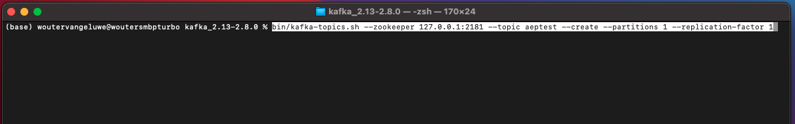

# 15.2 Installeer en configureer uw Kafka-cluster

## 15.2.1 Apache Kafka downloaden

Ga naar [https://kafka.apache.org/downloads](https://kafka.apache.org/downloads) en downloadt u de meest recente uitgebrachte versie. Selecteer in dit geval de meest recente binaire versie **Scala 2,13**.

Je wordt dan naar een spiegelsite gebracht. Klik op de voorgestelde koppeling om Kafka te downloaden.

Een map op uw bureaublad maken met de naam **Kafka_AEP** en plaats het gedownloade bestand in die map.

Een **Terminal** venster door met de rechtermuisknop op de map te klikken en op **Nieuwe terminal bij map**.

Voer dit bevel in uw Eind venster in werking om het gedownloade dossier te decomprimeren:

`tar -xvf kafka_2.13-3.1.0.tgz`

>[!NOTE]
>
>Controleer of de bovenstaande opdracht overeenkomt met de versie van het bestand dat u hebt gedownload. Als uw versie recenter is, zult u het bovengenoemde bevel moeten bijwerken om die versie aan te passen.

U zult dan dit zien:

Na het decomprimeren van dat bestand hebt u nu een map als deze:

En in die folder, zult u deze subdirecteuren zien:

Ga terug naar uw Eind venster. Voer de volgende opdracht in:

`cd kafka_2.13-3.1.0`

>[!NOTE]
>
>Controleer of de bovenstaande opdracht overeenkomt met de versie van het bestand dat u hebt gedownload. Als uw versie recenter is, zult u het bovengenoemde bevel moeten bijwerken om die versie aan te passen.

Voer vervolgens de opdracht in `bin/kafka-topics.sh`.

U zou dan deze reactie moeten zien. Dit betekent dat Kafka correct is geïnstalleerd en dat Java prima werkt. (Herinnering: u hebt Java 8 JDK of Java 11 JDK nodig geïnstalleerd om dit te laten werken!. U kunt zien welke Java-versie u hebt geïnstalleerd met de opdracht `java -version`.)

## 15.2.2 Start Kafka

Om Kafka te starten, moet je Kafka Zookeeper en Kafka starten, in deze volgorde.

Een **Terminal** venster door met de rechtermuisknop op uw map te klikken **kafka_2.13-3.1.0** en klikken **Nieuwe terminal bij map**.

Voer deze opdracht in:

`bin/zookeeper-server-start.sh config/zookeeper.properties`

U zult dan dit zien:

Houd dit venster open terwijl u deze oefeningen doorloopt!

Een andere, nieuwe openen **Terminal** venster door met de rechtermuisknop op uw map te klikken **kafka_2.13-3.1.0** en klikken **Nieuwe terminal bij map**.

Voer deze opdracht in:

`bin/kafka-server-start.sh config/server.properties`

U zult dan dit zien:

Houd dit venster open terwijl u deze oefeningen doorloopt!

## 15.2.3 Een Kafka-onderwerp maken

Een **Terminal** venster door met de rechtermuisknop op uw map te klikken **kafka_2.13-3.1.0** en klikken **Nieuwe terminal bij map**.

Ga dit bevel in om een nieuw Kafka onderwerp met de naam tot stand te brengen **aanvaardbaar**. Dit onderwerp zal voor het testen in deze oefening worden gebruikt.

`bin/kafka-topics.sh --create --topic aeptest --bootstrap-server localhost:9092`

Je ziet dan een vergelijkbare bevestiging:

Ga dit bevel in om een nieuw Kafka onderwerp met de naam tot stand te brengen **aep**. Dit onderwerp zal door de Schakelaar worden gebruikt van het Sink van Adobe Experience Platform die u in de volgende oefeningen zult vormen.

`bin/kafka-topics.sh --create --topic aep --bootstrap-server localhost:9092`

Je ziet dan een vergelijkbare bevestiging:

## 15.2.4 Productieevenementen

Ga terug naar het Eind venster waarin u uw eerste Kafka onderwerp creeerde en het volgende bevel ingaat:

`bin/kafka-console-producer.sh --broker-list 127.0.0.1:9092 --topic aeptest`

Dan zie je dit. Elke nieuwe lijn die door de Enter knoop wordt gevolgd zal in een nieuw bericht resulteren dat naar het onderwerp wordt verzonden **aanvaardbaar**.

Enter `Hello AEP` en drukt u op Enter. Uw eerste gebeurtenis is nu verzonden naar uw lokale instantie Kafka, in het onderwerp **aanvaardbaar**.

Enter `Hello AEP again.` en drukt u op Enter.

Enter `AEP Data Collection is the best.` en drukt u op Enter.

U hebt nu 3 gebeurtenissen in het onderwerp geproduceerd **aanvaardbaar**. Deze gebeurtenissen kunnen nu worden verbruikt door een toepassing die deze gegevens nodig heeft.

Klik op het toetsenbord op `Control` en `C` om de producent te sluiten.

## 15.2.4 Consumptiegebeurtenissen

In het zelfde Eindvenster dat u gebruikte om gebeurtenissen te veroorzaken, ga het volgende bevel in:

`bin/kafka-console-consumer.sh --bootstrap-server 127.0.0.1:9092 --topic aeptest --from-beginning`

U zult dan alle berichten zien die in de vorige oefening voor het onderwerp werden veroorzaakt **aanvaardbaar**, in de consument. Zo werkt Apache Kafka: een producent creëert evenementen in een pijpleiding en een consument verbruikt deze evenementen .

Klik op het toetsenbord op `Control` en `C` om de producent te sluiten.

In deze oefening, hebt u alle grondbeginselen doorlopen om een lokale cluster Kafka op te zetten, een onderwerp van Kafka tot stand te brengen, gebeurtenissen te produceren en gebeurtenissen te verbruiken.

Het doel van deze module is om te simuleren wat er zou gebeuren als een echte organisatie al een Apache Kafka-cluster heeft geïmplementeerd en gegevens van hun Kafka-cluster naar Adobe Experience Platform wil streamen.

Om een dergelijke implementatie te vergemakkelijken, is een Adobe Experience Platform Sink Connector gemaakt die kan worden geïmplementeerd met Kafka Connect. Hier vindt u de documentatie van die Adobe Experience Platform Sink Connector: [https://github.com/adobe/experience-platform-streaming-connect](https://github.com/adobe/experience-platform-streaming-connect).

Bij de volgende oefeningen implementeert u alles wat u nodig hebt om die Adobe Experience Platform Sink Connector vanuit uw eigen lokale Kafka-cluster te gebruiken.

Sluit uw eindvenster.

U hebt deze oefening voltooid.

Volgende stap: [15.3 Het eindpunt van HTTP API in Adobe Experience Platform configureren](./ex3.md)

[Ga terug naar module 15](./aep-apache-kafka.md)

[Terug naar alle modules](../../overview.md)
