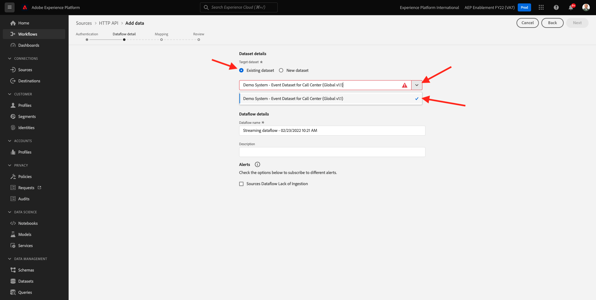

# 15.3 Het HTTP API-streamingeindpunt in Adobe Experience Platform configureren

Voordat u de Adobe Experience Platform Sink Connector kunt instellen in Kafka, moet u een HTTP API Source Connector maken in Adobe Experience Platform. De URL voor het HTTP API-streamingeindpunt is vereist voor het instellen van de Adobe Experience Platform Sink Connector.

Als u een HTTP API Source Connector wilt maken, meldt u zich aan bij Adobe Experience Platform door naar deze URL te gaan: [https://experience.adobe.com/platform](https://experience.adobe.com/platform).

Na het aanmelden landt je op de homepage van Adobe Experience Platform.

Voordat u verdergaat, moet u een **sandbox**. De sandbox die moet worden geselecteerd, krijgt een naam ``--aepSandboxId--``. U kunt dit doen door op de tekst te klikken **[!UICONTROL Productieproduct]** in de blauwe lijn boven op het scherm. Na het selecteren van de aangewezen zandbak, zult u de het schermverandering zien en nu bent u in uw specifieke zandbak.

Ga in het linkermenu naar **Bronnen** en naar beneden schuiven in het dialoogvenster **Broncatalogus** tot u ziet **HTTP-API**. Klikken **Gegevens toevoegen**.

Klikken **Nieuwe account**. Gebruiken `--demoProfileLdap-- - Kafka` als de naam voor uw HTTP API-verbinding, in dit geval **vangeluw - Kafka**. Selectievakje inschakelen voor **XDM-compatibel**. Klikken **Verbinden met bron**.

U ziet dit dan en klikt op **Volgende**.

Selecteren **Bestaande gegevensset**, opent u het vervolgkeuzemenu. De dataset zoeken en selecteren **Het Systeem van de manifestatie - de Dataset van de Gebeurtenis voor het Centrum van de Vraag (Globale v1.1)**.

Klik op **Next**.

Klik op **Next**.

Klikken **Voltooien**.

U zult dan een overzicht van de HTTP API BronSchakelaar zien u enkel creeerde.

U moet de **Streaming eindpunt** URL, die eruitziet zoals hieronder, zoals u het in de volgende oefening zult nodig hebben.

`https://dcs.adobedc.net/collection/d282bbfc8a540321341576275a8d052e9dc4ea80625dd9a5fe5b02397cfd80dc`

U hebt deze oefening voltooid.

Volgende stap: [15.4 Kafka Connect en de Adobe Experience Platform Sink Connector installeren en configureren](./ex4.md)

[Ga terug naar module 15](./aep-apache-kafka.md)

[Terug naar alle modules](../../overview.md)
