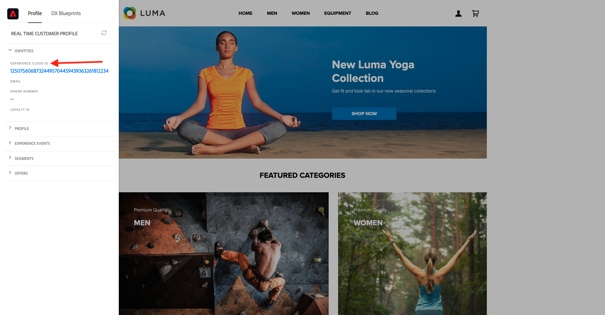
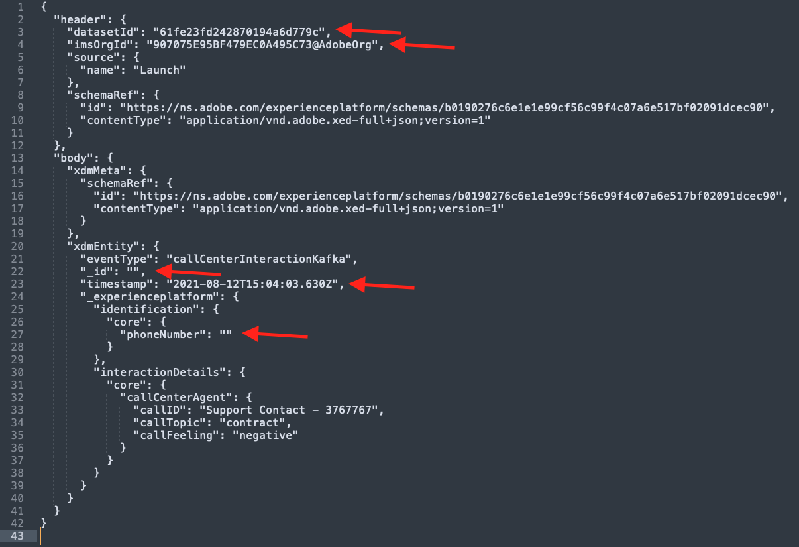
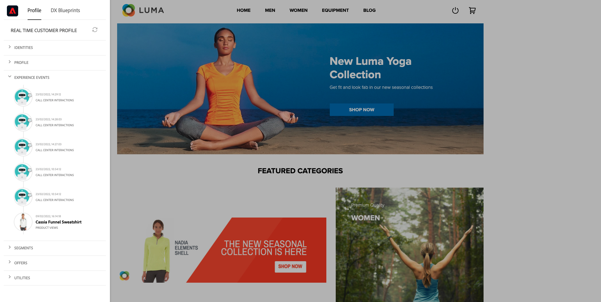
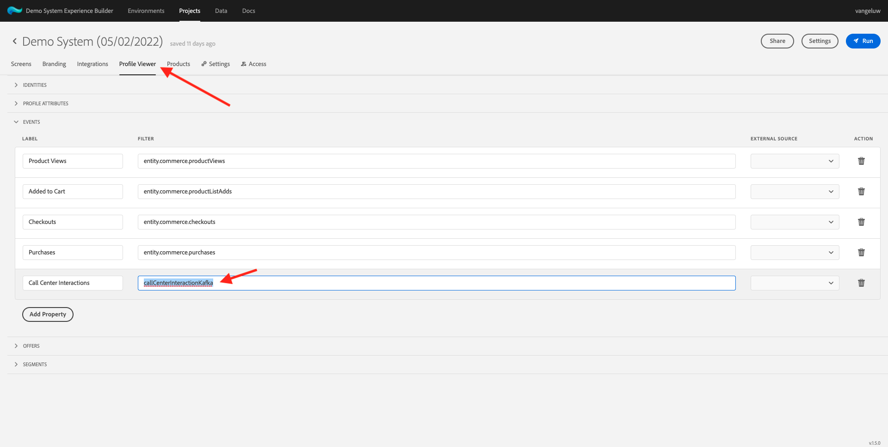

# 15.4 Kafka Connect en de Adobe Experience Platform Sink Connector installeren en configureren

## 15.4.1 Download de Adobe Experience Platform Sink Connector

Ga naar [https://github.com/adobe/experience-platform-streaming-connect/releases](https://github.com/adobe/experience-platform-streaming-connect/releases) en download de nieuwste officiële release van de Adobe Experience Platform Sink Connector.


Plaats het downloadbestand, **streaming-connect-sink-0.0.14-java-11.jar**, op uw bureaublad.


## 15.4.2 Kafka Connect configureren

Ga naar de map op uw bureaublad met de naam **Kafka_AEP** en navigeer naar de map `kafka_2.13-3.1.0/config`.
Open het bestand in die map **connect-distribute.properties** met een teksteditor.


Ga in de Teksteditor naar regel 34 en 35 en stel de velden in `key.converter.schemas.enable` en `value.converter.schemas.enable` tot `false`

```json
key.converter.schemas.enable=false
value.converter.schemas.enable=false
```

Sla uw wijzigingen in dit bestand op.


Ga vervolgens terug naar de map `kafka_2.13-3.1.0` en maakt u handmatig een nieuwe map en geeft u deze een naam `connectors`.


Klik met de rechtermuisknop op de map en klik op **Nieuwe terminal bij map**.


Dan zie je dit. Voer de opdracht in `pwd` om het volledige pad voor die map op te halen. Selecteer het volledige pad en kopieer het naar het klembord.


Ga terug naar de Teksteditor, naar het bestand **connect-distribute.properties** en schuift omlaag naar de laatste regel (lijn 86 in de schermafbeelding). De opmerking van de regel die begint met `# plugin.path=` en u moet het volledige pad naar de genoemde map plakken `connectors`. Het resultaat moet er ongeveer als volgt uitzien:

`plugin.path=/Users/woutervangeluwe/Desktop/Kafka_AEP/kafka_2.13-3.1.0/connectors`

Wijzigingen opslaan in het bestand **connect-distribute.properties** en sluit de Teksteditor.


Kopieer vervolgens de meest recente officiële release van de Adobe Experience Platform Sink Connector die u naar de genoemde map hebt gedownload `connectors`. Het bestand dat u eerder hebt gedownload, krijgt een naam **streaming-connect-sink-0.0.14-java-11.jar**, kunt u de `connectors` map.


Daarna, open een nieuw Eind venster op het niveau van **kafka_2.13-3.1.0** map. Klik met de rechtermuisknop op die map en klik op **Nieuwe terminal bij map**.

Plak deze opdracht in het venster Terminal: `bin/connect-distributed.sh config/connect-distributed.properties` en klik op **Enter**. Met deze opdracht start u Kafka Connect en laadt u de bibliotheek van de Adobe Experience Platform Sink Connector.


Na een paar seconden zie je iets als dit:


## 15.4.3 Maak een Adobe Experience Platform Sink-connector met Postman

U kunt nu communiceren met Kafka Connect via Postman. Hiervoor downloadt u [deze Postman-verzameling](../../assets/postman/postman_kafka.zip) en decomprimeer deze naar uw lokale computer op het bureaublad. U zult dan een dossier hebben dat wordt geroepen `Kafka_AEP.postman_collection.json`.


U moet dit bestand importeren in Postman. Open hiertoe Postman en klik op **Importeren**, slepen en neerzetten `Kafka_AEP.postman_collection.json` in de pop-up en klik op **Importeren**.


U zult dan deze inzameling in het linkermenu van Postman vinden. Klik op de eerste aanvraag. **GET Beschikbare Kafka Connect-connectors** om het te openen.


Dan zie je dit. Klik op blauw **Verzenden** -knop, waarna een lege reactie wordt weergegeven `[]`. De lege reactie is het gevolg van het feit dat er momenteel geen Kafka Connect-connectors zijn gedefinieerd.


Om een schakelaar tot stand te brengen, klik om het tweede verzoek in de inzameling te openen Kafka, **POST AEP-aansluiting voor gootsteen maken**. Dan zie je dit. Op regel 11, waar staat **&quot;aep.eindpunt&quot;: &quot;&quot;**, moet u plakken in HTTP API die eindpunt URL stroomt die u aan het eind van oefening ontving [15,3](./ex3.md). De URL voor het HTTP API Streaming-eindpunt ziet er als volgt uit: `https://dcs.adobedc.net/collection/d282bbfc8a540321341576275a8d052e9dc4ea80625dd9a5fe5b02397cfd80dc`.


Na het plakken van het verzoek, zou het lichaam van uw verzoek als dit moeten kijken. Klik op blauw **Verzenden** om uw schakelaar te creëren. U krijgt een directe reactie van de verwezenlijking van uw schakelaar.


Klik op de eerste aanvraag. **GET Beschikbare Kafka Connect-connectors** om het opnieuw te openen en te klikken op blauw **Verzenden** nogmaals. U ziet nu dat er een Kafka Connect-aansluiting is gemaakt.


Vervolgens opent u het derde verzoek in de verzameling Kafka. **Status Kafka Connect-aansluiting GET controleren**. Klik op blauw **Verzenden** dan krijgt u een reactie zoals hieronder, die verklaart dat de schakelaar loopt.


## 15.4.4 Een ervaringsevenement maken

Een nieuwe **Terminal** venster door met de rechtermuisknop op uw map te klikken **kafka_2.13-3.1.0** en klikken **Nieuwe terminal bij map**.


Voer de volgende opdracht in:

`bin/kafka-console-producer.sh --broker-list 127.0.0.1:9092 --topic aep`


Dan zie je dit. Elke nieuwe lijn die door de Enter knoop wordt gevolgd zal in een nieuw bericht resulteren dat naar het onderwerp wordt verzonden **aep**.


U kunt nu een bericht verzenden dat ertoe zal leiden dat de Adobe Experience Platform Sink Connector wordt verbruikt en dat in real-time in Adobe Experience Platform wordt ingevoerd.

Laten we een demo doen om dit te testen.

Ga naar [https://builder.adobedemo.com/projects](https://builder.adobedemo.com/projects). Nadat je je hebt aangemeld bij je Adobe ID, kun je dit zien. Klik op uw websiteproject om het te openen.


Op de **Schermen** pagina, klikt u op **Uitvoeren**.


Vervolgens wordt uw demowebsite geopend. Selecteer de URL en kopieer deze naar het klembord.


Open een nieuw Incognito-browservenster.


Plak de URL van uw demowebsite, die u in de vorige stap hebt gekopieerd. Vervolgens wordt u gevraagd u aan te melden met uw Adobe ID.


Selecteer uw accounttype en voltooi het aanmeldingsproces.


Uw website wordt vervolgens geladen in een Incognito-browservenster. Voor elke demonstratie, zult u een vers, incognito browser venster moeten gebruiken om uw demowebsite URL te laden.


Klik op het Adobe-logopictogram in de linkerbovenhoek van het scherm om de Profile Viewer te openen.


Bekijk het deelvenster Profielviewer en het realtime klantprofiel met de **Experience Cloud-id** als primaire identificator voor deze momenteel onbekende klant.



Ga naar de pagina Registreren/Aanmelden. Klikken **EEN ACCOUNT MAKEN**.


Vul uw gegevens in en klik op **Registreren** waarna u naar de vorige pagina wordt omgeleid.


Open het deelvenster Profielviewer en ga naar Klantprofiel in realtime. In het deelvenster Profielviewer worden al uw persoonlijke gegevens weergegeven, zoals de zojuist toegevoegde e-mail- en telefoon-id&#39;s.


U kunt bepaalde ervaringsgebeurtenissen zien die gebaseerd zijn op eerdere activiteiten.


Laten we dat veranderen en een Callcenter Experience-evenement sturen van Kafka naar Adobe Experience Platform.

Neem de onderstaande voorbeeldervaring op bij het laden van de gebeurtenis en kopieer deze naar een teksteditor.

```json
{
  "header": {
    "datasetId": "61fe23fd242870194a6d779c",
    "imsOrgId": "--aepImsOrgID--",
    "source": {
      "name": "Launch"
    },
    "schemaRef": {
      "id": "https://ns.adobe.com/experienceplatform/schemas/b0190276c6e1e1e99cf56c99f4c07a6e517bf02091dcec90",
      "contentType": "application/vnd.adobe.xed-full+json;version=1"
    }
  },
  "body": {
    "xdmMeta": {
      "schemaRef": {
        "id": "https://ns.adobe.com/experienceplatform/schemas/b0190276c6e1e1e99cf56c99f4c07a6e517bf02091dcec90",
        "contentType": "application/vnd.adobe.xed-full+json;version=1"
      }
    },
    "xdmEntity": {
      "eventType": "callCenterInteractionKafka",
      "_id": "",
      "timestamp": "2022-02-23T09:54:12.232Z",
      "_experienceplatform": {
        "identification": {
          "core": {
            "phoneNumber": ""
          }
        },
        "interactionDetails": {
          "core": {
            "callCenterAgent": {
              "callID": "Support Contact - 3767767",
              "callTopic": "contract",
              "callFeeling": "negative"
            }
          }
        }
      }
    }
  }
}
```

Dan zie je dit. U moet twee velden handmatig bijwerken:

- **_id**: moet u het instellen op een willekeurige id, bijvoorbeeld `--demoProfileLdap--1234`
- **tijdstempel**: de tijdstempel bijwerken naar de huidige datum en tijd
- **phoneNumber**: Voer het phoneNumber in van de account die zojuist op de demo-website is gemaakt. U vindt dit in het deelvenster Profielviewer onder **Identiteiten**.

U moet ook deze velden controleren en mogelijk bijwerken:
- **datasetId**: u moet identiteitskaart van de Dataset voor het systeem van de datasetdemo kopiëren - de Dataset van de Gebeurtenis voor het Centrum van de Vraag (Globale v1.1)
- **imsOrgID**: uw IMS Org ID is `--aepImsOrgId--`

>[!NOTE]
>
>Het veld **_id** moet uniek zijn voor elke gegevensinvoer. Als u meerdere gebeurtenissen maakt, moet u het veld bijwerken **_id** elke keer naar een nieuwe, unieke waarde.



Dan zou je iets als dit moeten hebben:


Kopieer vervolgens de volledige ervaringsgebeurtenis naar het klembord. De witruimte van uw JSON-lading moet worden verwijderd en daarvoor gebruiken we een online tool. Ga naar [http://jsonviewer.stack.hu/](http://jsonviewer.stack.hu/) om dat te doen.


Plak uw ervaringsgebeurtenis in de editor en klik op **Witruimte verwijderen**.


Selecteer vervolgens alle uitvoertekst en kopieer deze naar het klembord.


Ga terug naar uw Eind venster.


Plak de nieuwe lading zonder whitespaces in het Eind venster en klik **Enter**.


Ga vervolgens terug naar uw demowebsite en vernieuw de pagina. U moet nu een ervaringsgebeurtenis in uw profiel zien, onder **Overige gebeurtenissen**, net als hieronder:



>[!NOTE]
>
>Als u de interactie van het vraagcentrum op het paneel van de Kijker van het Profiel wilt verschijnen, moet u het hieronder etiket toevoegen en in uw project filtreren op [https://builder.adobedemo.com/projects](https://builder.adobedemo.com/projects)door naar de tab te gaan **Profielviewer**.



U hebt deze oefening voltooid.

Volgende stap: [Samenvatting en voordelen](./summary.md)

[Ga terug naar module 15](./aep-apache-kafka.md)

[Terug naar alle modules](../../overview.md)
