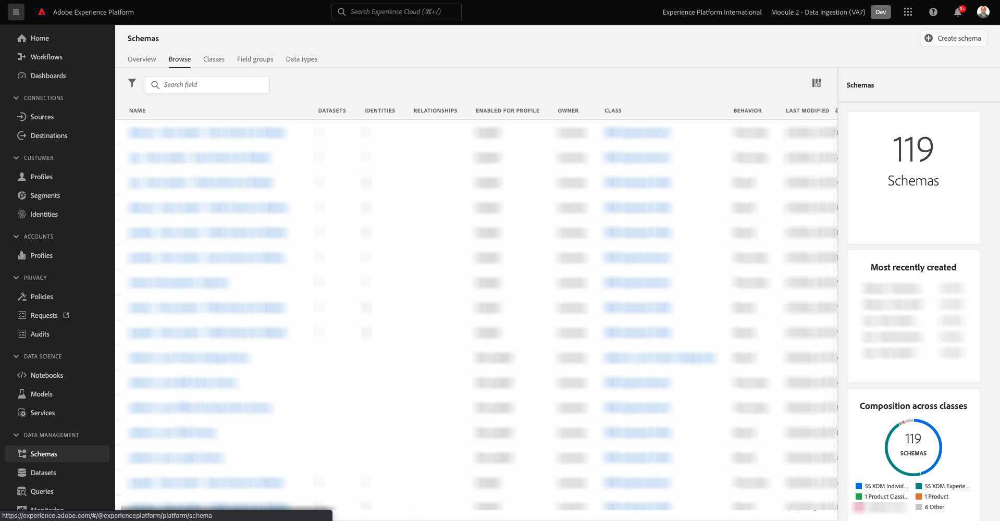
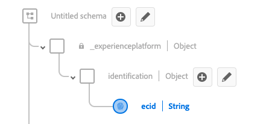

# 2.2 Schema&#39;s configureren en id&#39;s instellen

In deze oefening, zult u de vereiste schema&#39;s XDM vormen om profielinformatie en klantengedrag te classificeren. In elk schema XDM, zult u ook een primaire herkenningsteken moeten vormen om alle informatie te verbinden met.

## Artikel

Voordat u begint met het configureren van XDM-schema&#39;s en het instellen van primaire id&#39;s, moeten we nadenken over de zakelijke context van wat we proberen te doen:

- U wilt gegevens
- U wilt gegevens koppelen aan een klant
- U wilt een progressief, Real-time Profiel van de Klant bouwen

Er zijn twee soorten gegevens die we willen vastleggen:

- Wie is deze klant?
- Wat doet deze klant?

De vraag **Wie is deze klant?** Dit is een zeer open vraag die veel antwoorden heeft. Wanneer uw bedrijf deze vraag wil zien beantwoord, zoekt u demografische informatie zoals Voornaam, Achternaam en Adres. Maar ook voor contactgegevens zoals een e-mailadres of een mobiel telefoonnummer. En ook voor informatie met betrekking tot Taal, OptIn/OptOut en misschien zelfs Profielbeelden. Tot slot, wat u echt moet weten, is hoe wij deze klant in de diverse systemen identificeren die uw bedrijf gebruikt.

Hetzelfde geldt voor de vraag **Wat doet deze klant?**. Het is een zeer open vraag met veel antwoorden. Wanneer uw bedrijf deze vraag wil zien beantwoord, zoekt u om het even welke interactie een klant met om het even welk van uw online en off-line eigenschappen heeft gehad. Welke pagina&#39;s of producten zijn bezocht? Heeft deze klant een product aan zijn winkelwagen toegevoegd of zelfs een object gekocht? Welk apparaat en browser zijn gebruikt om door de website te bladeren? Welk soort informatie zoekt deze klant en hoe kunnen wij dat gebruiken om een heerlijke ervaring aan deze klant te vormen en te leveren? En tot slot, wat wij echt moeten weten, is hoe wij deze klant in de diverse systemen identificeren die uw bedrijf zal gebruiken.

## 2.1.1 - Wie is deze klant?

Het antwoord vastleggen op **Wie is deze klant?** voor uw bedrijf wordt gedaan door Login/Registratie-pagina.

Vanuit Schema-perspectief zien we dit als een **Klasse**. De vraag: **Wie is deze klant?** is iets dat wij in de Klasse bepalen **[!UICONTROL Afzonderlijk XDM-profiel]**.

Dus wanneer u een XDM-schema maakt om het antwoord op **Wie is deze klant?** Eerst en vooral moet u 1 schema maken en definiëren dat naar de klasse verwijst **[!UICONTROL Afzonderlijk XDM-profiel]**.

Als u wilt opgeven welk soort antwoorden aan die vraag kan worden gegeven, moet u definiëren [!UICONTROL Veldgroepen]. [!UICONTROL Veldgroepen] zijn uitbreidingen van de profiel-klasse, en hebben zeer specifieke configuraties. Zo maakt demografische informatie zoals voornaam, achternaam, geslacht en geboortedag deel uit van de [!UICONTROL Veldgroep]: **[!UICONTROL Demografische details]**.

Ten tweede, moet uw bedrijf beslissen hoe te om deze klant te identificeren. In het geval van uw bedrijf, zou het belangrijkste herkenningsteken voor een bekende klant identiteitskaart, zoals bijvoorbeeld een e-mailadres kunnen zijn. Maar technisch gezien zijn er andere manieren om een klant bij uw bedrijf te identificeren, zoals het gebruiken van een mobiel telefoonaantal.
In dit laboratorium, zullen wij het e-mailadres als primair herkenningsteken en het telefoonaantal als secundair herkenningsteken bepalen.

Tot slot is het belangrijk om het kanaal te onderscheiden waarop de gegevens werden gevangen. In dit geval, zullen wij over Registraties van de Website en het schema spreken dat moet worden bepaald moet weerspiegelen **waar** de registratiegegevens zijn vastgelegd. Het kanaal zal ook een belangrijke rol spelen bij het beïnvloeden van welke gegevens worden gevangen. Als dusdanig, is het beste praktijken om schema&#39;s voor elke combinatie kanaal, primaire herkenningsteken en type van verzamelde gegevens te bepalen.

Gebaseerd op het bovenstaande, zult u een Schema in Adobe Experience Platform moeten vormen.

Meld u aan bij Adobe Experience Platform door naar deze URL te gaan: [https://experience.adobe.com/platform](https://experience.adobe.com/platform).

Na het aanmelden landt je op de homepage van Adobe Experience Platform.

Voordat u verdergaat, moet u een **sandbox**. De sandbox die moet worden geselecteerd, krijgt een naam ``--module2sandbox--``. U kunt dit doen door op de tekst te klikken **[!UICONTROL Productieproduct]** in de blauwe lijn boven op het scherm. Na het selecteren van de aangewezen zandbak, zult u de het schermverandering zien en nu bent u in uw specifieke zandbak.

Klik in Adobe Experience Platform op **[!UICONTROL Schemas]** in het menu aan de linkerkant van het scherm. De lijst met beschikbare [!UICONTROL Schemas].

Maak een nieuw schema. Als u een nieuw schema wilt maken, klikt u op de knop **[!UICONTROL + Schema maken]** en selecteert u **[!UICONTROL Afzonderlijk XDM-profiel]**.

Nadat u op de knop **[!UICONTROL + Schema maken]** -knop, wordt een nieuw schema gemaakt en wordt u gevraagd of u **veldgroepen**.

Nu moet u definiëren wat een antwoord op de vraag is **Wie is deze klant?** zou er zo moeten uitzien.
In de inleiding van dit laboratorium, merkten wij op de behoefte aan volgende attributen om een klant te bepalen:

- Demografische informatie zoals voornaam, achternaam en adres
- Contactgegevens zoals een adres, e-mailadres of telefoonnummer
- Andere informatie met betrekking tot Taal, OptIn/OptOut en misschien zelfs profielfoto&#39;s.
- Primaire id voor een klant

Om die informatie deel van uw schema te maken, moet u het volgende toevoegen [!UICONTROL Veldgroepen] naar uw schema:

- Demografische gegevens (demografische informatie)
- Persoonlijke contactgegevens (contactgegevens)
- Details voorkeuren (andere informatie)
- de aangepaste profielidentificatie van uw bedrijf (primaire en secundaire id&#39;s)

In de **[!UICONTROL Veldgroep toevoegen]** scherm, selecteert u de [!UICONTROL Veldgroep] **[!UICONTROL Demografische details]**, **[!UICONTROL Persoonlijke contactgegevens]** en **[!UICONTROL Voorkeursdetails]**.

Klik op de knop **[!UICONTROL Veldgroepen toevoegen]** om de [!UICONTROL Veldgroep] op uw schema.

U hebt nu het volgende:

Nu hebt u een nieuwe [!UICONTROL Veldgroep] om de **[!UICONTROL Id]** gebruikt voor gegevensverzameling. Zoals u in de vorige oefening hebt gezien, is er een concept van Primaire en Secundaire Herkenningstekens. Een primaire id is de belangrijkste, aangezien alle verzamelde gegevens aan deze Identifier zullen worden gekoppeld.

U maakt nu uw eigen aangepaste [!UICONTROL Veldgroep] en als zodanig, zult u uitbreiden [!UICONTROL XDM-schema] om aan de vereisten van uw eigen bedrijf te voldoen.

Klik op de knop **[!UICONTROL + Toevoegen]** knop om te beginnen met het toevoegen van een [!UICONTROL Veldgroep].

In plaats van een bestaande [!UICONTROL Veldgroep], maakt u nu uw eigen [!UICONTROL Veldgroep]. U kunt dat doen door **[!UICONTROL Nieuwe veldgroep maken]**.

U moet nu een **[!UICONTROL Weergavenaam]** en **[!UICONTROL Beschrijving]** voor uw nieuwe [!UICONTROL Veldgroep].

Als naam voor ons schema, zullen wij dit gebruiken:
`--demoProfileLdap-- - Profile Identification Field Group`

Als voorbeeld voor LDAP **[!UICONTROL vangeluw]** Dit moet de naam van het schema zijn:

**[!UICONTROL vangeluw - de Groep van het Gebied van de Identificatie van het Profiel]**

Dat zou je iets dergelijks moeten geven:

Klik op de knop **[!UICONTROL Veldgroepen toevoegen]** om het nieuwe gemaakte [!UICONTROL Veldgroep] op uw schema.

Deze schemastructuur moet nu zijn ingesteld.

Uw nieuwe [!UICONTROL Veldgroep] is nog steeds leeg, dus nu moet u er velden aan toevoegen [!UICONTROL Veldgroep].
In de [!UICONTROL Veldgroep]-list, klik op uw aangepaste [!UICONTROL Veldgroep].

Er worden nu een aantal nieuwe knoppen weergegeven.

Klik op het bovenste niveau van uw schema op de knop **[!UICONTROL + Veld toevoegen]** knop.

Nadat u op de knop **[!UICONTROL + Veld toevoegen]** nu ziet u een nieuwe knop **[!UICONTROL object]** in uw schema. Dit object vertegenwoordigt een aangepaste **[!UICONTROL object]** in uw schema en krijgt de naam van uw Adobe Experience Platform Tenant ID. Je Adobe Experience Platform-huurder is `--aepTenantId--`.

U voegt nu een nieuw object toe onder die huurder. Klik hiertoe op het veld **[!UICONTROL Nieuw veld]** onder het huurobject.

Gebruik de volgende objectdefinities:

- Veldnaam: **[!UICONTROL identificatie]**
- Weergavenaam:  **[!UICONTROL identificatie]**
- Type: **[!UICONTROL Object]**

Klikken **[!UICONTROL Toepassen]** om uw wijzigingen op te slaan.

Na klikken **[!UICONTROL Toepassen]** nu ziet u **[!UICONTROL identificatie]** in het schema.

U voegt nu 3 nieuwe velden toe onder de  **[!UICONTROL identificatie]** object:

- ecid:
   - Veldnaam: **[!UICONTROL ecid]**
   - Weergavenaam:  **[!UICONTROL ecid]**
   - Type: **[!UICONTROL String]**

- emailId
   - Veldnaam: **[!UICONTROL emailId]**
   - Weergavenaam:  **[!UICONTROL emailId]**
   - Type: **[!UICONTROL String]**

- mobiele
   - Veldnaam: **[!UICONTROL mobiele]**
   - Weergavenaam:  **[!UICONTROL mobiele]**
   - Type: **[!UICONTROL String]**

Elk veld wordt gedefinieerd als type **[!UICONTROL String]** en wij zullen deze gebieden als vormen **[!UICONTROL Identiteiten]**. Voor het schema **[!UICONTROL Registratieschema website]**, veronderstellen wij dat een klant altijd door hun e-mailadres zal worden geïdentificeerd, wat betekent dat u het gebied moet vormen **[!UICONTROL emailId]** als **[!UICONTROL primair]** en de andere velden als **[!UICONTROL secundair]** id&#39;s.

Als u de velden wilt toevoegen, klikt u op de knop **[!UICONTROL +]** naast de knop **[!UICONTROL identificatie]** object.

U hebt nu een leeg veld. U moet de bovenstaande 3 velden configureren zoals aangegeven.

Dit is hoe elk gebied voor uw aanvankelijke gebiedsconfiguratie zou moeten kijken.

Klik op de knop **[!UICONTROL +]** naast de knop **[!UICONTROL identificatie]** een object maken om een nieuw veld te maken en de velden in te vullen zoals aangegeven.

- ecid

Schuif omlaag in het dialoogvenster **[!UICONTROL Veldeigenschappen]** totdat u de knop ziet **[!UICONTROL Toepassen]**. Klik op de knop **[!UICONTROL Toepassen]** knop.

Klik op de knop **[!UICONTROL +]** naast de knop **[!UICONTROL identificatie]** een object maken om een nieuw veld te maken en de velden in te vullen zoals aangegeven.

- emailId

Schuif omlaag in het dialoogvenster **[!UICONTROL Veldeigenschappen]** totdat u de knop ziet **[!UICONTROL Toepassen]**. Klik op de knop **[!UICONTROL Toepassen]** knop.

Klik op de knop **[!UICONTROL +]** naast de knop **[!UICONTROL identificatie]** een object maken om een nieuw veld te maken en de velden in te vullen zoals aangegeven.

- mobiele

Schuif omlaag in het dialoogvenster **[!UICONTROL Veldeigenschappen]** totdat u de knop ziet **[!UICONTROL Toepassen]**. Klik op de knop **[!UICONTROL Toepassen]** knop.

U hebt nu drie velden, maar deze velden zijn niet gedefinieerd als **[!UICONTROL Identiteit]**-fields yet.

Deze velden beginnen te definiëren als **[!UICONTROL Identiteit]**-fields, voer de volgende stappen uit:

- Selecteer het veld **[!UICONTROL emailId]**.
- Schuif in de veldeigenschappen aan de rechterkant omlaag totdat u deze ziet **[!UICONTROL Identiteit]**. Schakel het selectievakje in voor **[!UICONTROL Identiteit]**.

   

- Schakel nu het selectievakje in voor **[!UICONTROL Primaire identiteit]**.

   

- Tot slot selecteert u de naamruimte **[!UICONTROL E-mail]** van de lijst van **[!UICONTROL Naamruimten]**. Een naamruimte wordt gebruikt door de identiteitsgrafiek in Adobe Experience Platform om id&#39;s in naamruimten te classificeren en de relatie tussen die naamruimten te definiëren.

   

- Tot slot klikt u op **[!UICONTROL Toepassen]** om uw wijzigingen op te slaan.

   

Vervolgens moet u de andere velden definiëren voor **[!UICONTROL ecid]** en **[!UICONTROL mobiele]** als secundaire id&#39;s.

- Selecteer het veld **[!UICONTROL ecid]**.
- Schuif in de veldeigenschappen aan de rechterkant omlaag totdat u deze ziet **[!UICONTROL Identiteit]**. Schakel het selectievakje in voor **[!UICONTROL Identiteit]**.

   

- Selecteer vervolgens de naamruimte **[!UICONTROL ECID]** van de lijst van **[!UICONTROL Naamruimten]**. A [!UICONTROL Naamruimte] wordt gebruikt door de Grafiek van de Identiteit in Adobe Experience Platform om herkenningstekens in namespaces te classificeren en het verband tussen die namespaces te bepalen.

   

- Klikken **[!UICONTROL Toepassen]** om uw wijzigingen op te slaan.

   

- Selecteer het veld **[!UICONTROL mobiele]**.
- Schuif in de veldeigenschappen aan de rechterkant omlaag totdat u deze ziet **[!UICONTROL Identiteit]**. Schakel het selectievakje in voor **[!UICONTROL Identiteit]**.

   

- Zorg ervoor dat u de naamruimte selecteert **[!UICONTROL Telefoon]** van de lijst van **[!UICONTROL Naamruimten]**. Een naamruimte wordt gebruikt door de identiteitsgrafiek in Adobe Experience Platform om id&#39;s in naamruimten te classificeren en de relatie tussen die naamruimten te definiëren.

   

- Klikken **[!UICONTROL Toepassen]** om uw wijzigingen op te slaan.

   

De **[!UICONTROL identificatie]** Het object moet er nu zo uitzien, waarbij de drie id-velden nu ook een **[!UICONTROL vingerafdruk]** pictogram om aan te tonen dat deze als id&#39;s zijn gedefinieerd.

Geef nu uw schema een naam. Selecteer het veld **Naamloos schema**.

Als naam voor ons schema, zult u dit gebruiken:

`--demoProfileLdap-- - Demo System - Profile Schema for Website`

Vervangen **[!UICONTROL ldap]** door uw specifieke ldap. Als voorbeeld voor LDAP **[!UICONTROL vangeluw]** Dit moet de naam van het schema zijn:

**[!UICONTROL vangeluw - demosysteem - Profielschema voor website]**

Dat zou je iets dergelijks moeten geven:

U hebt nu een schema gedefinieerd, bestaande en nieuwe gekoppelde [!UICONTROL Veldgroepen] en hebben gedefinieerde id&#39;s.

Klikken **[!UICONTROL Opslaan]** om uw wijzigingen op te slaan.

Het laatste wat we hier moeten doen is het schema activeren om te worden gekoppeld aan het **[!UICONTROL Profiel]**.
Door uw schema voor Profiel toe te laten, zorgt u ervoor dat alle gegevens die naar Adobe Experience Platform op dit schema worden verzonden deel van het milieu van het Profiel van de Klant in real time zullen uitmaken, dat ervoor zorgt dat al die gegevens in real time voor het vragen, segmentatie en activering kunnen worden gebruikt.

Om dit te doen, selecteren wij de naam van uw schema.

In het juiste lusje van uw schema, zult u een **[!UICONTROL Schakelen tussen profielen]**, die momenteel is gedeactiveerd.

De [!UICONTROL Profiel] - overschakelen door erop te klikken.

Dit bericht wordt weergegeven:

Klikken **[!UICONTROL Inschakelen]** om dit schema in te schakelen voor Profiel.

Uw schema is nu geconfigureerd als onderdeel van het [!UICONTROL Klantprofiel in realtime].

Tot slot klikt u op **[!UICONTROL Opslaan]** om uw schema op te slaan.

### 2.1.2 - Wat doet deze klant?

Het antwoord op de vraag vastleggen **Wat doet deze klant?** voor uw bedrijf wordt gedaan door bijvoorbeeld een productmening op een productpagina.

Vanuit schemaperspectief bekijken we dit als een **[!UICONTROL Klasse]**. De vraag: **Wat doet deze klant?** is iets dat wij in de klasse hebben bepaald **[!UICONTROL ExperienceEvent]**.

Dus wanneer u een [!UICONTROL XDM-schema] om het antwoord op **Wat doet deze klant?** Eerst en vooral moet u 1 schema maken en definiëren dat naar de klasse verwijst **[!UICONTROL ExperienceEvent]**.

Als u wilt opgeven welk soort antwoorden aan die vraag kan worden gegeven, moet u definiëren [!UICONTROL Veldgroep]. [!UICONTROL Veldgroepen] zijn uitbreidingen van de [!UICONTROL ExperienceEvent]-class, en hebben zeer specifieke configuraties. Zo maakt informatie over welke producten een klant heeft bekeken of aan zijn winkelwagentje heeft toegevoegd deel uit van de [!UICONTROL Veldgroep] **Handelsgegevens**.

Ten tweede, moet uw bedrijf beslissen hoe u het gedrag van deze klant zult identificeren. Omdat we het hebben over interacties op een website, is het mogelijk dat uw bedrijf de klant kent, maar het is evenzeer mogelijk dat een onbekende, anonieme bezoeker actief is op de website. We kunnen dus geen id gebruiken zoals een e-mailadres. In dit geval zal uw bedrijf waarschijnlijk besluiten om de [!UICONTROL Experience Cloud-ID (ECID)] als primaire id.

Tot slot is het belangrijk om het kanaal te onderscheiden waarop de gegevens werden gevangen. In dit geval, zullen wij over de Interacties van de Website en het schema spreken dat moet worden bepaald moet weerspiegelen **waar** de interactiegegevens zijn vastgelegd. Het kanaal zal ook een belangrijke rol spelen bij het beïnvloeden van welke gegevens worden gevangen. Als dusdanig, is het beste praktijken om schema&#39;s voor elke combinatie kanaal, primaire herkenningsteken en type van verzamelde gegevens te bepalen.

Gebaseerd op het bovenstaande, zult u een schema in Adobe Experience Platform moeten vormen.

Na het aanmelden landt je op de homepage van Adobe Experience Platform.

Voordat u verdergaat, moet u een **[!UICONTROL sandbox]**. De [!UICONTROL sandbox] to select heeft een naam ``--module2sandbox--``. U kunt dit doen door op de tekst te klikken **[!UICONTROL Productieproduct]** in de blauwe lijn boven op het scherm. Na het selecteren van de aangewezen zandbak, zult u de het schermverandering zien en nu bent u in uw specifieke zandbak.

Klik in Adobe Experience Platform op **[!UICONTROL Schemas]** in het menu aan de linkerkant van het scherm.

In [!UICONTROL Schemas]Alle bestaande schema&#39;s worden weergegeven.

Maak een nieuw schema. Als u een nieuw schema wilt maken, klikt u op de knop **[!UICONTROL + Schema maken]** en selecteert u **[!UICONTROL XDM ExperienceEvent]**.

Nadat u op de knop **[!UICONTROL + Schema maken]** -knop, wordt een nieuw schema gemaakt en wordt u gevraagd of u **veldgroepen**.

Nu moet u definiëren wat een antwoord op de vraag is **Wat doet deze klant?** zou er zo moeten uitzien.
In de inleiding van dit laboratorium, merkten wij op de behoefte aan volgende attributen om te bepalen wat een klant doet:

- Welke pagina&#39;s of producten zijn bezocht?
- Heeft deze klant een product aan zijn winkelwagen toegevoegd of zelfs een object gekocht?
- Welk apparaat en browser zijn gebruikt om door de website te bladeren?
- Welk soort informatie zoekt deze klant en hoe kunnen wij dat gebruiken om een heerlijke ervaring aan deze klant te vormen en te leveren?
- Primaire id voor een klant

Om die informatie deel van uw schema te maken, moet u het volgende toevoegen [!UICONTROL Veldgroep] naar uw schema:

- Webdetails
- Handelsgegevens
- Omgevingsdetails
- de aangepaste profielidentificatie van uw bedrijf [!UICONTROL Veldgroep] (primaire en secundaire id&#39;s)

In de **[!UICONTROL Veldgroep toevoegen]** scherm, selecteert u de [!UICONTROL Veldgroepen] **[!UICONTROL Webdetails]**, **[!UICONTROL Handelsgegevens]** en **[!UICONTROL Omgevingsdetails]**.

Klik op de knop **[!UICONTROL Veldgroepen toevoegen]** om de Veldgroep aan uw schema toe te voegen.

Dan heb je het volgende:

Nu moet u een nieuwe [!UICONTROL Veldgroep] om de **[!UICONTROL Id]** gebruikt voor gegevensverzameling. Zoals u in de vorige oefening hebt gezien, is er een concept van Primaire en Secundaire Herkenningstekens. Een primaire id is de belangrijkste, aangezien alle verzamelde gegevens aan deze Identifier zullen worden gekoppeld.

U maakt nu uw eigen aangepaste [!UICONTROL Veldgroep] en als zodanig, zult u uitbreiden [!UICONTROL XDM-schema] om aan de vereisten van uw eigen bedrijf te voldoen.

A [!UICONTROL Veldgroep] is gekoppeld aan een [!UICONTROL Klasse], zodat kunt u niet gewoon het eerder gemaakte opnieuw gebruiken [!UICONTROL Veldgroep].

Klik op de knop **[!UICONTROL + Toevoegen]** knop om te beginnen met het toevoegen van een [!UICONTROL Veldgroep].

In plaats van een bestaande [!UICONTROL Veldgroep], maakt u nu uw eigen [!UICONTROL Veldgroep]. U kunt dat doen door **[!UICONTROL Nieuwe veldgroep maken]**.

U moet nu een **[!UICONTROL Weergavenaam]** en **[!UICONTROL Beschrijving]** voor uw nieuwe veldgroep.

Gebruik deze naam als naam voor uw veldgroep:

`--demoProfileLdap-- - ExperienceEvent Identification Field Group`

Als voorbeeld voor LDAP **[!UICONTROL vangeluw]** Dit moet de naam van het schema zijn:

**[!UICONTROL vangeluw - ExperienceEvent-identificatieveldgroep]**

Dat zou je iets dergelijks moeten geven:

Klik op de knop **[!UICONTROL Veldgroep toevoegen]** om het nieuwe gemaakte [!UICONTROL Veldgroep] op uw schema.

U moet nu [!UICONTROL Schema] de structuur.

Uw nieuwe [!UICONTROL Veldgroep] is nog steeds leeg, dus u moet nu velden toevoegen aan die veldgroep.
In de [!UICONTROL Veldgroep]-list, klik op uw aangepaste [!UICONTROL Veldgroep].

Er worden nu een aantal nieuwe knoppen weergegeven.

Op het hoogste niveau van uw Schema, naast uw Schema - naam, klik **[!UICONTROL +]** knop.

Nadat u op de knop **[!UICONTROL +]** nu ziet u een nieuwe knop **[!UICONTROL object]** in uw schema. Dit object vertegenwoordigt een aangepaste **[!UICONTROL object]** in uw [!UICONTROL Schema] en krijgt de naam van je Adobe Experience Platform Tenant ID. Je Adobe Experience Platform-huurder is `--aepTenantId--`.

U voegt nu een nieuw object toe onder die huurder. Klik hiertoe op het veld **[!UICONTROL Nieuw veld]** onder het huurobject.

Gebruik de volgende objectdefinities:

- Veldnaam: **[!UICONTROL identificatie]**
- Weergavenaam:  **[!UICONTROL identificatie]**
- Type: **[!UICONTROL Object]**

Omlaag schuiven en klikken **[!UICONTROL Toepassen]** om uw wijzigingen op te slaan.

Na klikken **[!UICONTROL Toepassen]** nu ziet u **[!UICONTROL identificatie]** in het schema.

U voegt nu 1 nieuw veld toe onder het tabblad  **[!UICONTROL identificatie]** object.

Klik op de knop **[!UICONTROL +]** naast de knop **[!UICONTROL identificatie]** object om een nieuw veld te maken.

Het veld ECID wordt gedefinieerd als type **[!UICONTROL String]** en u zult dit gebied als vormen **[!UICONTROL Identiteit]**. Voor het schema **[!UICONTROL Demosysteem - Gebeurtenisschema voor website]**, veronderstellen wij dat een klant altijd door hun [!UICONTROL ECID], wat betekent dat u het veld moet configureren **[!UICONTROL ECID]** als **primair** id

U hebt nu een leeg veld. U moet het bovenstaande veld configureren zoals aangegeven.

- ecid:

   - Veldnaam: **[!UICONTROL ecid]**
   - Weergavenaam:  **[!UICONTROL ecid]**
   - Type: **[!UICONTROL String]**

Zo ziet het [!UICONTROL ecid]-field moet zorgen voor uw initiële veldconfiguratie:

Omlaag schuiven en klikken **[!UICONTROL Toepassen]**.

U hebt nu een nieuw veld, maar dit veld is niet gedefinieerd als een **[!UICONTROL Identiteit]**-field nog.

Deze velden beginnen te definiëren als **[!UICONTROL Identiteit]**-fields, voer de volgende stappen uit:

- Selecteer het veld **[!UICONTROL ecid]**.
- Schuif in de veldeigenschappen aan de rechterkant omlaag totdat u deze ziet **[!UICONTROL Identiteit]**. Schakel het selectievakje in voor **[!UICONTROL Identiteit]**.

- Schakel nu het selectievakje in voor **[!UICONTROL Primaire identiteit]**.

- Tot slot selecteert u de naamruimte **[!UICONTROL ECID]** van de lijst van **[!UICONTROL Naamruimten]**. A [!UICONTROL Naamruimte] wordt gebruikt door de [!UICONTROL Identiteitsgrafiek] in Adobe Experience Platform om id&#39;s in naamruimten te classificeren en de relatie tussen deze naamruimten te definiëren.

   

- Tot slot klikt u op **[!UICONTROL Toepassen]** om uw wijzigingen op te slaan.

   

De **[!UICONTROL identificatie]** Het object moet er nu zo uitzien, waarbij het ecid-veld nu ook een **vingerafdruk** pictogram om aan te tonen dat deze als id&#39;s zijn gedefinieerd.

Geef nu uw schema een naam. Selecteer het veld **Naamloos schema**.

Als naam voor ons schema, zullen wij dit gebruiken:
`--demoProfileLdap-- - Demo System - Event Schema for Website`

Als voorbeeld voor LDAP **[!UICONTROL vangeluw]** Dit moet de naam van het schema zijn:

**[!UICONTROL vangeluw - demosysteem - Gebeurtenisschema voor website]**

Dat zou je iets dergelijks moeten geven:

Klikken **[!UICONTROL Opslaan]** om uw wijzigingen op te slaan.

Het is belangrijk om op te merken dat wanneer uiteindelijk het opnemen van gegevens tegen dit schema, dat sommige gebieden worden vereist.
De velden **[!UICONTROL _id]** en **[!UICONTROL tijdstempel]** zijn verplichte velden.

- _id moet een unieke id bevatten voor een specifieke gegevensinvoer
- timestamp moet de timestamp van deze hit zijn, in het formaat **[!UICONTROL &quot;YYYY-MM-DDTHH:MM:SSSZ&quot;]**, zoals bijvoorbeeld: **[!UICONTROL &quot;2019-04-08T07:20:000Z&quot;]**

U hebt nu een schema gedefinieerd, bestaande en nieuwe gekoppelde [!UICONTROL Veldgroepen] en hebben gedefinieerde id&#39;s.

Het laatste wat we hier moeten doen is het schema activeren om te worden gekoppeld aan het **[!UICONTROL Profiel]**.
Door uw schema in te schakelen voor [!UICONTROL Profiel], zorgt u ervoor dat alle gegevens die op basis van dit schema naar Adobe Experience Platform worden verzonden deel zullen uitmaken van het Real-time Klantprofiel, dat ervoor zorgt dat al die gegevens in real time voor het vragen, segmenteren en activeren kunnen worden gebruikt.

Om dit te doen, selecteren wij de naam van uw schema.

In het juiste lusje van uw schema, zult u een **[!UICONTROL Profiel] schakelen**, die momenteel is gedeactiveerd.

De [!UICONTROL Profiel] - overschakelen door erop te klikken.

Dit bericht wordt weergegeven:

Klikken **[!UICONTROL Inschakelen]** om dit schema in te schakelen voor Profiel.

Uw schema wordt nu gevormd om deel van het Profiel van de Klant in real time te zijn.

Tot slot klikt u op **[!UICONTROL Opslaan]** om uw schema op te slaan.

U hebt nu bouwschema&#39;s klaar die worden geactiveerd om in het Profiel van de Klant in real time te worden gebruikt.

Laten we eens kijken naar datasets in de volgende oefening.

Volgende stap: [2.3 Gegevensbestanden configureren](./ex3.md)

[Ga terug naar module 2](./data-ingestion.md)

[Terug naar alle modules](../../overview.md)
