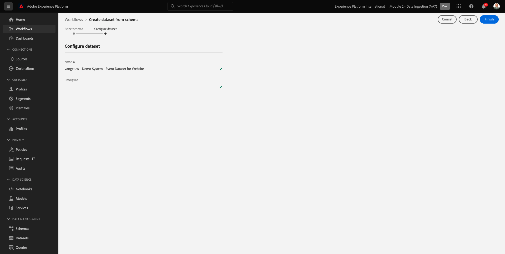

# 2.3 Gegevensbestanden configureren

In deze oefening, zult u de vereiste datasets vormen om profielinformatie en klantengedrag te vangen en op te slaan. Elke dataset die u in dit creeert zal één van de schema&#39;s gebruiken die u in de vorige stap bouwde.

## Artikel

Nadat u het antwoord op de vragen hebt gedefinieerd **Wie is deze klant?** en **Wat doet deze klant?** U moet nu een emmertje maken dat deze informatie gebruikt om gegevens te ontvangen en te valideren die naar Adobe Experience Platform zijn verzonden.

## 2.3.1 - Gegevensbestanden maken

U moet nu twee datasets tot stand brengen:

- 1 dataset om de informatie te vangen die beantwoordt aan **Wie is deze klant?** - vraag.
- 1 dataset om de informatie te vangen die beantwoordt aan **Wat doet deze klant?** - vraag.

Meld u aan bij Adobe Experience Platform door naar deze URL te gaan: [https://experience.adobe.com/platform](https://experience.adobe.com/platform).

Na het aanmelden landt je op de homepage van Adobe Experience Platform.

Voordat u verdergaat, moet u een **[!UICONTROL sandbox]**. De sandbox die moet worden geselecteerd, krijgt een naam ``--module2sandbox--``. U kunt dit doen door op de tekst te klikken **[!UICONTROL Productieproduct]** in de blauwe lijn boven op het scherm. Nadat u de juiste [!UICONTROL sandbox], ziet u de schermwijziging en nu bent u in uw eigen omgeving [!UICONTROL sandbox].

Klik in Adobe Experience Platform op **[!UICONTROL Gegevenssets]** in het menu aan de linkerkant van het scherm.  U zult dan dit zien:

Laten we beginnen met het maken van de gegevensset om de registratiegegevens van de website vast te leggen.

U zou een nieuwe dataset moeten creëren. Om een nieuwe dataset tot stand te brengen, klik op de knoop **[!UICONTROL + Dataset maken]**.

Nadat u op de knop **[!UICONTROL + Dataset maken]** ziet u het volgende scherm.

U moet een dataset van het schema bepalen dat u in de vorige stap bepaalde. Klik op de knop **[!UICONTROL Dataset maken van schema]** - optie.

In het volgende scherm, moet u het schema selecteren dat u in 1 creeerde, `--demoProfileLdap-- - Demo System - Profile Schema for Website`.

Nadat u het schema hebt geselecteerd, klikt u op **[!UICONTROL Volgende]** om door te gaan.

Geef een naam aan uw dataset.

Als naam voor onze dataset, gebruik dit:

`--demoProfileLdap-- - Demo System - Profile Dataset for Website`

Als voorbeeld voor LDAP **[!UICONTROL vangeluw]** Dit moet de naam van het schema zijn:

**[!UICONTROL vangeluw - demosysteem - profielgegevensset voor website]**

Dat zou je iets dergelijks moeten geven:

Klikken **[!UICONTROL Voltooien]** om uw gegevenssetconfiguratie te voltooien.

U ziet nu het volgende:

Ga terug naar de [!UICONTROL Gegevenssets] overzicht. U zult nu de dataset zien u pop - omhoog in het overzicht creeerde.

Daarna, zult u een tweede dataset vormen om websiteinteractie te vangen.

U zou een nieuwe dataset moeten creëren. Om een nieuwe dataset tot stand te brengen, klik op de knoop **[!UICONTROL + Dataset maken]**.

Nadat u op de knop **[!UICONTROL + Dataset maken]** ziet u het volgende scherm.

U moet een dataset van het schema bepalen dat u in de vorige stap bepaalde. Klik op de knop **[!UICONTROL Dataset maken van schema]** - optie.

In het volgende scherm, moet u het schema selecteren dat u in 2.2 creeerde, `--demoProfileLdap-- - Demo System - Event Schema for Website`.

Nadat u het schema hebt geselecteerd, klikt u op **[!UICONTROL Volgende]** om door te gaan.

Geef een naam aan uw dataset.

Als naam voor onze dataset, zullen wij dit gebruiken:

`--demoProfileLdap-- - Demo System - Event Dataset for Website`

Als voorbeeld voor LDAP **[!UICONTROL vangeluw]** Dit moet de naam van het schema zijn:

**[!UICONTROL vangeluw - demosysteem - Dataset voor gebeurtenissen voor website]**

Dat zou je iets dergelijks moeten geven:

Klikken **[!UICONTROL Voltooien]** om uw gegevenssetconfiguratie te voltooien.

U zult dan dit zien:

Ga terug naar de [!UICONTROL Gegevenssets] overzichtsscherm.

U moet nu uw datasets toelaten om deel van Adobe Experience Platform in real time het Profiel van de Klant te maken.

Uw gegevensset openen `--demoProfileLdap--` - Demosysteem - Profielgegevensset voor website door erop te klikken.

Zoek de [!UICONTROL Profiel] schakelt het pictogram aan de rechterkant van het scherm in of uit.

Klik op de knop [!UICONTROL Profiel] schakelen om deze gegevensset in te schakelen voor [!UICONTROL Profiel].

Klik op de knop **[!UICONTROL Inschakelen]**.

Uw gegevensset is nu ingeschakeld voor [!UICONTROL Profiel].

Ga terug naar het overzicht van de datasets en open uw dataset `--demoProfileLdap-- - Demo System - Event Dataset` voor website door erop te klikken.

Zoek de [!UICONTROL Profiel] schakelt het pictogram aan de rechterkant van het scherm in of uit.

Klik op de knop [!UICONTROL Profiel] schakelen om [!UICONTROL Profiel].

Klikken **[!UICONTROL Inschakelen]**.

Uw gegevensset is nu ingeschakeld voor [!UICONTROL Profiel].

Volgende stap: [2.4 Gegevensinname uit offlinebronnen](./ex4.md)

[Ga terug naar module 2](./data-ingestion.md)

[Terug naar alle modules](../../overview.md)
