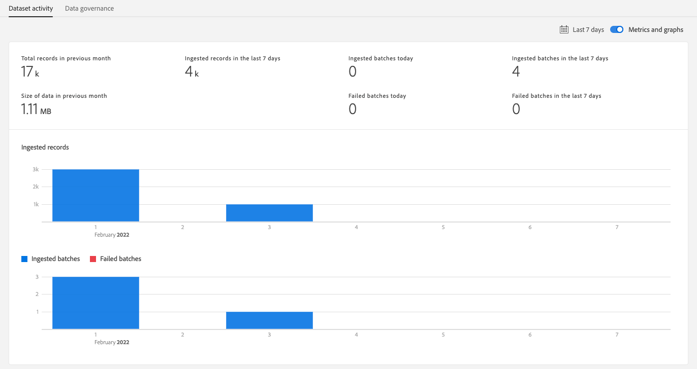
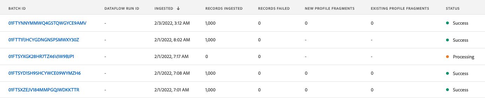

# 2.4 Gegevensinname uit offlinebronnen

In deze oefening, is het doel aan boord externe gegevens zoals de Gegevens van CRM in Platform.

## Leerdoelen

- Leer hoe u testgegevens kunt genereren
- Leer hoe u CSV inneemt
- Leer hoe u de webinterface kunt gebruiken voor gegevensinvoer via Workflows
- Begrijp de eigenschappen van het gegevensbeheer van Experience Platform

## Bronnen

- Mockaroo UI: [https://www.mockaroo.com/](https://www.mockaroo.com/)
- UI Experience Platform: [https://experience.adobe.com/platform/](https://experience.adobe.com/platform/)

## Taken

- Maak een CSV-bestand met de demodatum. Maak gebruik van de beschikbare workflows om het CSV-bestand in Adobe Experience Platform op te nemen.
- Opties voor gegevensbeheer in Adobe Experience Platform begrijpen

## 2.4.1 Creeer uw Dataset van CRM door een hulpmiddel van de gegevensgenerator

Hiervoor hebt u 1000 voorbeeldlijnen van CRM-gegevens nodig.

Open de Mockaroo-sjabloon door naar [https://www.mockaroo.com/12674210](https://www.mockaroo.com/12674210).

In de sjabloon ziet u de volgende velden:

- id
- first_name
- last_name
- email
- sekse
- geboortedatum
- home_latitude
- home_longitude
- country_code
- stad
- land

Al deze gebieden zijn bepaald om gegevens te veroorzaken die met Platform compatibel zijn.

Als u het CSV-bestand wilt genereren, klikt u op de knop **[!UICONTROL Gegevens downloaden]** een CSV-bestand met 1000 regels demo-data.

Open uw CSV-bestand in Microsoft Excel om de inhoud ervan te visualiseren.

Als het CSV-bestand gereed is, kunt u doorgaan met het toewijzen ervan aan XDM.

### 2.4.2 Controleer de CRM-gegevensset aan boord in Adobe Experience Platform

Openen [Adobe Experience Platform](https://experience.adobe.com/platform) en ga naar **[!UICONTROL Gegevenssets]**.

Voordat u verdergaat, moet u een **[!UICONTROL sandbox]**. De sandbox die moet worden geselecteerd, krijgt een naam ``--module2sandbox--``. U kunt dit doen door op de tekst te klikken **[!UICONTROL Productieproduct]** in de blauwe lijn boven op het scherm. Nadat u de juiste [!UICONTROL sandbox], ziet u de schermwijziging en nu bent u in uw eigen omgeving [!UICONTROL sandbox].

Klik in Adobe Experience Platform op **[!UICONTROL Gegevenssets]** in het menu aan de linkerkant van het scherm.

U gaat een gedeelde dataset gebruiken die in dit toelaat wordt gebaseerd. De gedeelde dataset is reeds gecreeerd en genoemd **[!UICONTROL Demosysteem - profielgegevensset voor CRM (Global v1.1)]**.

De dataset openen **[!UICONTROL Demosysteem - profielgegevensset voor CRM (Global v1.1)]**.

Op het overzichtsscherm kunt u drie belangrijke stukken van informatie zien.

Allereerst de [!UICONTROL Gegevensactiviteit] het dashboard toont het totale aantal verslagen van CRM in de dataset en de opgenomen partijen en hun status

Ten tweede kunt u door omlaag te schuiven op de pagina controleren wanneer batches met gegevens zijn ingesloten, hoeveel records zijn ingecheckt en of de batch is ingecheckt. De **[!UICONTROL Batch-id]** is de id voor een specifieke batchtaak en de **[!UICONTROL Batch-id]** is belangrijk aangezien het voor het oplossen van problemen kan worden gebruikt waarom een specifieke partij niet met succes werd ingezien.

Tot slot [!UICONTROL Gegevensset-info] tab bevat belangrijke informatie zoals [!UICONTROL Dataset-id] (opnieuw, belangrijk vanuit een het oplossen van problemenperspectief), de Naam van de Dataset en of de dataset voor Profiel werd toegelaten.

Het belangrijkste plaatsen hier is het verband tussen de dataset en het Schema. Het schema bepaalt welke gegevens kunnen worden opgenomen en hoe die gegevens eruit moeten zien.

In dit geval gebruiken we de **[!UICONTROL Demosysteem - Profielschema voor CRM (Global v1.1)]**, die aan de klasse van **[!UICONTROL Profiel]** en heeft extensies geïmplementeerd, ook wel veldgroepen genoemd.

Als u op de naam van het schema klikt, gaat u naar de [!UICONTROL Schema] overzicht waar u alle velden kunt zien die voor dit schema zijn geactiveerd.

Voor elk schema moet een aangepaste, primaire descriptor zijn gedefinieerd. In het geval van onze dataset van CRM, heeft het schema bepaald dat het gebied **[!UICONTROL crmId]** moet de primaire identificator zijn. Als u een schema wilt maken en dit aan de [!UICONTROL Klantprofiel in realtime], moet u een aangepaste [!UICONTROL Veldgroep] die naar uw primaire descriptor verwijst.

In de bovenstaande schermafbeelding kunt u zien dat uw descriptor zich bevindt in `--aepTenantId--.identification.core.crmId`, die wordt ingesteld als de [!UICONTROL Primaire id], gekoppeld aan de [!UICONTROL namespace] van **[!UICONTROL Demosysteem - CRMID]**.

Elk schema en als zodanig, elke dataset die in zou moeten worden gebruikt [!UICONTROL Klantprofiel in realtime] moet er één hebben [!UICONTROL Primaire id]. Dit [!UICONTROL Primaire id] is de herkenningstekengebruiker door het merk voor een klant in die dataset. In het geval van een dataset van CRM zou het e-mail-adres of identiteitskaart van CRM kunnen zijn, in het geval van een dataset van het Centrum van de Vraag het het mobiele aantal van een klant kunnen zijn.

Het is beste praktijken om een afzonderlijk, specifiek schema voor elke dataset tot stand te brengen en de beschrijver voor elke dataset specifiek te plaatsen om aan te passen hoe de huidige oplossingen die door het merk worden gebruikt werken.

### 2.4.3 Een workflow gebruiken om een CSV-bestand toe te wijzen aan een XDM-schema

Het doel hiervan is om CRM-gegevens in Platform aan boord te hebben. Alle gegevens die in Platform worden opgenomen zouden tegen het specifieke Schema XDM in kaart moeten worden gebracht. Wat u momenteel hebt is een dataset CSV met 1000 lijnen op de ene kant, en een dataset die met een schema aan de andere kant verbonden is. Om dat CSV-bestand in die dataset te laden, moet een toewijzing plaatsvinden. Om deze inventarisatie te vergemakkelijken, moeten we **[!UICONTROL Workflows]** beschikbaar in Adobe Experience Platform.

De [!UICONTROL werkstroom] die we hier zullen gebruiken, is de [!UICONTROL werkstroom] benoemd **[!UICONTROL CSV toewijzen aan XDM-schema]** in de [!UICONTROL Gegevensinname] -menu.

Klik op de knop **[!UICONTROL CSV toewijzen aan XDM-schema]** knop. Klikken **[!UICONTROL Starten]** om het proces te starten.

Op het volgende scherm, moet u een dataset selecteren om uw dossier binnen in te nemen. U kunt kiezen tussen het selecteren van een bestaande gegevensset of het maken van een nieuwe gegevensset. Voor deze oefening, zullen wij bestaande hergebruiken: Selecteer **[!UICONTROL Demosysteem - profielgegevensset voor CRM (Global v1.1)]** zoals hieronder aangegeven, en laat de andere instellingen op de standaardwaarde staan.

Klikken **[!UICONTROL Volgende]** om naar de volgende stap te gaan.

Sleep het CSV-bestand of klik op **[!UICONTROL Bladeren]** en navigeer op uw computer naar uw bureaublad en selecteer uw CSV-bestand.

Nadat u het CSV-bestand hebt geselecteerd, wordt het meteen geüpload en wordt binnen enkele seconden een voorvertoning van het bestand weergegeven.

Klikken **[!UICONTROL Volgende]** om naar de volgende stap te gaan. Het kan een paar seconden duren als het bestand volledig is verwerkt.

U moet nu uw Kopballen van de Kolom CSV met een XDM-bezit in kaart brengen **[!UICONTROL Demosysteem - profielgegevensset voor CRM]**.

Adobe Experience Platform heeft al een aantal voorstellen voor u gedaan door te proberen de [!UICONTROL Bronkenmerken] met de [!UICONTROL Doelschemavelden].

Voor de [!UICONTROL Schema-toewijzingen], Adobe Experience Platform heeft al geprobeerd velden aan elkaar te koppelen. Niet alle voorstellen voor het in kaart brengen zijn echter juist. U moet nu **Doelvelden accepteren** één voor één.

#### geboortedatum

Het veld Bronschema **geboortedatum** moet worden gekoppeld aan het doelveld **person.bornDate**.

#### stad

Het veld Bronschema **stad** moet worden gekoppeld aan het doelveld **homeAddress.city**.

#### land

Het veld Bronschema **land** moet worden gekoppeld aan het doelveld **homeAddress.country**.

#### country_code

Het veld Bronschema **country_code** moet worden gekoppeld aan het doelveld **homeAddress.countryCode**.

#### email

Het veld Bronschema **email** moet worden gekoppeld aan het doelveld **PersonalEmail.address**.

#### crmid

Het veld Bronschema ** crmid* moet aan het doelveld worden gekoppeld **`--aepTenantId--`.identification.core.crmId**.

#### first_name

Het veld Bronschema **first_name** moet worden gekoppeld aan het doelveld **person.name.firstName**.

#### sekse

Het veld Bronschema **sekse** moet worden gekoppeld aan het doelveld **persoon.geslacht**.

#### home_latitude

Het veld Bronschema **home_latitude** moet worden gekoppeld aan het doelveld **homeAddress._schema.latitude**.

#### home_longitude

Het veld Bronschema **home_longitude** moet worden gekoppeld aan het doelveld **homeAddress._schema.longitude**.

#### id

Het veld Bronschema **id** moet worden gekoppeld aan het doelveld **_id**.

#### last_name

Het veld Bronschema **last_name** moet worden gekoppeld aan het doelveld **person.name.lastName**.

U zou nu het volgende moeten hebben:

Klik op de knop **[!UICONTROL Voltooien]** om de workflow te voltooien.

Na klikken **[!UICONTROL Voltooien]**, dan zie je de **Gegevensstroom** en na een paar minuten kunt u het scherm vernieuwen om te zien of de workflow is voltooid. Klik op **Naam doelgegevensset**.

U zult dan de dataset zien waar uw opname heeft verwerkt.

Op de dataset, zult u een zien [!UICONTROL Batch-id] dat nu is ingeslikt , met 1000 records ingegeten en een status van **[!UICONTROL Succes]**.

Klik op de knop **[!UICONTROL Gegevensset voorvertoning]**- om een snelle mening van een kleine steekproef van de dataset te krijgen om ervoor te zorgen dat de geladen gegevens correct zijn.

Zodra het gegeven wordt geladen, kunt u de correcte benadering van het gegevensbeheer voor onze dataset bepalen.

### 2.5.4 Gegevensbeheer toevoegen aan uw gegevensset

Nu uw klantengegevens worden opgenomen, moet u ervoor zorgen dat deze dataset behoorlijk voor gebruik en de uitvoercontrole wordt geregeerd. Klik op de knop **[!UICONTROL Gegevensbeheer]** en ziet u dat u drie typen beperkingen kunt instellen: Contractueel, Identiteit en Gevoelige Gegevens.

U vindt meer informatie over de verschillende labels en hoe deze in de toekomst worden gehandhaafd via het beleidskader op deze koppeling: [https://www.adobe.io/apis/experienceplatform/home/dule/duleservices.html](https://www.adobe.io/apis/experienceplatform/home/dule/duleservices.html)

Laten wij identiteitsgegevens voor de volledige dataset beperken. Houd de muis boven de naam van de gegevensset en klik op het pictogram Potlood om de instellingen te bewerken.

Ga naar **[!UICONTROL Identiteitsgegevens]** en je zult zien dat de **[!UICONTROL I2]** optie wordt gecontroleerd - hierbij wordt ervan uitgegaan dat alle gegevens in deze gegevensset ten minste indirect voor de persoon identificeerbaar zijn.

Klikken **[!UICONTROL Wijzigingen opslaan]** en merkt op dat **[!UICONTROL I2]** is nu ingesteld voor alle gegevensvelden in de gegevensset.

U kunt deze markeringen ook instellen voor afzonderlijke gegevensvelden, zoals de **[!UICONTROL firstName]** waarschijnlijk als een **[!UICONTROL I1]** niveau voor rechtstreeks identificeerbare informatie.

Selecteer het veld **[!UICONTROL firstName]** door het selectievakje in te schakelen en op **[!UICONTROL Regelgevingslabels bewerken]** in de rechterbovenhoek van het scherm.

Ga naar **[!UICONTROL Identiteitsgegevens]** en je zult zien dat de **[!UICONTROL I2]** optie is reeds gecontroleerd (die van de dataset wordt geërft). Het veld firstName heeft ook een veldspecifieke configuratie en wordt ingesteld als **[!UICONTROL I1 - Direct identificeerbare gegevens]**.

Met dit, hebt u met succes en geclassificeerde Gegevens van CRM in Adobe Experience Platform opgenomen.

Volgende stap: [2.5 Gegevenslandingszone](./ex5.md)

[Ga terug naar module 2](./data-ingestion.md)

[Terug naar alle modules](../../overview.md)
