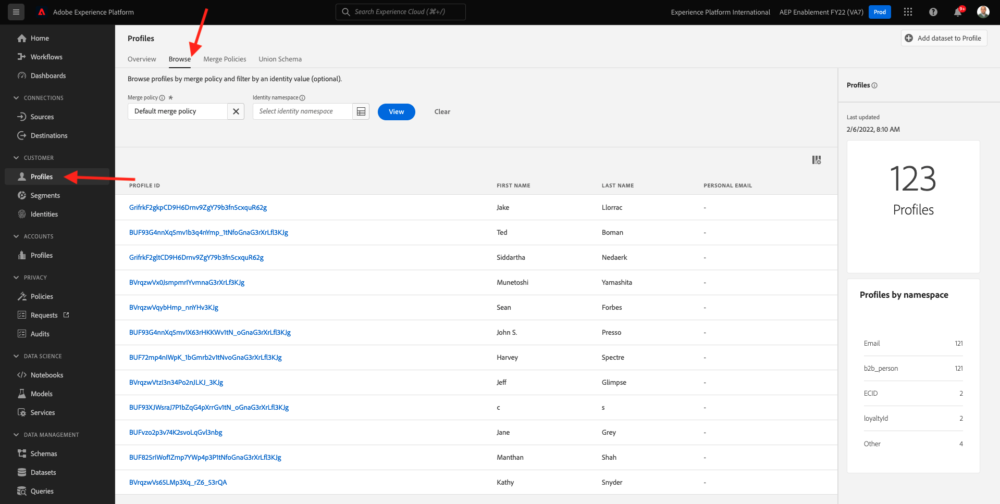
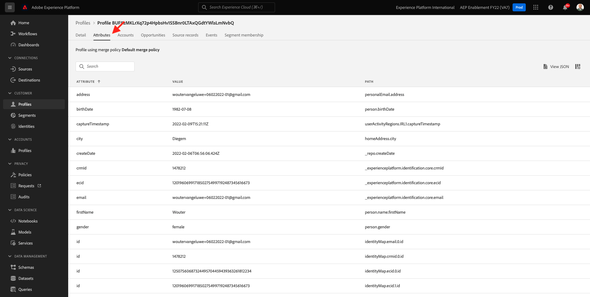

# 3.2 Visualiseer uw eigen Real-time profiel van de Klant - UI

In deze oefening, zult u login aan Adobe Experience Platform en uw eigen Profiel van de Klant in real time in UI bekijken.

## Artikel

In het profiel van de Klant in real time, worden alle profielgegevens getoond naast gebeurtenisgegevens, evenals bestaande segmentlidmaatschap. De getoonde gegevens kunnen van overal, van de toepassingen van Adobe en externe oplossingen komen. Dit is de krachtigste weergave in Adobe Experience Platform, het echte ervaringssysteem van record.

## 3.2.1 De weergave Klantprofiel in Adobe Experience Platform gebruiken

Ga naar [Adobe Experience Platform](https://experience.adobe.com/platform). Na het aanmelden landt je op de homepage van Adobe Experience Platform.

Voordat u verdergaat, moet u een **sandbox**. De sandbox die moet worden geselecteerd, krijgt een naam ``--aepSandboxId--``. U kunt dit doen door op de tekst te klikken **[!UICONTROL Productieproduct]** in de blauwe lijn boven op het scherm. Nadat u de juiste [!UICONTROL sandbox], ziet u de schermwijziging en nu bent u in uw eigen omgeving [!UICONTROL sandbox].

Ga in het linkermenu naar **Profielen** en **Bladeren**.

In het deelvenster Profielviewer op uw website kunt u meerdere identiteiten vinden. Elke identiteit is gekoppeld aan een naamruimte.

In het deelvenster Profielviewer kunt u de volgende combinaties van id&#39;s en naamruimten zien:

| Identiteit | Naamruimte |
|:-------------:| :---------------:|
| Experience Cloud ID (ECID) | 12507560687324495704459439363261812234 |
| E-mailid | woutervangeluwe+06022022-01@gmail.com |
| Mobiel nummer-id | +32473622044+06022022-01 |

In Adobe Experience Platform zijn alle id&#39;s even belangrijk. Voorheen was de ECID de belangrijkste id in de context van Adobe en alle andere id&#39;s waren hiërarchisch gekoppeld aan de ECID. In Adobe Experience Platform is dit niet langer het geval en kan elke id als een primaire id worden beschouwd.

Doorgaans is de primaire id afhankelijk van de context. Als u uw Centrum van de Vraag vraagt, **Wat is de belangrijkste ID?** zij zullen waarschijnlijk antwoorden , **het telefoonnummer!** Maar als u uw team van CRM vraagt, zullen zij antwoorden, **Het e-mailadres!**  Adobe Experience Platform begrijpt deze complexiteit en beheert deze voor u. Elke toepassing, of een toepassing van de Adobe of niet-Adobe, zal met Adobe Experience Platform spreken door te verwijzen naar identiteitskaart zij primair beschouwen. Het werkt gewoon.

Voor het veld **Naamruimte identiteit**, selecteert u **E-mail** en voor het veld **Identiteitswaarde** Voer het e-mailadres in dat u in de vorige exercitie hebt gebruikt om u te registreren. Klikken **Weergave**. Vervolgens ziet u uw profiel in de lijst. Klik op de knop **Profiel-id** om uw profiel te openen.

U ziet nu een overzicht van een paar belangrijke **Profielkenmerken** van uw klantprofiel.

Als u alle beschikbare profielkenmerken voor uw profiel wilt zien, gaat u naar **Attributen**.

Ga naar **Gebeurtenissen**, waar u ingangen voor elke ervaringsgebeurtenis kunt zien die met uw Profiel wordt verbonden.

Tot slot ga naar de menuoptie **Segmentlidmaatschap**. U ziet nu alle segmenten die in aanmerking komen voor dit profiel.

Nu u hebt geleerd hoe u het real-time profiel van een klant kunt bekijken door gebruik te maken van de Adobe Experience Platform-gebruikersinterface, doen we hetzelfde via de API&#39;s door gebruik te maken van Postman en Adobe I/O om te zoeken op Adobe Experience Platform-API&#39;s.

Volgende stap: [3.3 Visualiseer uw eigen real-time klantprofiel - API](./ex3.md)

[Ga terug naar module 3](./real-time-customer-profile.md)

[Terug naar alle modules](../../overview.md)
