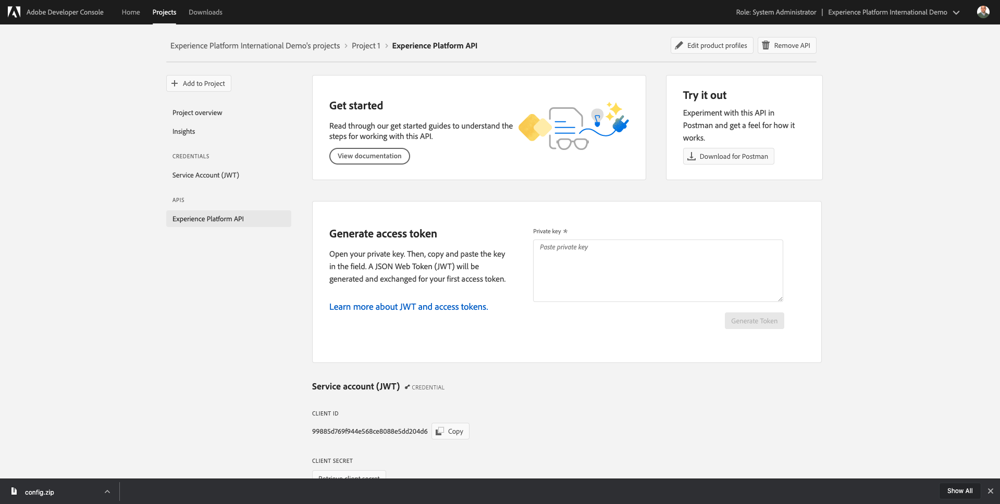
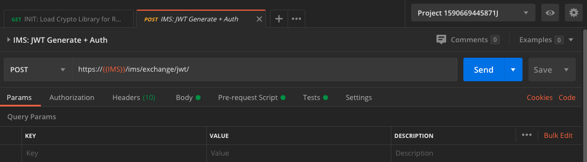
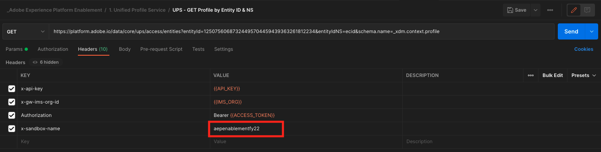
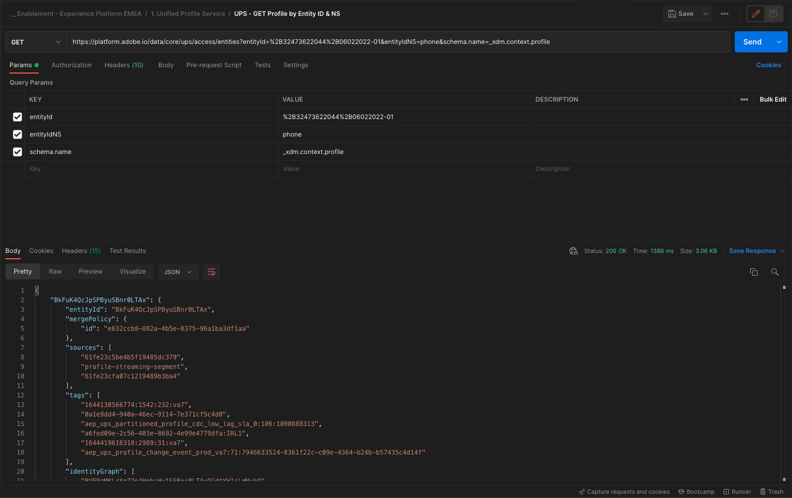
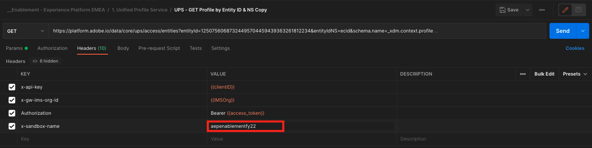

# 3.3 Visualiseer uw eigen real-time klantprofiel - API

In deze oefening, zult u Postman en Adobe I/O gebruiken om Adobe Experience Platform APIs te vragen om uw eigen real-time klantenprofiel te bekijken.

## Artikel

In het profiel van de Klant in real time, worden alle profielgegevens getoond naast gebeurtenisgegevens, evenals bestaande segmentlidmaatschap. De getoonde gegevens kunnen van overal, van de toepassingen van Adobe en externe oplossingen komen. Dit is de krachtigste weergave in Adobe Experience Platform, het ervaringssysteem.

Het profiel van de Klant in real time kan door alle toepassingen van de Adobe, maar ook door externe oplossingen zoals de Centers van de Vraag of in-store clienteling apps worden verbruikt. De manier om dit te doen is die externe oplossingen met Adobe Experience Platform APIs te verbinden.

## 3.3.1 Uw id&#39;s

In het deelvenster Profielviewer op de website kunt u meerdere identiteiten vinden. Elke identiteit is gekoppeld aan een naamruimte.


Op het röntgenpaneel, kunnen wij vier verschillende combinaties identiteitskaart en Namespaces zien:

| Identiteit | Naamruimte |
|:-------------:| :---------------:|
| Experience Cloud ID (ECID) | 12507560687324495704459439363261812234 |
| E-mailid | woutervangeluwe+06022022-01@gmail.com |
| Mobiel nummer-id | +32473622044+06022022-01 |

Onthoud deze id&#39;s voor de volgende stap.

Ga met deze id&#39;s naar Postman.

## 3.3.2 Uw Adobe I/O-project instellen

In deze oefening zult u Adobe I/O vrij intensief aan vraag tegen Platform APIs gebruiken. Volg de onderstaande stappen om Adobe I/O in te stellen.

Ga naar [https://developer.adobe.com/console/home](https://developer.adobe.com/console/home)


Selecteer de juiste Adobe Experience Platform-instantie in de rechterbovenhoek van het scherm. Uw instantie is `--envName--`.


Klikken **Nieuw project maken**.

 of


Selecteren **+ Toevoegen aan project** en selecteert u **API**.


U zult dan dit zien:


Klik op de knop **Adobe Experience Platform** pictogram.


Klikken **Experience Platform-API**.


Klik op **Next**.


U kunt er nu voor kiezen om Adobe I/O uw beveiligingssleutel te laten genereren of een bestaand sleutelpaar te laten uploaden.

Kies **Optie 1 - Een sleutelpaar genereren**.


Klikken **Keypair genereren**.


Je ziet een spinner voor ongeveer 30 seconden.


U zult dan dit zien, en uw geproduceerd sleutelpaar zal als zip dossier worden gedownload: **config.zip**.

Het bestand uitpakken **config.zip** op uw bureaublad ziet u dat het 2 bestanden bevat:


- **certificate_pub.crt** is uw openbare-sleutelcertificaat. Vanuit een veiligheidsperspectief, is dit het certificaat dat vrij aan opstellingsintegratie met online toepassingen wordt gebruikt.
- **private.key** is uw persoonlijke sleutel. Dit mag nooit met iemand worden gedeeld. De persoonlijke sleutel is wat u gebruikt voor verificatie voor uw API-implementatie en moet een geheim zijn. Als u uw Privé Sleutel met iedereen deelt, kunnen zij tot uw implementatie toegang hebben en API misbruiken om kwaadwillige gegevens in Platform in te voeren en alle gegevens te halen die in Platform zitten.


Zorg ervoor dat u de **config.zip** bestand op een veilige locatie. U hebt dit nodig voor de volgende stappen en voor toekomstige toegang tot Adobe I/O- en Adobe Experience Platform-API&#39;s.

Klik op **Next**.


U moet nu de **Productprofiel(en)** voor uw integratie.

Selecteer de vereiste productprofielen.

**FYI**: in uw Adobe Experience Platform-exemplaar hebben de productprofielen een andere naam. U moet ten minste één productprofiel selecteren met de juiste toegangsrechten, die zijn ingesteld in de Adobe Admin Console.


Klikken **Configureerde API opslaan**.


Je ziet een spinner voor een paar seconden.


En daarna zie je je integratie.



Klik op de knop **Downloaden naar Postman** en klik vervolgens op **Serviceaccount (JWT)** om een Postman-omgeving te downloaden (dit kan een paar seconden duren voordat de omgeving is gedownload).


Omlaag schuiven totdat u ziet **Serviceaccount (JWT)**, waar u al uw integratiegegevens kunt vinden die worden gebruikt om de integratie met Adobe Experience Platform te configureren.


Uw IO-project heeft momenteel een algemene naam. Je moet je integratie een vriendelijke naam geven. Klikken op **Project 1** (of soortgelijke naam) zoals aangegeven


Klikken **Project bewerken**.


Voer een naam en beschrijving in voor uw integratie. Als naamgevingsconventie gebruiken we `AEP API --demoProfileLdap--`. Vervang ldap door uw ldap.
Als uw LDAP bijvoorbeeld vangeluw is, worden de naam en beschrijving van uw integratie gewijzigd in AEP API vangeluw.

Enter `AEP API --demoProfileLdap--` als de **Projecttitel**. Klikken **Opslaan**.


Uw Adobe I/O-integratie is nu voltooid.


## 3.3.3 Postman-verificatie naar Adobe I/O

Ga naar [https://www.getpostman.com/](https://www.getpostman.com/).

Klikken op **Aan de slag**.


Download en installeer vervolgens Postman.


Start de toepassing nadat u Postman hebt geïnstalleerd.

In Postman zijn er twee concepten: Omgevingen en verzamelingen.

- Het milieu bevat al uw milieuvariabelen die min of meer samenhangend zijn. In het Milieu, zult u dingen zoals IMSOrg van ons milieu van het Platform, naast veiligheidsgeloofsbrieven zoals uw Privé Sleutel en anderen vinden. Het omgevingsbestand is het bestand dat u tijdens de vorige Adobe I/O-installatie hebt gedownload. De naam ziet er als volgt uit: **service.postman_environment.json**.

- De verzameling bevat een aantal API-aanvragen die u kunt gebruiken. We gebruiken twee verzamelingen
   - 1 Verzameling voor Authentificatie aan Adobe I/0
   - 1 Verzameling voor de oefeningen in deze module
   - 1 inzameling voor de oefeningen in de module van Real-Time CDP, voor de Authoring van de Bestemming

Download het bestand [postman.zip](../../assets/postman/postman_profile.zip) naar uw lokale bureaublad.

In dit **postman.zip** , vindt u de volgende bestanden:

- `_Adobe I-O - Token.postman_collection.json`
- `_Adobe Experience Platform Enablement.postman_collection.json`
- `Destination_Authoring_API.json`

De **postman.zip** Deze 3 bestanden samen met de gedownloade Postman-omgeving van Adobe I/O opslaan en opslaan in een map op uw bureaublad. U hebt deze 4 bestanden nodig in die map:


Ga terug naar Postman. Klikken **Importeren**.


Klikken **Bestanden uploaden**.


Navigeer naar de map op uw bureaublad waarin u de vier gedownloade bestanden hebt uitgepakt. Selecteer deze 4 bestanden tegelijk en klik op **Openen**.


Nadat u hebt geklikt **Openen** Postman geeft u een overzicht van de omgeving en verzamelingen die u wilt importeren. Klikken **Importeren**.


U hebt nu alles wat u nodig hebt in Postman om te gaan communiceren met Adobe Experience Platform via de API&#39;s.

Het eerste wat je moet doen, is ervoor zorgen dat je op de juiste manier geverifieerd bent. Om voor authentiek te worden verklaard, moet u om een toegangstoken verzoeken.

Zorg ervoor dat u het juiste Milieu hebt geselecteerd alvorens om het even welk verzoek uit te voeren. U kunt de momenteel geselecteerde omgeving controleren door de vervolgkeuzelijst Omgeving in de rechterbovenhoek te controleren.

De geselecteerde omgeving moet een naam hebben die vergelijkbaar is met deze:


Klik op de knop **oog** pictogram en klik vervolgens op **Bewerken** om de persoonlijke sleutel in het omgevingsbestand bij te werken.


Dan zie je dit. Alle velden zijn vooraf ingevuld, behalve het veld **PRIVATE_KEY**.


De persoonlijke sleutel is gegenereerd toen u uw Adobe I/O-project hebt gemaakt. Het bestand is gedownload als een ZIP-bestand met de naam **config.zip**. Pak dat ZIP-bestand uit op uw bureaublad.


De map openen **config** en opent u het bestand **private.key** met de gewenste teksteditor.


Vervolgens ziet u iets dat hierop lijkt, en kopieert u alle tekst naar het klembord.


Ga terug naar Postman en plak de persoonlijke sleutel in de velden naast de variabele **PRIVATE_KEY** voor beide kolommen **EERSTE WAARDE** en **HUIDIGE WAARDE**. Klikken **Opslaan**.


Uw Postman-omgeving en -verzamelingen zijn nu geconfigureerd en werken. U kunt nu verifiëren van Postman naar Adobe I/O.

Hiervoor moet u een externe bibliotheek laden die zorgt voor de codering en ontsleuteling van communicatie. Als u deze bibliotheek wilt laden, moet u de aanvraag met de naam uitvoeren **INIT: Cryptobibliotheek laden voor RS256**. Selecteer deze aanvraag in het dialoogvenster **_Adobe I/O - Symbolische verzameling** en je ziet het midden op je scherm.


Klik op blauw **Verzenden** knop. Na een paar seconden, zou u een reactie moeten zien die in wordt getoond **Lichaam** sectie van Postman:


Met de cryptobibliotheek nu geladen, kunnen wij aan Adobe I/O voor authentiek verklaren.

In de **\_Adobe I/O - Symbolische verzameling** selecteert u de aanvraag met de naam **IMS: JWT Genereren + Auth**. Ook hier ziet u de aanvraagdetails midden in het scherm.



Klik op blauw **Verzenden** knop. Na een paar seconden, zou u een reactie moeten zien die in wordt getoond **Lichaam** sectie van Postman:


Als uw configuratie succesvol was, zou u een gelijkaardige reactie moeten zien die de volgende informatie bevat:

| Sleutel | Waarde |
|:-------------:| :---------------:| 
| token_type | **drager** |
| access_token | **eyJ4NXUiOiJpbXNfbmEx...QT7mqZkumN1tdsPEioOEl4087Dg** |
| verloopt_in | **86399973** |

Adobe I/O heeft u een **drager**-token, met een specifieke waarde (dit zeer lange access_token) en een vervalvenster.

De token die we hebben ontvangen, is nu 24 uur geldig. Dit betekent dat na 24 uur, als u Postman wilt gebruiken om aan Adobe I/O voor authentiek te verklaren, u een nieuw teken zult moeten produceren door dit verzoek opnieuw in werking te stellen.

## 3.3.4 Real-time Customer Profile API, Schema: Profiel

Nu kunt u doorgaan en uw eerste verzoek verzenden naar de realtime-API&#39;s van het klantprofiel van Platform.

Zoek in Postman de verzameling **_Adobe Experience Platform Enablement**.


In **1. Unified Profile-service** selecteert u de eerste aanvraag met de naam **UPS - Profiel GET per entiteit-id en NS**.


Voor dit verzoek zijn er drie vereiste variabelen:

| Sleutel | Waarde | Definitie |
|:-------------:| :---------------:| :---------------:| 
| entiteitId | **id** | de specifieke klant-id |
| entiteitIdNS | **namespace** | de specifieke naamruimte die van toepassing is op de id |
| schema.name | **_xdm.context.profile** | het specifieke schema waarvoor u informatie wilt ontvangen |

Dus als u Adobe Experience Platform API&#39;s wilt vragen om u alle profielgegevens voor uw eigen ECID terug te geven, moet u de aanvraag als volgt configureren:

| Sleutel | Waarde |
|:-------------:| :---------------:| 
| entiteitId | **yourECID** |
| entiteitIdNS | **ecid** |
| schema.name | **_xdm.context.profile** |


U moet ook controleren **Koptekst** - velden van uw aanvraag. Ga naar **Kopteksten**. U zult dan dit zien:



| Sleutel | Waarde |
| ----------- | ----------- |
| x-sandbox-name | `--aepSandboxId--` |

>[!NOTE]
>
>U moet de naam opgeven van de Adobe Experience Platform-sandbox die u gebruikt. De naam van uw x-sandbox moet `--aepSandboxId--`.

Klikken **Verzenden** om uw aanvraag naar het Platform te verzenden.

U zou een directe reactie van Platform moeten krijgen, die u iets als dit toont:


Dit is de volledige reactie van Platform:

```javascript
{
    "A28iM3aJBJRbEQpOnUh5HOM9": {
        "entityId": "A28iM3aJBJRbEQpOnUh5HOM9",
        "mergePolicy": {
            "id": "e632ccb8-882a-4b5e-8375-96a1ba3df1aa"
        },
        "sources": [
            "61fe23c5be4b5f19485dc379",
            "profile-streaming-segment",
            "61fe23cfa07c1219489b3ba4"
        ],
        "tags": [
            "1644130566774:1542:232:va7",
            "0a1e9dd4-940a-46ec-9114-7e371cf5c4d0",
            "aep_ups_partitioned_profile_cdc_low_lag_sla_0:106:1090888313",
            "a6fed09e-2c56-403e-8692-4e99e4779dfa:IRL1",
            "1644419616318:2989:31:va7",
            "aep_ups_profile_change_event_prod_va7:71:7946633524-8361f22c-c09e-4364-b24b-b57435c4d14f"
        ],
        "identityGraph": [
            "BUF9zMKLrXq72p4HpbsHv1SSBnr0LTAxQGdtYWlsLmNvbQ",
            "GkicrkFjgmCjUg",
            "GtCbrkFjgkSOFg",
            "A2-AP9zOsakzNTe9Rqwf7Wse",
            "BkFuK4QcJpSPByuSBnr0LTAx",
            "A28jSB484ziuECF3fEoXmFlF",
            "A28iM3aJBJRbEQpOnUh5HOM9"
        ],
        "entity": {
            "_experienceplatform": {
                "individualCharacteristics": {},
                "loyaltyDetails": {
                    "level": "Basic",
                    "points": 0
                },
                "identification": {
                    "core": {
                        "phoneNumber": "+32473622044+06022022-01",
                        "email": "woutervangeluwe+06022022-01@gmail.com",
                        "loyaltyId": "5415776",
                        "ecid": "12019606991718502754997192487345616673",
                        "crmId": "1478212"
                    }
                }
            },
            "personalEmail": {
                "address": "woutervangeluwe+06022022-01@gmail.com"
            },
            "_repo": {
                "createDate": "2022-02-06T06:56:06.424Z"
            },
            "testProfile": true,
            "homeAddress": {
                "postalCode": "1831",
                "city": "Diegem",
                "street1": "Culliganlaan 2F"
            },
            "mobilePhone": {
                "number": "+32473622044+06022022-01"
            },
            "segmentMembership": {
                "ups": {
                    "bc999ded-b6d7-40d4-87a7-d3a280b950e3": {
                        "lastQualificationTime": "2022-02-09T20:38:33Z",
                        "status": "exited"
                    },
                    "23b1cd4e-d62f-44bd-8392-3095a33109c4": {
                        "lastQualificationTime": "2022-02-09T20:38:33Z",
                        "status": "exited"
                    },
                    "f0807704-a1c8-4ac4-85dd-60db2fbf18f1": {
                        "lastQualificationTime": "2022-02-09T20:38:33Z",
                        "status": "existing"
                    }
                }
            },
            "person": {
                "name": {
                    "lastName": "Van Geluwe",
                    "firstName": "Wouter"
                },
                "gender": "female",
                "birthDate": "1982-07-08"
            },
            "userActivityRegions": {
                "IRL1": {
                    "captureTimestamp": "2022-02-09T15:21:11Z"
                }
            },
            "identityMap": {
                "email": [
                    {
                        "id": "woutervangeluwe+06022022-01@gmail.com"
                    }
                ],
                "crmid": [
                    {
                        "id": "1478212"
                    }
                ],
                "ecid": [
                    {
                        "id": "12507560687324495704459439363261812234"
                    },
                    {
                        "id": "12019606991718502754997192487345616673"
                    },
                    {
                        "id": "38335942889672702722192106363935964471"
                    }
                ],
                "phone": [
                    {
                        "id": "+32473622044+06022022-01"
                    }
                ],
                "loyaltyid": [
                    {
                        "id": "5415776"
                    }
                ]
            }
        },
        "lastModifiedAt": "2022-02-09T20:38:36Z"
    }
}
```

Dit zijn momenteel alle beschikbare profielgegevens in Platform voor deze ECID.

U hoeft de ECID niet te gebruiken om profielgegevens aan te vragen via het realtime klantprofiel van het Platform. U kunt elke id in een naamruimte gebruiken om deze gegevens aan te vragen.

Laten we teruggaan naar Postman en doen alsof we het callcenter zijn, en een verzoek naar Platform sturen om de naamruimte van **Telefoon** en uw mobiele nummer.

Zo, als u Platform APIs wilt vragen om u alle informatie van het Profiel voor een specifieke Telefoon terug te geven, zult u het verzoek als volgt moeten vormen:

| Sleutel | Waarde |
|:-------------:| :---------------:| 
| entiteitId | **uw telefoonnummer** |
| entiteitIdNS | **telefoon** (ecid telefonisch vervangen) |
| schema.name | **_xdm.context.profile** |

Als uw telefoonnummer speciale symbolen bevat, zoals **+**, moet u uw volledig telefoonnummer selecteren, een klik met de rechtermuisknop uitvoeren en klikken **EncodeURIComponent**.


Dan heb je het volgende:


U moet ook controleren **Koptekst** - velden van uw aanvraag. Ga naar **Kopteksten**. U zult dan dit zien:


| Sleutel | Waarde |
| ----------- | ----------- |
| x-sandbox-name | `--aepSandboxId--` |

>[!NOTE]
>
>U moet de naam opgeven van de Adobe Experience Platform-sandbox die u gebruikt. De naam van uw x-sandbox moet `--aepSandboxId--`.

Klik op blauw **Verzenden** en verifieer de reactie.



Doe het zelfde ding voor uw e-mailadres door namespace van te specificeren **email** en uw e-mailadres.

Dus als u de API&#39;s van het Platform wilt vragen om u alle profielgegevens voor een specifiek e-mailadres terug te geven, moet u de aanvraag als volgt configureren:

| Sleutel | Waarde |
|:-------------:| :---------------:| 
| entiteitId | **e-mail** |
| entiteitIdNS | **email** (Telefoon vervangen door e-mail) |
| schema.name | **_xdm.context.profile** |

Als je e-mailadres speciale symbolen bevat zoals **+**, moet u uw volledige e-mailadres selecteren, met de rechtermuisknop klikken en klikken **EncodeURIComponent**.


Dan heb je het volgende:


U moet ook controleren **Koptekst** - velden van uw aanvraag. Ga naar **Kopteksten**. U zult dan dit zien:


| Sleutel | Waarde |
| ----------- | ----------- |
| x-sandbox-name | `--aepSandboxId--` |

>[!NOTE]
>
>U moet de naam opgeven van de Adobe Experience Platform-sandbox die u gebruikt. De naam van uw x-sandbox moet `--aepSandboxId--`.

Klik op blauw **Verzenden** en verifieer de reactie.


Dit is een zeer belangrijke vorm van flexibiliteit die aan merken wordt aangeboden. Dit betekent dat elke omgeving een aanvraag naar een Platform kan verzenden met behulp van een eigen id en naamruimte, zonder dat de complexiteit van meerdere naamruimten en id&#39;s wordt begrepen.

Als voorbeeld:

- Het Centrum van de Vraag zal gegevens van Platform verzoeken gebruikend namespace **telefoon**
- Het Systeem van de Loyaliteit zal gegevens van Platform verzoeken gebruikend namespace **email**
- onlinetoepassingen kunnen de naamruimte gebruiken **ecid**

Het Centrum van de Vraag weet niet noodzakelijk welk soort herkenningsteken in het Systeem van de Loyalty wordt gebruikt en het Systeem van de Loyalty weet niet noodzakelijk welk soort herkenningsteken door online toepassingen wordt gebruikt. Elk afzonderlijk systeem kan de informatie gebruiken die ze hebben en begrijpen om de informatie te krijgen die ze nodig hebben, wanneer ze die nodig hebben.

## 3.3.5 Real-time Customer Profile API, Schema: Profiel en ExperienceEvent

Nadat de API&#39;s van het Platform correct zijn gecontroleerd op profielgegevens, doen we nu hetzelfde met ExperienceEvent-gegevens.

Zoek in Postman de verzameling **_Adobe Experience Platform Enablement**.


In **1. Unified Profile-service** selecteert u de tweede aanvraag met de naam **UPS - Profiel en EE van GET-id en NS**.


Voor dit verzoek zijn vier vereiste variabelen:

| Sleutel | Waarde | Definitie |
|:-------------:| :---------------:|  :---------------:| 
| schema.name | **_xdm.context.experienceEvent** | het specifieke schema waarvoor u informatie wilt ontvangen. In dit geval, zoeken wij gegevens die tegen het schema ExperienceEvent in kaart worden gebracht. |
| relatedSchema.name | **_xdm.context.profile** | Terwijl wij gegevens zoeken die tegen het schema ExperienceEvent in kaart worden gebracht, moeten wij een identiteit specificeren waarvoor wij die gegevens willen ontvangen. Het schema dat toegang tot identiteit heeft is het profiel-schema, zodat is relatedSchema hier het profiel-schema. |
| relatedEntiteitId | **id** | de specifieke klant-I D |
| relatedEntiteitIdNS | **namespace** | de specifieke naamruimte die van toepassing is op de id |

Dus als u de API&#39;s van het Platform wilt vragen om u alle profielgegevens voor uw eigen id terug te geven, moet u de aanvraag als volgt configureren:

| Sleutel | Waarde |
|:-------------:| :---------------:| 
| schema.name | **_xdm.context.experienceEvent** |
| relatedSchema.name | **_xdm.context.profile** |
| relatedEntiteitId | **yourECID** |
| relatedEntiteitIdNS | **ecid** |


U moet ook controleren **Koptekst** - velden van uw aanvraag. Ga naar **Kopteksten**. U zult dan dit zien:



| Sleutel | Waarde |
| ----------- | ----------- |
| x-sandbox-name | `--aepSandboxId--` |

>[!NOTE]
>
>U moet de naam opgeven van de Adobe Experience Platform-sandbox die u gebruikt. De naam van uw x-sandbox moet `--aepSandboxId--`.

Klikken **Verzenden** om uw aanvraag naar het Platform te verzenden.

U zou een directe reactie van Platform moeten krijgen, die u iets als dit toont:


Hieronder volgt de volledige reactie van Platform. In dit voorbeeld zijn er acht ExperienceEvents gekoppeld aan de ECID van deze klant. Bekijk hieronder de verschillende variabelen op het verzoek, aangezien wat u hieronder ziet het directe gevolg van uw configuratie in Lancering in vorige oefeningen is.

Wanneer het röntgendeelvenster de ExperienceEvent-informatie weergeeft, gebruikt het de onderstaande payload om de informatie te parseren en op te halen, zoals de productnaam (zoek naar productName in de onderstaande payload) en de URL van de productafbeelding (zoek naar productImageUrl in de onderstaande payload).

```javascript
{
    "_page": {
        "orderby": "timestamp",
        "start": "d686ab8a-2d0c-4722-9ff5-bfc1020b0b55-0",
        "count": 31,
        "next": ""
    },
    "children": [
        {
            "relatedEntityId": "A28iM3aJBJRbEQpOnUh5HOM9",
            "entityId": "d686ab8a-2d0c-4722-9ff5-bfc1020b0b55-0",
            "timestamp": 1644127126596,
            "entity": {
                "environment": {
                    "ipV4": "213.118.129.117",
                    "type": "browser",
                    "browserDetails": {
                        "viewportHeight": 969,
                        "viewportWidth": 1920,
                        "userAgent": "Mozilla/5.0 (Macintosh; Intel Mac OS X 10_15_7) AppleWebKit/537.36 (KHTML, like Gecko) Chrome/98.0.4758.80 Safari/537.36"
                    }
                },
                "web": {
                    "webPageDetails": {
                        "pageViews": {
                            "value": 1
                        },
                        "name": "vangeluw-OCUC",
                        "URL": "https://builder.adobedemo.com/run/vangeluw-OCUC"
                    },
                    "webReferrer": {
                        "URL": "https://adobe.okta.com/"
                    }
                },
                "_experienceplatform": {
                    "interactionDetails": {
                        "core": {
                            "channel": "web"
                        }
                    },
                    "demoEnvironment": {
                        "brandName": "vangeluw-OCUC"
                    },
                    "identification": {
                        "core": {
                            "ecid": "12507560687324495704459439363261812234"
                        }
                    }
                },
                "implementationDetails": {
                    "name": "https://ns.adobe.com/experience/alloy/reactor",
                    "version": "2.8.0+2.9.0",
                    "environment": "browser"
                },
                "identityMap": {
                    "ECID": [
                        {
                            "id": "12507560687324495704459439363261812234",
                            "authenticatedState": "ambiguous",
                            "primary": true
                        }
                    ]
                },
                "eventType": "web.webpagedetails.pageViews",
                "_id": "d686ab8a-2d0c-4722-9ff5-bfc1020b0b55-0",
                "placeContext": {
                    "localTime": "2022-02-06T06:58:46.596+01:00",
                    "localTimezoneOffset": -60
                },
                "device": {
                    "screenOrientation": "landscape",
                    "screenWidth": 1920,
                    "screenHeight": 1080
                },
                "timestamp": "2022-02-06T05:58:46.596Z"
            },
            "lastModifiedAt": "2022-02-06T05:59:48Z"
        },
        {
            "relatedEntityId": "A28iM3aJBJRbEQpOnUh5HOM9",
            "entityId": "919a46bf-a591-4c32-9201-b72250d5f5d9-0",
            "timestamp": 1644127129876,
            "entity": {
                "environment": {
                    "ipV4": "213.118.129.117",
                    "type": "browser",
                    "browserDetails": {
                        "viewportHeight": 969,
                        "viewportWidth": 1920,
                        "userAgent": "Mozilla/5.0 (Macintosh; Intel Mac OS X 10_15_7) AppleWebKit/537.36 (KHTML, like Gecko) Chrome/98.0.4758.80 Safari/537.36"
                    }
                },
                "web": {
                    "webPageDetails": {
                        "pageViews": {
                            "value": 1
                        },
                        "name": "vangeluw-OCUC#",
                        "URL": "https://builder.adobedemo.com/run/vangeluw-OCUC#"
                    },
                    "webReferrer": {
                        "URL": "https://adobe.okta.com/"
                    }
                },
                "_experienceplatform": {
                    "interactionDetails": {
                        "core": {
                            "channel": "web"
                        }
                    },
                    "demoEnvironment": {
                        "brandName": "vangeluw-OCUC"
                    },
                    "identification": {
                        "core": {
                            "ecid": "12507560687324495704459439363261812234"
                        }
                    }
                },
                "implementationDetails": {
                    "name": "https://ns.adobe.com/experience/alloy/reactor",
                    "version": "2.8.0+2.9.0",
                    "environment": "browser"
                },
                "identityMap": {
                    "ECID": [
                        {
                            "id": "12507560687324495704459439363261812234",
                            "authenticatedState": "ambiguous",
                            "primary": true
                        }
                    ]
                },
                "eventType": "web.webpagedetails.pageViews",
                "_id": "919a46bf-a591-4c32-9201-b72250d5f5d9-0",
                "placeContext": {
                    "localTime": "2022-02-06T06:58:49.876+01:00",
                    "localTimezoneOffset": -60
                },
                "device": {
                    "screenOrientation": "landscape",
                    "screenWidth": 1920,
                    "screenHeight": 1080
                },
                "timestamp": "2022-02-06T05:58:49.876Z"
            },
            "lastModifiedAt": "2022-02-06T05:59:48Z"
        },
        {
            "relatedEntityId": "A28iM3aJBJRbEQpOnUh5HOM9",
            "entityId": "41a80489-00d4-446c-b456-8cb19c3f309a-0",
            "timestamp": 1644130597134,
            "entity": {
                "environment": {
                    "ipV4": "213.118.129.117",
                    "type": "browser",
                    "browserDetails": {
                        "viewportHeight": 1001,
                        "viewportWidth": 1920,
                        "userAgent": "Mozilla/5.0 (Macintosh; Intel Mac OS X 10_15_7) AppleWebKit/537.36 (KHTML, like Gecko) Chrome/98.0.4758.80 Safari/537.36"
                    }
                },
                "web": {
                    "webPageDetails": {
                        "pageViews": {
                            "value": 1
                        },
                        "name": "login",
                        "URL": "https://builder.adobedemo.com/run/vangeluw-OCUC/login"
                    },
                    "webReferrer": {
                        "URL": "https://builder.adobedemo.com/run/vangeluw-OCUC/login"
                    }
                },
                "_experienceplatform": {
                    "interactionDetails": {
                        "core": {
                            "channel": "web"
                        }
                    },
                    "demoEnvironment": {
                        "brandName": "vangeluw-OCUC"
                    },
                    "identification": {
                        "core": {
                            "ecid": "12507560687324495704459439363261812234"
                        }
                    }
                },
                "implementationDetails": {
                    "name": "https://ns.adobe.com/experience/alloy/reactor",
                    "version": "2.8.0+2.9.0",
                    "environment": "browser"
                },
                "identityMap": {
                    "ECID": [
                        {
                            "id": "12507560687324495704459439363261812234",
                            "authenticatedState": "ambiguous",
                            "primary": true
                        }
                    ]
                },
                "eventType": "web.webpagedetails.pageViews",
                "_id": "41a80489-00d4-446c-b456-8cb19c3f309a-0",
                "placeContext": {
                    "localTime": "2022-02-06T07:56:37.134+01:00",
                    "localTimezoneOffset": -60
                },
                "device": {
                    "screenOrientation": "landscape",
                    "screenWidth": 1920,
                    "screenHeight": 1080
                },
                "timestamp": "2022-02-06T06:56:37.134Z"
            },
            "lastModifiedAt": "2022-02-06T06:56:38Z"
        },
        {
            "relatedEntityId": "A28jSB484ziuECF3fEoXmFlF",
            "entityId": "8ACC7B6C-2320-4865-B414-3B0CFA01F628",
            "timestamp": 1644419615000,
            "entity": {
                "environment": {
                    "ipV4": "213.118.129.117",
                    "browserDetails": {
                        "userAgent": "Mozilla/5.0 (iPhone; CPU OS 15_3 like Mac OS X; en_BE)"
                    }
                },
                "eventType": "application.login",
                "_id": "8ACC7B6C-2320-4865-B414-3B0CFA01F628",
                "_experienceplatform": {
                    "interactionDetails": {
                        "core": {
                            "channel": "mobile"
                        }
                    },
                    "demoEnvironment": {
                        "brandName": "vangeluw-2L6V"
                    },
                    "identification": {
                        "core": {
                            "ecid": "12019606991718502754997192487345616673",
                            "email": "woutervangeluwe+06022022-01@gmail.com"
                        }
                    }
                },
                "timestamp": "2022-02-09T15:13:35Z",
                "identityMap": {
                    "ECID": [
                        {
                            "id": "12019606991718502754997192487345616673",
                            "authenticatedState": "ambiguous",
                            "primary": true
                        }
                    ]
                }
            },
            "lastModifiedAt": "2022-02-09T15:13:38Z"
        },
        {
            "relatedEntityId": "A28jSB484ziuECF3fEoXmFlF",
            "entityId": "54F68CE5-E9E1-4AD0-91B1-7B607A9285C4",
            "timestamp": 1644419658000,
            "entity": {
                "environment": {
                    "ipV4": "213.118.129.117",
                    "browserDetails": {
                        "userAgent": "Mozilla/5.0 (iPhone; CPU OS 15_3 like Mac OS X; en_BE)"
                    }
                },
                "_experienceplatform": {
                    "interactionDetails": {
                        "core": {
                            "channel": "mobile"
                        }
                    },
                    "demoEnvironment": {
                        "brandName": "vangeluw-2L6V"
                    },
                    "identification": {
                        "core": {
                            "ecid": "12019606991718502754997192487345616673"
                        }
                    }
                },
                "identityMap": {
                    "ECID": [
                        {
                            "id": "12019606991718502754997192487345616673",
                            "authenticatedState": "ambiguous",
                            "primary": true
                        }
                    ]
                },
                "eventType": "commerce.productViews",
                "_id": "54F68CE5-E9E1-4AD0-91B1-7B607A9285C4",
                "commerce": {
                    "productViews": {
                        "value": 1
                    }
                },
                "productListItems": [
                    {
                        "quantity": 1,
                        "productAddMethod": "Mobile",
                        "_experienceplatform": {
                            "core": {
                                "mainCategory": "Women",
                                "productURL": "product1",
                                "imageURL": "https://contentviewer.s3.amazonaws.com/helium/wh08-white_main.jpg"
                            }
                        },
                        "priceTotal": 42,
                        "name": "Cassia Funnel Sweatshirt",
                        "SKU": "product1",
                        "currencyCode": "USD"
                    }
                ],
                "timestamp": "2022-02-09T15:14:18Z"
            },
            "lastModifiedAt": "2022-02-09T15:14:21Z"
        },
        {
            "relatedEntityId": "A2-AP9zOsakzNTe9Rqwf7Wse",
            "entityId": "bfe26684-bc3b-40c5-9fe5-5aba854c3227-0",
            "timestamp": 1644420036035,
            "entity": {
                "environment": {
                    "ipV4": "193.105.139.131",
                    "type": "browser",
                    "browserDetails": {
                        "viewportHeight": 969,
                        "viewportWidth": 1920,
                        "userAgent": "Mozilla/5.0 (Macintosh; Intel Mac OS X 10_15_7) AppleWebKit/537.36 (KHTML, like Gecko) Chrome/98.0.4758.80 Safari/537.36"
                    }
                },
                "web": {
                    "webPageDetails": {
                        "pageViews": {
                            "value": 1
                        },
                        "name": "vangeluw-OCUC",
                        "URL": "https://builder.adobedemo.com/run/vangeluw-OCUC"
                    },
                    "webReferrer": {
                        "URL": "https://adobe.okta.com/"
                    }
                },
                "_experienceplatform": {
                    "interactionDetails": {
                        "core": {
                            "channel": "web"
                        }
                    },
                    "demoEnvironment": {
                        "brandName": "vangeluw-OCUC"
                    },
                    "identification": {
                        "core": {
                            "ecid": "38335942889672702722192106363935964471"
                        }
                    }
                },
                "implementationDetails": {
                    "name": "https://ns.adobe.com/experience/alloy/reactor",
                    "version": "2.8.0+2.9.0",
                    "environment": "browser"
                },
                "identityMap": {
                    "ECID": [
                        {
                            "id": "38335942889672702722192106363935964471",
                            "authenticatedState": "ambiguous",
                            "primary": true
                        }
                    ]
                },
                "eventType": "web.webpagedetails.pageViews",
                "_id": "bfe26684-bc3b-40c5-9fe5-5aba854c3227-0",
                "placeContext": {
                    "localTime": "2022-02-09T16:20:36.035+01:00",
                    "localTimezoneOffset": -60
                },
                "device": {
                    "screenOrientation": "landscape",
                    "screenWidth": 1920,
                    "screenHeight": 1080
                },
                "timestamp": "2022-02-09T15:20:36.035Z"
            },
            "lastModifiedAt": "2022-02-09T15:20:39Z"
        },
        {
            "relatedEntityId": "A2-AP9zOsakzNTe9Rqwf7Wse",
            "entityId": "0480c434-8fcd-4a80-b298-c561276ac989-0",
            "timestamp": 1644420037078,
            "entity": {
                "environment": {
                    "ipV4": "193.105.139.131",
                    "type": "browser",
                    "browserDetails": {
                        "viewportHeight": 969,
                        "viewportWidth": 1920,
                        "userAgent": "Mozilla/5.0 (Macintosh; Intel Mac OS X 10_15_7) AppleWebKit/537.36 (KHTML, like Gecko) Chrome/98.0.4758.80 Safari/537.36"
                    }
                },
                "web": {
                    "webPageDetails": {
                        "pageViews": {
                            "value": 1
                        },
                        "name": "vangeluw-OCUC#",
                        "URL": "https://builder.adobedemo.com/run/vangeluw-OCUC#"
                    },
                    "webReferrer": {
                        "URL": "https://adobe.okta.com/"
                    }
                },
                "_experienceplatform": {
                    "interactionDetails": {
                        "core": {
                            "channel": "web"
                        }
                    },
                    "demoEnvironment": {
                        "brandName": "vangeluw-OCUC"
                    },
                    "identification": {
                        "core": {
                            "ecid": "38335942889672702722192106363935964471"
                        }
                    }
                },
                "implementationDetails": {
                    "name": "https://ns.adobe.com/experience/alloy/reactor",
                    "version": "2.8.0+2.9.0",
                    "environment": "browser"
                },
                "identityMap": {
                    "ECID": [
                        {
                            "id": "38335942889672702722192106363935964471",
                            "authenticatedState": "ambiguous",
                            "primary": true
                        }
                    ]
                },
                "eventType": "web.webpagedetails.pageViews",
                "_id": "0480c434-8fcd-4a80-b298-c561276ac989-0",
                "placeContext": {
                    "localTime": "2022-02-09T16:20:37.078+01:00",
                    "localTimezoneOffset": -60
                },
                "device": {
                    "screenOrientation": "landscape",
                    "screenWidth": 1920,
                    "screenHeight": 1080
                },
                "timestamp": "2022-02-09T15:20:37.078Z"
            },
            "lastModifiedAt": "2022-02-09T15:20:39Z"
        },
        {
            "relatedEntityId": "A2-AP9zOsakzNTe9Rqwf7Wse",
            "entityId": "6b1b3983-6966-4551-a711-6b6e410fd819-0",
            "timestamp": 1644420045993,
            "entity": {
                "environment": {
                    "ipV4": "193.105.139.131",
                    "type": "browser",
                    "browserDetails": {
                        "viewportHeight": 969,
                        "viewportWidth": 1920,
                        "userAgent": "Mozilla/5.0 (Macintosh; Intel Mac OS X 10_15_7) AppleWebKit/537.36 (KHTML, like Gecko) Chrome/98.0.4758.80 Safari/537.36"
                    }
                },
                "web": {
                    "webPageDetails": {
                        "pageViews": {
                            "value": 1
                        },
                        "name": "login",
                        "URL": "https://builder.adobedemo.com/run/vangeluw-OCUC/login"
                    },
                    "webReferrer": {
                        "URL": "https://adobe.okta.com/"
                    }
                },
                "_experienceplatform": {
                    "interactionDetails": {
                        "core": {
                            "channel": "web"
                        }
                    },
                    "demoEnvironment": {
                        "brandName": "vangeluw-OCUC"
                    },
                    "identification": {
                        "core": {
                            "ecid": "38335942889672702722192106363935964471"
                        }
                    }
                },
                "implementationDetails": {
                    "name": "https://ns.adobe.com/experience/alloy/reactor",
                    "version": "2.8.0+2.9.0",
                    "environment": "browser"
                },
                "identityMap": {
                    "ECID": [
                        {
                            "id": "38335942889672702722192106363935964471",
                            "authenticatedState": "ambiguous",
                            "primary": true
                        }
                    ]
                },
                "eventType": "web.webpagedetails.pageViews",
                "_id": "6b1b3983-6966-4551-a711-6b6e410fd819-0",
                "placeContext": {
                    "localTime": "2022-02-09T16:20:45.993+01:00",
                    "localTimezoneOffset": -60
                },
                "device": {
                    "screenOrientation": "landscape",
                    "screenWidth": 1920,
                    "screenHeight": 1080
                },
                "timestamp": "2022-02-09T15:20:45.993Z"
            },
            "lastModifiedAt": "2022-02-09T15:20:47Z"
        },
        {
            "relatedEntityId": "A2-AP9zOsakzNTe9Rqwf7Wse",
            "entityId": "ae0f3551-7753-4467-8547-8fdbb66c2214-0",
            "timestamp": 1644420058565,
            "entity": {
                "environment": {
                    "ipV4": "193.105.139.131",
                    "type": "browser",
                    "browserDetails": {
                        "viewportHeight": 969,
                        "viewportWidth": 1920,
                        "userAgent": "Mozilla/5.0 (Macintosh; Intel Mac OS X 10_15_7) AppleWebKit/537.36 (KHTML, like Gecko) Chrome/98.0.4758.80 Safari/537.36"
                    }
                },
                "web": {
                    "webPageDetails": {
                        "URL": "https://builder.adobedemo.com/run/vangeluw-OCUC/home"
                    },
                    "webReferrer": {
                        "URL": "https://adobe.okta.com/"
                    }
                },
                "_experienceplatform": {
                    "interactionDetails": {
                        "core": {
                            "channel": "web"
                        }
                    },
                    "demoEnvironment": {
                        "brandName": "vangeluw-OCUC"
                    },
                    "identification": {
                        "core": {
                            "ecid": "38335942889672702722192106363935964471",
                            "email": "woutervangeluwe+06022022-01@gmail.com"
                        }
                    }
                },
                "implementationDetails": {
                    "name": "https://ns.adobe.com/experience/alloy/reactor",
                    "version": "2.8.0+2.9.0",
                    "environment": "browser"
                },
                "identityMap": {
                    "ECID": [
                        {
                            "id": "38335942889672702722192106363935964471",
                            "authenticatedState": "ambiguous",
                            "primary": true
                        }
                    ]
                },
                "eventType": "web.login",
                "_id": "ae0f3551-7753-4467-8547-8fdbb66c2214-0",
                "placeContext": {
                    "localTime": "2022-02-09T16:20:58.565+01:00",
                    "localTimezoneOffset": -60
                },
                "device": {
                    "screenOrientation": "landscape",
                    "screenWidth": 1920,
                    "screenHeight": 1080
                },
                "timestamp": "2022-02-09T15:20:58.565Z"
            },
            "lastModifiedAt": "2022-02-09T15:20:59Z"
        },
        {
            "relatedEntityId": "A2-AP9zOsakzNTe9Rqwf7Wse",
            "entityId": "5e67a9c9-b201-4e21-bd3a-4d10475f6156-0",
            "timestamp": 1644420058653,
            "entity": {
                "environment": {
                    "ipV4": "193.105.139.131",
                    "type": "browser",
                    "browserDetails": {
                        "viewportHeight": 969,
                        "viewportWidth": 1920,
                        "userAgent": "Mozilla/5.0 (Macintosh; Intel Mac OS X 10_15_7) AppleWebKit/537.36 (KHTML, like Gecko) Chrome/98.0.4758.80 Safari/537.36"
                    }
                },
                "web": {
                    "webPageDetails": {
                        "pageViews": {
                            "value": 1
                        },
                        "name": "home",
                        "URL": "https://builder.adobedemo.com/run/vangeluw-OCUC/home"
                    },
                    "webReferrer": {
                        "URL": "https://adobe.okta.com/"
                    }
                },
                "_experienceplatform": {
                    "interactionDetails": {
                        "core": {
                            "channel": "web"
                        }
                    },
                    "demoEnvironment": {
                        "brandName": "vangeluw-OCUC"
                    },
                    "identification": {
                        "core": {
                            "ecid": "38335942889672702722192106363935964471"
                        }
                    }
                },
                "implementationDetails": {
                    "name": "https://ns.adobe.com/experience/alloy/reactor",
                    "version": "2.8.0+2.9.0",
                    "environment": "browser"
                },
                "identityMap": {
                    "ECID": [
                        {
                            "id": "38335942889672702722192106363935964471",
                            "authenticatedState": "ambiguous",
                            "primary": true
                        }
                    ]
                },
                "eventType": "web.webpagedetails.pageViews",
                "_id": "5e67a9c9-b201-4e21-bd3a-4d10475f6156-0",
                "placeContext": {
                    "localTime": "2022-02-09T16:20:58.653+01:00",
                    "localTimezoneOffset": -60
                },
                "device": {
                    "screenOrientation": "landscape",
                    "screenWidth": 1920,
                    "screenHeight": 1080
                },
                "timestamp": "2022-02-09T15:20:58.653Z"
            },
            "lastModifiedAt": "2022-02-09T15:21:00Z"
        },
        {
            "relatedEntityId": "A2-AP9zOsakzNTe9Rqwf7Wse",
            "entityId": "33253c5a-6a7e-4858-a7d2-4e6d4a1c7901-0",
            "timestamp": 1644420061804,
            "entity": {
                "environment": {
                    "ipV4": "193.105.139.131",
                    "type": "browser",
                    "browserDetails": {
                        "viewportHeight": 969,
                        "viewportWidth": 1920,
                        "userAgent": "Mozilla/5.0 (Macintosh; Intel Mac OS X 10_15_7) AppleWebKit/537.36 (KHTML, like Gecko) Chrome/98.0.4758.80 Safari/537.36"
                    }
                },
                "web": {
                    "webPageDetails": {
                        "pageViews": {
                            "value": 1
                        },
                        "name": "vangeluw-OCUC",
                        "URL": "https://builder.adobedemo.com/run/vangeluw-OCUC"
                    },
                    "webReferrer": {
                        "URL": "https://builder.adobedemo.com/run/vangeluw-OCUC/home"
                    }
                },
                "_experienceplatform": {
                    "interactionDetails": {
                        "core": {
                            "channel": "web"
                        }
                    },
                    "demoEnvironment": {
                        "brandName": "vangeluw-OCUC"
                    },
                    "identification": {
                        "core": {
                            "ecid": "38335942889672702722192106363935964471"
                        }
                    }
                },
                "implementationDetails": {
                    "name": "https://ns.adobe.com/experience/alloy/reactor",
                    "version": "2.8.0+2.9.0",
                    "environment": "browser"
                },
                "identityMap": {
                    "ECID": [
                        {
                            "id": "38335942889672702722192106363935964471",
                            "authenticatedState": "ambiguous",
                            "primary": true
                        }
                    ]
                },
                "eventType": "web.webpagedetails.pageViews",
                "_id": "33253c5a-6a7e-4858-a7d2-4e6d4a1c7901-0",
                "placeContext": {
                    "localTime": "2022-02-09T16:21:01.804+01:00",
                    "localTimezoneOffset": -60
                },
                "device": {
                    "screenOrientation": "landscape",
                    "screenWidth": 1920,
                    "screenHeight": 1080
                },
                "timestamp": "2022-02-09T15:21:01.804Z"
            },
            "lastModifiedAt": "2022-02-09T15:21:03Z"
        },
        {
            "relatedEntityId": "A2-AP9zOsakzNTe9Rqwf7Wse",
            "entityId": "d8e81fb7-6de9-44c1-b9c6-60d93b520209-0",
            "timestamp": 1644420071737,
            "entity": {
                "environment": {
                    "ipV4": "193.105.139.131",
                    "type": "browser",
                    "browserDetails": {
                        "viewportHeight": 969,
                        "viewportWidth": 1920,
                        "userAgent": "Mozilla/5.0 (Macintosh; Intel Mac OS X 10_15_7) AppleWebKit/537.36 (KHTML, like Gecko) Chrome/98.0.4758.80 Safari/537.36"
                    }
                },
                "web": {
                    "webPageDetails": {
                        "pageViews": {
                            "value": 1
                        },
                        "name": "vangeluw-OCUC",
                        "URL": "https://builder.adobedemo.com/run/vangeluw-OCUC"
                    },
                    "webReferrer": {
                        "URL": "https://builder.adobedemo.com/run/vangeluw-OCUC/home"
                    }
                },
                "_experienceplatform": {
                    "interactionDetails": {
                        "core": {
                            "channel": "web"
                        }
                    },
                    "demoEnvironment": {
                        "brandName": "vangeluw-OCUC"
                    },
                    "identification": {
                        "core": {
                            "ecid": "38335942889672702722192106363935964471"
                        }
                    }
                },
                "implementationDetails": {
                    "name": "https://ns.adobe.com/experience/alloy/reactor",
                    "version": "2.8.0+2.9.0",
                    "environment": "browser"
                },
                "identityMap": {
                    "ECID": [
                        {
                            "id": "38335942889672702722192106363935964471",
                            "authenticatedState": "ambiguous",
                            "primary": true
                        }
                    ]
                },
                "eventType": "web.webpagedetails.pageViews",
                "_id": "d8e81fb7-6de9-44c1-b9c6-60d93b520209-0",
                "placeContext": {
                    "localTime": "2022-02-09T16:21:11.737+01:00",
                    "localTimezoneOffset": -60
                },
                "device": {
                    "screenOrientation": "landscape",
                    "screenWidth": 1920,
                    "screenHeight": 1080
                },
                "timestamp": "2022-02-09T15:21:11.737Z"
            },
            "lastModifiedAt": "2022-02-09T15:21:14Z"
        }
    ],
    "_links": {
        "next": {
            "href": ""
        }
    }
}
```

Dit zijn momenteel alle beschikbare ExperienceEvent-gegevens in Platform voor deze ECID.

U hoeft de ECID niet te gebruiken om ExperienceEvent-gegevens aan te vragen vanuit Adobe Experience Platform in real-time profiel. U kunt elke id in een naamruimte gebruiken om deze gegevens aan te vragen.

Volgende stap: [3.4 Een segment maken - UI](./ex4.md)

[Ga terug naar module 3](./real-time-customer-profile.md)

[Terug naar alle modules](../../overview.md)
