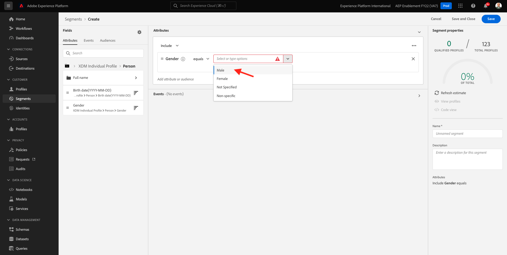

# 3.4 Een segment maken - UI

In deze oefening, zult u een segment tot stand brengen door gebruik van de Bouwer van het Segment van Adobe Experience Platform te maken.

## Artikel

Ga naar [Adobe Experience Platform](https://experience.adobe.com/platform). Na het aanmelden landt je op de homepage van Adobe Experience Platform.


Voordat u verdergaat, moet u een **sandbox**. De sandbox die moet worden geselecteerd, krijgt een naam ``--aepSandboxId--``. U kunt dit doen door op de tekst te klikken **[!UICONTROL Productieproduct]** in de blauwe lijn boven op het scherm. Nadat u de juiste [!UICONTROL sandbox], ziet u de schermwijziging en nu bent u in uw eigen omgeving [!UICONTROL sandbox].


Ga in het menu aan de linkerkant naar **Segmenten**. Op deze pagina ziet u een overzicht van alle bestaande segmenten. Klik op de knop **+ Segment maken** om een nieuw segment te maken.


Zodra u in de nieuwe segmentbouwer bent, merkt u onmiddellijk **Attributen** en de **Afzonderlijk XDM-profiel** referentie.


Aangezien XDM de taal is die de ervaringszaken macht, is XDM ook de stichting voor de segmentbouwer. Alle gegevens die in Platform worden opgenomen, moeten tegen XDM worden toegewezen en als zodanig, worden alle gegevens deel van het zelfde gegevensmodel ongeacht waar die gegevens uit komen. Dit geeft u een groot voordeel wanneer het bouwen van segmenten, zoals van deze één segment bouwer UI, kunt u gegevens van om het even welke oorsprong in het zelfde werkschema combineren. Segmenten die in Segment Builder zijn gemaakt, kunnen voor activering naar oplossingen als Adobe Target, Adobe Campaign en Adobe Audience Manager worden verzonden.

Laten we een segment maken dat alle **mannetje** klanten.

Om aan het genderattribuut te krijgen, moet u XDM begrijpen en kennen.

Gender is een kenmerk van Person, dat te vinden is onder Kenmerken. Om daar te komen, ga je beginnen door op te klikken **Afzonderlijk XDM-profiel**. Dan zie je dit. Van de **Afzonderlijk XDM-profiel** venster, selecteert u **Persoon**.


Dan zie je dit. In **Persoon**, kunt u de **Geslacht** kenmerk. Sleep het attribuut Gender op de segmentbouwer.


Nu kunt u het specifieke geslacht kiezen uit de vooraf ingevulde opties. Laten we in dit geval kiezen **Mannelijk**.



Na het selecteren **Mannelijk**, kunt u een schatting krijgen van de bevolking van het segment door de **Offerte vernieuwen** knop. Dit is zeer nuttig voor een bedrijfsgebruiker, zodat zij het effect van bepaalde attributen op de resulterende segmentgrootte kunnen zien.


Hieronder ziet u een schatting:


Daarna, zou u uw segment een beetje moeten verfijnen. U moet een segment van alle mannelijke klanten opbouwen die het product hebben bekeken **Proteus Fitness Jackshirt (oranje)**.

Om dit segment te bouwen, moet u een Gebeurtenis van de Ervaring toevoegen. U kunt alle Experience Events vinden door op **Gebeurtenissen** in het deelvenster **Velden** menubalk.


Vervolgens ziet u het hoogste niveau, **XDM ExperienceEvents** knooppunt. Klikken op **XDM ExperienceEvent**.


Ga naar **Objecten in de productlijst**.


Selecteren **Naam** en sleep de **Naam** object van het linkermenu naar het gesegmenteerde buildercanvas **Gebeurtenissen** sectie.


U zult dan dit zien:


De vergelijkingsparameter moet **equals** en in het invoerveld typt u **MONTANA WIND JACKET**.


Telkens als u een element aan de segmentbouwer toevoegt, kunt u klikken **Offerte vernieuwen** om een nieuwe schatting van de bevolking in uw segment te krijgen.

Tot dusver, hebt u slechts UI gebruikt om uw segment te bouwen, maar er is ook een code-optie om een segment te bouwen.

Wanneer het bouwen van een segment, stelt u eigenlijk een vraag van de Vraag van de Vraag van het Profiel (PQL) samen. Als u de PQL-code wilt visualiseren, klikt u op de knop **Codeweergave** schakelaar in de hogere juiste hoek van de segmentbouwer.


Nu kunt u de volledige verklaring zien PQL:

```sql
person.gender in ["male"] and CHAIN(xEvent, timestamp, [C0: WHAT(productListItems.exists(name.equals("MONTANA WIND JACKET", false)))])
```

U kunt ook een voorbeeld bekijken van de klantprofielen die deel uitmaken van dit segment door op **Profielen weergeven**.


Tot slot geven wij uw segment een naam en bewaren het.

Gebruik als naamgevingsconventie:

- `--demoProfileLdap-- - Male customers with interest in Montana Wind Jacket`


Klik vervolgens op de knop **Opslaan en sluiten** om uw segment op te slaan, waarna u terug naar de overzichtspagina van het Segment zult worden genomen.


U kunt nu doorgaan met de volgende oefening en een segment maken via de API.

Volgende stap: [3.5 Een segment maken - API](./ex5.md)

[Ga terug naar module 3](./real-time-customer-profile.md)

[Terug naar alle modules](../../overview.md)
