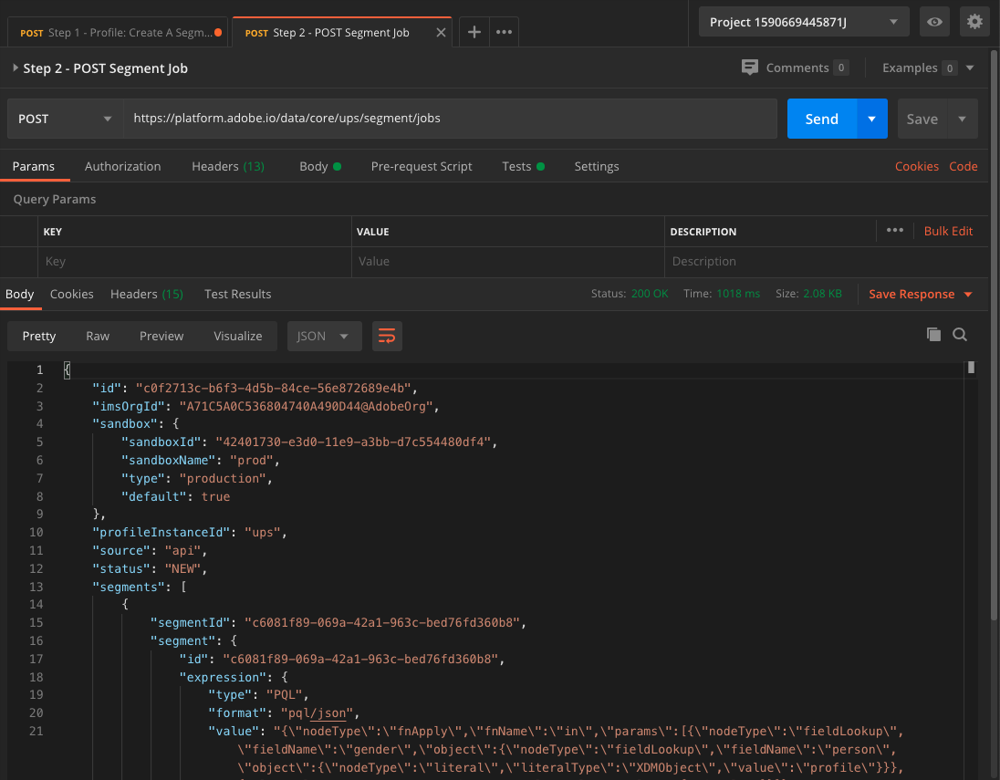

# 3.5 Een segment maken - API

In deze oefening, zult u Postman en Adobe I/O gebruiken om een segment tot stand te brengen en de resultaten van dat segment op te slaan als dataset, door Adobe Experience Platform APIs te gebruiken.

## Artikel

In het profiel van de Klant in real time, worden alle profielgegevens getoond naast gebeurtenisgegevens en bestaand segmentlidmaatschap. De gegevens die worden getoond kunnen van overal, van de toepassingen van Adobe en externe oplossingen komen. Dit is de krachtigste weergave in Adobe Experience Platform, het ervaringssysteem.

## Oefening 3.5.1 - Een segment maken via de Platform-API

Ga naar Postman.

Zoek de verzameling: **_Adobe Experience Platform Enablement**. In deze verzameling ziet u een map **2. Segmentatie**. We zullen deze verzoeken in deze oefening gebruiken.


Hierna volgen alle vereiste stappen om een segment te maken via de API. We gaan een eenvoudig segment bouwen: &quot;**ldap** - Alle vrouwelijke klanten&quot;.

### Stap 1 - Een segmentdefinitie maken

Klik op de benoemde aanvraag **Stap 1 - Profiel: Een segmentdefinitie maken**.


Ga naar de **Lichaam** van dit verzoek.


In de **Lichaam** van dit verzoek, zult u het volgende zien:


De taal die voor dit verzoek wordt gebruikt wordt genoemd de Taal van de Vraag van het Profiel, of **PQL**.

Meer informatie en documentatie over PQL vindt u [hier](https://experienceleague.adobe.com/docs/experience-platform/segmentation/pql/overview.html?lang=en).


Let op: werkt u de variabele bij **name** in het onderstaande verzoek door **ldap** met uw specifieke **ldap**.

```json
{
    "name" : "ldap - API - All Female Customer",
    "expression" : {"type":"PQL", "format":"pql/json", "value":"{\"nodeType\":\"fnApply\",\"fnName\":\"in\",\"params\":[{\"nodeType\":\"fieldLookup\",\"fieldName\":\"gender\",\"object\":{\"nodeType\":\"fieldLookup\",\"fieldName\":\"person\",\"object\":{\"nodeType\":\"literal\",\"literalType\":\"XDMObject\",\"value\":\"profile\"}}},{\"literalType\":\"List\",\"nodeType\":\"literal\",\"value\":[\"female\"]}]}"},
    "createdBy": "ldap",
    "schema" : { "name" : "_xdm.context.profile"},
    "ttlInDays" : 90
}
```

Nadat u uw specifieke **ldap**, moet het lichaam er ongeveer als volgt uitzien:

```json
{
    "name" : "vangeluw - API - All Female Customer",
    "expression" : {"type":"PQL", "format":"pql/json", "value":"{\"nodeType\":\"fnApply\",\"fnName\":\"in\",\"params\":[{\"nodeType\":\"fieldLookup\",\"fieldName\":\"gender\",\"object\":{\"nodeType\":\"fieldLookup\",\"fieldName\":\"person\",\"object\":{\"nodeType\":\"literal\",\"literalType\":\"XDMObject\",\"value\":\"profile\"}}},{\"literalType\":\"List\",\"nodeType\":\"literal\",\"value\":[\"female\"]}]}"},
    "createdBy": "vangeluw",
    "schema" : { "name" : "_xdm.context.profile"},
    "ttlInDays" : 90
}
```

U moet ook controleren **Koptekst** - velden van uw aanvraag. Ga naar **Kopteksten**. U zult dan dit zien:


| Sleutel | Waarde |
| -------------- | ------------------ |
| x-sandbox-name | `--aepSandboxId--` |

>[!NOTE]
>
>U moet de naam opgeven van de Adobe Experience Platform-sandbox die u gebruikt. De naam van uw x-sandbox moet `--aepSandboxId--`.

Klik nu op blauw **Verzenden** om het segment te maken en de resultaten daarvan weer te geven.


Na deze stap, kunt u uw segmentdefinitie in de UI van het Platform bekijken. Meld u aan bij Adobe Experience Platform en ga naar **Segmenten**.


### Stap 2 - creeer een Baan van de POST van het Segment

In de vorige oefening creeerde u _streaming_ segment. Een streaming segment evalueert voortdurend kwalificaties in real-time. Wat je hier doet, is een _partij_ segment. Het segment van de partij geeft u een voorproef van wat het segment in termen van kwalificaties zou kunnen kijken, maar _dat betekent niet dat het segment eigenlijk is gestart_. Momenteel _niemand komt in aanmerking voor dit segment_. Om mensen in aanmerking te laten komen, moet het batchsegment lopen, wat precies is wat we hier gaan doen.

Laten we nu een segmenttaak POSTEN.

Ga naar Postman.


Klik in uw Postman-collectie op de benoemde aanvraag **Stap 2 - POST segmenttaak** om het te openen.


U moet ook controleren **Koptekst** - velden van uw aanvraag. Ga naar **Kopteksten**. U zult dan dit zien:


| Sleutel | Waarde |
| -------------- | ------------------ |
| x-sandbox-name | `--aepSandboxId--` |

>[!NOTE]
>
>U moet de naam opgeven van de Adobe Experience Platform-sandbox die u gebruikt. De naam van uw x-sandbox moet `--aepSandboxId--`.

Klik op blauw **Verzenden** knop.

U zou een gelijkaardig resultaat moeten zien:



Deze segmenttaak is nu actief en dit kan enige tijd in beslag nemen. In Stap 3, zult u de status van deze baan kunnen controleren.


### Stap 3 - Taakstatus van segment

Ga naar Postman.


Klik in uw Postman-collectie op de benoemde aanvraag **Stap 3 - Taakstatus van segment**.


U moet ook controleren **Koptekst** - velden van uw aanvraag. Ga naar **Kopteksten**. U zult dan dit zien:


| Sleutel | Waarde |
| -------------- | ------------------ |
| x-sandbox-name | `--aepSandboxId--` |

>[!NOTE]
>
>U moet de naam opgeven van de Adobe Experience Platform-sandbox die u gebruikt. De naam van uw x-sandbox moet `--aepSandboxId--`.

Klik op blauw **Verzenden** knop.

U zou een gelijkaardig resultaat moeten zien:


In dit voorbeeld wordt **status** van de taak is ingesteld op **GEWACHT**.

Herhaal deze aanvraag door op blauw te klikken **Verzenden** om de paar minuten tot de **status** is ingesteld op **GESLAAGD**.


Zodra de status **GESLAAGD**, is uw segmenttaak uitgevoerd en klanten komen nu in aanmerking voor het segment.

Gefeliciteerd, u hebt met succes de oefening van de Segmentatie voltooid. Laten we nu eens kijken hoe het Real-Time Klantprofiel in de hele onderneming kan worden geactiveerd.

Volgende stap: [3.6 zie u het Profiel van de Klant in real time in actie in het Centrum van de Vraag](./ex6.md)

[Ga terug naar module 3](./real-time-customer-profile.md)

[Terug naar alle modules](../../overview.md)
