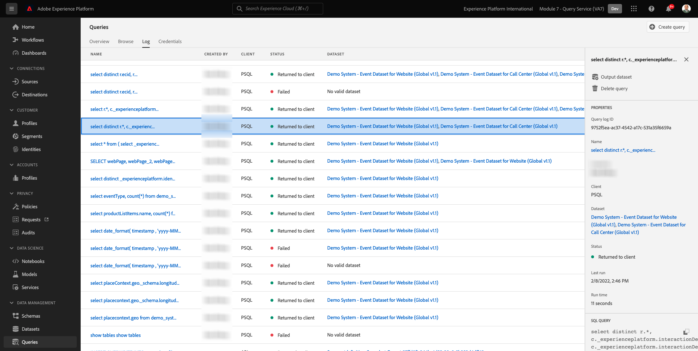

# 4.1 Aan de slag

## 4.1.1 De gebruikersinterface van Adobe Experience Platform leren kennen

Ga naar [Adobe Experience Platform](https://experience.adobe.com/platform). Na het aanmelden landt je op de homepage van Adobe Experience Platform.

Voordat u verdergaat, moet u een **sandbox**. De sandbox die moet worden geselecteerd, krijgt een naam ``--module7sandbox--``. U kunt dit doen door op de tekst te klikken **[!UICONTROL Productieproduct]** in de blauwe lijn boven op het scherm. Nadat u de juiste [!UICONTROL sandbox], ziet u de schermwijziging en nu bent u in uw eigen omgeving [!UICONTROL sandbox].

## 4.1.2 Gegevens op het platform verkennen

Het leveren van gegevens van verschillende kanalen is een zware taak voor elk merk. In deze exercitie werken Citi Signal-klanten samen met Citi Signal op haar website, op haar mobiele app. De aankoopgegevens worden verzameld door het Point of Sale-systeem van Citi Signal en ze beschikken over CRM- en Loyalty-gegevens. Citi Signal gebruikt Adobe Analytics en Adobe Launch om gegevens vast te leggen op zijn website, mobiele app en POS-systeem. Deze gegevens stromen dus al naar Adobe Experience Platform. Laten we beginnen met het verkennen van alle gegevens voor Citi Signal die al in Adobe Experience Platform bestaan.

Ga in het linkermenu naar **Gegevenssets**.

Citi Signal streamt gegevens naar Adobe Experience Platform en deze gegevens zijn beschikbaar in de `Demo System - Event Dataset for Website (Global v1.1)` dataset. Zoeken naar `Demo System - Event Dataset for Website`.

De interactiegegevens van het callcenter van Citi Signal worden vastgelegd in de `Demo System - Event Dataset for Call Center (Global v1.1)` dataset. Zoeken naar `Demo System - Event Dataset for Call Center` gegevens in het zoekvak. Klik op de naam van de gegevensset om deze te openen.

Na het klikken van de dataset, zult u een overzicht van de datasetactiviteit zoals ingebed en ontbroken partijen krijgen.

Klikken op **Gegevensset voorvertoning** om een voorbeeld te bekijken van de gegevens die zijn opgeslagen in `Demo System - Event Dataset for Call Center (Global v1.1)` dataset. Het linkerpaneel toont schemastructuur voor deze dataset.

Klik op de knop **Sluiten** om het dialoogvenster **Gegevensset voorvertoning** venster.

## 4.1.3 Inleiding aan de Dienst van de Vraag

Adobe Experience Platform Query Service is toegankelijk door op **Zoekopdrachten** in het linkermenu.

Ga naar **Logboek** u zult de pagina van de Lijst van de Vraag zien, die u een lijst van alle vragen verstrekt die in deze organisatie, met het recentste bij de bovenkant in werking hebben gesteld.

Klik op een SQL-query in de lijst en bekijk de details in de rechtertrack.

U kunt door het venster bladeren om de volledige query weer te geven, of u kunt op het hieronder gemarkeerde pictogram klikken om de volledige query naar uw laptop te kopiëren. U hoeft de query op dit moment niet te kopiëren.

U kunt niet enkel de vragen zien die zijn uitgevoerd, laat dit Gebruikersinterface u nieuwe datasets van vragen tot stand brengen. Deze gegevenssets kunnen worden gekoppeld aan het Adobe Experience Platform-profiel voor realtime klanten of kunnen worden gebruikt als invoer voor de Adobe Experience Platform Data Science Workspace.

## 4.1.4 Connect PSQL Client to Query Service

De Dienst van de vraag steunt cliënten met een bestuurder voor PostgreSQL. In dit zullen wij PSQL, een bevel-lijn interface, en Power BI of Tableau gebruiken. Laten we verbinding maken met PSQL.

Klikken op **Credentials**.

U ziet hieronder het scherm. Het scherm van de Configuratie verstrekt serverinformatie en geloofsbrieven voor het voor authentiek verklaren aan de Dienst van de Vraag. Momenteel, zullen wij op de rechterkant van het scherm concentreren dat een verbindingsbevel voor PSQL bevat. Klik op de knop Kopiëren om de opdracht naar het klembord te kopiëren.

Voor Windows: Open de bevellijn door de venstersleutel te raken en cmd te typen en dan op het Snelle resultaat van het Bevel te klikken.

Voor macOS: Open terminal.app via spotlight-zoekopdracht:

Plak het verbindingsbevel dat u van de Dienst UI van de Vraag hebt gekopieerd en druk binnengaan in het venster van de bevelherinnering:

Windows:

macOS:

U bent nu verbonden met de Dienst van de Vraag gebruikend PSQL.

In de volgende oefeningen zal er behoorlijk wat interactie met dit venster zijn. Wij zullen het als uw **PSQL-opdrachtregelinterface**.

Nu bent u klaar om vragen te beginnen verzenden.

Volgende stap: [4.2 Het gebruiken van de Dienst van de Vraag](./ex2.md)

[Ga terug naar module 4](./query-service.md)

[Terug naar alle modules](../../overview.md)
