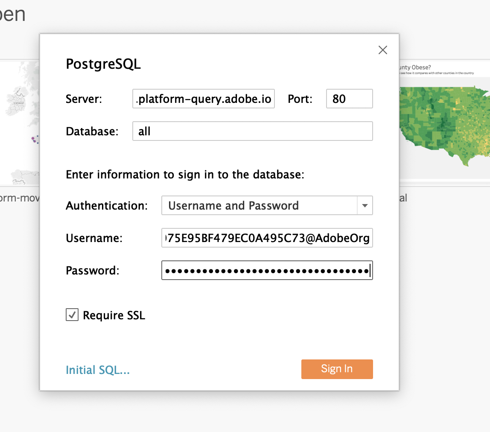

# 4.6 Query-service en Tableau

Open Tableau.

In **Verbinding maken met een server** selecteren **PostgreSQL**:

Ga naar Adobe Experience Platform, naar **Zoekopdrachten** en **Credentials**.

Van de **Credentials** pagina in Adobe Experience Platform, kopieer de **Host** en plak deze in het dialoogvenster **Server** veld, kopieert u de **Database** en plak deze in het dialoogvenster **Database** in Tableau, kopieer de **Poort** en plak deze in het veld **Poort** in Tableau, doe het zelfde voor **Gebruikersnaam** en **Wachtwoord**. Klik op Volgende **Aanmelden**.

Aanmelden:

Klik op Zoeken (1) en voer uw **ldap** in het zoekveld, identificeer u de tabel uit de resultatenset en sleep deze (3) naar de benoemde locatie **Tabellen hierheen slepen**. Klik op Als u klaar bent **Blad 1** (3)

Om onze gegevens op de kaart zichtbaar te maken, moeten we lengte en breedte in dimensies omzetten. In **Maatregelen** selecteren **Breedte** (1) en opent u het vervolgkeuzemenu van het veld en selecteert u **Omzetten in Dimension** (2) Doe het zelfde voor **Lengtegraad** meten.

Sleep de **Lengtegraad** aan de **Kolommen** en de **Breedte** meten tot **Rijen**. Automatisch de kaart van **België** worden weergegeven met kleine puntjes die de steden in de gegevensset weergeven.

Selecteren **Namen meten** (1), opent u het vervolgkeuzemenu en selecteert u **Toevoegen aan werkblad** (2)

Nu heb je een kaart met puntjes van verschillende grootten. De grootte wijst op het aantal interactie van het vraagcentrum voor die specifieke stad. Als u de grootte van de stippen wilt wijzigen, navigeert u naar het rechterdeelvenster en opent u **Waarden meten** (met het vervolgkeuzepictogram). Selecteer in de vervolgkeuzelijst de optie **Grootten bewerken**. Speel rond met verschillende grootten.

De gegevens verder weergeven per **Het Onderwerp van de vraag**, sleep (1) de **Het Onderwerp van de vraag** dimensie op **Pagina&#39;s**. Navigeren door de verschillende **Onderwerpen bellen** met de **Het Onderwerp van de vraag** (2) aan de rechterkant van het scherm:

Je hebt deze oefening nu afgerond.

Volgende stap: [4.7 API voor zoekservice](./ex7.md)

[Ga terug naar module 4](./query-service.md)

[Terug naar alle modules](../../overview.md)
