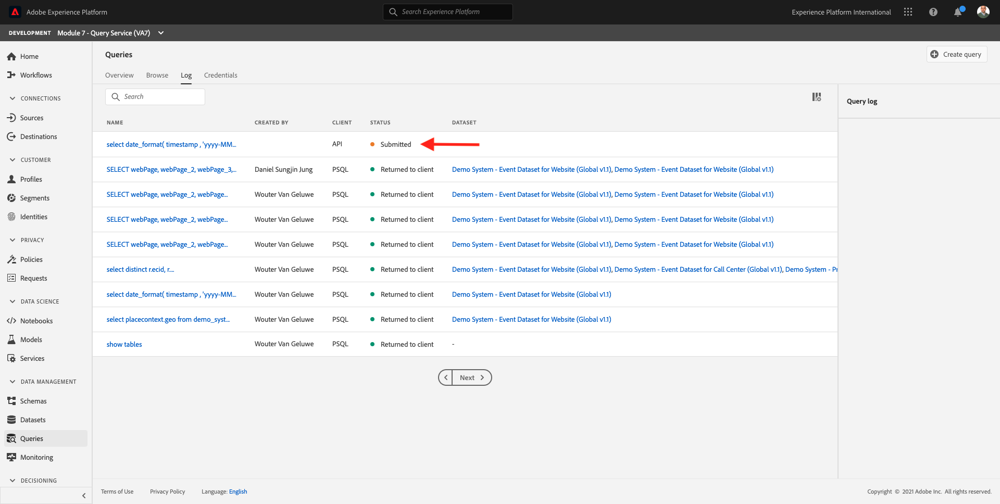
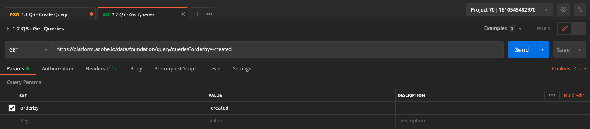

# 4.7 API voor zoekservice

## Doelstelling

- Gebruik de API van de Dienst van de Vraag om vraagmalplaatjes en vraagprogramma&#39;s te beheren

## Context

In deze oefening zult u API vraag uitvoeren om vraagmalplaatjes en vraagprogramma&#39;s te beheren gebruikend een inzameling van Postman. U zult vraagmalplaatjes bepalen, regelmatige vragen en vragen CTAS uitvoeren. A **CTAS** De vraag (creeer lijst zoals uitgezochte vraag) slaat zijn resultaatreeks in een expliciete dataset op. Terwijl de regelmatige vragen in een impliciete (of systeem geproduceerde) dataset worden opgeslagen, die typisch in parketdossierformaat wordt uitgevoerd.

## Documentatie

- [Help bij Adobe Experience Platform Query Service](https://experienceleague.adobe.com/docs/experience-platform/query/api/getting-started.html)
- [Query Service-API](https://www.adobe.io/apis/experienceplatform/home/api-reference.html#!acpdr/swagger-specs/qs-api.yaml)

## 4.7.1 API voor query-service

Met de API voor zoekdiensten kunt u niet-interactieve query&#39;s beheren op het Adobe Experience Platform-datumpeer.

Niet-interactief betekent dat een verzoek om een query uit te voeren niet resulteert in een directe reactie. De query wordt verwerkt en de resultaatset wordt impliciet of expliciet opgeslagen (CTAS: tabel maken als geselecteerde gegevensset).

## 4.7.2 Voorbeeldquery

Als steekproefvraag zult u de eerste die vraag gebruiken in wordt vermeld [4.3 - Vragen, vragen, vragen... en kurkanalyse](./ex3.md):

Hoeveel productweergaven hebben we dagelijks?

**SQL**

```sql
select date_format( timestamp , 'yyyy-MM-dd') AS Day,
       count(*) AS productViews
from   demo_system_event_dataset_for_website_global_v1_1
where  --aepTenantId--.demoEnvironment.brandName IN ('Luma Telco', 'Citi Signal')
and eventType = 'commerce.productViews'
group by Day
limit 10;
```

## 4.7.3 Vragen

Open Postman op uw computer. Als deel van Module 3, creeerde u een milieu van Postman en importeerde een inzameling van Postman. Volg de instructies in [Oefening 3.3.3](./../module3/ex3.md) voor het geval je dat nog niet hebt gedaan.

Als onderdeel van de Postman-verzameling die u hebt geïmporteerd, wordt een map weergegeven **3. Query-service**. Als deze map niet wordt weergegeven, downloadt u de map [Postman-collectie](../../assets/postman/postman_profile.zip) en importeer die verzameling opnieuw in Postman volgens de instructies in [Oefening 3.3.3](./../module3/ex3.md).


>[!NOTE]
>
>Alleen de map **1. Zoekopdrachten** bevat verzoeken. Andere verzoeken worden in een laagstadium toegevoegd.

Open die map en ken de API-aanroepen van Query Service om de query-resultset uit te voeren, te controleren en te downloaden.

Een POST die [/query/query] met de volgende lading zal de uitvoering van onze vraag teweegbrengen;

### 4.7.3.1 Query maken

Klik op de benoemde aanvraag **1.1 QS - Vraag maken** en ga naar **Kopteksten**. U zult dan dit zien:


Laten we ons richten op dit headerveld:

| Sleutel | Waarde |
| ----------- | ----------- |
| x-sandbox-name | `--module7sandbox--` |

>[!NOTE]
>
>U moet de naam opgeven van de Adobe Experience Platform-sandbox die u gebruikt. Het headerveld **x-sandbox-name** moeten `--module7sandbox--`.

Ga naar de **Lichaam** van dit verzoek. In de **Lichaam** van dit verzoek, zult u het volgende zien:


```sql
{
    "name" : "ldap - QS API demo - Citi Signal - Product Views Per Day",
	"description": "ldap - QS API demo - Citi Signal - Product Views Per Day",
	"dbName": "module7:all",
	"sql": "select date_format( timestamp , 'yyyy-MM-dd') AS Day, count(*) AS productViews from demo_system_event_dataset_for_website_global_v1_1 where _experienceplatform.demoEnvironment.brandName IN ('Luma Telco', 'Citi Signal') and eventType = 'commerce.productViews' group by Day limit 10"
}
```

Let op: werkt u de variabele bij **name** in het onderstaande verzoek door **ldap** met uw specifieke **ldap**.

Nadat u uw specifieke **ldap**, moet het lichaam er ongeveer als volgt uitzien:

```json
{
    "name" : "vangeluw - QS API demo - Citi Signal - Product Views Per Day",
	"description": "vangeluw - QS API demo - Citi Signal - Product Views Per Day",
	"dbName": "module7:all",
	"sql": "select date_format( timestamp , 'yyyy-MM-dd') AS Day, count(*) AS productViews from demo_system_event_dataset_for_website_global_v1_1 where _experienceplatform.demoEnvironment.brandName IN ('Luma Telco', 'Citi Signal') and eventType = 'commerce.productViews' group by Day limit 10"
}
```

>[!NOTE]
>
>De toets **dbName** in de bovenstaande JSON-hoofdtekst verwijst naar de sandbox die wordt gebruikt in uw Adobe Experience Platform-instantie. Als u de sandbox PROD gebruikt, moet dbName **pod:alle**, als u bijvoorbeeld een andere sandbox gebruikt **module7** moet de dbName gelijk zijn aan **module7:alle**.

Klik vervolgens op blauw **Verzenden** om het segment te maken en de resultaten daarvan weer te geven.


Wanneer de POST is geslaagd, retourneert de aanvraag het volgende antwoord:

```json
{
    "isInsertInto": false,
    "request": {
        "dbName": "module7:all",
        "sql": "select date_format( timestamp , 'yyyy-MM-dd') AS Day, count(*) AS productViews from demo_system_event_dataset_for_website_global_v1_1 where _experienceplatform.demoEnvironment.brandName IN ('Luma Telco', 'Citi Signal') and eventType = 'commerce.productViews' group by Day limit 10",
        "name": "vangeluw - QS API demo - Citi Signal - Product Views Per Day",
        "description": "vangeluw - QS API demo - Citi Signal - Product Views Per Day"
    },
    "clientId": "5a143b5ae4aa4631a1f3b09cd051333f",
    "state": "SUBMITTED",
    "rowCount": 0,
    "errors": [],
    "isCTAS": false,
    "version": 1,
    "id": "8f0d7f25-f7aa-493b-9792-290f884a7e5b",
    "elapsedTime": 0,
    "updated": "2021-01-20T13:23:13.951Z",
    "client": "API",
    "userId": "A3392DB95FFF08EE0A495E87@techacct.adobe.com",
    "created": "2021-01-20T13:23:13.951Z",
    "_links": {
        "self": {
            "href": "https://platform-va7.adobe.io/data/foundation/query/queries/8f0d7f25-f7aa-493b-9792-290f884a7e5b",
            "method": "GET"
        },
        "soft_delete": {
            "href": "https://platform-va7.adobe.io/data/foundation/query/queries/8f0d7f25-f7aa-493b-9792-290f884a7e5b",
            "method": "PATCH",
            "body": "{ \"op\": \"soft_delete\"}"
        },
        "cancel": {
            "href": "https://platform-va7.adobe.io/data/foundation/query/queries/8f0d7f25-f7aa-493b-9792-290f884a7e5b",
            "method": "PATCH",
            "body": "{ \"op\": \"cancel\"}"
        }
    }
}
```

De huidige **state** van de query **INGEDIEND** zodra de staat is uitgevoerd, wordt deze **SUCCES**.

U kunt ingediende query&#39;s ook opzoeken via de gebruikersinterface van Adobe Experience Platform. Open [Adobe Experience Platform](https://experience.adobe.com/#/@experienceplatform/platform/home), navigeer naar **Zoekopdrachten**, naar **Logboek** en selecteer uw vraag:



### 4.7.3.2 Vraag ophalen

Klik op de benoemde aanvraag **1.2 QS - krijg Vragen** en ga naar **Kopteksten**. U zult dan dit zien:


Laten we ons richten op dit headerveld:

| Sleutel | Waarde |
| ----------- | ----------- |
| x-sandbox-name | `--module7sandbox--` |

>[!NOTE]
>
>U moet de naam opgeven van de Adobe Experience Platform-sandbox die u gebruikt. Het headerveld **x-sandbox-name** moeten `--module7sandbox--`.

Ga naar **Params**. U zult dan dit zien:



De **ordonneren** kunt u een sorteervolgorde opgeven op basis van de **gemaakt** eigenschap. Let op: **&#39;-&#39;** aanmelden vóór het maken, wat betekent dat de volgorde waarin de lijst met query&#39;s wordt geretourneerd, de door hen gemaakte datum zal gebruiken in **Aflopend** bestelling. De query moet boven aan de lijst staan.

Klik vervolgens op blauw **Verzenden** om het segment te maken en de resultaten daarvan weer te geven.


Wanneer de aanvraag succesvol is, wordt een vergelijkbare reactie als hieronder gegeven. De **state** van de respons **INGEDIEND**, **IN_PROGRESS** of **SUCCES**. Het kan enige minuten duren voordat de query een **SUCCES** status. U kunt het verzenden van dit verzoek meerdere keren herhalen, totdat u het dialoogvenster **SUCCES** status.

```json
{
    "queries": [
        {
            "isInsertInto": false,
            "request": {
                "dbName": "module7:all",
                "sql": "select date_format( timestamp , 'yyyy-MM-dd') AS Day, count(*) AS productViews from demo_system_event_dataset_for_website_global_v1_1 where _experienceplatform.demoEnvironment.brandName IN ('Luma Telco', 'Citi Signal') and eventType = 'commerce.productViews' group by Day limit 10",
                "name": "vangeluw - QS API demo - Citi Signal - Product Views Per Day",
                "description": "vangeluw - QS API demo - Citi Signal - Product Views Per Day"
            },
            "clientId": "5a143b5ae4aa4631a1f3b09cd051333f",
            "state": "SUCCESS",
            "rowCount": 1,
            "errors": [],
            "isCTAS": false,
            "version": 1,
            "id": "8f0d7f25-f7aa-493b-9792-290f884a7e5b",
            "elapsedTime": 217481,
            "updated": "2021-01-20T13:26:51.432Z",
            "client": "API",
            "userId": "A3392DB95FFF08EE0A495E87@techacct.adobe.com",
            "created": "2021-01-20T13:23:13.951Z",
            "_links": {
                "self": {
                    "href": "https://platform-va7.adobe.io/data/foundation/query/queries/8f0d7f25-f7aa-493b-9792-290f884a7e5b",
                    "method": "GET"
                },
                "soft_delete": {
                    "href": "https://platform-va7.adobe.io/data/foundation/query/queries/8f0d7f25-f7aa-493b-9792-290f884a7e5b",
                    "method": "PATCH",
                    "body": "{ \"op\": \"soft_delete\"}"
                },
                "referenced_datasets": [
                    {
                        "id": "60080ace62c49a19490c5870",
                        "href": "https://platform-va7.adobe.io/data/foundation/catalog/dataSets/60080ace62c49a19490c5870"
                    }
                ]
            }
        }
     ]
    },
    "version": 1
}
```

Wanneer de status **SUCCES**, ga verder met het volgende verzoek.

### 4.7.3.3 Vraag de Status van de Vraag krijgen

Klik op de benoemde aanvraag **1.3 QS - krijg de Status van de Vraag** en ga naar **Kopteksten**. U zult dan dit zien:


Laten we ons richten op dit headerveld:

| Sleutel | Waarde |
| ----------- | ----------- |
| x-sandbox-name | `--module7sandbox--` |

>[!NOTE]
>
>U moet de naam opgeven van de Adobe Experience Platform-sandbox die u gebruikt. Het headerveld **x-sandbox-name** moeten `--module7sandbox--`.

Klik vervolgens op blauw **Verzenden** om het segment te maken en de resultaten daarvan weer te geven.


Wanneer de aanvraag succesvol is, wordt een vergelijkbare reactie als hieronder gegeven.

```json
{
    "isInsertInto": false,
    "request": {
        "dbName": "module7:all",
        "sql": "select date_format( timestamp , 'yyyy-MM-dd') AS Day, count(*) AS productViews from demo_system_event_dataset_for_website_global_v1_1 where _experienceplatform.demoEnvironment.brandName IN ('Luma Telco', 'Citi Signal') and eventType = 'commerce.productViews' group by Day limit 10",
        "name": "vangeluw - QS API demo - Citi Signal - Product Views Per Day",
        "description": "vangeluw - QS API demo - Citi Signal - Product Views Per Day"
    },
    "clientId": "5a143b5ae4aa4631a1f3b09cd051333f",
    "state": "SUCCESS",
    "rowCount": 1,
    "errors": [],
    "isCTAS": false,
    "version": 1,
    "id": "8f0d7f25-f7aa-493b-9792-290f884a7e5b",
    "elapsedTime": 217481,
    "updated": "2021-01-20T13:26:51.432Z",
    "client": "API",
    "userId": "A3392DB95FFF08EE0A495E87@techacct.adobe.com",
    "created": "2021-01-20T13:23:13.951Z",
    "_links": {
        "self": {
            "href": "https://platform-va7.adobe.io/data/foundation/query/queries/8f0d7f25-f7aa-493b-9792-290f884a7e5b",
            "method": "GET"
        },
        "soft_delete": {
            "href": "https://platform-va7.adobe.io/data/foundation/query/queries/8f0d7f25-f7aa-493b-9792-290f884a7e5b",
            "method": "PATCH",
            "body": "{ \"op\": \"soft_delete\"}"
        },
        "referenced_datasets": [
            {
                "id": "60080ace62c49a19490c5870",
                "href": "https://platform-va7.adobe.io/data/foundation/catalog/dataSets/60080ace62c49a19490c5870"
            }
        ]
    }
}
```

Wanneer een query de status van **SUCCES** geeft de reactie ook het aantal rijen aan dat door de query via de **rowCount** eigenschap. In ons voorbeeld worden 10 rijen geretourneerd door de query. Laten we in de volgende sectie zien hoe we de 10 rijen kunnen ophalen.

### 4.7.3.4 Zoekresultaat ophalen

De **SUCCES** reactie hierboven omvat een **referenced_datasets** bezit, dat aan de impliciete dataset richt die het vraagresultaat opslaat. Om toegang te krijgen tot het resultaat, gebruiken wij zijn **href** of **id** eigenschap.

Klik op de benoemde aanvraag **1.4 QS - krijg het Resultaat van de Vraag** en ga naar **Kopteksten**. U zult dan dit zien:


Laten we ons richten op dit headerveld:

| Sleutel | Waarde |
| ----------- | ----------- |
| x-sandbox-name | `--module7sandbox--` |

>[!NOTE]
>
>U moet de naam opgeven van de Adobe Experience Platform-sandbox die u gebruikt. Het headerveld **x-sandbox-name** moeten `--module7sandbox--`.

Klik vervolgens op blauw **Verzenden** om het segment te maken en de resultaten daarvan weer te geven.


Het antwoord op dit verzoek zal naar de datasetdossiers richten:

```json
{
    "60080ace62c49a19490c5870": {
        "name": "Demo System - Event Dataset for Website (Global v1.1)",
        "description": "Demo System - Event Dataset for Website (Global v1.1)",
        "enableErrorDiagnostics": false,
        "tags": {
            "adobe/siphon/partition/definition": [
                "day(timestamp, _ACP_DATE)",
                "identity(_ACP_BATCHID)"
            ],
            "aep/siphon/partitions": [
                "_ACP_DATE",
                "_ACP_BATCHID"
            ],
            "acp_granular_plugin_validation_flags": [
                "identity:enabled",
                "profile:enabled"
            ],
            "adobe/siphon/buffered-promotion-recency": [
                "live"
            ],
            "adobe/siphon/use-buffered-promotion": [
                "true"
            ],
            "adobe/pqs/table": [
                "demo_system_event_dataset_for_website_global_v1_1"
            ],
            "aep/siphon/expire-snapshot-timestamp": [
                "1611141272703"
            ],
            "acp_granular_validation_flags": [
                "requiredFieldCheck:enabled"
            ],
            "acp_validationContext": [
                "enabled"
            ],
            "adobe/siphon/table/format": [
                "iceberg"
            ],
            "unifiedProfile": [
                "enabled:true",
                "enabledAt:2021-01-20 10:49:51"
            ],
            "unifiedIdentity": [
                "enabled:true"
            ]
        },
        "namespace": "ACP",
        "state": "DRAFT",
        "imsOrg": "907075E95BF479EC0A495C73@AdobeOrg",
        "sandboxId": "62cd9f38-8529-4b05-8d9f-388529db0540",
        "lastBatchId": "01EWFQZ15XRNNB1FPKPW5ETRVP",
        "lastBatchStatus": "success",
        "lastSuccessfulBatch": "01EWFQZ15XRNNB1FPKPW5ETRVP",
        "version": "1.0.6",
        "created": 1611139790698,
        "updated": 1611149266031,
        "createdClient": "750e24ee855b4ac18ccc4f4817f96ee1",
        "createdUser": "3A260B485E909A170A495E76@techacct.adobe.com",
        "updatedUser": "acp_foundation_dataTracker@AdobeID",
        "viewId": "60080ace62c49a19490c5871",
        "fileDescription": {
            "persisted": true,
            "containerFormat": "parquet",
            "format": "parquet"
        },
        "files": "@/dataSets/60080ace62c49a19490c5870/views/60080ace62c49a19490c5871/files",
        "schemaMetadata": {
            "delta": [],
            "gdpr": []
        },
        "schemaRef": {
            "id": "https://ns.adobe.com/experienceplatform/schemas/d9b88a044ad96154637965a97ed63c7b20bdf2ab3b4f642e",
            "contentType": "application/vnd.adobe.xed-full+json;version=1"
        }
    }
}
```

>[!NOTE]
>
>Binnenkort worden meer oefeningen toegevoegd om u te helpen met de API voor zoekdiensten te communiceren.

Volgende stap: [Samenvatting en voordelen](./summary.md)

[Ga terug naar module 4](./query-service.md)

[Terug naar alle modules](../../overview.md)
