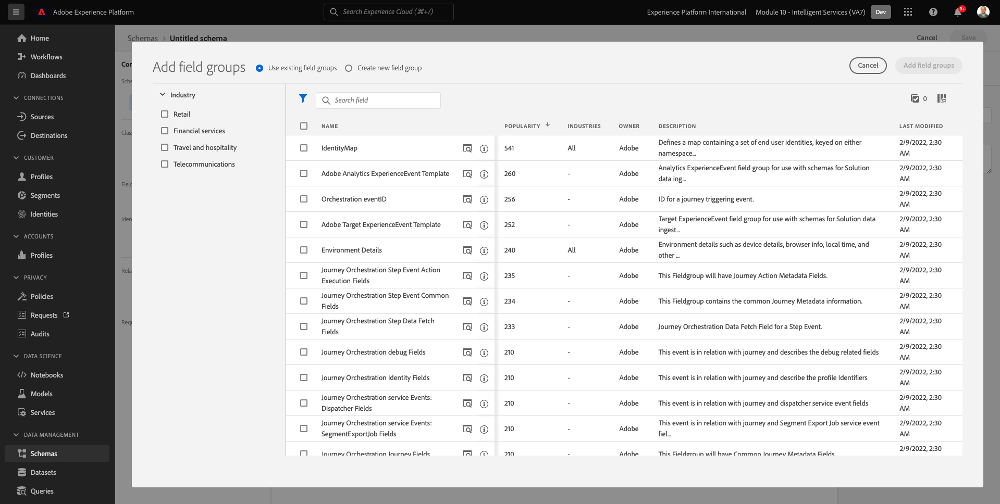
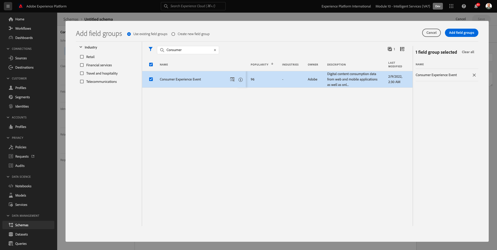
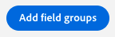
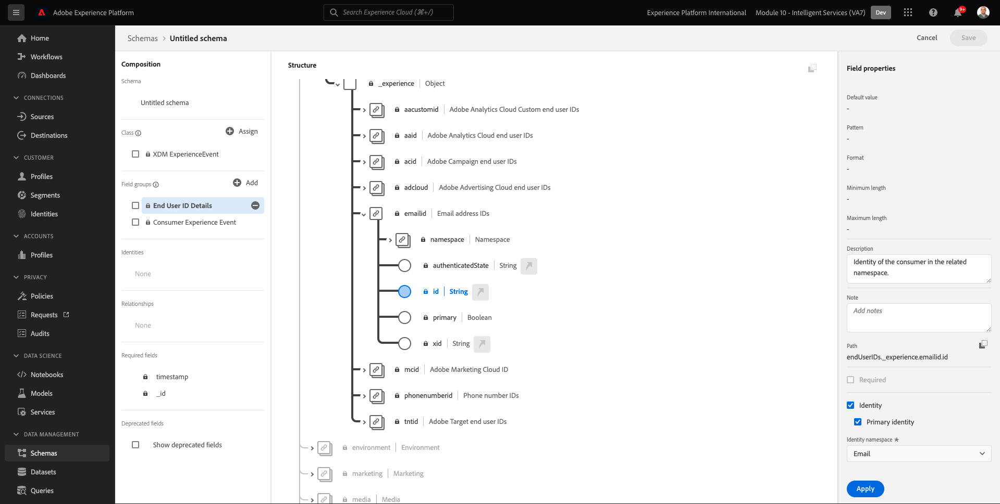
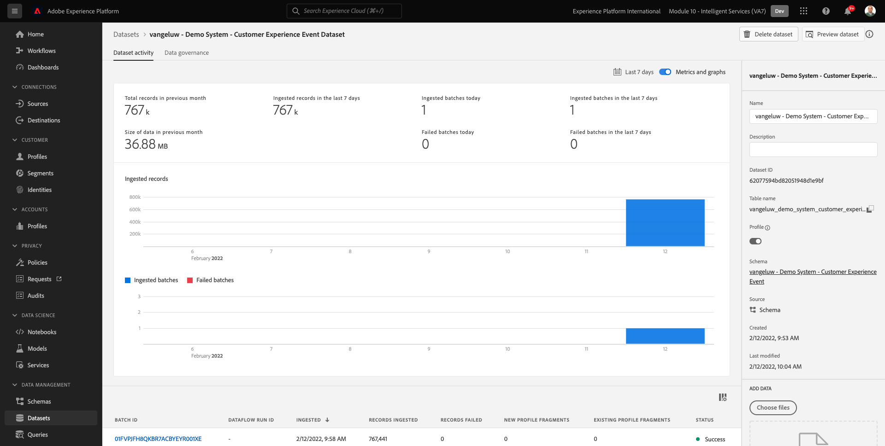

# 5.1 AI van klant - Gegevensvoorbereiding (Ingest)

Om de Intelligente Diensten inzichten van uw marketing gebeurtenisgegevens te ontdekken, moeten de gegevens semantisch worden verrijkt en in een standaardstructuur worden gehandhaafd. Intelligent Services leverages Adobe Experience Model (XDM) schema&#39;s om dit te bereiken.
Specifiek, moeten alle datasets die in de Intelligente Diensten worden gebruikt met in overeenstemming zijn **Consumentenervaringsgebeurtenis** XDM-schema.

## 5.1.1 Schema maken

In deze oefening, zult u een schema creëren dat bevat **Consumer Experience Event-mix**, die vereist zijn door de **Customer AI** Intelligente service.

Meld u aan bij Adobe Experience Platform door naar deze URL te gaan: [https://experience.adobe.com/platform](https://experience.adobe.com/platform).

Na het aanmelden landt je op de homepage van Adobe Experience Platform.

Voordat u verdergaat, moet u een **sandbox**. De sandbox die moet worden geselecteerd, krijgt een naam ``--module10sandbox--``. U kunt dit doen door op de tekst te klikken **[!UICONTROL Productieproduct]** in de blauwe lijn boven op het scherm. Na het selecteren van de aangewezen zandbak, zult u de het schermverandering zien en nu bent u in uw specifieke zandbak.

Klik in het linkermenu op **Schemas** en ga naar **Bladeren**. Klikken **Schema maken**.

Selecteer **XDM ExperienceEvent**.

Dan zie je dit.

Zoek en selecteer het volgende **Mixins** om aan dit Schema toe te voegen:

- Consumentenervaringsgebeurtenis

   

- Gegevens van eindgebruiker

   

Klikken **Veldgroepen toevoegen**.

Dan zie je dit. De mix selecteren **Gegevens van eindgebruiker**.

Naar het veld navigeren **endUserIDs._experience.emailid.id**.

In het rechtermenu van het veld **endUserIDs._experience.emailid.id**, omlaag schuiven en het selectievakje inschakelen voor **Identiteit**, schakel het selectievakje in voor **Primaire identiteit** en selecteert u de **Naamruimte identiteit** van **E-mail**.

Naar het veld navigeren **endUserIDs._experience.mcid.id**. Schakel het selectievakje in voor **Identiteit** en selecteert u de **Naamruimte identiteit** van **ECID**. Klikken **Toepassen**.

Geef uw schema nu een naam.

Als naam voor ons schema, zult u dit gebruiken:

- `--demoProfileLdap-- - Demo System - Customer Experience Event`

Als voorbeeld voor LDAP **vangeluw** Dit moet de naam van het schema zijn:

- **vangeluw - demosysteem - Customer Experience Event**

Dat zou je iets dergelijks moeten geven. Klik op de knop **+ Toevoegen** knop om nieuwe toe te voegen **Mixins**.

Selecteer de naam van het schema. U moet nu uw schema inschakelen voor **Profiel** door op de knop **Profiel** schakelen.

Dan zie je dit. Klikken **Inschakelen**.

Dat zou u nu moeten doen. Klikken **Opslaan** om uw schema op te slaan.

## 5.1.2 Gegevensset maken

Klik in het linkermenu op **Gegevenssets** en ga naar **Bladeren**. Klikken **Gegevensset maken**.

Klikken **Gegevensset maken van schema**.

In het volgende scherm, selecteer de dataset u in de vorige oefening creeerde, die wordt genoemd **[!UICONTROL LDAP - demosysteem - Customer Experience Event]**. Klik op **Next**.

Als naam voor uw dataset, gebruik `--demoProfileLdap-- - Demo System - Customer Experience Event Dataset`. Klikken **Voltooien**.

Uw dataset wordt nu gecreeerd. De optie **Profiel** schakelen.

Klikken **Inschakelen**.

U zou nu het volgende moeten hebben:

U bent nu klaar om gegevens van de Gebeurtenis van de Ervaring van de Consumenten te beginnen en de dienst van AI van de Klant te gebruiken.

## 5.1.3 Testgegevens downloadervaring

Wanneer de **Schema** en **Gegevensset** zijn gevormd, bent u nu klaar om de gegevens van de Gebeurtenis van de Ervaring in te voeren. Aangezien AI van de Klant gegevens vereist over **2 kwarten of ten minste**, moet u extern voorbereide gegevens opnemen.

De gegevens die worden voorbereid voor de ervaringsgebeurtenissen moeten voldoen aan de vereisten en het schema van het [Consumer Experience Event XDM Mixer](https://github.com/adobe/xdm/blob/797cf4930d5a80799a095256302675b1362c9a15/docs/reference/context/experienceevent-consumer.schema.md).

Download het bestand met voorbeeldgegevens van deze locatie: [https://dashboard.adobedemo.com/data](https://dashboard.adobedemo.com/data). Klik op de knop **Downloaden** knop.

U hebt nu een bestand gedownload met de naam **retail-v1-dec2020-xl.json.zip**. Plaats het bestand op het bureaublad van de computer en decomprimeer het, waarna u een bestand ziet met de naam **retail-v1.json**. U hebt dit bestand nodig in de volgende oefening.

## 5.1.4 Testgegevens over gebeurtenissen met de grootste ervaring

Ga in Adobe Experience Platform naar **Gegevenssets** en open uw dataset, die wordt genoemd **[!UICONTROL ldap - demosysteem - Gegevensset van gebeurtenis Klantervaring]**.

Klik in de gegevensset op **Bestanden kiezen** om gegevens toe te voegen.

Selecteer het bestand in de pop-up **retail-v1.json** en klik op **Openen**.

U zult dan de gegevens zien die worden ingevoerd, en een nieuwe partij wordt gecreeerd in **Laden** status. Navigeer niet van deze pagina weg tot het dossier wordt geupload.

Zodra het bestand is geüpload, ziet u de wijziging in de batchstatus van **Laden** tot **Verwerking**.

Het installeren en verwerken van de gegevens kan 10 tot 20 minuten duren.

Als de gegevens eenmaal zijn ingevoerd, verandert de batchstatus in **Succes**.

Volgende stap: [5.2 AI van de Klant - creeer een Nieuwe Instantie (vorm)](./ex2.md)

[Ga terug naar module 5](./intelligent-services.md)

[Terug naar alle modules](./../../overview.md)
