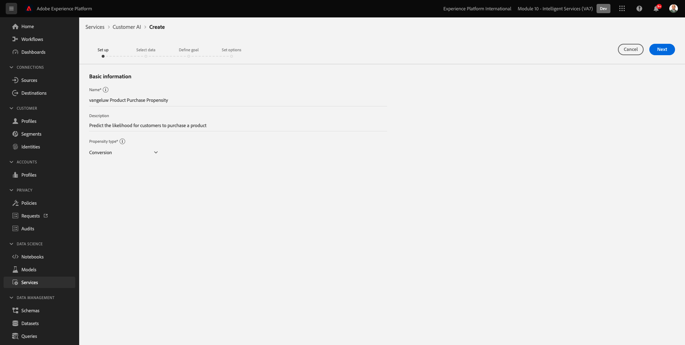
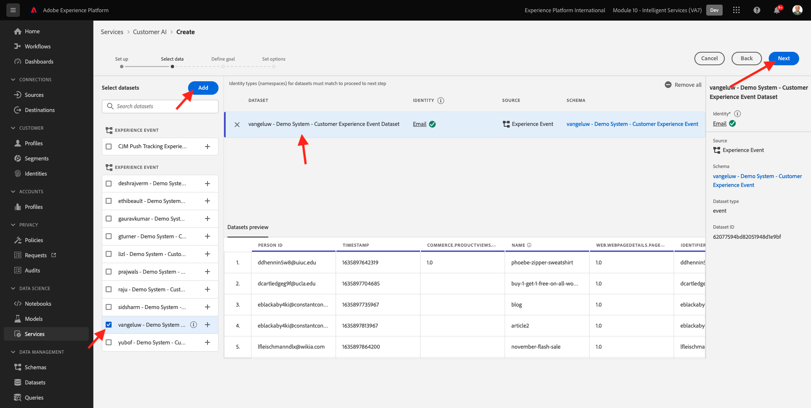
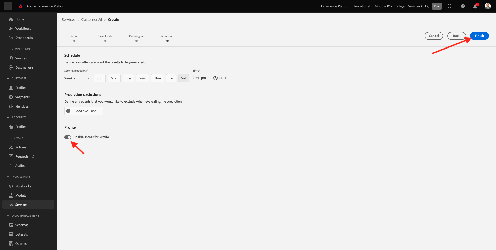
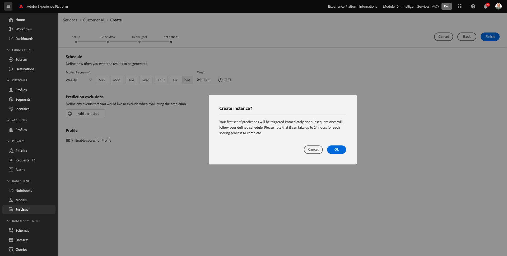

# 5.2 AI van de Klant - creeer een Nieuwe Instantie (vorm)

De AI van de klant werkt door bestaande gegevens van de Gebeurtenis van de Consumentenervaring te analyseren om karn of de scores van de omzetneigheidswaarde te voorspellen. Door een nieuwe AI-instantie van de klant te maken, kunnen marketeers doelstellingen en maatregelen definiëren.

## 5.2.1 Nieuwe Customer AI-instantie instellen

Klik in Adobe Experience Platform op **Services** in het linkermenu. De **Services** wordt weergegeven en geeft alle beschikbare services weer. Klik op de kaart voor Customer AI op **Openen**.

Klikken **Instantie maken**.

Dan zie je dit.

Voer de vereiste gegevens voor de AI-instantie van de Klant in:

- Naam: gebruiken `--demoProfileLdap-- Product Purchase Propensity`
- Omschrijving: gebruik: **Verwacht hoe waarschijnlijk het is dat klanten een product kunnen kopen**
- Type buigzaamheid: selecteren **Conversie**

Klik op **Next**.

Dan zie je dit. Selecteer de dataset u in de vorige oefening creeerde die wordt genoemd `--demoProfileLdap - Demo System - Customer Experience Event Dataset`. Klik op **Next**.

Selecteren **Wordt uitgevoerd** en definieert u het veld **commerce.purchase.value** als de doelvariabele.

Klik op **Next**.

Stel vervolgens uw schema in op uitvoeren **Wekelijks** en de tijd zo dicht mogelijk bij de huidige tijd in te stellen. Zorg ervoor dat de schakeloptie **Muziek inschakelen voor profiel** is ingeschakeld.

Klikken **Voltooien**.

Dan zie je deze popup. Klikken **OK**.

Nadat u het exemplaar vormt, kunt u het in de de instantielijst van de KlantAI zien en ook voorproef de samenvatting van de opstelling en uitvoeringsdetails door op de de instantielijst van de KlantAI te klikken. In het deelvenster Samenvatting worden ook foutgegevens weergegeven voor het geval er fouten zijn gevonden.

>[!NOTE]
>
>U kunt elke definitie of elk kenmerk wijzigen zolang de status van de AI-instantie van uw klant **In afwachting van training** of **Fout**

Volgende stap: [5.3 AI van de Klant - Score en Segmentatie (Voorspelling en actie ondernemen)](./ex3.md)

[Ga terug naar module 5](./intelligent-services.md)

[Terug naar alle modules](./../../overview.md)
