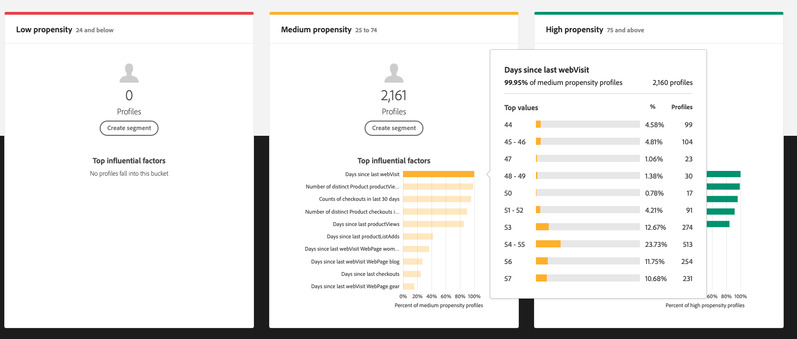

# 5.3 AI van de Klant - Score en Segmentatie (Voorspelling en actie ondernemen)

Zodra uw exemplaar van de Klant AI een modellooppas voltooit, zal het u toelaten om de volheidsscore visualiseren die wordt geëvalueerd om een klant te voorspellen die een aankoop in de volgende 30 dagen uitvoert.

>[!NOTE]
>
>Alleen een Customer AI-exemplaar met de status **Succes** Hiermee kunt u de inzichten van de service voorvertonen.

## 5.3.1 Propensiteitsvoorspelling

Laten we nu de voorspelde eigenschappen bekijken die worden gegenereerd door het AI-instantiemodel van de klant. Klik op de instantienaam om het dashboard weer te geven.

Het AI-dashboard van de Klant geeft een overzicht van de score, de verdeling van de populatie en de invloedrijke factoren voor het model dat moet worden geëvalueerd.

Houd de invloedrijke factoren aan om de verdere uitsplitsing van de gegevensdistributie te bekijken.

## 5.3.2 Handelingen

### 5.3.2.1 Klanten segmenteren

Met het AI-dashboard van de Klant kunt u segmenten definiëren met één klik. Klik op de knop **Segment maken** op de proxykaarten.

U zult zien dat een segmentdefinitie automatisch wordt gecreeerd.

Geef uw segment een naam volgens deze naamgevingsconventie: `--demoProfileLdap-- - Customer AI High Propensity`. Klikken **Opslaan**.

U kunt dit segment nu gebruiken voor het opgeven van doelen, bijvoorbeeld Real-time CDP, Journey Orchestration en Adobe Target.

### 5.3.2.2 Profieloverzicht

Aangezien de AI-garantiescore van de Klant onderdeel wordt van het Real-time Klantprofiel, kunt u de score van de individuele klant bekijken.

Ga in Adobe Experience Platform naar **Profielen** in het linkermenu en selecteer **Bladeren**.

Zoeken naar een profiel met een van de id&#39;s, zoals bijvoorbeeld **E-MAIL hbirkenshawa@businessweek.com**, die beschikbaar zijn in het JSON-bestand dat u hebt ingevoerd. Klik op de knop **Profiel-id** om het profiel te openen.

U zult dan dit zien:

Ga naar **Attributen**, die de uitvoer van uw AI-model van de klant bevat.

Schuif omlaag om de score voor volheid te zien, zoals deze wordt berekend door uw AI-model van de klant.

Volgende stap: [Samenvatting en voordelen](./summary.md)

[Ga terug naar module 5](./intelligent-services.md)

[Terug naar alle modules](./../../overview.md)
