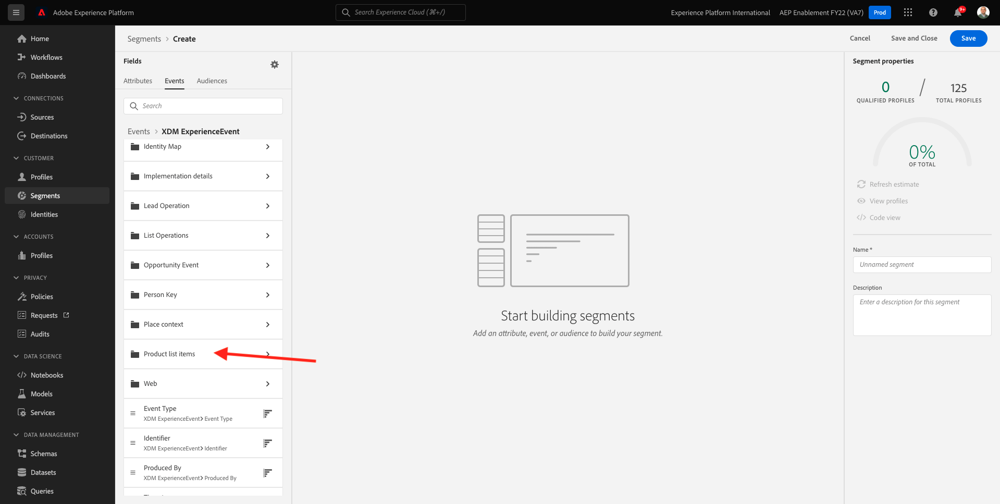
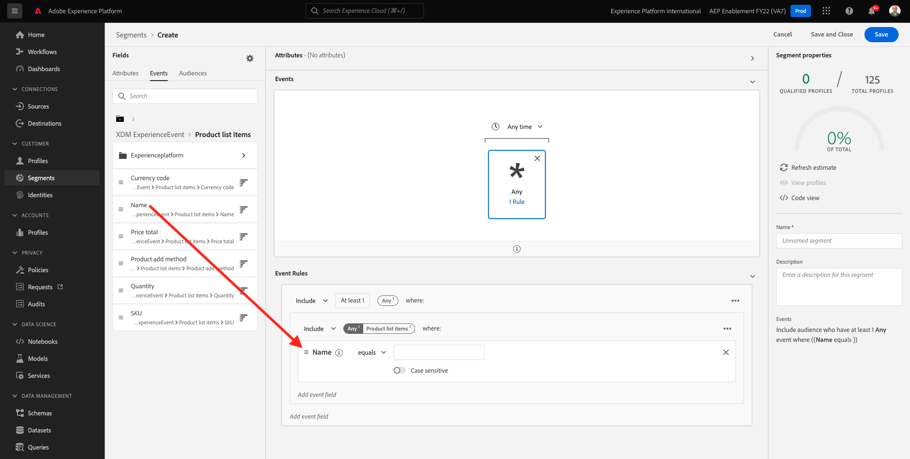

# 6.1 Een segment maken

In deze oefening, zult u een segment tot stand brengen door gebruik te maken van de bouwer van het segment van Adobe Experience Platform.

## 6.1.1 Context

In de wereld van vandaag, moet het antwoorden op het gedrag van een klant in real time zijn. Één van de manieren om aan klantengedrag in real time te antwoorden is door een segment te gebruiken, op voorwaarde dat het segment in real time kwalificeert. In deze oefening, moet u een segment opbouwen, rekening houdend met echte activiteit op de website die wij hebben gebruikt.

## 6.1.2 Bepaal het gedrag waarop u wilt reageren

Ga naar [https://builder.adobedemo.com/projects](https://builder.adobedemo.com/projects). Nadat je je hebt aangemeld bij je Adobe ID, kun je dit zien. Klik op uw websiteproject om het te openen.

U kunt nu de onderstaande workflow volgen om toegang te krijgen tot de website. Klikken **Integraties**.

Op de **Integraties** pagina, moet u het bezit van de Inzameling van Gegevens selecteren dat in oefening 0.1 werd gecreeerd.

Vervolgens wordt uw demowebsite geopend. Selecteer de URL en kopieer deze naar het klembord.

Open een nieuw Incognito-browservenster.

Plak de URL van uw demowebsite, die u in de vorige stap hebt gekopieerd. Vervolgens wordt u gevraagd u aan te melden met uw Adobe ID.

Selecteer uw accounttype en voltooi het aanmeldingsproces.

Uw website wordt vervolgens geladen in een Incognito-browservenster. Voor elke demonstratie, zult u een vers, incognito browser venster moeten gebruiken om uw demowebsite URL te laden.

In dit voorbeeld wilt u reageren op een specifieke klant die een specifiek product weergeeft.
Van de **Luminantie** homepage, ga naar **Mannen** en klik op het product **PROTEUS FITNESS JACKSHIRT**.

Dus als iemand de productpagina bezoekt **PROTEUS FITNESS JACKSHIRT**, wilt u actie kunnen ondernemen. Het eerste wat je moet doen om actie te ondernemen, is een segment definiëren.

## 6.1.3 Het segment maken

Ga naar [Adobe Experience Platform](https://experience.adobe.com/platform). Na het aanmelden landt je op de homepage van Adobe Experience Platform.

Voordat u verdergaat, moet u een **sandbox**. De sandbox die moet worden geselecteerd, krijgt een naam ``--aepSandboxId--``. U kunt dit doen door op de tekst te klikken **[!UICONTROL Productieproduct]** in de blauwe lijn boven op het scherm. Nadat u de juiste [!UICONTROL sandbox], ziet u de schermwijziging en nu bent u in uw eigen omgeving [!UICONTROL sandbox].

Ga in het menu aan de linkerkant naar **Segmenten** en ga vervolgens naar **Bladeren** Hier ziet u een overzicht van alle bestaande segmenten. Klik op de knop **Segment maken** om een nieuw segment te maken.

Zoals hierboven vermeld, moet u een segment maken van alle klanten die het product hebben bekeken **PROTEUS FITNESS JACKSHIRT**.

Om dit segment op te bouwen, moet u een gebeurtenis toevoegen. U kunt alle gebeurtenissen vinden door op de knop **Gebeurtenissen** in het deelvenster **Segmenten** menubalk.

Vervolgens ziet u het hoogste niveau **XDM ExperienceEvent** knooppunt.

Om klanten te vinden die hebben bezocht **PROTEUS FITNESS JACKSHIRT** product, klik op **XDM ExperienceEvent**.

Omlaag schuiven naar **Objecten in de productlijst** en klik erop.

Selecteren **Naam** en sleep de **Naam** object van links **Objecten in de productlijst** menu op het gesegmenteerde canvas van de bouwer in **Gebeurtenissen** sectie.

De vergelijkingsparameter moet **equals** en in het invoerveld typt u `PROTEUS FITNESS JACKSHIRT`.

Uw **Gebeurtenisregels** zou er nu zo moeten uitzien. Telkens als u een element aan de segmentbouwer toevoegt, kunt u klikken **Offerte vernieuwen** om een nieuwe schatting van de bevolking in uw segment te krijgen.

Tot slot geven wij uw segment een naam en bewaren het.

Gebruik als naamgevingsconventie:

- `--demoProfileLdap-- - Interest in PROTEUS FITNESS JACKSHIRT`

Uw segmentnaam moet er als volgt uitzien:
`vangeluw - Interest in PROTEUS FITNESS JACKSHIRT`

Klik op de knop **Opslaan en sluiten** om uw segment op te slaan.

U wordt nu teruggezet naar de pagina van het segmentoverzicht.

Volgende stap: [6.2 Overzicht hoe te om DV360 Bestemming te vormen gebruikend Doelen](./ex2.md)

[Ga terug naar module 11](./real-time-cdp-build-a-segment-take-action.md)

[Terug naar alle modules](../../overview.md)
