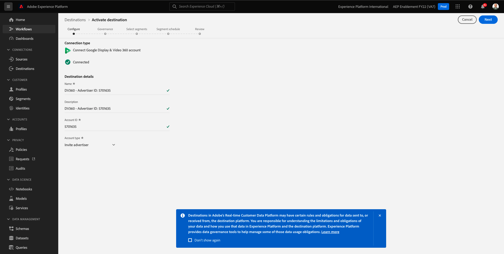

# 6.2 Een advertentiebestemming configureren, zoals Google DV360

>[!IMPORTANT]
>
>De onderstaande inhoud is bedoeld als FYI - U doet dit **NOT** moet een nieuwe bestemming voor DV360 vormen. De bestemming is reeds gecreeerd en u kunt het in de volgende oefening gebruiken.

Ga naar [Adobe Experience Platform](https://experience.adobe.com/platform). Na het aanmelden landt je op de homepage van Adobe Experience Platform.

Voordat u verdergaat, moet u een **sandbox**. De sandbox die moet worden geselecteerd, krijgt een naam ``--aepSandboxId--``. U kunt dit doen door op de tekst te klikken **[!UICONTROL Productieproduct]** in de blauwe lijn boven op het scherm. Nadat u de juiste [!UICONTROL sandbox], ziet u de schermwijziging en nu bent u in uw eigen omgeving [!UICONTROL sandbox].

Ga in het linkermenu naar **Doelen** en ga vervolgens naar **Catalogus**. Dan zie je de **Doelcatalogus**.

In **Doelen**, klikt u op **Google Display &amp; Video 360** en klik vervolgens op **+ Instellen**.

Dan zie je dit. Klikken **Verbinden met doel**.

In het volgende scherm kunt u uw bestemming configureren naar Google DV360.

Geef een waarde op in de velden **Naam** en **Beschrijving**.

Het veld **Account-id** is de **Adverteerder-id** van de DV360-rekening. U kunt dat hier vinden:

De **Accounttype** moet worden ingesteld op **Adverteerder uitnodigen**.

Nu heb je dit. Klik op **Next**.

>[!NOTE]
>
>Google moet de lijst met Adobe toestaan om gegevens naar Google DV360 te kunnen verzenden. Neem contact op met uw Google-accountmanager om deze gegevensstroom in te schakelen.

Na het creëren van de bestemming, zult u dit zien. U kunt desgewenst een beleid voor gegevensbeheer selecteren. Klik op Volgende **Opslaan en afsluiten**.

U zult dan een lijst van beschikbare bestemmingen zien.
In de volgende oefening, zult u het segment verbinden u in de vorige oefening bouwde aan de bestemming van Google DV360.

Volgende stap: [6.3 Actie ondernemen: verzend uw segment naar DV360](./ex3.md)

[Ga terug naar module 6](./real-time-cdp-build-a-segment-take-action.md)

[Terug naar alle modules](../../overview.md)
