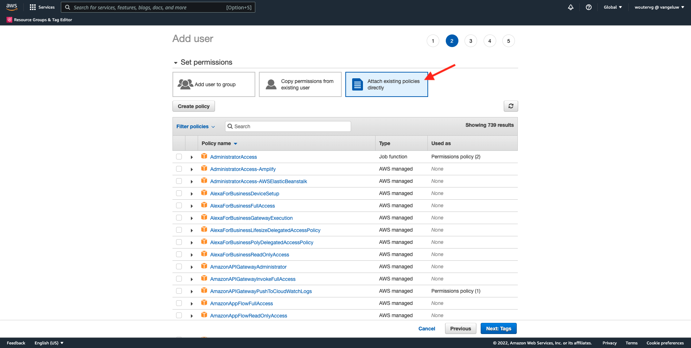
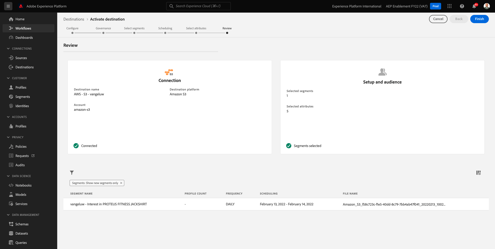

# 6.4 Actie nemen: verzend uw segment naar S3-bestemming

Adobe Experience Platform heeft ook de capaciteit om Publiek aan E-mailMarketing Doelen zoals de Marketing Cloud van Salesforce, Oracle Eloqua, Oracle Responsys en Adobe Campaign te delen.

U kunt FTP of SFTP als deel van de specifieke bestemmingen voor elk van deze E-mailMarketing Doelen gebruiken, of u kunt AWS S3 gebruiken om lijsten van klanten tussen Adobe Experience Platform en deze E-mailmarketing Doelen uit te wisselen.

In deze module, zult u zulk een bestemming vormen door gebruik van een emmertje van AWS S3 te maken.

## 6.4.1 Een S3-emmertje maken

Ga naar [https://console.aws.amazon.com](https://console.aws.amazon.com) en meld u aan met de Amazon-account die u eerder hebt gemaakt.

Nadat u zich hebt aangemeld, wordt u omgeleid naar de **AWS Management Console**.

In de **Services zoeken** menu, zoeken naar **s3**. Klik op het eerste zoekresultaat: **S3 - Schaalbare opslag in de cloud**.

Dan zie je de **Amazon S3** homepage. Klikken **Emmertje maken**.

In de **Emmertje maken** scherm, moet u twee dingen vormen:

- Naam: de naam gebruiken `aepmodulertcdp--demoProfileLdap--`. In deze oefening is de naam van de emmertje bijvoorbeeld **aepmodulertcdpvangeluw**
- Regio: de regio gebruiken **EU (Frankfurt)**

Laat alle andere standaardinstellingen ongewijzigd. Omlaag schuiven en klikken **Emmertje maken**.

Vervolgens ziet u dat uw emmer is gemaakt en wordt deze omgeleid naar de startpagina van Amazon S3.

## 6.4.2 Recht plaatsen om tot uw S3 emmertje toegang te hebben

De volgende stap is toegang tot uw S3 emmertje te plaatsen.

Ga om dat te doen naar [https://console.aws.amazon.com/iam/home](https://console.aws.amazon.com/iam/home).

De toegang tot AWS-bronnen wordt beheerd door Amazon Identity and Access Management (IAM).

U ziet deze pagina nu.

Klik in het linkermenu op **Gebruikers**. Dan zie je de **Gebruikers** scherm. Klikken **Gebruikers toevoegen**.

Configureer vervolgens de gebruiker:

- Gebruikersnaam: gebruiken `s3_--demoProfileLdap--_rtcdp` als een naam, dus in dit voorbeeld is de naam `s3_vangeluw_rtcdp`.
- AWS-toegangstype: selecteren **Toegangstoets - Programmatische toegang**.

Klikken **Volgende: Machtigingen**.

U zult dan dit toestemmingenscherm zien. Klikken **Bestaand beleid rechtstreeks koppelen**.

Voer de zoekterm in **s3** om alle verwante S3 beleid te zien. Selecteer het beleid **AmazonS3FullAccess**. Klikken **Volgende: Tags**.

Op de **Tags** scherm, is er geen behoefte om om het even wat te vormen. Klikken **Volgende: Controleren**.

Controleer uw configuratie. Klikken **Gebruiker maken**.

Uw gebruiker wordt nu gecreeerd en u ziet uw geloofsbrieven om tot uw S3 milieu toegang te hebben. Dit is de enige keer dat u uw referenties ziet, dus schrijf deze naar beneden.

Klikken **Tonen** om uw geheime toegangssleutel te zien:

>[!IMPORTANT]
>
>Sla uw gegevens op in een tekstbestand op uw computer.
>
> - Toegangstoets-id: ...
> - Geheime toegangstoets: ...
>
> Klik eenmaal op **Sluiten** u zult nooit meer uw geloofsbrieven zien!

Klikken **Sluiten**.

U hebt nu een AWS S3 emmertje met succes gecreeerd en u hebt een gebruiker met toestemmingen gecreeerd om tot dit emmertje toegang te hebben.

## 6.4.3 Doel configureren in Adobe Experience Platform

Ga naar [Adobe Experience Platform](https://experience.adobe.com/platform). Na het aanmelden landt je op de homepage van Adobe Experience Platform.

Voordat u verdergaat, moet u een **sandbox**. De sandbox die moet worden geselecteerd, krijgt een naam ``--aepSandboxId--``. U kunt dit doen door op de tekst te klikken **[!UICONTROL Productieproduct]** in de blauwe lijn boven op het scherm. Nadat u de juiste [!UICONTROL sandbox], ziet u de schermwijziging en nu bent u in uw eigen omgeving [!UICONTROL sandbox].

Ga in het linkermenu naar **Doelen** en ga vervolgens naar **Catalogus**. Dan zie je de **Doelcatalogus**.

Klikken **Cloud Storage** klikt u op de knop **Instellen** knop (of aan **Segmenten activeren**, afhankelijk van uw omgeving) **Amazon S3** kaart.

Afhankelijk van uw omgeving moet u mogelijk op **+ Vorm nieuwe bestemming** om uw bestemming te beginnen creëren.

Selecteren **Nieuw account** als Accounttype. Gelieve te gebruiken de S3 geloofsbrieven die aan u in de vorige stap werden gegeven:

| Toegangstoets-id | Geheime toegangstoets |
|:-----------------------:| :-----------------------:|
| AKIA..... | Cm5Ln..... |

Klikken **Verbinden met doel**.

Vervolgens ziet u een visuele bevestiging dat deze bestemming nu is verbonden.

U moet een naam en een map opgeven zodat Adobe Experience Platform verbinding kan maken met het S3-emmertje.

Gebruik de volgende naamgevingsregels:

| Toegangstoets-id | Geheime toegangstoets |
|:-----------------------:| :-----------------------:|
| Naam | `AWS - S3 - --demoProfileLdap--` |
| Beschrijving | `AWS - S3 - --demoProfileLdap--` |
| Naam emmertje | `aepmodulertcdp--demoProfileLdap--` |
| Mappad | / |

Klik op **Next**.

U kunt nu optioneel een beleid voor gegevensbeheer aan uw nieuwe bestemming koppelen. Klik op **Next**.

Zoek in de lijst met segmenten naar het segment dat u in oefening 1 hebt gemaakt en selecteer het. Klik op **Next**.

Dan zie je dit. U kunt het schema desgewenst bewerken door op de knop **potlood** pictogram. **Schema maken**.

Bepaal uw keuzeplanning. Selecteren **Incrementele bestanden exporteren** en stelt de frequentie in op **Uur** elke **3 uur**. Klikken **Maken**.

Dan heb je dit. Klik op **Next**.

U kunt nu kenmerken selecteren voor het exporteren naar AWS S3. Klikken **Nieuw veld toevoegen** en zorgen voor `--aepTenantId--.identification.core.ecid` wordt toegevoegd en gemarkeerd als **Deduplicatietoets**.

U kunt desgewenst zoveel andere velden toevoegen als u wilt.

Nadat u alle velden hebt toegevoegd, klikt u op **Volgende**.

Controleer uw configuratie. Klikken **Voltooien** om uw configuratie te voltooien.

U zult dan terug bij het scherm van de Activering van de Bestemming zijn en u zult uw segment zien dat aan deze bestemming wordt toegevoegd.

Als u meer segmentexport wilt toevoegen, klikt u op **Segmenten activeren** om het proces opnieuw te beginnen en meer segmenten toe te voegen.

Volgende stap: [6.5 Actie nemen: Uw segment verzenden naar Adobe Target](./ex5.md)

[Ga terug naar module 6](./real-time-cdp-build-a-segment-take-action.md)

[Terug naar alle modules](../../overview.md)
