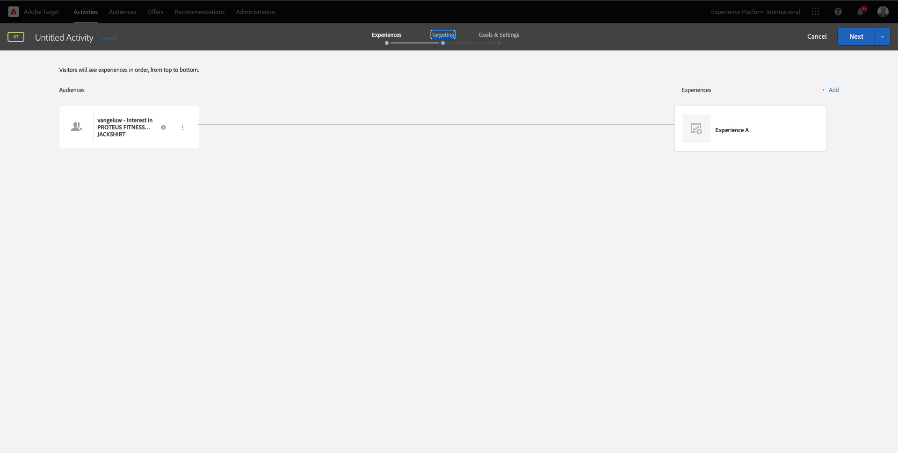
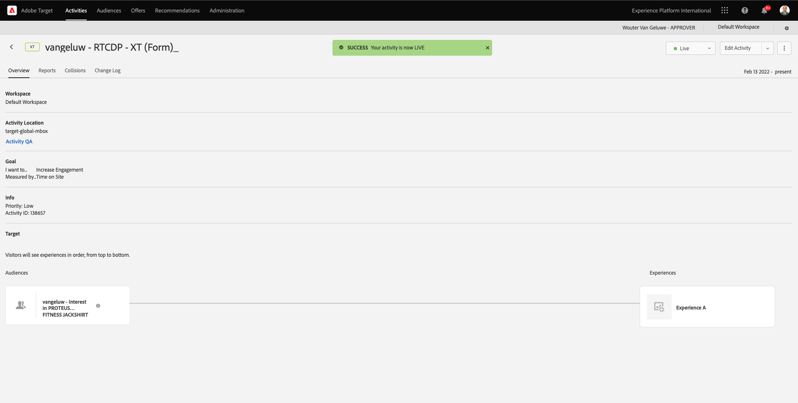

# 6.5 Actie nemen: Uw segment verzenden naar Adobe Target

Ga naar [Adobe Experience Platform](https://experience.adobe.com/platform). Na het aanmelden landt je op de homepage van Adobe Experience Platform.


Voordat u verdergaat, moet u een **sandbox**. De sandbox die moet worden geselecteerd, krijgt een naam ``--aepSandboxId--``. U kunt dit doen door op de tekst te klikken **[!UICONTROL Productieproduct]** in de blauwe lijn boven op het scherm. Nadat u de juiste [!UICONTROL sandbox], ziet u de schermwijziging en nu bent u in uw eigen omgeving [!UICONTROL sandbox].


## 6.5.1 Controleer uw gegevensstroom

De Adobe Target-bestemming in Real-Time CDP wordt verbonden met de gegevensstroom die wordt gebruikt om gegevens in te voeren in het Adobe edge-netwerk. Als u uw Adobe Target-bestemming wilt instellen, moet u eerst controleren of uw gegevensstroom al is ingeschakeld voor Adobe Target. Uw datastram is geconfigureerd in [Oefening 0.2 Uw DataStream maken](./../module0/ex2.md) en was benoemd `--demoProfileLdap-- - Demo System Datastream`.

Ga naar [https://experience.adobe.com/#/data-collection/](https://experience.adobe.com/#/data-collection/)en klik vervolgens op **DataStreams** of **Gegevensstromen (bèta)**.


Selecteer in de rechterbovenhoek van het scherm de naam van de sandbox die u wilt instellen als `--aepSandboxId--`.


Zoek in gegevensstreams naar de gegevensstroom met de naam `--demoProfileLdap-- - Demo System Datastream`. Klik op de gegevensstroom om deze te openen.


U ziet dit dan en klikt op **...** naast **Adobe Experience Platform** en klik vervolgens op **Bewerken**.


Schakel de selectievakjes voor beide in **Randsegmentatie** en **Aanpassingsdoelen**. Klikken **Opslaan**.


Klik op Volgende **+ Service toevoegen**.


Selecteer de service **Adobe Target**. Klikken **Opslaan**.


Uw gegevensstroom is nu geconfigureerd voor Adobe Target.


## 6.5.2 Uw Adobe Target-bestemming configureren

Adobe Target is beschikbaar als een bestemming vanuit Real-Time CDP. Ga naar **Doelen**, naar **Catalogus**.


Klikken **Personalisatie** in de **Categorieën** -menu. Dan zie je de **Adobe Target** doelkaart. Klikken **Segmenten activeren** (of **Instellen** afhankelijk van uw omgeving).


Afhankelijk van uw omgeving moet u mogelijk op **+ Vorm nieuwe bestemming** om uw bestemming te beginnen creëren.


Dan zie je dit.


In de **Nieuwe bestemming configureren** scherm, moet u twee dingen vormen:

- Naam: de naam gebruiken `--demoProfileLdap-- - Adobe Target (Web)`, die er als volgt uitzien: **vangeluw - Adobe Target (Web)**.
- DataStream-id: u moet de datastream selecteren waarin u hebt geconfigureerd [Oefening 0.2 Uw DataStream maken](./../module0/ex2.md). De naam van de gegevensstroom moet als volgt zijn: `--demoProfileLdap-- - Demo System Datastream`.

Klik op **Next**.


In het volgende scherm, kunt u naar keuze een governancebeleid selecteren. U hoeft deze niet te selecteren, in dit geval hoeft u er geen te selecteren, dus klikt u op **Maken**.


Uw bestemming wordt nu gecreeerd en zal in de lijst worden getoond. Selecteer uw bestemming en klik op **Volgende** om te beginnen segmenten naar uw bestemming te verzenden.


Selecteer in de lijst met beschikbare segmenten het segment waarin u hebt gemaakt [Oefening 6.1 Een segment maken](./ex1.md), die `--demoProfileLdap-- - Interest in PROTEUS FITNESS JACKSHIRT`. Klik vervolgens op **Volgende**.


Klik op de volgende pagina op **Volgende**.


Klikken **Voltooien**.


Uw segment wordt nu geactiveerd naar Adobe Target.


>[!IMPORTANT]
>
>Als je net je Adobe Target-bestemming hebt gemaakt in Real-Time CDP, kan het tot een uur duren voordat de bestemming live is. Dit is eenmalig wachttijd, wegens de opstelling van de backendconfiguratie. Zodra de aanvankelijke 1 uur wachttijd en achtergrondconfiguratie wordt gedaan, zullen de onlangs toegevoegde randsegmenten die naar de bestemming van Adobe Target worden verzonden voor het richten in real time beschikbaar zijn.

## 6.5.3 Configureer uw Adobe Target-formuliergebaseerde activiteit

Nu uw Real-Time CDP-segment is geconfigureerd voor verzending naar Adobe Target, kunt u uw Experience Targeting-activiteit configureren in Adobe Target. In deze oefening zult u een op vorm-gebaseerde activiteit vormen.

Ga naar de Adobe Experience Cloud-homepage door naar [https://experiencecloud.adobe.com/](https://experiencecloud.adobe.com/). Klikken **Doel** om het te openen.


Op de **Adobe Target** homepage, zult u alle bestaande Activiteiten zien.


Klikken **+ Activiteit maken** om een nieuwe Activiteit te creëren.


Selecteren **Gericht op ervaring**.


Selecteren **Formulier** en selecteert u **Geen eigenschapsbeperkingen**. Klik op **Next**.


U bent nu in de op formulier gebaseerde composer voor activiteiten.


Voor het veld **LOCATIE 1**, selecteert u **target-global-mbox**.


Het standaardpubliek is momenteel **Alle bezoekers**. Klik op de knop **3 punten** naast **Alle bezoekers** en klik op **Publiek wijzigen**.


U ziet nu de lijst met beschikbare soorten publiek. Het Adobe Experience Platform-segment dat u eerder hebt gemaakt en naar Adobe Target hebt verzonden, maakt nu deel uit van deze lijst. Selecteer het segment dat u eerder in Adobe Experience Platform hebt gemaakt. Klikken **Publiek toewijzen**.


Uw Adobe Experience Platform-segment maakt nu deel uit van deze Experience Targeting Activity.


Laten we nu de hoofdafbeelding wijzigen op de homepage van de website. Klik om de vervolgkeuzelijst te openen naast **Standaardinhoud** en klik op **HTML-voorstel maken**.


Plak de volgende code. Klik vervolgens op **Volgende**.

```javascript
<script>document.querySelector("#home > div > div > div > div > div.banner_img.d-none.d-lg-block > img").src="https://parsefiles.back4app.com/hgJBdVOS2eff03JCn6qXXOxT5jJFzialLAHJixD9/ff92fdc3885972c0090ad5419e0ef4d4_Luma - Product - Proteus - Hero Banner.png"; document.querySelector(".banner_text > *").remove()</script>
```


U zult dan de nieuwe ervaring met het nieuwe beeld, voor uw geselecteerd Publiek zien.



Klik op de titel van uw activiteit in de linkerbovenhoek om de naam ervan te wijzigen.


Gebruik voor de naam:

- `--demoProfileLdap-- - RTCDP - XT (Form)`


Klik op **Next**.


Op de **Doelstellingen en instellingen** - pagina, ga naar **Goederenstatistieken**.


Het primaire doel instellen op **Betrokkenheid** - **Tijd op de site**.


Klikken **Opslaan en sluiten**.


Je bent nu op de **Overzicht van activiteiten** pagina. U moet uw activiteit nog activeren.


Klik in het veld **Inactief** en selecteert u **Activeren**.


Je krijgt dan een visuele bevestiging dat je activiteit nu actief is.



Uw activiteiten zijn nu live en kunnen worden getest op de demo-website.

>[!IMPORTANT]
>
>Als je net je Adobe Target-bestemming hebt gemaakt in Real-Time CDP, kan het tot een uur duren voordat de bestemming live is. Dit is eenmalig wachttijd, wegens de opstelling van de backendconfiguratie. Zodra de aanvankelijke 1 uur wachttijd en achtergrondconfiguratie wordt gedaan, zullen de onlangs toegevoegde randsegmenten die naar de bestemming van Adobe Target worden verzonden voor het richten in real time beschikbaar zijn.

Als u nu teruggaat naar uw demo-website en de productpagina voor PROTEUS FITNESS JACKSHIRT bezoekt, komt u meteen in aanmerking voor het segment dat u hebt gemaakt en ziet u dat de Adobe Target-activiteit in real-time wordt weergegeven op de homepage.


Volgende stap: [6.6 Extern publiek](./ex6.md)

[Ga terug naar module 6](./real-time-cdp-build-a-segment-take-action.md)

[Terug naar alle modules](../../overview.md)
