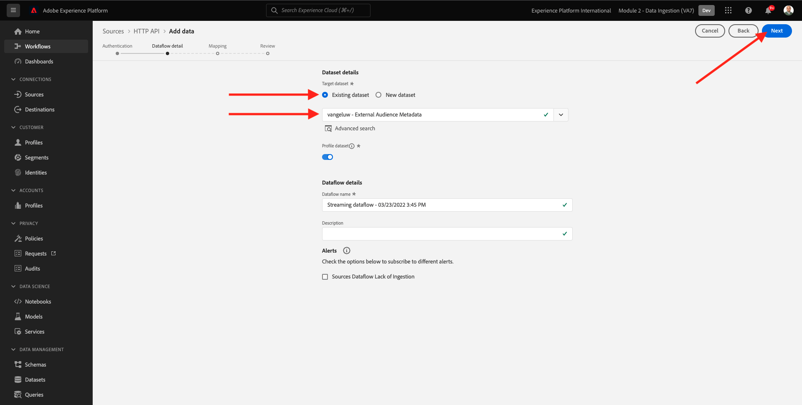
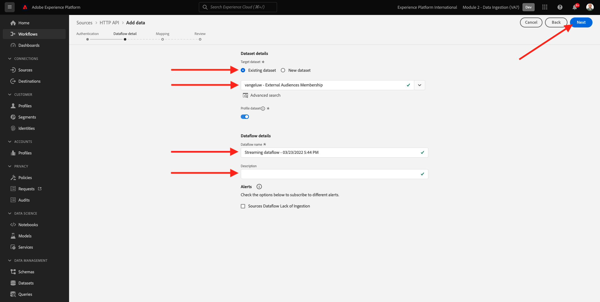
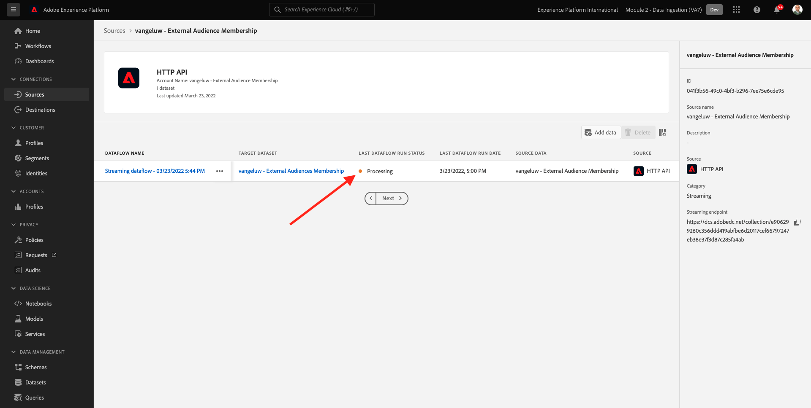
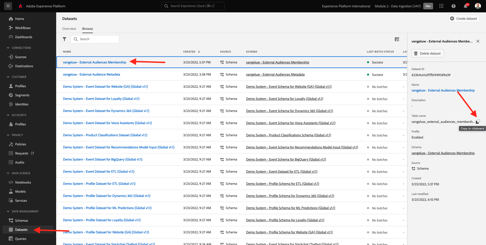

# 6.6 Extern publiek

In veel gevallen wil uw bedrijf bestaande segmenten uit andere toepassingen gebruiken om het klantprofiel in Adobe Experience Platform te verrijken.
Die externe doelgroepen kunnen zijn gedefinieerd op basis van een model voor gegevenswetenschap of met behulp van externe gegevensplatforms.

Met de functie Extern publiek van Adobe Experience Platform kunt u de aandacht richten op de opname van het externe publiek en de activering ervan zonder dat u de definitie van het desbetreffende segment in Adobe Experience Platform nader hoeft te definiëren.

Het algemene proces bestaat uit drie hoofdstappen:

- De metagegevens van het externe publiek importeren: Deze stap is bedoeld om de externe publieksmeta-gegevens, zoals de publieksnaam, in Adobe Experience Platform op te nemen.
- Wijs het externe publiekslidmaatschap aan het profiel van de klant toe: deze stap is bedoeld om het klantenprofiel met de externe attributen van het segmentlidmaatschap te verrijken.
- Maak de segmenten in Adobe Experience Platform: deze stap is bedoeld om actioneerbare segmenten tot stand te brengen die op het externe publiek lidmaatschap worden gebaseerd.

## 6.6.1 Metagegevens

Ga naar [Adobe Experience Platform](https://experience.adobe.com/platform). Na het aanmelden landt je op de homepage van Adobe Experience Platform.


>[!IMPORTANT]
>
>De sandbox die voor deze oefening moet worden gebruikt, is ``--module2sandbox--``!

Voordat u verdergaat, moet u een **sandbox**. De sandbox die moet worden geselecteerd, krijgt een naam ``--module2sandbox--``. U kunt dit doen door op de tekst te klikken **[!UICONTROL Productieproduct]** in de blauwe lijn boven op het scherm. Nadat u de juiste [!UICONTROL sandbox], ziet u de schermwijziging en nu bent u in uw eigen omgeving [!UICONTROL sandbox].


Terwijl de segmentgegevens de voorwaarde voor een profiel om deel van een segment bepalen te zijn, zijn de segmentmeta-gegevens informatie over het segment zoals de naam, de beschrijving en de status van het segment. Aangezien de metagegevens van het externe publiek in Adobe Experience Platform worden opgeslagen, moet u een naamruimte gebruiken om de metagegevens in Adobe Experience Platform in te voeren.

## 6.6.1.1 Identiteitsnaamruimte voor extern publiek

Er is al een naamruimte voor identiteiten gemaakt voor gebruik met **Extern publiek**.
Ga naar **Identiteiten** en zoek naar **Extern**. Klik op het item &quot;Extern publiek&quot;.

Opmerking:

- Het identiteitssymbool **extern publiek** wordt in de volgende stappen gebruikt om naar de identiteit van het externe publiek te verwijzen.
- De **Id van niet-personen** type wordt gebruikt voor deze identiteitsnaamruimte, aangezien deze naamruimte niet bedoeld is om klantprofielen maar segmenten te identificeren.


## 6.6.1.2 Het schema voor metagegevens van externe doelgroepen maken

De metagegevens van het externe publiek zijn gebaseerd op de **Segmentdefinitieschema**. Meer informatie vindt u in het gedeelte [XDM Github-opslagplaats](https://github.com/adobe/xdm/blob/master/docs/reference/classes/segmentdefinition.schema.md).

Ga in het linkermenu naar Schemas. Klikken **+ Schema maken** en klik vervolgens op **Bladeren**.


Als u een klasse wilt toewijzen, zoekt u naar **segmentdefinitie**. Selecteer **Segmentdefinitie** klasse en klik op **Klasse toewijzen**.


Dan zie je dit. Klikken **Annuleren**.


Dan zie je dit. Selecteer het veld **_id**. Schuif omlaag in het rechtermenu en schakel de optie **Identiteit** en de **Primaire identiteit** selectievakjes. Selecteer **Extern publiek** naamruimte identiteit. Klikken **Toepassen**.


Selecteer vervolgens de naam van het schema **Naamloos schema**. De naam wijzigen in `--demoProfileLdap-- - External Audiences Metadata`.


De optie **Profiel** schakelen en bevestigen. Tot slot klikt u op **Opslaan**.


## 6.6.1.3 De gegevensset met metagegevens van externe doelgroepen maken

In **Schemas**, ga naar **Bladeren**. Zoeken en klik op de knop `--demoProfileLdap-- - External Audiences Metadata` schema u in de vorige stap creeerde. Klik op Volgende **Dataset maken van schema**.


Voor het veld **Naam**, enter `--demoProfileLdap-- - External Audience Metadata`. Klikken **Gegevensset maken**.


Dan zie je dit. Vergeet niet de functie **Profiel** schakelen!


## 6.6.1.4 Een HTTP API-bronverbinding maken

Vervolgens moet u de HTTP API Source Connector configureren die u gebruikt om de metagegevens in de gegevensset in te voeren.

Ga naar **Bronnen**. Voer in het zoekveld **HTTP**. Klikken **Gegevens toevoegen**.


Voer de volgende gegevens in:

- **Accounttype**: selecteren **Nieuwe account**
- **Accountnaam**: enter `--demoProfileLdap-- - External Audience Metadata`
- Selectievakje inschakelen **Met XDM compatibel vak**

Klik op Volgende **Verbinden met bron**.


Dan zie je dit. Klik op **Next**.


Selecteren **Bestaande gegevensset** en in het vervolgkeuzemenu selecteert u de gegevensset `--demoProfileLdap-- - External Audience Metadata`.

Controleer de **Gegevens gegevensstroom** en klik vervolgens op **Volgende**.



Dan zie je dit.

De **Toewijzing** stap van de tovenaar is leeg aangezien u een XDM volgzame nuttige lading in de Bron van HTTP API Schakelaar zult opnemen, zodat wordt geen afbeelding vereist. Klik op **Next**.


In de **Controleren** kunt u desgewenst de verbinding en de toewijzingsdetails controleren. Klikken **Voltooien**.


Dan zie je dit.


## 6.6.1.5 Opname van metagegevens van externe doelgroepen

Klik op het tabblad Overzicht van de Source Connector op **...** en klik vervolgens op **Schema-lading kopiëren**.


Open de toepassing van de Teksteditor op uw computer en plak de lading die u net hebt gekopieerd. Deze ziet er als volgt uit. Vervolgens moet u de **xdmEntiteit** object in deze payload.


Het object **xdmEntiteit** moet worden vervangen door de onderstaande code. Kopieer de onderstaande code en plak deze in het tekstbestand door de naam **xdmEntiteit** in de teksteditor.

```
"xdmEntity": {
    "_id": "--demoProfileLdap---extaudience-01",
    "description": "--demoProfileLdap---extaudience-01 description",
    "segmentIdentity": {
      "_id": "--demoProfileLdap---extaudience-01",
      "namespace": {
        "code": "externalaudiences"
      }
    },
    "segmentName": "--demoProfileLdap---extaudience-01 name",
    "segmentStatus": "ACTIVE",
    "version": "1.0"
  }
```

U zou dan dit moeten zien:


Open vervolgens een nieuwe **Terminal** venster. Kopieer alle tekst in de Teksteditor en plak deze in het terminalvenster.


Volgende, druk op **Enter**.

U zult dan een bevestiging van uw gegevensopname in het Eind venster zien:


Vernieuw het scherm van de Bron van HTTP API schakelaar, waar u nu zult zien dat de gegevens worden verwerkt:


## 6.6.1.6 De metagegevens van externe doelgroepen valideren

Wanneer de verwerking wordt voltooid kunt u de gegevensbeschikbaarheid in de dataset controleren gebruikend de Dienst van de Vraag.

Ga in het rechtermenu naar **Gegevenssets** en selecteert u de `--demoProfileLdap-- - External Audience Metadata` dataset u eerder creeerde.


Ga in het rechtermenu naar Query&#39;s en klik op **Query maken**.


Voer de volgende code in en druk op **SHIFT + ENTER**:

```
select * from --demoProfileLdap--_external_audience_metadata
```

In de vraagresultaten zult u de meta-gegevens van de externe publiek zien die u hebt opgenomen.


## 6.6.2 Segmentlidmaatschap

Met de externe publieksmeta-gegevens beschikbaar kunt u nu het segmentlidmaatschap voor een specifiek klantenprofiel opnemen.

U moet nu een profieldataset voorbereiden die tegen het het lidmaatschapsschema van het Segment wordt verrijkt. Meer informatie vindt u in het gedeelte [XDM Github-opslagplaats](https://github.com/adobe/xdm/blob/master/docs/reference/datatypes/segmentmembership.schema.md).

## 6.6.2.1 Het lidmaatschapsschema voor externe doelgroepen maken

Ga in het rechtermenu naar **Schemas**. Klikken **Schema maken** en klik vervolgens op **Afzonderlijk XDM-profiel**.


In de **Veldgroepen toevoegen** popup, zoeken naar **Profielkern**. Selecteer **Profile Core v2** veldgroep.


Volgende, in **Veldgroepen toevoegen** popup, zoeken naar **Segmentlidmaatschap**. Selecteer **Details segmentlidmaatschap** veldgroep. Klik op Volgende **Veldgroepen toevoegen**.


Dan zie je dit. Naar het veld navigeren `--aepTenantId--.identification.core`. Klik op de knop **crmId** veld. Blader in het rechtermenu omlaag en controleer de instelling **Identiteit** en de **Primaire identiteit** selectievakjes. Voor de **Naamruimte van identiteit** selecteren **Demosysteem - CRMID**.

Klikken **Toepassen**.


Selecteer vervolgens de naam van het schema **Naamloos schema**. Typ in het veld Weergavenaam `--demoProfileLdap-- - External Audiences Membership`.


Schakel vervolgens de optie **Profiel** schakelen en bevestigen. Klikken **Opslaan**.


## 6.6.2.2 Maak een gegevensset voor het lidmaatschap van externe doelgroepen

In **Schemas**, ga naar **Bladeren**. Zoeken en klik op de knop `--demoProfileLdap-- - External Audiences Membership` schema u in de vorige stap creeerde. Klik op Volgende **Dataset maken van schema**.


Voor het veld **Naam**, enter `--demoProfileLdap-- - External Audiences Membership`. Klikken **Gegevensset maken**.


Dan zie je dit. Vergeet niet de functie **Profiel** schakelen!


## 6.6.2.3 Een HTTP API-bronverbinding maken


Vervolgens moet u de HTTP API Source Connector configureren die u gebruikt om de metagegevens in de gegevensset in te voeren.

Ga naar **Bronnen**. Voer in het zoekveld **HTTP**. Klikken **Gegevens toevoegen**.


Voer de volgende gegevens in:

- **Accounttype**: selecteren **Nieuwe account**
- **Accountnaam**: enter `--demoProfileLdap-- - External Audience Membership`
- Selectievakje inschakelen **Met XDM compatibel vak**

Klik op Volgende **Verbinden met bron**.


Dan zie je dit. Klik op **Next**.


Selecteren **Bestaande gegevensset** en in het vervolgkeuzemenu selecteert u de gegevensset `--demoProfileLdap-- - External Audiences Membership`.

Controleer de **Gegevens gegevensstroom** en klik vervolgens op **Volgende**.



Dan zie je dit.

De **Toewijzing** stap van de tovenaar is leeg aangezien u een XDM volgzame nuttige lading in de Bron van HTTP API Schakelaar zult opnemen, zodat wordt geen afbeelding vereist. Klik op **Next**.


In de **Controleren** kunt u desgewenst de verbinding en de toewijzingsdetails controleren. Klikken **Voltooien**.


Dan zie je dit.


## 6.6.2.4 Verontreiniging van de gegevens over het lidmaatschap van externe doelgroepen

Klik op het tabblad Overzicht van de Source Connector op **...** en klik vervolgens op **Schema-lading kopiëren**.


Open de toepassing van de Teksteditor op uw computer en plak de lading die u net hebt gekopieerd. Deze ziet er als volgt uit. Vervolgens moet u de **xdmEntiteit** object in deze payload.


Het object **xdmEntiteit** moet worden vervangen door de onderstaande code. Kopieer de onderstaande code en plak deze in het tekstbestand door de naam **xdmEntiteit** in de teksteditor.

```
  "xdmEntity": {
    "_id": "--demoProfileLdap---profile-test-01",
    "_experienceplatform": {
      "identification": {
        "core": {
          "crmId": "--demoProfileLdap---profile-test-01"
        }
      }
    },
    "personID": "--demoProfileLdap---profile-test-01",
    "segmentMembership": {
      "externalaudiences": {
        "--demoProfileLdap---extaudience-01": {
          "status": "realized",
          "lastQualificationTime": "2022-03-05T00:00:00Z"
        }
      }
    }
  }
```

U zou dan dit moeten zien:


Open vervolgens een nieuwe **Terminal** venster. Kopieer alle tekst in de Teksteditor en plak deze in het terminalvenster.


Volgende, druk op **Enter**.

U zult dan een bevestiging van uw gegevensopname in het Eind venster zien:


Vernieuw het scherm van de Bron van HTTP API schakelaar, waar u na een paar notulen zult zien dat de gegevens worden verwerkt:



## 6.6.2.5 Valideren van lidmaatschap voor externe doelgroepen

Wanneer de verwerking wordt voltooid kunt u de gegevensbeschikbaarheid in de dataset controleren gebruikend de Dienst van de Vraag.

Ga in het rechtermenu naar **Gegevenssets** en selecteert u de `--demoProfileLdap-- - External Audiences Membership ` dataset u eerder creeerde.



Ga in het rechtermenu naar Query&#39;s en klik op **Query maken**.


Voer de volgende code in en druk op **SHIFT + ENTER**:

```
select * from --demoProfileLdap--_external_audiences_membership
```

In de vraagresultaten zult u de meta-gegevens van de externe publiek zien die u hebt opgenomen.


## 6.6.3 Een segment maken

Nu bent u klaar om actie te ondernemen tegen het externe publiek.
In Adobe Experience Platform wordt actie ondernomen door het creëren van segmenten, het vullen van de respectieve doelgroepen en het delen van die doelgroepen.
U zult nu een segment gebruikend het externe publiek creëren u enkel creeerde.

Ga in het linkermenu naar **Segmenten** en klik op **Segment maken**.


Ga naar **Soorten publiek**. Dan zie je dit. Klikken **Extern publiek**.


Selecteer het externe publiek dat u eerder hebt gemaakt en dat een naam heeft `--demoProfileLdap---extaudience-01`. Sleep het publiek naar het canvas.


Geef uw segment een naam, gebruik `--demoProfileLdap-- - extaudience-01`. Klikken **Opslaan en sluiten**.


Dan zie je dit. U zult ook opmerken dat het profiel waarvoor u het segmentlidmaatschap opnam nu in de lijst van toont **Voorbeeldprofielen**.


Uw segment is nu klaar en kan naar een bestemming voor activering worden verzonden.

## 6.6.4 Het profiel van uw klant visualiseren

U kunt nu ook de segmentkwalificatie visualiseren op uw klantprofiel. Ga naar **Profielen**, gebruikt u de naamruimte identity **Demosysteem - CRMID** en geef de identiteit `--demoProfileLdap---profile-test-01`, die u gebruikte als onderdeel van oefening 6.6.2.4, en klik **Weergave**. Klik op de knop **Profiel-id** om het profiel te openen.


Ga naar **Segmentlidmaatschap**, waar je je externe publiek ziet verschijnen.


Volgende stap: [6.7 Doelen SDK](./ex7.md)

[Ga terug naar module 6](./real-time-cdp-build-a-segment-take-action.md)

[Terug naar alle modules](../../overview.md)
