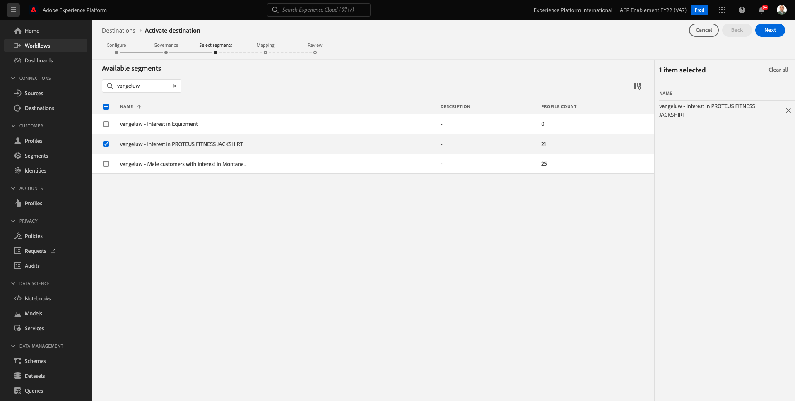

# 6.7 Doelen SDK

## 6.7.1 Uw Adobe I/O-project instellen

>[!IMPORTANT]
>
>Als u uw project van de Adobe I/O na December 2021 hebt gecreeerd, kunt u dat project hergebruiken, deze oefening overslaan en zich aan oefening 6.7.2 onmiddellijk bewegen.
>
>Als u uw Adobe I/O project vóór December 2021 creeerde, gelieve een nieuw project tot stand te brengen om het met de Authoring API van Doelen compatibel te maken.

In deze oefening zult u Adobe I/O vrij intensief aan vraag tegen Platform APIs gebruiken. Volg de onderstaande stappen om Adobe I/O in te stellen.

Ga naar [https://developer.adobe.com/console/home](https://developer.adobe.com/console/home)


Selecteer de juiste Adobe Experience Platform-instantie in de rechterbovenhoek van het scherm. Uw instantie is `--envName--`.


Klikken **Nieuw project maken**.

 of


Selecteren **+ Toevoegen aan project** en selecteert u **API**.


U zult dan dit zien:


Klik op de knop **Adobe Experience Platform** pictogram.


Klikken **Experience Platform-API**.


Klik op **Next**.


U kunt er nu voor kiezen om Adobe I/O uw beveiligingssleutel te laten genereren of een bestaand sleutelpaar te laten uploaden.

Kies **Optie 1 - Een sleutelpaar genereren**.


Klikken **Keypair genereren**.


Je ziet een spinner voor ongeveer 30 seconden.


U zult dan dit zien, en uw geproduceerd sleutelpaar zal als zip dossier worden gedownload: **config.zip**.

Het bestand uitpakken **config.zip** op uw bureaublad ziet u dat het 2 bestanden bevat:


- **certificate_pub.crt** is uw openbare-sleutelcertificaat. Vanuit een veiligheidsperspectief, is dit het certificaat dat vrij aan opstellingsintegratie met online toepassingen wordt gebruikt.
- **private.key** is uw persoonlijke sleutel. Dit mag nooit met iemand worden gedeeld. De persoonlijke sleutel is wat u gebruikt voor verificatie voor uw API-implementatie en moet een geheim zijn. Als u uw Privé Sleutel met iedereen deelt, kunnen zij tot uw implementatie toegang hebben en API misbruiken om kwaadwillige gegevens in Platform in te voeren en alle gegevens te halen die in Platform zitten.


Zorg ervoor dat u de **config.zip** bestand op een veilige locatie. U hebt dit nodig voor de volgende stappen en voor toekomstige toegang tot Adobe I/O- en Adobe Experience Platform-API&#39;s.

Klik op **Next**.


U moet nu de **Productprofiel(en)** voor uw integratie.

Selecteer de vereiste productprofielen.

**FYI**: in uw Adobe Experience Platform-exemplaar hebben de productprofielen een andere naam. U moet ten minste één productprofiel selecteren met de juiste toegangsrechten, die zijn ingesteld in de Adobe Admin Console.


Klikken **Configureerde API opslaan**.


Je ziet een spinner voor een paar seconden.


En daarna zie je je integratie.


Klik op de knop **Downloaden naar Postman** en klik vervolgens op **Serviceaccount (JWT)** om een Postman-omgeving te downloaden (dit kan een paar seconden duren voordat de omgeving is gedownload).


Omlaag schuiven totdat u ziet **Serviceaccount (JWT)**, waar u al uw integratiegegevens kunt vinden die worden gebruikt om de integratie met Adobe Experience Platform te configureren.


Uw IO-project heeft momenteel een algemene naam. Je moet je integratie een vriendelijke naam geven. Klikken op **Project 1** (of soortgelijke naam) zoals aangegeven


Klikken **Project bewerken**.


Voer een naam en beschrijving in voor uw integratie. Als naamgevingsconventie gebruiken we `AEP API --demoProfileLdap--`. Vervang ldap door uw ldap.
Als uw LDAP bijvoorbeeld vangeluw is, worden de naam en beschrijving van uw integratie gewijzigd in AEP API vangeluw.

Enter `AEP API --demoProfileLdap--` als de **Projecttitel**. Klikken **Opslaan**.


Uw Adobe I/O-integratie is nu voltooid.


## 6.7.2 Postman-verificatie naar Adobe I/O

Ga naar [https://www.getpostman.com/](https://www.getpostman.com/).

Klikken op **Aan de slag**.


Download en installeer vervolgens Postman.


Start de toepassing nadat u Postman hebt geïnstalleerd.

In Postman zijn er twee concepten: Omgevingen en verzamelingen.

- Het milieu bevat al uw milieuvariabelen die min of meer samenhangend zijn. In het Milieu, zult u dingen zoals IMSOrg van ons milieu van het Platform, naast veiligheidsgeloofsbrieven zoals uw Privé Sleutel en anderen vinden. Het omgevingsbestand is het bestand dat u tijdens de vorige Adobe I/O-installatie hebt gedownload. De naam ziet er als volgt uit: **service.postman_environment.json**.

- De verzameling bevat een aantal API-aanvragen die u kunt gebruiken. We gebruiken twee verzamelingen
   - 1 Verzameling voor Authentificatie aan Adobe I/0
   - 1 Verzameling voor de oefeningen in deze module
   - 1 inzameling voor de oefeningen in de module van Real-Time CDP, voor de Authoring van de Bestemming

Download het bestand [postman.zip](../../assets/postman/postman_profile.zip) naar uw lokale bureaublad.

In dit **postman.zip** , vindt u de volgende bestanden:

- `_Adobe I-O - Token.postman_collection.json`
- `_Adobe Experience Platform Enablement.postman_collection.json`
- `Destination_Authoring_API.json`

De **postman.zip** Deze 3 bestanden samen met de gedownloade Postman-omgeving van Adobe I/O opslaan en opslaan in een map op uw bureaublad. U hebt deze 4 bestanden nodig in die map:


Ga terug naar Postman. Klikken **Importeren**.


Klikken **Bestanden uploaden**.


Navigeer naar de map op uw bureaublad waarin u de vier gedownloade bestanden hebt uitgepakt. Selecteer deze 4 bestanden tegelijk en klik op **Openen**.


Nadat u hebt geklikt **Openen** Postman geeft u een overzicht van de omgeving en verzamelingen die u wilt importeren. Klikken **Importeren**.


U hebt nu alles wat u nodig hebt in Postman om te gaan communiceren met Adobe Experience Platform via de API&#39;s.

Het eerste wat je moet doen, is ervoor zorgen dat je op de juiste manier geverifieerd bent. Om voor authentiek te worden verklaard, moet u om een toegangstoken verzoeken.

Zorg ervoor dat u het juiste Milieu hebt geselecteerd alvorens om het even welk verzoek uit te voeren. U kunt de momenteel geselecteerde omgeving controleren door de vervolgkeuzelijst Omgeving in de rechterbovenhoek te controleren.

De geselecteerde omgeving moet een naam hebben die vergelijkbaar is met deze:


Klik op de knop **oog** pictogram en klik vervolgens op **Bewerken** om de persoonlijke sleutel in het omgevingsbestand bij te werken.


Dan zie je dit. Alle velden zijn vooraf ingevuld, behalve het veld **PRIVATE_KEY**.


De persoonlijke sleutel is gegenereerd toen u uw Adobe I/O-project hebt gemaakt. Het bestand is gedownload als een ZIP-bestand met de naam **config.zip**. Pak dat ZIP-bestand uit op uw bureaublad.


De map openen **config** en opent u het bestand **private.key** met de gewenste teksteditor.


Vervolgens ziet u iets dat hierop lijkt, en kopieert u alle tekst naar het klembord.


Ga terug naar Postman en plak de persoonlijke sleutel in de velden naast de variabele **PRIVATE_KEY** voor beide kolommen **EERSTE WAARDE** en **HUIDIGE WAARDE**. Klikken **Opslaan**.


Uw Postman-omgeving en -verzamelingen zijn nu geconfigureerd en werken. U kunt nu verifiëren van Postman naar Adobe I/O.

Hiervoor moet u een externe bibliotheek laden die zorgt voor de codering en ontsleuteling van communicatie. Als u deze bibliotheek wilt laden, moet u de aanvraag met de naam uitvoeren **INIT: Cryptobibliotheek laden voor RS256**. Selecteer deze aanvraag in het dialoogvenster **_Adobe I/O - Symbolische verzameling** en je ziet het midden op je scherm.


Klik op blauw **Verzenden** knop. Na een paar seconden, zou u een reactie moeten zien die in wordt getoond **Lichaam** sectie van Postman:


Met de cryptobibliotheek nu geladen, kunnen wij aan Adobe I/O voor authentiek verklaren.

In de **\_Adobe I/O - Symbolische verzameling** selecteert u de aanvraag met de naam **IMS: JWT Genereren + Auth**. Ook hier ziet u de aanvraagdetails midden in het scherm.


Klik op blauw **Verzenden** knop. Na een paar seconden, zou u een reactie moeten zien die in wordt getoond **Lichaam** sectie van Postman:


Als uw configuratie succesvol was, zou u een gelijkaardige reactie moeten zien die de volgende informatie bevat:

| Sleutel | Waarde |
|:-------------:| :---------------:| 
| token_type | **drager** |
| access_token | **eyJ4NXUiOiJpbXNfbmEx...QT7mqZkumN1tdsPEioOEl4087Dg** |
| verloopt_in | **86399973** |

Adobe I/O heeft u een **drager**-token, met een specifieke waarde (dit zeer lange access_token) en een vervalvenster.

De token die we hebben ontvangen, is nu 24 uur geldig. Dit betekent dat na 24 uur, als u Postman wilt gebruiken om aan Adobe I/O voor authentiek te verklaren, u een nieuw teken zult moeten produceren door dit verzoek opnieuw in werking te stellen.

## 6.7.3 Definiëren van eindpunt en formaat

Voor deze oefening, zult u een eindpunt nodig hebben om te vormen zodat wanneer een segment kwalificeert, de kwalificatiegebeurtenis aan dat eindpunt kan worden gestroomd. In deze oefening, zult u een steekproefeindpunt gebruiken gebruikend [https://webhook.site/](https://webhook.site/). Ga naar [https://webhook.site/](https://webhook.site/)Daar zie je iets gelijkaardigs. Klikken **Kopiëren naar klembord** om de URL te kopiëren. U zult deze url in de volgende oefening moeten specificeren. De URL in dit voorbeeld is `https://webhook.site/e0eb530c-15b4-4a29-8b50-e40877d5490a`.


Wat het formaat betreft, zullen wij een standaardmalplaatje gebruiken dat segmentkwalificaties of onkwalificaties samen met meta-gegevens zoals klantenherkenningstekens stroomt. De malplaatjes kunnen worden aangepast om aan de verwachtingen van specifieke eindpunten te voldoen, maar in deze oefening zullen wij een standaardmalplaatje opnieuw gebruiken, dat in een nuttige last als dit zal resulteren die aan het eindpunt zal worden gestroomd.

```json
{
  "profiles": [
    {
      "identities": [
        {
          "type": "ecid",
          "id": "64626768309422151580190219823409897678"
        }
      ],
      "AdobeExperiencePlatformSegments": {
        "add": [
          "f58c723c-f1e5-40dd-8c79-7bb4ab47f041"
        ],
        "remove": []
      }
    }
  ]
}
```

## 6.7.4 Een server- en sjabloonconfiguratie maken

De eerste stap om uw eigen Doel in Adobe Experience Platform te creëren is een server en malplaatjeconfiguratie tot stand te brengen.

Ga om dat te doen naar **Authoring-API voor doelen**, naar **Doelservers en sjablonen** en klik om het verzoek te openen **POST - Een doelserverconfiguratie maken**. Dan zie je dit. Onder **Kopteksten** moet u de waarde voor de toets handmatig bijwerken **x-sandbox-name** en stel deze in op `--aepSandboxId--`. Selecteer de waarde **{{SANDBOX_NAME}}**.


Vervangen door `--aepSandboxId--`.


Ga vervolgens naar **Lichaam**. de tijdelijke aanduiding selecteren **{{body}}**.


U moet nu de tijdelijke aanduiding vervangen **{{body}}** met de onderstaande code:

```json
{
    "name": "Custom HTTP Destination",
    "destinationServerType": "URL_BASED",
    "urlBasedDestination": {
        "url": {
            "templatingStrategy": "PEBBLE_V1",
            "value": "yourURL"
        }
    },
    "httpTemplate": {
        "httpMethod": "POST",
        "requestBody": {
            "templatingStrategy": "PEBBLE_V1",
            "value": "{\n    \"profiles\": [\n    \n        {\n            \"identities\": [\n            \n            \n                \n                {\n                    \"type\": \"{{ namespace }}\",\n                    \"id\": \"{{ identity.id }}\"\n                },\n                ,\n            \n            ],\n            \"AdobeExperiencePlatformSegments\": {\n                \"add\": [\n                \n                    \"{{ segment.key }}\",\n                \n                ],\n                \"remove\": [\n                {#- Alternative syntax for filtering segments by status: -#}\n                \n                    \"{{ segment.key }}\",\n                \n                ]\n            }\n        },\n    \n    ]\n}"
        },
        "contentType": "application/json"
    }
}
```

Nadat u de bovenstaande code hebt geplakt, moet u het veld handmatig bijwerken **urlBasedDestination.url.value** en moet u deze instellen op de URL van de webhaak die u in de vorige stap hebt gemaakt, namelijk `https://webhook.site/e0eb530c-15b4-4a29-8b50-e40877d5490a` in dit voorbeeld.


Na het bijwerken van het veld **urlBasedDestiantion.url.value** Het moet er zo uitzien. Klikken **Verzenden**.


Na klikken **Verzenden**, wordt uw serversjabloon gemaakt en als onderdeel van de reactie ziet u een veld met de naam **instanceId**. Schrijf het neer, aangezien u het in de volgende stap zult nodig hebben. In dit voorbeeld wordt **instanceId** is
`eb0f436f-dcf5-4993-a82d-0fcc09a6b36c`.


## 6.7.5 Creeer uw bestemmingsconfiguratie

In Postman, onder **Authoring-API voor doelen**, ga naar **Doelconfiguraties** en klik om het verzoek te openen **POST - Een doelconfiguratie maken**. Dan zie je dit. Onder **Kopteksten** moet u de waarde voor de toets handmatig bijwerken **x-sandbox-name** en stel deze in op `--aepSandboxId--`. Selecteer de waarde **{{SANDBOX_NAME}}**.


Vervangen door `--aepSandboxId--`.


Ga vervolgens naar **Lichaam**. de tijdelijke aanduiding selecteren **{{body}}**.


U moet nu de tijdelijke aanduiding vervangen **{{body}}** met de onderstaande code:

```json
{
    "name": "--demoProfileLdap-- - Webhook",
    "description": "Exports segment qualifications and identities to a custom webhook via Destination SDK.",
    "status": "TEST",
    "customerAuthenticationConfigurations": [
        {
            "authType": "BEARER"
        }
    ],
    "customerDataFields": [
        {
            "name": "endpointsInstance",
            "type": "string",
            "title": "Select Endpoint",
            "description": "We could manage several instances across the globe for REST endpoints that our customers are provisioned for. Select your endpoint in the dropdown list.",
            "isRequired": true,
            "enum": [
                "US",
                "EU",
                "APAC",
                "NZ"
            ]
        }
    ],
    "uiAttributes": {
        "documentationLink": "https://experienceleague.adobe.com/docs/experience-platform/destinations/home.html?lang=en",
        "category": "streaming",
        "connectionType": "Server-to-server",
        "frequency": "Streaming"
    },
    "identityNamespaces": {
        "ecid": {
            "acceptsAttributes": true,
            "acceptsCustomNamespaces": false
        }
    },
    "segmentMappingConfig": {
        "mapExperiencePlatformSegmentName": true,
        "mapExperiencePlatformSegmentId": true,
        "mapUserInput": false
    },
    "aggregation": {
        "aggregationType": "BEST_EFFORT",
        "bestEffortAggregation": {
            "maxUsersPerRequest": "1000",
            "splitUserById": false
        }
    },
    "schemaConfig": {
        "profileRequired": false,
        "segmentRequired": true,
        "identityRequired": true
    },
    "destinationDelivery": [
        {
            "authenticationRule": "NONE",
            "destinationServerId": "yourTemplateInstanceID"
        }
    ]
}
```


Nadat u de bovenstaande code hebt geplakt, moet u het veld handmatig bijwerken **destinationDelivery. destinationServerId** en moet u deze instellen op **instanceId** van het malplaatje van de bestemmingsserver u in de vorige stap creeerde, die `eb0f436f-dcf5-4993-a82d-0fcc09a6b36c` in dit voorbeeld. Volgende, klik **Verzenden**.


Dan zie je dit antwoord.


Je bestemming is nu gemaakt in Adobe Experience Platform. Laten we daar naartoe gaan en het controleren.

Ga naar [Adobe Experience Platform](https://experience.adobe.com/platform). Na het aanmelden landt je op de homepage van Adobe Experience Platform.


Voordat u verdergaat, moet u een **sandbox**. De sandbox die moet worden geselecteerd, krijgt een naam ``--aepSandboxId--``. U kunt dit doen door op de tekst te klikken **[!UICONTROL Productieproduct]** in de blauwe lijn boven op het scherm. Nadat u de juiste [!UICONTROL sandbox], ziet u de schermwijziging en nu bent u in uw eigen omgeving [!UICONTROL sandbox].


Ga in het linkermenu naar **Doelen**, klikt u op **Catalogus** en naar de categorie schuiven **Streaming**. Je ziet je bestemming nu beschikbaar.


## 6.7.6 Verbinding uw segment aan uw bestemming

In **Doelen** > **Catalogus**, klikt u op **Instellen** op uw bestemming beginnen segmenten aan uw nieuwe bestemming toe te voegen.


Voer bijvoorbeeld een dummytoken voor toonder in **1234**. Klikken **Verbinden met doel**.


Dan zie je dit. Als naam voor uw bestemming, gebruik `--demoProfileLdap-- - Webhook`. Selecteer een eindpunt van keus, in dit voorbeeld **EU**. Klik op **Next**.


U kunt desgewenst een beleid voor gegevensbeheer selecteren. Klik op **Next**.


Selecteer het segment dat u eerder hebt gemaakt en dat een naam heeft `--demoProfileLdap-- - Interest in PROTEUS FITNESS JACKSHIRT`. Klik op **Next**.



Dan zie je dit. Zorg ervoor dat u de **BRONVELD** `--aepTenantId--.identification.core.ecid` naar het veld `Identity: ecid`. Klik op **Next**.


Klikken **Voltooien**.


Uw bestemming is nu live. Nieuwe segmentkwalificaties worden nu gestreamd naar uw aangepaste webhaak.


## 6.7.7 Test uw segment activeren

Ga naar [https://builder.adobedemo.com/projects](https://builder.adobedemo.com/projects). Nadat je je hebt aangemeld bij je Adobe ID, kun je dit zien. Klik op uw websiteproject om het te openen.


U kunt nu de onderstaande workflow volgen om toegang te krijgen tot de website. Klikken **Integraties**.


Op de **Integraties** pagina, moet u het bezit van de Inzameling van Gegevens selecteren dat in oefening 0.1 werd gecreeerd.


Vervolgens wordt uw demowebsite geopend. Selecteer de URL en kopieer deze naar het klembord.


Open een nieuw Incognito-browservenster.


Plak de URL van uw demowebsite, die u in de vorige stap hebt gekopieerd. Vervolgens wordt u gevraagd u aan te melden met uw Adobe ID.


Selecteer uw accounttype en voltooi het aanmeldingsproces.


Uw website wordt vervolgens geladen in een Incognito-browservenster. Voor elke demonstratie, zult u een vers, incognito browser venster moeten gebruiken om uw demowebsite URL te laden.


Van de **Luminantie** homepage, ga naar **Mannen** en klik op het product **PROTEUS FITNESS JACKSHIRT**.


U hebt nu de productpagina bezocht voor **PROTEUS FITNESS JACKSHIRT** Dit betekent dat u nu in aanmerking komt voor het segment dat u eerder in deze oefening hebt gemaakt.


Wanneer u de profielviewer opent en naar **Segmenten**, ziet u dat het segment in aanmerking komt.


Ga nu terug naar uw open webhaak op [https://webhook.site/](https://webhook.site/), waar u een nieuw inkomend verzoek zou moeten zien, dat uit Adobe Experience Platform voortkomt en de gebeurtenis van de segmentkwalificatie bevat.


Volgende stap: [Samenvatting en voordelen](./summary.md)

[Ga terug naar module 6](./real-time-cdp-build-a-segment-take-action.md)

[Terug naar alle modules](../../overview.md)
