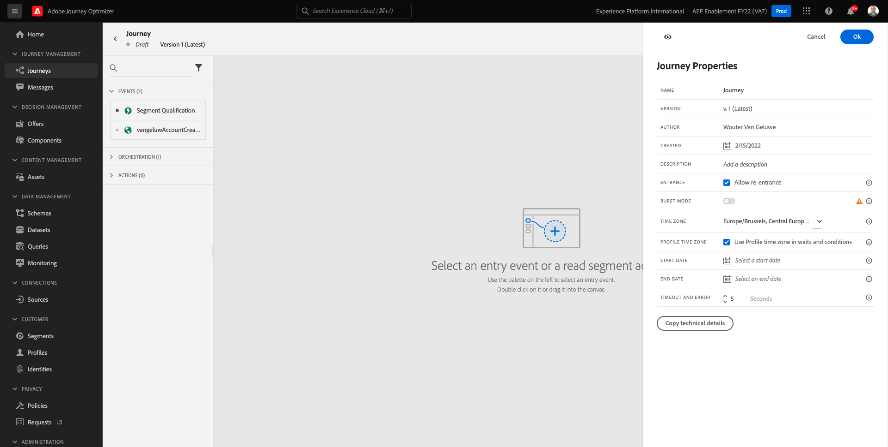
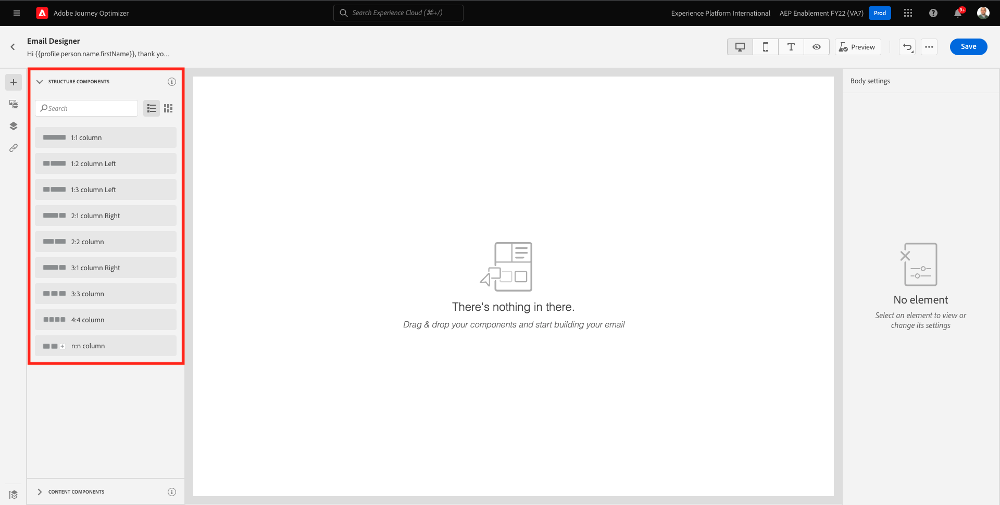
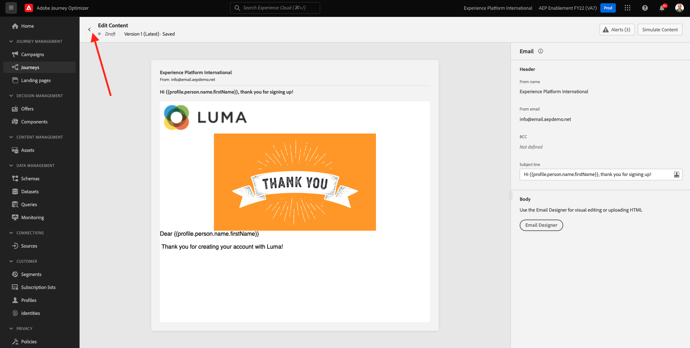
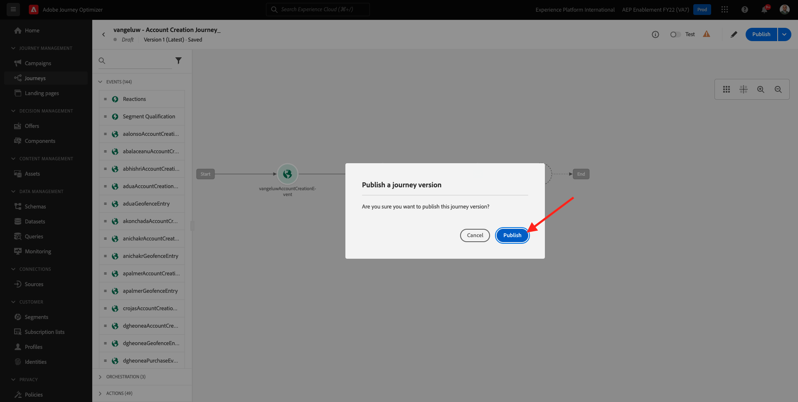

# 7.2 Maak uw reis en e-mailbericht

In deze oefening, zult u de reis en het bericht vormen die moeten worden teweeggebracht wanneer iemand een rekening op de demowebsite creeert.

Aanmelden bij Adobe Journey Optimizer door naar [Adobe Experience Cloud](https://experience.adobe.com). Klikken **Journey Optimizer**.

U wordt omgeleid naar de **Home**  in Journey Optimizer. Eerst, zorg ervoor u de correcte zandbak gebruikt. De sandbox die moet worden gebruikt, wordt `--aepSandboxId--`. Als u van de ene naar de andere sandbox wilt gaan, klikt u op **PRODUCTIEVOORRAAD (VA7)** en selecteert u de sandbox in de lijst. In dit voorbeeld krijgt de sandbox een naam **AEP-activering FY22**. Dan ben je in de **Home** weergave van de sandbox `--aepSandboxId--`.

## 7.2.1 Maak uw reis

Klik in het linkermenu op **Reizen**. Klik op Volgende **Reis maken** om een nieuwe reis te maken.

Dan zie je een leeg reisscherm.

In de vorige oefening creeerde u een nieuw **Gebeurtenis**. U noemde het zo `ldapAccountCreationEvent` en vervangen `ldap` met uw ldap. Dit was het resultaat van het maken van de gebeurtenis:

U moet deze gebeurtenis nu als begin van deze reis nemen. U kunt dit doen door naar de linkerkant van het scherm te gaan en naar uw gebeurtenis in de lijst met gebeurtenissen te zoeken.

Selecteer de gebeurtenis, sleep deze naar het canvas Reis. Uw reis ziet er nu als volgt uit:

Als tweede stap in de reis, moet u een korte toevoegen **Wachten** stap. Naar de linkerkant van het scherm **Orchestratie** voor meer informatie. U zult profielattributen gebruiken en moet ervoor zorgen zij in het Profiel van de Klant in real time worden bevolkt.

Je reis ziet er nu zo uit. Aan de rechterkant van het scherm moet u de wachttijd configureren. Stel dit in op 1 minuut. Dit geeft voldoende tijd om de profielkenmerken beschikbaar te maken nadat de gebeurtenis is gestart.

Klikken **OK** om uw wijzigingen op te slaan.

Als derde stap in de reis, moet u toevoegen **E-mail** handeling. Naar de linkerkant van het scherm gaan **Handelingen**, selecteert u de **E-mail** actie, dan belemmering en laat vallen het op de tweede knoop in uw reis. U ziet dit nu.

Stel de **Categorie** tot **Marketing** en selecteer een e-mailoppervlak waarmee u e-mail kunt verzenden. In dit geval is het te selecteren e-mailoppervlak **E-mail**. Zorg ervoor dat de selectievakjes **Klik op e-mail** en **e-mail wordt geopend** zijn beide ingeschakeld.

De volgende stap is uw bericht te creëren. Om dat te doen, klikt u op **Inhoud bewerken**.

## 7.2.2 Uw bericht maken

Klik op **Inhoud bewerken**.

U ziet dit nu.

Klik op de knop **Onderwerpregel** tekstveld.

Begin met schrijven in het tekstgebied **Hallo**

De onderwerpregel is nog niet gereed. Vervolgens moet u het personalisatietoken voor het veld introduceren **Voornaam** dat is opgeslagen onder `profile.person.name.firstName`. Blader in het linkermenu omlaag om de **Persoon** en klik op de pijl om een niveau dieper te gaan.

Zoek nu de **Volledige naam** en klik op de pijl om een niveau dieper te gaan.

Tot slot, vind **Voornaam** en klik op de knop **+** onderteken ernaast. Vervolgens ziet u het personalisatietoken in het tekstveld.

Voeg vervolgens de tekst toe **, dank u dat u zich hebt aangemeld!**. Klikken **Opslaan**.

Dan ben je hier weer. Klikken **E-mailontwerper** om de inhoud van de e-mail te maken.

In het volgende scherm krijgt u drie verschillende methoden om de inhoud van de e-mail te verschaffen:

- **Ontwerpen vanaf nul**: Begin met een leeg canvas en gebruik de WYSIWYG-redacteur om structuur en inhoudscomponenten te slepen en te laten vallen om de inhoud van e-mail visueel op te bouwen.
- **Uw eigen code schrijven**: Uw eigen e-mailsjabloon maken door deze te coderen met HTML
- **HTML importeren**: Importeer een bestaande HTML-sjabloon, die u kunt bewerken.

Klikken **Ontwerpen vanaf nul**.

In het linkermenu vindt u de structuurcomponenten die u kunt gebruiken om de structuur van de e-mail (rijen en kolommen) te definiëren.

Sleep een **1:2, kolom links** in het menu naar het canvas. Dit is de plaatsaanduiding voor de logoafbeelding.

Sleep een **1:1, kolom** onder de vorige component. Dit wordt het bannerblok.

Sleep een **1:2, kolom links** onder de vorige component. Dit is de werkelijke inhoud met een afbeelding aan de linkerkant en tekst aan de rechterkant.

Vervolgens sleept u een **1:1, kolom** onder de vorige component. Dit wordt de voettekst van e-mail. Uw canvas moet er nu als volgt uitzien:

Vervolgens gebruiken we Inhoud-componenten om inhoud toe te voegen binnen deze blokken. Klik op de knop **Inhoudscomponenten** menu-item

Sleep een **Afbeelding** in de eerste cel op de eerste rij. Klikken **Bladeren**.

Dan zie je dit. Ga naar de map **vermogensbestanddelen** en selecteer het bestand **luma-logo.png**. Klikken **Selecteren**.

U bent nu weer hier:

Ga naar **Inhoudscomponenten** en sleep een **Afbeelding** in de eerste cel op de eerste rij. Klikken **Bladeren**.

In de **Activa** pop-up, ga naar **vermogensbestanddelen** map. In deze map vindt u alle middelen die eerder door het creatieve team zijn voorbereid en geüpload. Selecteren **module23-thankyou-new.png** en klik op **Selecteren**.

Dan heb je het volgende:

Selecteer de afbeelding en schuif omlaag in het rechtermenu totdat u het dialoogvenster **Grootte** component width slider. Gebruik de schuifregelaar om de breedte te wijzigen in f.i. **60%**.

Ga vervolgens naar **Inhoudscomponenten** en sleep een **Tekst** in de structuurcomponent op de vierde rij.

De standaardtekst selecteren **Typ hier uw tekst.** zoals u met om het even welke tekstredacteur zou doen. Schrijven **Beste** in plaats daarvan. De werkbalk Tekst wordt weergegeven in de tekstmodus.

Klik op de werkbalk op de knop **Aanpassing toevoegen** pictogram.

Nu moet u de **Voornaam** personalisatietoken dat onder wordt opgeslagen `profile.person.name.firstName`. Zoek in het menu de **Persoon** element, naar beneden boren naar de **Volledige naam** en klik vervolgens op de knop **+** pictogram om het veld Voornaam toe te voegen aan de expressieeditor.

Klikken **Opslaan**.

U zult nu zien hoe het verpersoonlijkingsgebied aan uw tekst is toegevoegd.

Klik in hetzelfde tekstveld op **Enter** twee keer om twee regels toe te voegen en te schrijven **Hartelijk dank voor het maken van uw account met Luma!**.

De laatste controle die moet worden uitgevoerd om te controleren of uw e-mail gereed is, is een voorvertoning ervan. Klik op de knop **Inhoud simuleren** knop.

Geef eerst aan welk profiel u voor de voorvertoning wilt gebruiken. Selecteer **email** naamruimte door te klikken op het pictogram naast **Naamruimte invoeren** veld.

Selecteer in de lijst met naamruimten de optie **E-mail** naamruimte.

In de **Identiteitswaarde** voert u het e-mailadres in van een eerder demoprofiel dat al is opgeslagen in het realtime profiel van de klant. Bijvoorbeeld **woutervangeluwe+06022022-01@gmail.com** en klik op de knop **Testprofiel zoeken** knop

Als uw profiel in de tabel wordt weergegeven, klikt u op de knop **Voorvertoning** om het voorvertoningsscherm te openen.

Wanneer de voorvertoning gereed is, controleert u of de personalisatie correct is in de onderwerpregel. De hoofdtekst en de koppeling voor het opzeggen van het abonnement worden dan gemarkeerd als een hyperlink.

Klikken **Sluiten** om de voorvertoning te sluiten.

Klikken **Opslaan** om uw bericht op te slaan.

Ga terug naar het berichtdashboard door op het **pijl** naast de tekst van de onderwerpregel in de linkerbovenhoek.

Je hebt je registratiebericht nu gemaakt. Klik op de pijl in de linkerbovenhoek om terug te gaan naar uw reis.

Klikken **OK**.

## 7.2.3 Uw reis publiceren

Je moet je reis nog steeds een naam geven. U kunt dat doen door op de knop **Eigenschappen** in de rechterbovenhoek van het scherm.

Je kunt hier de naam van de reis invoeren. Gebruik `--demoProfileLdap-- - Account Creation Journey`. Klikken **OK** om uw wijzigingen op te slaan.

U kunt uw reis nu publiceren door te klikken **Publiceren**.

Klikken **Publiceren** opnieuw.

Vervolgens ziet u een groene bevestigingsbalk met de mededeling dat uw reis nu is gepubliceerd.

Je hebt deze oefening nu afgerond.

Volgende stap: [7.3 Werk uw bezit van de Inzameling van Gegevens bij en test uw reis](./ex3.md)

[Ga terug naar module 7](./journey-orchestration-create-account.md)

[Terug naar alle modules](../../overview.md)
