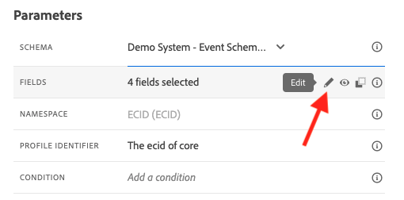

# 8.1 Een gebeurtenis definiëren

Aanmelden bij Adobe Journey Optimizer door naar [Adobe Experience Cloud](https://experience.adobe.com). Klikken **Journey Optimizer**.

U wordt omgeleid naar de **Home**  in Journey Optimizer. Eerst, zorg ervoor u de correcte zandbak gebruikt. De sandbox die moet worden gebruikt, wordt `--aepSandboxId--`. Als u van de ene naar de andere sandbox wilt gaan, klikt u op **PRODUCTIEVOORRAAD (VA7)** en selecteert u de sandbox in de lijst. In dit voorbeeld krijgt de sandbox een naam **AEP-activering FY22**. Dan ben je in de **Home** weergave van de sandbox `--aepSandboxId--`.

Blader in het linkermenu omlaag en klik op **Configuraties**. Klik op de knop **Beheren** knop onder **Gebeurtenissen**.

Vervolgens ziet u een overzicht van alle beschikbare gebeurtenissen. Klikken **Gebeurtenis maken** om uw eigen gebeurtenis te maken.

Er verschijnt dan een nieuw, leeg gebeurtenisvenster.

Als naam voor de gebeurtenis gebruikt u `--demoProfileLdap--GeofenceEntry`. In dit voorbeeld is de naam van de gebeurtenis `vangeluwGeofenceEntry`.

Beschrijving instellen op: `Geofence Entry Event`.

Controleer vervolgens of de **Type** is ingesteld op **Unitair** en voor de **Type gebeurtenis-id** selectie, selecteren **Door systeem gegenereerd**

Vervolgens moet u een schema selecteren. Alle schema&#39;s die hier worden getoond, zijn Adobe Experience Platform Schemas.

U zult merken dat niet alle schema&#39;s worden getoond. Er zijn veel meer schema&#39;s beschikbaar in Adobe Experience Platform.
Om in deze lijst te tonen, moet een schema een zeer specifieke gebiedsgroep hebben met het verbonden. De veldgroep die hier moet worden getoond, wordt `Orchestration eventID`.

Laten we eens kijken hoe deze schema&#39;s in Adobe Experience Platform zijn gedefinieerd.

Ga in het linkermenu naar **Schemas** en opent u deze op een nieuw browsertabblad. In **Schemas**, ga naar **Bladeren** voor de lijst van beschikbare schema&#39;s.
Het schema openen `Demo System - Event Schema for Website (Global v1.1)`.

Nadat u het schema hebt geopend, ziet u dat de veldgroep `Orchestration eventID` maakt deel uit van het schema.
Deze veldgroep heeft slechts twee velden. `_experience.campaign.orchestration.eventID` en `originJourneyID`.

Zodra deze veldgroep en dit specifieke eventID gebied deel van een schema uitmaken, zal dat schema voor gebruik door Adobe Journey Optimizer beschikbaar zijn.

Ga terug naar uw gebeurtenisconfiguratie in Adobe Journey Optimizer.

In dit gebruiksgeval, wilt u aan een Gebeurtenis van Geofence luisteren om te begrijpen als een klant op een specifieke plaats is, zodat nu, selecteer het Schema `Demo System - Event Schema for Website (Global v1.1)` als Schema voor uw Gebeurtenis.

Adobe Journey Optimizer selecteert dan automatisch een aantal vereiste velden, maar u kunt de velden bewerken die beschikbaar zijn voor Adobe Journey Optimizer.

Klik op de knop **potlood** pictogram om de velden te bewerken.

Vervolgens ziet u een pop-upvenster met een schemahiërarchie waarin u velden kunt selecteren.

Velden zoals de ECID en de Orchestration eventID zijn vereist en als zodanig vooraf geselecteerd.

Een marketeer moet echter flexibele toegang hebben tot alle gegevenspunten die context bieden aan een reis. Laten we dus ook de volgende velden als minimum selecteren (gevonden in het contextknooppunt Plaatsen):

- Plaats

Als dat is gebeurd, klikt u op **OK**.

Adobe Journey Optimizer heeft ook een id nodig om de klant te identificeren. Aangezien Adobe Journey Optimizer is gekoppeld aan Adobe Experience Platform, wordt de primaire id van een schema automatisch beschouwd als de id voor de reis.
De primaire id houdt ook automatisch rekening met de volledige identiteitsgrafiek van Adobe Experience Platform en koppelt al het gedrag in alle beschikbare identiteiten, apparaten en kanalen aan hetzelfde profiel, zodat Adobe Journey Optimizer contextueel, relevant en consistent is.

Klikken **Opslaan** om uw aangepaste gebeurtenis op te slaan.

Uw gebeurtenis maakt dan deel uit van de lijst met beschikbare gebeurtenissen.

Tot slot moet u herstellen `Orchestration eventID` voor uw aangepaste gebeurtenis.

Open de gebeurtenis opnieuw door erop te klikken in de lijst met gebeurtenissen.
Klik op de knop **Payload weergeven** pictogram naast **Velden**.

Klik op de knop **Payload weergeven** wordt een voorbeeld van een XDM-payload voor deze gebeurtenis geopend.

Omlaag schuiven in het deelvenster **Payload** totdat u de lijn ziet `eventID`.

Schrijf de `eventID` aangezien u het in het laatste zult nodig hebben om uw configuratie te testen.

In dit voorbeeld wordt `eventID` is `fa42ab7982ba55f039eacec24c1e32e5c51b310c67f0fa559ab49b89b63f4934`.

U hebt nu de gebeurtenis gedefinieerd die de reis zal activeren die we bouwen. Zodra de reis in werking wordt gesteld, zullen de geofence-gebieden zoals Stad, en anderen die u (zoals Land, Breedtegraad en Lengtegraad) kunt kiezen ter beschikking worden gesteld aan de reis.

Zoals besproken in de beschrijving van het gebruikscase, moeten we dan contextuele promoties bieden die afhankelijk zijn van het weer. Om weerinformatie te krijgen, zullen wij een externe gegevensbronnen moeten bepalen die ons van de weerinformatie voor die plaats zullen voorzien. U gebruikt de **OpenWeather** dienst om ons te laten weten wat die informatie is, als onderdeel van 2.

Volgende stap: [8.2 Een externe gegevensbron definiëren](./ex2.md)

[Ga terug naar module 8](journey-orchestration-external-weather-api-sms.md)

[Terug naar alle modules](../../overview.md)
