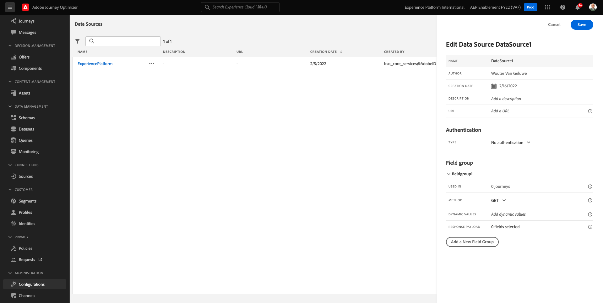
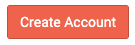
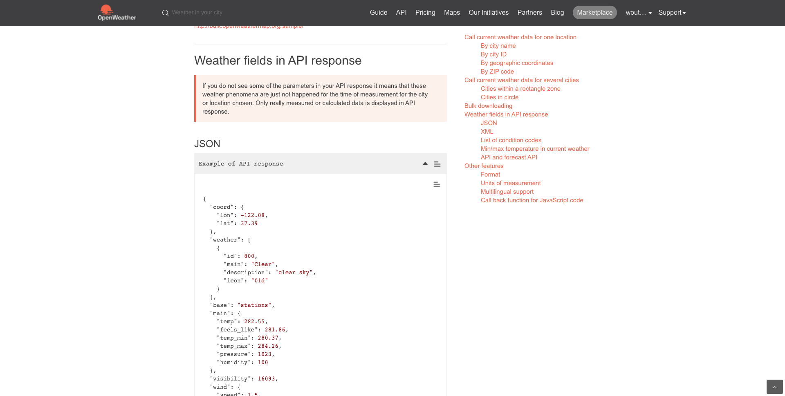
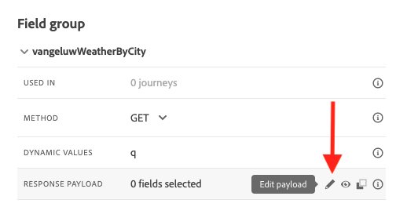

# 8.2 Een externe gegevensbron definiëren

In deze oefening, zult u een douane externe gegevensbron tot stand brengen door gebruik van Adobe Journey Optimizer te maken.

Aanmelden bij Adobe Journey Optimizer door naar [Adobe Experience Cloud](https://experience.adobe.com). Klikken **Journey Optimizer**.


U wordt omgeleid naar de **Home**  in Journey Optimizer. Eerst, zorg ervoor u de correcte zandbak gebruikt. De sandbox die moet worden gebruikt, wordt `--aepSandboxId--`. Als u van de ene naar de andere sandbox wilt gaan, klikt u op **PRODUCTIEVOORRAAD (VA7)** en selecteert u de sandbox in de lijst. In dit voorbeeld krijgt de sandbox een naam **AEP-activering FY22**. Dan ben je in de **Home** weergave van de sandbox `--aepSandboxId--`.


Blader in het linkermenu omlaag en klik op **Configuraties**. Klik op de knop **Beheren** knop onder **Gegevensbronnen**.


Dan zie je de **Gegevensbronnen** lijst.
Klikken **Gegevensbron maken** om uw gegevensbron toe te voegen.


Er verschijnt een lege pop-up voor de gegevensbron.



Voordat u dit kunt configureren, hebt u een account nodig met de **Weaderkaart openen** service. Voer de volgende stappen uit om uw account te maken en uw API-sleutel op te halen.

Ga naar [https://openweathermap.org/](https://openweathermap.org/). Klik op de startpagina op **Aanmelden**.


Klikken **Een account maken**.


Vul de details in.


Klikken **Account maken**.



U wordt vervolgens omgeleid naar uw accountpagina.


Klik in het menu op **API-toetsen** om uw API-sleutel op te halen, die u nodig hebt om uw aangepaste externe gegevensbron in te stellen.


An **API-sleutel** ziet er als volgt uit: `b2c4c36b6bb59c3458d6686b05311dc3`.

U kunt de **API-documentatie** voor de **Huidig weefsel** [hier](https://openweathermap.org/current).

In ons gebruik-geval, zullen wij de verbinding met Open Kaart van het Weer uitvoeren die op de plaats wordt gebaseerd de klant in is.


Ga terug naar **Adobe Journey Optimizer**, naar uw lege **Externe gegevensbron** popup.


Als naam voor de gegevensbron, gebruik `--demoProfileLdap--WeatherApi`. In dit voorbeeld is de naam van de gegevensbron `vangeluwWeatherApi `.

Beschrijving instellen op: `Access to the Open Weather Map`.

De URL voor de Open Weather Map API is: **http://api.openweathermap.org/data/2.5/weather?units=metric**


Vervolgens moet u de verificatie selecteren die u wilt gebruiken.

Gebruik de volgende variabelen:

| Veld | Waarde |
|:-----------------------:| :-----------------------|
| Type | **API-sleutel** |
| Naam | **APPID** |
| Waarde | **uw API-sleutel** |
| Locatie | **Query-parameter** |


Tot slot moet u een **FieldGroup**, wat eigenlijk het verzoek is dat je naar de Weer-API stuurt. In ons geval, willen wij de naam van de Stad gebruiken om het Huidige Weer voor die Stad te verzoeken.


Volgens de Weather API-documentatie moeten we een parameter verzenden `q=City`.


Configureer uw FieldGroup als volgt om de verwachte API-aanvraag af te stemmen:

>[!IMPORTANT]
>
>De naam van de veldgroep moet uniek zijn. Gebruik de volgende naamgevingsconventie: `--demoProfileLdap--WeatherByCity` in dat geval moet de naam `vangeluwWeatherByCity`


Voor de Payload van de Reactie, moet u een voorbeeld van de Reactie kleven die door Weather API zal worden verzonden.

U kunt de verwachte API JSON-reactie vinden op de pagina met API-documentatie [hier](https://openweathermap.org/current).



Of u kunt de JSON-reactie hier kopiëren:

```json
{"coord": { "lon": 139,"lat": 35},
  "weather": [
    {
      "id": 800,
      "main": "Clear",
      "description": "clear sky",
      "icon": "01n"
    }
  ],
  "base": "stations",
  "main": {
    "temp": 281.52,
    "feels_like": 278.99,
    "temp_min": 280.15,
    "temp_max": 283.71,
    "pressure": 1016,
    "humidity": 93
  },
  "wind": {
    "speed": 0.47,
    "deg": 107.538
  },
  "clouds": {
    "all": 2
  },
  "dt": 1560350192,
  "sys": {
    "type": 3,
    "id": 2019346,
    "message": 0.0065,
    "country": "JP",
    "sunrise": 1560281377,
    "sunset": 1560333478
  },
  "timezone": 32400,
  "id": 1851632,
  "name": "Shuzenji",
  "cod": 200
}
```

Kopieer de bovenstaande JSON-reactie naar het klembord en ga vervolgens naar het configuratiescherm van de aangepaste gegevensbron.

Klik op de knop **Payload bewerken** pictogram.



U ziet een popup waar u nu de bovengenoemde Reactie van JSON moet kleven.


Plak uw JSON-reactie, waarna u dit ziet. Klikken **Opslaan**.


De aangepaste configuratie van de gegevensbron is nu voltooid. Omhoog schuiven en klikken **Opslaan**.


Uw gegevensbron is nu gemaakt en maakt deel uit van de **Gegevensbronnen** lijst.


Volgende stap: [8.3 Een aangepaste handeling definiëren](./ex3.md)

[Ga terug naar module 8](journey-orchestration-external-weather-api-sms.md)

[Terug naar alle modules](../../overview.md)
