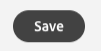

# 8.3 Een aangepaste handeling definiëren

In deze oefening, zult u twee douaneacties creëren door gebruik van Adobe Journey Optimizer in combinatie te maken.

Aanmelden bij Adobe Journey Optimizer door naar [Adobe Experience Cloud](https://experience.adobe.com). Klikken **Journey Optimizer**.


U wordt omgeleid naar de **Home**  in Journey Optimizer. Eerst, zorg ervoor u de correcte zandbak gebruikt. De sandbox die moet worden gebruikt, wordt `--aepSandboxId--`. Als u van de ene naar de andere sandbox wilt gaan, klikt u op **PRODUCTIEVOORRAAD (VA7)** en selecteert u de sandbox in de lijst. In dit voorbeeld krijgt de sandbox een naam **AEP-activering FY22**. Dan ben je in de **Home** weergave van de sandbox `--aepSandboxId--`.


Blader in het linkermenu omlaag en klik op **Configuraties**. Klik op de knop **Beheren** knop onder **Handelingen**.


Dan zie je de **Handelingen** lijst.


U definieert één handeling die een tekst naar een Slack-kanaal verzendt.

## 8.3.1 Actie: Tekst verzenden naar kanaal Slack

U zult nu een bestaand kanaal van Slack gebruiken en berichten verzenden naar dat Kanaal van Slack. Slack heeft een eenvoudig te gebruiken API en wij zullen Adobe Journey Optimizer gebruiken om hun API teweeg te brengen.


Klikken **Handeling maken** om een nieuwe handeling toe te voegen.


Er verschijnt een leeg actiepopup.


Als naam voor de handeling gebruikt u `--demoProfileLdap--TextSlack`. In dit voorbeeld is de naam van de handeling `vangeluwTextSlack`.

Beschrijving instellen op: `Send Text to Slack`.


Voor de **URL-configuratie** Gebruik deze optie:

- URL: `https://2mnbfjyrre.execute-api.us-west-2.amazonaws.com/prod`
- Methode: **POST**

>[!NOTE]
>
>De bovenstaande URL verwijst naar een AWS Lambda-functie die uw verzoek doorstuurt naar het Slack-kanaal zoals hierboven vermeld. Dit wordt gedaan om toegang tot een Adobe-Bezit Slack kanaal te beschermen. Als u uw eigen Slack-kanaal hebt, kunt u beter een Slack-app maken via [https://api.slack.com/](https://api.slack.com/), moet u dan een Inkomende Webhaak in die app van Slack tot stand brengen, en dan bovengenoemde URL vervangen door uw Inkomende URL Webhaak.

U hoeft de koptekstvelden niet te wijzigen.


**Verificatie** moet worden ingesteld op **Geen verificatie**.


Voor de **Handelingsparameters**, moet u bepalen welke velden naar Slack moeten worden verzonden. Logischerwijze willen we dat Adobe Journey Optimizer en Adobe Experience Platform het brein van personalisatie zijn, dus de tekst die naar Slack moet worden gestuurd, moet door Adobe Journey Optimizer worden gedefinieerd en vervolgens naar Slack worden gestuurd voor executie.

Dus voor de **Handelingsparameters** klikt u op de knop **Payload bewerken** pictogram.


Dan zie je een leeg popup-venster.


Kopieer de onderste tekst en plak deze in het lege pop-upvenster.

```json
{
 "text": {
  "toBeMapped": true,
  "dataType": "string",
  "label": "textToSlack"
 }
}
```

FYI: Door de onderstaande velden op te geven, worden deze velden toegankelijk vanaf uw Klantenreis en kunt u ze dynamisch vanuit de Reis vullen:

**&quot;toBeMapping&quot;: true,**

**&quot;dataType&quot;: &quot;string&quot;,**

**&quot;label&quot;: &quot;textToSlack&quot;**

U zult dan dit zien:


Klikken **Opslaan**.



Omhoog schuiven en klikken **Opslaan** nog een keer om uw aangepaste handeling op te slaan.


Uw aangepaste handeling maakt nu deel uit van de **Handelingen** lijst.


U hebt gebeurtenissen, externe gegevensbronnen en acties gedefinieerd. Laten we dat allemaal op één reis consolideren.

Volgende stap: [8.4 Maak uw reis en uw berichten](./ex4.md)

[Ga terug naar module 8](journey-orchestration-external-weather-api-sms.md)

[Terug naar alle modules](../../overview.md)
