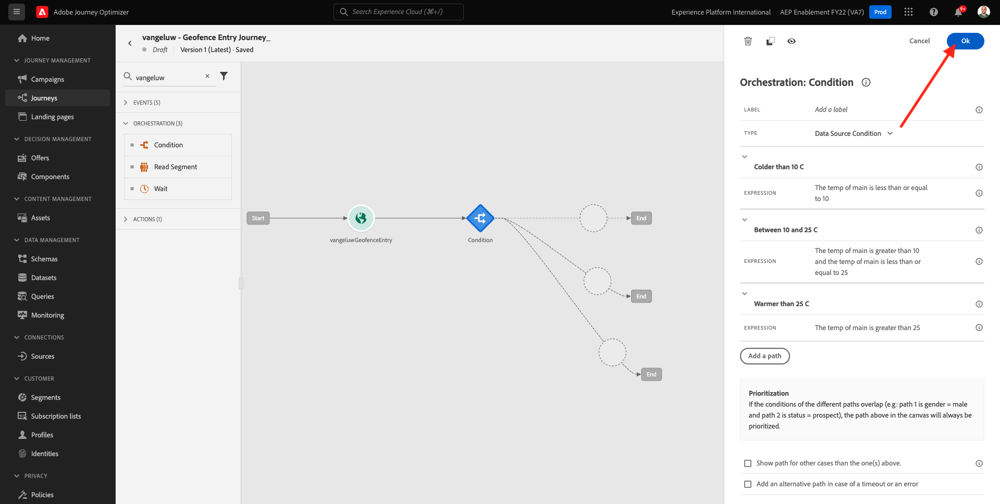
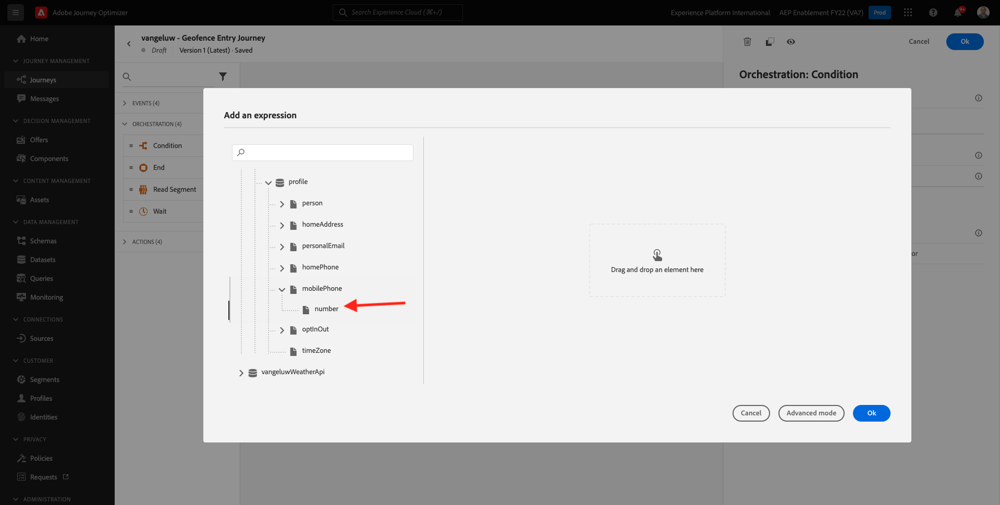
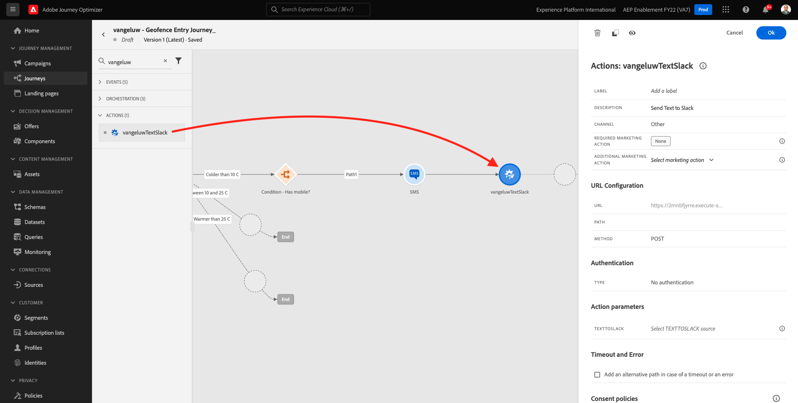

# 8.4 Maak uw reis en uw berichten

In deze oefening, zult u een reis en verscheidene tekstberichten creëren door Adobe Journey Optimizer te gebruiken.

Voor dit gebruiksgeval, is het doel verschillende sms- berichten te verzenden die op de weersomstandigheden van de plaats van uw klant worden gebaseerd. Er zijn drie scenario&#39;s vastgesteld:

- Kleiner dan 10° Celsius
- Tussen 10° en 25° Celsius
- Warmer dan 25° Celsius

Voor deze 3 voorwaarden moet je 3 SMS-berichten definiëren in Adobe Journey Optimizer.

## 8.4.1 Maak uw reis

Aanmelden bij Adobe Journey Optimizer door naar [Adobe Experience Cloud](https://experience.adobe.com). Klikken **Journey Optimizer**.


U wordt omgeleid naar de **Home**  in Journey Optimizer. Eerst, zorg ervoor u de correcte zandbak gebruikt. De sandbox die moet worden gebruikt, wordt `--aepSandboxId--`. Als u van de ene naar de andere sandbox wilt gaan, klikt u op **PRODUCTIEVOORRAAD (VA7)** en selecteert u de sandbox in de lijst. In dit voorbeeld krijgt de sandbox een naam **AEP-activering FY22**. Dan ben je in de **Home** weergave van de sandbox `--aepSandboxId--`.


Ga in het linkermenu naar **Reizen** en klik op **Reis maken** om uw reis te beginnen maken.


Je moet eerst je reis noemen.

Als naam voor de reis, gebruik `--demoProfileLdap-- - Geofence Entry Journey`. In dit voorbeeld is de reisnaam `vangeluw - Geofence Entry Journey`. Er mogen op dit moment geen andere waarden worden ingesteld. Klikken **OK**.


Kijk aan de linkerkant van het scherm **Gebeurtenissen**. De eerder gemaakte gebeurtenis wordt in die lijst weergegeven. Selecteer het, sleep het en laat vallen het op het reiscanvas. Uw reis ziet er dan zo uit. Klikken **OK**.


Klik op Volgende **Orchestratie**. U ziet nu de beschikbare **Orchestratie** mogelijkheden. Selecteren **Voorwaarde** en sleep deze naar het canvas Journey.


U moet nu drie voorwaarden definiëren:

- Het is kouder dan 10° Celsius
- Het ligt tussen 10° en 25° Celsius
- Het is warmer dan 25° Celsius

Laten we de eerste voorwaarde definiëren.

### Voorwaarde 1: Kleiner dan 10° Celsius

Klik op de knop **Voorwaarde**.  Klikken op **Pad1** en bewerk de naam van het pad naar **Kleiner dan 10 C**. Klik op de knop **Bewerken** pictogram voor de expressie van Path1.


Dan zie je een lege **Eenvoudige editor** scherm. Uw query is een beetje geavanceerder, dus u hebt de opdracht **Geavanceerde modus**. Klikken **Geavanceerde modus**.


Dan zie je de **Geavanceerde editor** die code-invoer toestaat.


Selecteer de onderstaande code en plak deze in het dialoogvenster **Geavanceerde editor**.

`#{--demoProfileLdap--WeatherApi.--demoProfileLdap--WeatherByCity.main.temp} <= 10`

Dan zie je dit.


Om de temperatuur als deel van deze voorwaarde terug te winnen, moet u de stad verstrekken waarin de klant momenteel is.
De **Plaats** moet worden gekoppeld aan de dynamische parameter `q`, net als in de Open Weather API-documentatie.

Klik op het veld **dynamische waarde: q** zoals aangegeven in de schermafbeelding.


Dan moet u het gebied vinden dat de huidige plaats van de klant in één van de beschikbare Gegevensbronnen bevat.


U kunt het veld vinden door naar `--demoProfileLdap--GeofenceEntry.placeContext.geo.city`.

Door op dat veld te klikken, wordt het toegevoegd als de dynamische waarde voor de parameter `q`. Dit veld wordt gevuld met bijvoorbeeld de geolocatieservice die u in uw mobiele app hebt geïmplementeerd. In ons geval simuleren we dit met de beheerconsole van de demo-website. Klikken **OK**.


### Voorwaarde 2: Tussen 10° en 25° Celsius

Nadat u de eerste voorwaarde hebt toegevoegd, ziet u dit scherm. Klikken **Pad toevoegen**.


Dubbelklikken op **Pad1** en bewerk de padnaam om **Tussen 10 en 25 C**. Klik op de knop **Bewerken** pictogram voor de expressie van dit pad.


Dan zie je een lege **Eenvoudige editor** scherm. Uw query is een beetje geavanceerder, dus u hebt de opdracht **Geavanceerde modus**. Klikken **Geavanceerde modus**.


Dan zie je de **Geavanceerde editor** die code-invoer toestaat.


Selecteer de onderstaande code en plak deze in het dialoogvenster **Geavanceerde editor**.

`#{--demoProfileLdap--WeatherApi.--demoProfileLdap--WeatherByCity.main.temp} > 10 and #{--demoProfileLdap--WeatherApi.--demoProfileLdap--WeatherByCity.main.temp} <= 25`

Dan zie je dit.


Om de temperatuur als deel van deze Voorwaarde terug te winnen, moet u de stad verstrekken waarin de klant momenteel is.
De **Plaats** moet worden gekoppeld aan de dynamische parameter **q**, net als in de Open Weather API-documentatie.

Klik op het veld **dynamische waarde: q** zoals aangegeven in de schermafbeelding.


Dan moet u het gebied vinden dat de huidige plaats van de klant in één van de beschikbare Gegevensbronnen bevat.


U kunt het veld vinden door naar `--demoProfileLdap--GeofenceEntry.placeContext.geo.city`. Door op dat veld te klikken, wordt het toegevoegd als de dynamische waarde voor de parameter **q**. Dit veld wordt gevuld met bijvoorbeeld de geolocatieservice die u in uw mobiele app hebt geïmplementeerd. In ons geval simuleren we dit met de beheerconsole van de demo-website. Klikken **OK**.


Vervolgens voegt u de derde voorwaarde toe.

### Voorwaarde 3: Warmer dan 25° Celsius

Nadat u de tweede voorwaarde hebt toegevoegd, ziet u dit scherm. Klikken **Pad toevoegen**.


Dubbelklik op Path1 om de naam te wijzigen in **Warmer dan 25 C**.
Klik vervolgens op de knop **Bewerken** pictogram voor de expressie van dit pad.


Dan zie je een lege **Eenvoudige editor** scherm. Uw query is een beetje geavanceerder, dus u hebt de opdracht **Geavanceerde modus**. Klikken **Geavanceerde modus**.


Dan zie je de **Geavanceerde editor** die code-invoer toestaat.


Selecteer de onderstaande code en plak deze in het dialoogvenster **Geavanceerde editor**.

`#{--demoProfileLdap--WeatherApi.--demoProfileLdap--WeatherByCity.main.temp} > 25`

Dan zie je dit.


Om de temperatuur als deel van deze Voorwaarde terug te winnen, moet u de stad verstrekken waarin de klant momenteel is.
De **Plaats** moet worden gekoppeld aan de dynamische parameter **q**, net als in de Open Weather API-documentatie.

Klik op het veld **dynamische waarde: q** zoals aangegeven in de schermafbeelding.


Dan moet u het gebied vinden dat de huidige plaats van de klant in één van de beschikbare Gegevensbronnen bevat.


U kunt het veld vinden door naar ```--demoProfileLdap--GeofenceEntry.placeContext.geo.city```. Door op dat veld te klikken, wordt het toegevoegd als de dynamische waarde voor de parameter **q**. Dit veld wordt gevuld met bijvoorbeeld de geolocatieservice die u in uw mobiele app hebt geïmplementeerd. In ons geval simuleren we dit met de beheerconsole van de demo-website. Klikken **OK**.


U hebt nu drie geconfigureerde paden. Klikken **OK**.



Aangezien dit een reis voor het leren doel is, zullen wij nu een paar acties vormen om de verscheidenheid van opties te tonen moeten de verkopers nu berichten leveren.

## 8.4.2 Berichten verzenden voor pad: Kleiner dan 10° Celsius

Voor elk van de temperatuurcontexten, zullen wij proberen om een tekstbericht naar onze klant te verzenden. Wij kunnen een tekstbericht slechts verzenden als wij een Mobiel Aantal beschikbaar voor een klant hebben, zodat zullen wij eerst moeten verifiëren dat wij.

Laten we ons richten op **Kleiner dan 10 C**.


Laten we nog een keer nemen **Voorwaarde** en sleep het element zoals aangegeven in de onderstaande schermafbeelding. We gaan controleren of er voor deze klant een mobiel nummer beschikbaar is.


Aangezien dit slechts een voorbeeld is, vormen wij slechts de optie waar de klant een mobiel aantal beschikbaar heeft. Voeg een label toe van **Is mobiel?**.

Klik op de knop **Bewerken** pictogram voor de uitdrukking voor **Pad1** pad.


In de Gegevensbronnen die op de linkerzijde worden getoond, navigeer aan **ExperiencePlatform.ProfileFieldGroup.profile.mobilePhone.number**. U leest het mobiele telefoonnummer nu rechtstreeks vanuit het Adobe Experience Platform Real-Time Klantprofiel.



Selecteer het veld **Getal** en sleep het naar het Condition Canvas.

Selecteer de operator **is niet leeg**. Klikken **OK**.


Dan zie je dit. Klikken **OK** opnieuw.


Je reis zal er dan zo uitzien. Klikken op **Handelingen** zoals aangegeven in de schermafbeelding.


Selecteer de handeling **SMS** en sleep deze vervolgens naar de voorwaarde die u zojuist hebt toegevoegd.


Stel de **Categorie** tot **Marketing** en selecteer een oppervlak van SMS dat u toelaat om SMS te verzenden. In dit geval is het te selecteren e-mailoppervlak **SMS**.


De volgende stap is uw bericht te creëren. Om dat te doen, klikt u op **Inhoud bewerken**.


U ziet nu het berichtdashboard, waar u de tekst van uw SMS kunt vormen. Klik op de knop **Bericht samenstellen** gebied voor het maken van uw bericht.


Voer de volgende tekst in: `Brrrr... {{profile.person.name.firstName}}, it's freezing. 20% discount on jackets today!`. Klikken **Opslaan**.


Dan zie je dit. Klik op de pijl in de linkerbovenhoek om terug te gaan naar uw reis.


Dan ben je hier weer. Klikken **OK**.


Ga in het linkermenu terug naar **Handelingen** selecteert u de handeling `--demoProfileLdap--TextSlack`, en sleep het na **Bericht** handeling.



Ga naar **Handelingsparameters** en klik op de knop **Bewerken** pictogram voor de parameter `TEXTTOSLACK`.


Klik in het pop-upvenster op **Geavanceerde modus**.


Selecteer de onderstaande code, kopieer deze en plak deze in de **Geavanceerde moduseditor**. Klikken **OK**.

`"Brrrr..." + #{ExperiencePlatform.ProfileFieldGroup.profile.person.name.firstName} + " It's freezing. 20% discount on Jackets today!"`


Je ziet de voltooide actie. Klikken **OK**.


Deze weg van de reis is nu gereed.

## 8.4.3 Berichten verzenden voor pad: Tussen 10° en 25° Celsius

Voor elk van de temperatuurcontexten, zullen wij proberen om een tekstbericht naar onze klant te verzenden. Wij kunnen een tekstbericht slechts verzenden als wij een Mobiel Aantal beschikbaar voor een klant hebben, zodat zullen wij eerst moeten verifiëren dat wij.

Laten we ons richten op **Tussen 10 en 25 C** pad.


Laten we nog een keer nemen **Voorwaarde** en sleep het element zoals aangegeven in de onderstaande schermafbeelding. We gaan controleren of er voor deze klant een mobiel nummer beschikbaar is.


Aangezien dit slechts een voorbeeld is, vormen wij slechts de optie waar de klant een mobiel aantal beschikbaar heeft. Voeg een label toe van **Is mobiel?**.

Klik op de knop **Bewerken** pictogram voor de uitdrukking voor **Pad1** pad.


In de Gegevensbronnen die op de linkerzijde worden getoond, navigeer aan **ExperiencePlatform.ProfileFieldGroup.profile.mobilePhone.number**. U leest het mobiele telefoonnummer nu rechtstreeks vanuit het Adobe Experience Platform Real-Time Klantprofiel.


Selecteer het veld **Getal** en sleep het naar het Condition Canvas.

Selecteer de operator **is niet leeg**. Klikken **OK**.


Dan zie je dit. Klikken **OK**.


Je reis zal er dan zo uitzien. Klikken op **Handelingen** zoals aangegeven in de schermafbeelding.


Selecteer de handeling **SMS** en sleep deze vervolgens naar de voorwaarde die u zojuist hebt toegevoegd.


Stel de **Categorie** tot **Marketing** en selecteer een oppervlak van SMS dat u toelaat om SMS te verzenden. In dit geval is het te selecteren e-mailoppervlak **SMS**.


De volgende stap is uw bericht te creëren. Om dat te doen, klikt u op **Inhoud bewerken**.


U ziet nu het berichtdashboard, waar u de tekst van uw SMS kunt vormen. Klik op de knop **Bericht samenstellen** gebied voor het maken van uw bericht.


Voer de volgende tekst in: `What a nice weather for the time of year, {{profile.person.name.firstName}} - 20% discount on Sweaters today!`. Klikken **Opslaan**.


Dan zie je dit. Klik op de pijl in de linkerbovenhoek om terug te gaan naar uw reis.


U ziet nu de voltooide actie. Klikken **OK**.


Ga in het linkermenu terug naar **Handelingen** selecteert u de handeling `--demoProfileLdap--TextSlack`, en sleep het na **Bericht** handeling.


Ga naar **Handelingsparameters** en klik op de knop **Bewerken** pictogram voor de parameter `TEXTTOSLACK`.


Klik in het pop-upvenster op **Geavanceerde modus**.


Selecteer de onderstaande code, kopieer deze en plak deze in de **Geavanceerde moduseditor**. Klikken **OK**.

`"What nice weather for the time of year, " + #{ExperiencePlatform.ProfileFieldGroup.profile.person.name.firstName} + " 20% discount on Sweaters today!"`


Je ziet de voltooide actie. Klikken **OK**.


Deze weg van de reis is nu gereed.

## 8.4.4 Berichten verzenden voor pad: Warmer dan 25° Celsius

Voor elk van de temperatuurcontexten, zullen wij proberen om een tekstbericht naar onze klant te verzenden. Wij kunnen een tekstbericht slechts verzenden als wij een Mobiel Aantal beschikbaar voor een klant hebben, zodat zullen wij eerst moeten verifiëren dat wij.

Laten we ons richten op **Warmer dan 25 C** pad.


Laten we nog een keer nemen **Voorwaarde** en sleep het element zoals aangegeven in de onderstaande schermafbeelding. U gaat controleren of er voor deze klant een mobiel nummer beschikbaar is.


Aangezien dit slechts een voorbeeld is, vormen wij slechts de optie waar de klant een mobiel aantal beschikbaar heeft. Voeg een label toe van **Is mobiel?**.

Klik op de knop **Bewerken** pictogram voor de uitdrukking voor **Pad1** pad.


In de Gegevensbronnen die op de linkerzijde worden getoond, navigeer aan **ExperiencePlatform.ProfileFieldGroup.profile.mobilePhone.number**. U leest het mobiele telefoonnummer nu rechtstreeks vanuit het Adobe Experience Platform Real-Time Klantprofiel.


Selecteer het veld **Getal** en sleep het naar het Condition Canvas.

Selecteer de operator **is niet leeg**. Klikken **OK**.


Dan zie je dit. Klikken **OK**.


Je reis zal er dan zo uitzien. Klikken op **Handelingen** zoals aangegeven in de schermafbeelding.


Selecteer de handeling **SMS** en sleep deze vervolgens naar de voorwaarde die u zojuist hebt toegevoegd.


Stel de **Categorie** tot **Marketing** en selecteer een oppervlak van SMS dat u toelaat om SMS te verzenden. In dit geval is het te selecteren e-mailoppervlak **SMS**.


De volgende stap is uw bericht te creëren. Om dat te doen, klikt u op **Inhoud bewerken**.


U ziet nu het berichtdashboard, waar u de tekst van uw SMS kunt vormen. Klik op de knop **Bericht samenstellen** gebied voor het maken van uw bericht.


Voer de volgende tekst in: `So warm, {{profile.person.name.firstName}}! 20% discount on swimwear today!`. Klikken **Opslaan**.


Dan zie je dit. Klik op de pijl in de linkerbovenhoek om terug te gaan naar uw reis.


U ziet nu de voltooide actie. Klikken **OK**.


Ga in het linkermenu terug naar **Handelingen** selecteert u de handeling `--demoProfileLdap--TextSlack`, en sleep het na **Berichten** handeling.


Ga naar **Handelingsparameters** en klik op de knop **Bewerken** pictogram voor de parameter `TEXTTOSLACK`.


Klik in het pop-upvenster op **Geavanceerde modus**.


Selecteer de onderstaande code, kopieer deze en plak deze in de **Geavanceerde moduseditor**. Klikken **OK**.

`"So warm, " + #{ExperiencePlatform.ProfileFieldGroup.profile.person.name.firstName} + "! 20% discount on swimwear today!"`


Je ziet de voltooide actie. Klikken **OK**.


Deze weg van de reis is nu gereed.

## 8.4.5 Uw reis publiceren

Uw reis is nu volledig gevormd. Klikken **Publiceren**.


Klikken **Publiceren** opnieuw.


Uw reis is nu gepubliceerd.


Volgende stap: [8.5 Trigger je reis](./ex5.md)

[Ga terug naar module 8](journey-orchestration-external-weather-api-sms.md)

[Terug naar alle modules](../../overview.md)
