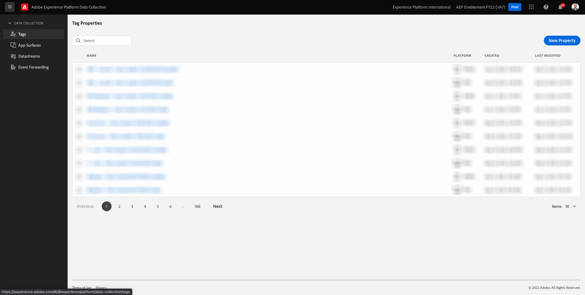
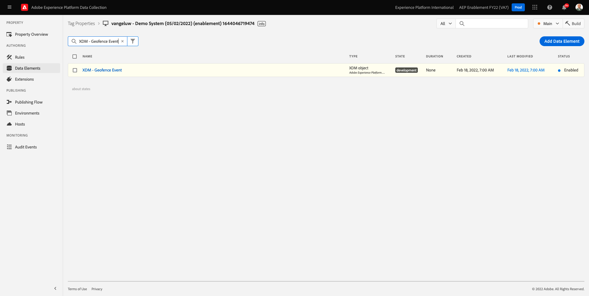
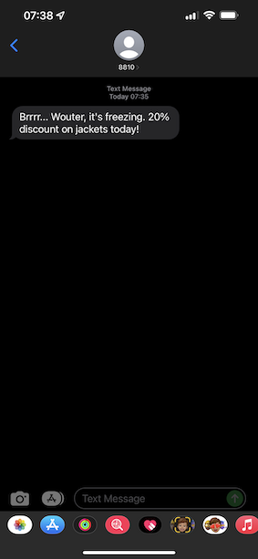

# 8.5 Trigger je reis

In deze oefening, zult u de reis testen en teweegbrengen u in deze module vormde.

## 8.5.1 De configuratie van uw geofence-gebeurtenis bijwerken

Ga naar [Adobe Experience Platform-gegevensverzameling](https://experience.adobe.com/launch/) en selecteert u **Tags**.

Dit is de pagina Eigenschappen van Adobe Experience Platform-gegevensverzameling die u eerder hebt gezien.

In module 0, leidde het Systeem van de Demo tot twee eigenschappen van de Cliënt voor u: één voor de website en één voor de mobiele app. Zoeken naar `--demoProfileLdap--` in de **[!UICONTROL Zoeken]** doos. Klik om het dialoogvenster **Web** eigenschap.

Dan zie je dit.

Ga in het linkermenu naar **Regels** en zoek naar de regel **Geofence, gebeurtenis**. Klik op de regel **Geofence, gebeurtenis** om het te openen.

U zult dan de details van deze regel zien. Klik om de handeling te openen **&quot;geofence event&quot; naar AEP verzenden - trigger JO**.

U zult dan zien dat wanneer deze actie wordt teweeggebracht, een specifiek gegevenselement wordt gebruikt om de XDM gegevensstructuur te bepalen. U moet dat gegevenselement bijwerken, en u moet bepalen **Gebeurtenis-id** van de gebeurtenis waarin u hebt geconfigureerd [Oefening 8.1](./ex1.md).

U moet nu het gegevenselement bijwerken **XDM - Geofence-gebeurtenis**. Ga hiertoe naar **Gegevenselementen**. Zoeken naar **XDM - Geofence-gebeurtenis** en klik om dat gegevenselement te openen.

U zult dan dit zien:

Naar het veld navigeren `_experience.campaign.orchestration.eventID`. Verwijder de huidige waarde en plak de eventID daar.

De gebeurtenis-id is te vinden in Adobe Journey Optimizer onder **Configuraties > Gebeurtenissen** en u zult gebeurtenisidentiteitskaart in de steekproeflading van uw even vinden, die als dit kijkt: `"eventID": "fa42ab7982ba55f039eacec24c1e32e5c51b310c67f0fa559ab49b89b63f4934"`.

Vervolgens moet u de plaats in dit gegevenselement definiëren. Ga naar **placeContext > geo > city** en ga naar een stad van keuze. Klik op Volgende **Opslaan** of **Opslaan in bibliotheek**.

Tot slot moet u uw wijzigingen publiceren. Ga naar **Publishing Flow** in het linkermenu.

Klikken **Alle gewijzigde bronnen toevoegen** en klik vervolgens op **Opslaan en samenstellen tot ontwikkeling**.

## 8.5.2 Stem uw reis op

Ga naar [https://builder.adobedemo.com/projects](https://builder.adobedemo.com/projects). Nadat je je hebt aangemeld bij je Adobe ID, kun je dit zien. Klik op uw websiteproject om het te openen.

Op de **Schermen** pagina, klikt u op **Uitvoeren**.

Vervolgens wordt uw demowebsite geopend. Selecteer de URL en kopieer deze naar het klembord.

Open een nieuw Incognito-browservenster.

Plak de URL van uw demowebsite, die u in de vorige stap hebt gekopieerd. Vervolgens wordt u gevraagd u aan te melden met uw Adobe ID.

Selecteer uw accounttype en voltooi het aanmeldingsproces.

Uw website wordt vervolgens geladen in een Incognito-browservenster. Voor elke demonstratie, zult u een vers, incognito browser venster moeten gebruiken om uw demowebsite URL te laden.

Klik op het Adobe-logopictogram in de linkerbovenhoek van het scherm om de Profile Viewer te openen.

Bekijk het deelvenster Profielviewer en het realtime klantprofiel met de **Experience Cloud-id** als primaire identificator voor deze momenteel onbekende klant.

Ga naar de pagina Registreren/Aanmelden. Klikken **EEN ACCOUNT MAKEN**.

Vul uw gegevens in en klik op **Registreren** waarna u naar de vorige pagina wordt omgeleid.

Open het deelvenster Profielviewer en ga naar Klantprofiel in realtime. In het deelvenster Profielviewer worden al uw persoonlijke gegevens weergegeven, zoals de zojuist toegevoegde e-mail- en telefoon-id&#39;s.

Klik in het deelvenster Profielviewer op **HULPPROGRAMMA**. Enter `geofenceevent` en klik op **Verzenden**.

Een paar seconden later ontvang je een SMS van Adobe Journey Optimizer.

Volgende stap: [Samenvatting en voordelen](./summary.md)

[Ga terug naar module 8](journey-orchestration-external-weather-api-sms.md)

[Terug naar alle modules](../../overview.md)
